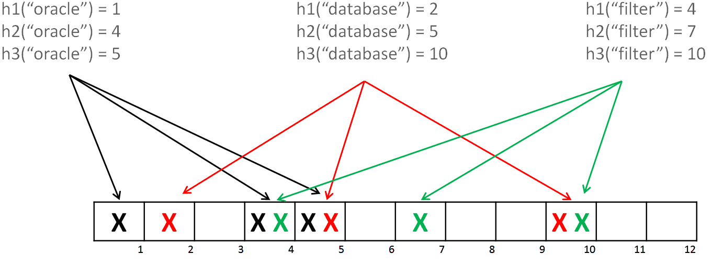

# bitmap

# 位图

## bitmap

bitmap 利用位运算，可以判重，基数统计方面，可以起到一定节省存储空间的作用。即便如此，在一些场景，依然算是占用大量内存

给定含有40亿个不重复的位于[0, 232 - 1]区间内的整数的集合，如何快速判定某个数是否在该集合内？

2^32 = 4294967296 (42.9亿)

如果是 uint32 大约需要 14.9 G 的内存空间，使用位图大概需要 500 M 的内存空间。

使用 bitmap 已经可以大大缩小内存的使用量了，但是 bitmap 对于稀疏的数据，内存利用率就不高了，比如只有第40亿个数存在，其他的都不存在，依然要浪费那么多的内存。


## roaring bitmap

Roaring Bitmaps 就是一种优秀的压缩位图索引。压缩位图索引有很多种，Roaring Bitmaps 算是其中的佼佼者。


32 位无符整型，分成高16位，与低16位分开存储。就像分成了两级索引，高十六位为第一级，低16位为第二级。这样低十六位，还可以共享它们的高位存储空间。

具体讲，将  uint32 整数按照高16位分桶，即最多可能有216=65536个桶，论文内称为 container 。 

结构如下， keys 是 []uint16 数组，用于存储 高十六位，[]container 数组用于存储低十六位，高低位通过数组下标关联。

```go
// Bitmap represents a compressed bitmap where you can add integers.
type Bitmap struct {
	highlowcontainer roaringArray
}

type roaringArray struct {
	keys            []uint16			  // 存储高16位
	containers      []container `msg:"-"` // 存储第16位
	needCopyOnWrite []bool
	copyOnWrite     bool
	conserz []containerSerz   // 序列化 containers 使用
}
```

container 类型主要有 `arrayContainer`, `bitmapContainer`, 后来又有了 `runContainer`。


**Array Container** 

- 因为普通 bitmap 对于比较稀疏的数据分布，相对浪费内存，所以才有了 `arrayContainer` ，主要是用于数据小于 4096个时使用。
- `arrayContainer` 是 uint16 类型的有序数组。
- 使用二分查找目标，时间复杂度为 O(logN)。
- 占用的空间大小与存储的数据量为线性关系， 最多存储 4096个 uint16 数据占用 8kb。

```go
// 实现 container 接口
type arrayContainer struct {
	content []uint16
}
```

**bitmapContainer**

- 当容量超过这个值的时候会将当前 `arrayContainer` 替换为 `bitmapContainer`。
- 因为 4096 个 uint16 的数，与 2^16 的 bitmap 空间相等，所以 Container 中存储的数总数大于4096，就改用 bitmap 存储。
- `bitmapContainer` 只涉及到位运算，时间复杂度为O(1) 。
- `bitmapContainer` 空间是恒定为2^16 bit 即 8192 字节, 使用 uint64 数组来存储也就是 1024 个 uint64 的大小，

```GO
// 实现 container 接口
type bitmapContainer struct {
	cardinality int
	bitmap      []uint64
}
```

**RunContainer**

RunContainer 用于行程长度压缩算法(run-length encoding)，对连续数据有比较好的压缩效果。

它的原理是，对于连续出现的数字，只记录初始数字和后续数量。即：

> 对于数列 11，它会压缩为11,0；
> 对于数列 11,12,13,14,15，它会压缩为11,4；
> 对于数列 11,12,13,14,15,21,22，它会压缩为11,4,21,1；

```go
// 实现 container 接口
type runContainer16 struct {
	iv   []interval16  // 存储的就是压缩后的数据
	card int64

	// avoid allocation during search
	myOpts searchOptions `msg:"-"`
}
```

RunContainer 的压缩效果可好可坏，效果和数据的连续性（紧凑性）关系极为密切。

### 示例

```go
import (
	"fmt"
	"github.com/RoaringBitmap/roaring"
)


func Rbm() {
	// BitmapOf 生成一个新的位图，其中填充了指定的整数
	rb0 := roaring.BitmapOf(0, 1, 2, 3, 4)
	rb1 := roaring.BitmapOf(1, 3, 5, 7, 101, 100001)
	rb2 := roaring.BitmapOf(2, 4, 6)
	rb3 := roaring.New() // 创建空的 bitmap

	// And 运算
	rb0.And(rb1)
	fmt.Println(rb0.String()) // {1,3}

	// Or 运算
	rb1.Or(rb2)
	fmt.Println(rb1.String()) // {1,2,3,4,5,6,7,101,100001}

	
	rb0 = roaring.BitmapOf(0, 1, 2, 3, 4)
	rb1 = roaring.BitmapOf(1, 3, 5, 7, 101, 100001)
	rb2 = roaring.BitmapOf(2, 4, 6)

	// ParOr 并行计算所有提供的位图的并集(OR)
	rb4 := roaring.ParOr(4, rb0, rb1, rb2, rb3)
	fmt.Println(rb4.String()) // {0,1,2,3,4,5,6,7,101,100001}

	// 求最大最小值
	fmt.Println(rb4.Maximum()) // 100001
	fmt.Println(rb4.Minimum()) // 0

	// 判断是否存在
	fmt.Println(rb4.ContainsInt(101)) // true

	// 计算小于某个数的值有多少个
	fmt.Println(rb4.Rank(10)) // 8
}
```

通过 roaring bitmap 可以实现对数字进行类似有序集合的操作，而且相比普通的bitmap可以解决数据稀疏分布内存利用率低的问题，可以极大的节省内存空间。感觉这个数据结构真是太巧妙了，让人眼前一亮。


### References

https://github.com/RoaringBitmap/roaring

[Better bitmap performance with Roaring bitmaps](https://arxiv.org/pdf/1402.6407.pdf)

[Consistently faster and smaller compressed bitmaps with Roaring](https://arxiv.org/pdf/1603.06549.pdf)

## bloom filter

Bloom Filter 通过用多个哈希函数将集合映射到位数组中，从而实现用较小的空间，判断目标元素是否在集合中。相比于其它的数据结构，布隆过滤器在空间和时间方面都有巨大的优势。

可能会存在一些误判的情况

- 判断结果为不在集合中的，一定不在；
- 判断结果为在集合中的，可能不在（小概率误差）；

而在能容忍低错误率的应用场合下，Bloom Filter 通过极少的错误换取了存储空间的极大节省。



误差评估

需要几个哈希函数

位数组的大小

## HyperLogLong


