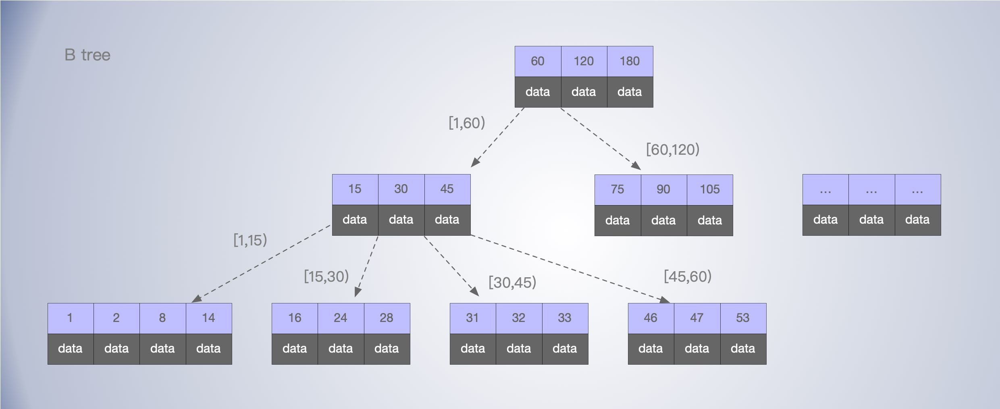
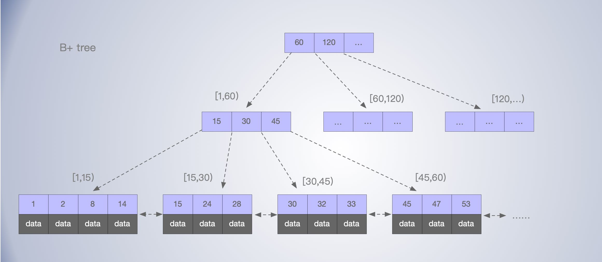
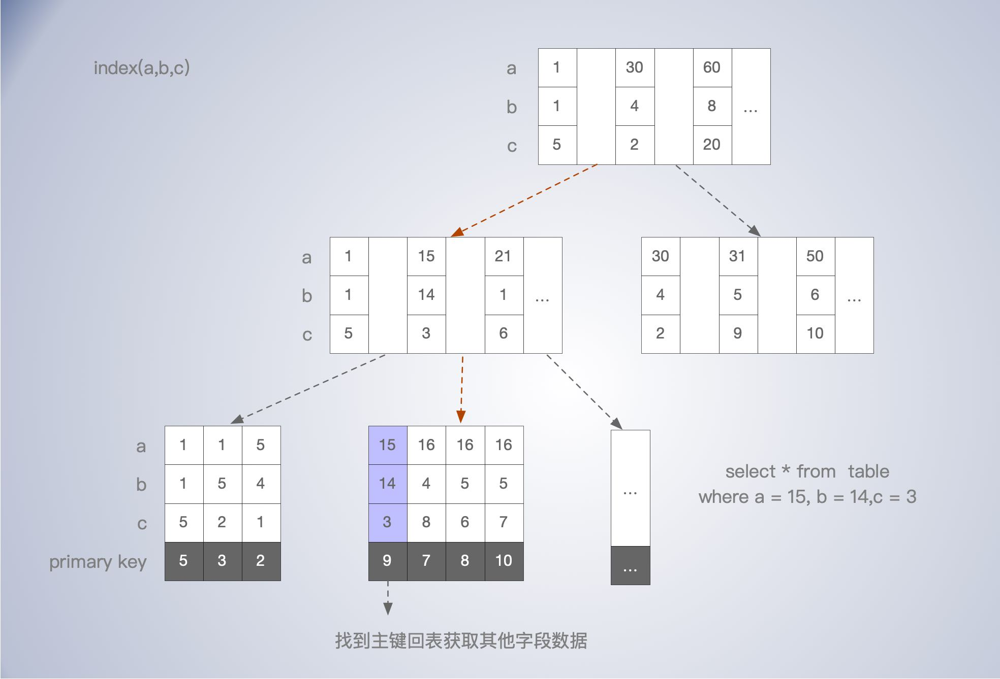

# B 树 B+树

## 用于查找的一些数据结构

什么样的数据结构适合用作数据库索引？

- 查询效率得高
- 通常需要支持范围查询，虽然也有哈希索引，但不算是主流
- 要能减少磁盘 IO。

常见提高读写的数据结构：

- **哈希表**：只适合等值查询的场景，没法支持范围查询，当然装载因子的变大，哈希冲突，扩容 rehash 的成本，对性能的影响，也是需要考虑的。
- **有序数组**：二分查找，更新太麻烦，而且数据要求连续的内存空间。
- **跳表**：跳表是在链表之上加上多层索引构成的。它支持快速地插入、查找、删除数据，对应的时间复杂度是 O(logn)。并且，跳表也支持按照区间快速地查找数据。数据也是有序的排列。Redis 的有序集合就是基于跳表实现的。
- **平衡二叉树**：平衡二叉树，具有较高的查询效率，如红黑树，AVL树。如果需要支持范围查询，查找树需要进行一定的改造。而且只是二叉树的话，指针占的空间还是比较大的。

### N 叉树

平衡二叉树，二叉树是搜索效率最高的，但是实际上大多数的数据库存储却并不使用二叉树。其原因是，索引不止存在内存中，还要写到磁盘上。(为了减少磁盘IO次数)，而使用N叉树。

随着 N 的增大，树的高度会降低。由于每次 IO 都是按 page 的大小来读取，调整 N 的大小，使得每个节点的大小等于一个页的大小。

在 innodb 中，*N叉树*，N 差不都为 1200，树高4，可以存储 1200^3=17 亿的值。故一个10亿数据的表，整数索引最多也就3次磁盘IO。

## B树

B 数就是一棵 N 叉查找树，每个节点上的数据是有序的，同时从左到右的子节点也是有序的。这样一个节点能够存放更多的数据，在节点内部，可以使用二分查找，快速定位到对应的值或下一个子节点区间。

## B+树

**与 B 树相比，B+树主要的不同点在于**：

- 只有叶子节点会存储数据。B树每个节点中不仅包含数据的索引值，还有其他数据。

- 非叶子节点只存储索引数据，在通过索引找到目标记录之前，除了索引，读其他的数据，其实是浪费IO的，当然是越少越好，所以除了叶子节点，其他节点就不应该存数据项。
- B+ 树的叶子节点之间通过两个指针与前后相邻的节点连接起来，这样方便了范围查询和遍历。

根据 B+数的特点，极端索引的字段占空间越小，每次 IO 就能读取更多的索引数，也更有利于提升查询性能。

假设 B+树为一棵 N 叉树，B+树特点

- 每个节点中子节点的个数不能超过 N，也不能小于 N/2；通过这样的约束，可以让树尽量保持平衡。这也涉及到页分裂问题；
- 根节点的子节点个数可以不超过 N/2，这是一个例外；
- N 叉树只存储索引，并不存储数据；
- 通过链表将叶子节点串联在一起，方便按区间查找；

B+ 树和跳表还是有点类似的，都是在底层链表基础上加了多层索引，底层数据都是有序的。

### 联合索引的 B+数存储

假设对 a, b, c 三个非主键字段建立联合索引。

如图，联合索引的B+树存储图，索引字段都在非叶子节点构成索引。叶子节点存储主键的，如果查找的数据通过索引自身可以满足，就直接返回，即所谓的覆盖索引。如果不能满足，比如 `select a,b,c,d` 就需要根据主键到主键索引树上去找对应的数据，即所谓的“回表”。显然使用覆盖索引效率会高些，直接通过主键索引查询效率也会高些。因为少了额外的一次回表 IO 。

Innodb 就是索引组织表，我们建立索引时，其实就是相当于增加了一个索引树。此外，加锁操作，也是把锁加在索引树上。

### 最左匹配

针对上述 a b c 字段建立的联合索引。由于 B+ 树的特性，为了使用联合索引，我们需要满足最左匹配特性。

比如，查询条件为 `a = 16, b = 5, c = 7`, mysql 会先根据  a = 16 找到 3条记录，再  b = 5 , 有两条记录，再 c = 7, 三个字段都能使用索引，找到目标。假设查询条件为 `a = 16, c = 7`，此时先使用索引 a，找到3条记录，由于没有提供 b 字段，所以后续的 b 和 c 字段索引都无法使用。只能把符合条件的记录挨个扫描比较。

同样的，如果查询条件为 `a = 16, b > 4, c = 7` ，由于 b 字段使用范围查询，匹配到字段 b 时就开始从 b > 4 开始往后扫描记录，c 字段也无法使用索引。

## 问题思考

