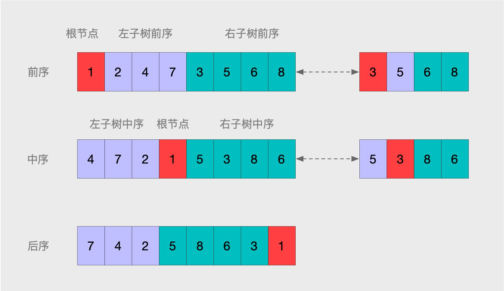

[TOC]


## 需要掌握的

这3种遍历都有递归和循环两种不同的实现方法, *每种遍历的递归实现都比循环实现要简洁很多*。

很多面试官喜欢直接或间接考查遍历。

- 树 3 种遍历的6中实现
- 宽度优先遍历，即按层遍历
- 完全二叉树，数组实现

- 二叉搜索树的面试题有很多
- 二叉树的特殊情况，堆和红黑树，红黑树相对较难，优先级往后排


**三种遍历的应用场景**

- 前序遍历，可以用来实现目录结构的显示。用来静态遍历访问。
- 中序遍历，对于二分搜索树，输出结果是有序递增的。
- 后续遍历，对节点操作时必访问其所有子节点，可以进行破坏性操作如删除节点。还可以计算目录内的文件占用的数据大小。

## 案例

### 重建二叉树

输入某二叉树的前序遍历和中序遍历的结果，请重建出该二叉树。假设输入的前序遍历和中序遍历的结果中都不含重复的数字。例如输入前序遍历序列{1,2,4,7,3,5,6,8}和中序遍历序列{4,7,2,1,5,3,8,6}，则重建二叉树并返回。

思路

- 前序遍历的第一个元素必是树的根节点可以确定根节点也就是 1。
- 在中序遍历中，根节点左边序列是`左子树`即 {4,7,2} ，右边序列是`右子树` {5,3,8,6} 。
- 再根据上面两个子树的中序数字，找到对应的前序，以 {4,7,2} 为例，对应的前序就是 {2,4,7} 。

- 有了前序 {2,4,7}，中序 {4,7,2} ，同样的思路，继续重复上述步骤。很明显这个很适合递归来处理了。



`数是有一棵一棵子树组成的更大的树，无论是子树，还是完整的树，三种遍历都可以划分为[根节点，左子树，右子树]。并且再每个子树内又可以继续重复类似划分,知道没有子节点`。

```go
func ReConstructBinaryTree(pre []int, vin []int) *TreeNode {
    if len(pre) == 0 || len(pre) != len(vin) {
        return nil
    }
    
    if len(pre) == 1 {
        return &TreeNode{
            Val:   pre[0],
            Left:  nil,
            Right: nil,
        }
    }

    root := pre[0]
    leftPrev := make([]int, 0)  // 左子树前序
    leftVin := make([]int, 0)   // 左子树中序
    rightPrev := make([]int, 0) // 右子树前序
    rightVin := make([]int, 0)  // 右子树中序

    // 找到左右子树中序
    i := 0
    for i < len(vin) && vin[i] != root {
        leftVin = append(leftVin, vin[i])
        i++
    }
    i++
    for i < len(vin) {
        rightVin = append(rightVin, vin[i])
        i++
    }

    // 找到左右子树前序
    i = 1
    for ; i <= len(leftVin) && i < len(pre); i++ {
        leftPrev = append(leftPrev, pre[i])
    }
    for ;i < len(pre); i++ {
        rightPrev = append(rightPrev, pre[i])
    }

    // 递归构建左右子树
    leftNode := ReConstructBinaryTree(leftPrev, leftVin)
    rightNode := ReConstructBinaryTree(rightPrev, rightVin)

    return &TreeNode{
        Val:   root,
        Left:  leftNode,
        Right: rightNode,
    }
}

// 用例：
//  输入为空；
//  普通二叉树，完全二叉树，只有左子树，右子树的二叉树
//  前序中序元素个数对不上；
//  只有一个元素时；只有两个，三个元素时；
//  如果输入的中序，前序，是错的，对不上；
```


### 二叉树的下一个节点 

题目:给定一棵二叉树和其中的一个节点, 如何找出`中序遍历`序列的下一个节点?树中的节点除了有两个分别指向左、右子节点的指针,还有个指向父节点的指针。

- 如果一个节点有右子树, 那么它的下一个节点就是它的右子树中的最左子节点。即从右子节点出发一直沿着指向左子节点的指针到叶子节点。

- 如果一个节点既没有右子树, 并且它还是它父节点的右子节点。则可以沿着指向父节点的指针一直向上遍历, 直到找到一个节点是它父节点的左子节点的节点。如果这样的节点存在, 那么这个节点的父节点就是我们要找的下一个节点。

需要对二叉树有深刻的理解，考査应聘者分析复杂问题的能力。应聘者只有画出二叉树的结构图、通过具体的例子找出中序遍历下一个节点的规律, 才有可能设计出可行的算法。

代码实例 [08_NextNodeInBinaryTrees](https://github.com/zhedahht/CodingInterviewChinese2/tree/master/08_NextNodeInBinaryTrees)


### 试题26:树的子结构

输入两棵二叉树A，B，判断B是不是A的子结构。（ps：我们约定空树不是任意一个树的子结构）

示例1: 输入 {8,8,#,9,#,2,#,5},{8,9,#,2} , 返回 true .

```go
func HasSubtree( pRoot1 *TreeNode ,  pRoot2 *TreeNode ) bool {
    ret := false
    if pRoot1 != nil && pRoot2 != nil {
        ret = DoesTree1HasTree2(pRoot1, pRoot2)
        if !ret {
            ret = HasSubtree(pRoot1.Left, pRoot2)
        }
        if !ret {
            ret = HasSubtree(pRoot1.Right, pRoot2)
        }
    }
    return ret
}

func DoesTree1HasTree2(pRoot1 *TreeNode ,  pRoot2 *TreeNode ) bool {
    if pRoot2 == nil {
        return true
    }
    if pRoot1 == nil {
        return true
    }
    if pRoot1.Val != pRoot2.Val {
        return false
    }
    ret1 := DoesTree1HasTree2(pRoot1.Left, pRoot2.Left)
    ret2 := DoesTree1HasTree2(pRoot1.Right, pRoot2.Right)
    return ret1 && ret2
}
```

### 试题27：二叉树镜像

操作给定的二叉树，将其变换为源二叉树的镜像。如收入{8,6,10,5,7,9,11}，变为 {8,6,10,5,7,9,11}。

思路：从根节点开始，把整个左右子树对换位置，再把左右子树当做根节点继续，重复如此。递归实现。

```go
// 测试用例：
// 为 nil
// 只有左子树，或右子树
// 正常
func Mirror( pRoot *TreeNode ) *TreeNode {
    if pRoot == nil {
        return nil
    }
    if pRoot.Left == nil && pRoot.Right == nil {
        return pRoot
    }
    pRoot.Left, pRoot.Right = pRoot.Right, pRoot.Left
    Mirror(pRoot.Left)
    Mirror(pRoot.Right)
    return pRoot
}
```

### 试题28:对称的二又树

请实现一个函数，用来判断一棵二叉树是不是对称的。注意，如果一个二叉树同此二叉树的镜像是同样的，定义其为对称的。


思路一: 按层遍历二叉树，即把二叉树转化为数组存储，再求镜像，再得出镜像的数组存储的顺序，再比较前后数组是否相等。与上面的思路类似，但是少了一次遍历。注意转化为数组存储，需要填补上中间的控制接节点。

思路二：比较两棵数的前序遍历顺序是够一直。前序遍历，对称比较，先比较父级 p1 和 p2 是值否相等，再用 p1 的左右子树 和 p2 的右左子树分别比较。

```go
// 测试用例
// 输入 nil
// 输入对称二叉树，输入不对产二叉树
func IsSymmetrical( pRoot *TreeNode ) bool {
    return Symmetrical(pRoot, pRoot)
}

// 先比较父级 p1 和 p2 是值否相等，再用 p1 的左右子树 和 p2 的右左子树分别比较。
func Symmetrical(pRoot1 *TreeNode, pRoot2 *TreeNode) bool {
    if pRoot1 == nil && pRoot2 == nil {
        return true
    }
    if pRoot1 == nil || pRoot2 == nil {
        return false
    }

    if pRoot1.Val != pRoot2.Val {
        return false
    }

    ret1 := Symmetrical(pRoot1.Left, pRoot2.Right)
    ret2 := Symmetrical(pRoot1.Right, pRoot2.Left)

    return ret1 && ret2
}
```

### 试题32:从上到下打印二叉树

题目：从上往下打印出二叉树的每个节点，同层节点从左至右打印。例如输入 {5,4,#,3,#,2,#,1} ，返回 [5,4,3,2,1] 。

```go
// 测试用例
// 输入 nil
// 只有左子树，右子树
// 只有一个节点
func PrintFromTopToBottom( root *TreeNode ) []int {
    if root == nil {
        return nil
    }
    return FromToBottom([]*TreeNode{root}, []int{})
}

func FromToBottom(pRoot []*TreeNode, nodes []int) [] int {
    if len(pRoot) == 0 {
        return nodes
    }
    children := make([]*TreeNode, 0)
    for _, parent := range pRoot {
        nodes = append(nodes, parent.Val)
        if parent.Left != nil {
            children = append(children, parent.Left)
        }
        if parent.Right != nil {
            children = append(children, parent.Right)
        }
    }
    return FromToBottom(children, nodes)
}
```


