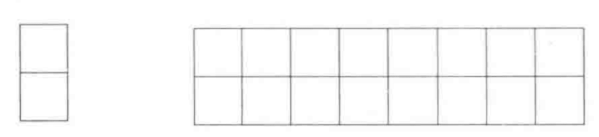

[TOC]


## 强调

- 数据结构题目一直是面试官考査的重点。

- 链表应该是面试题中使用频率最高的一种数据结构。

- 通常*排序*和*査找*是面试时考查算法的重点。

- 应该重点掌握`二分査找`、`归并排序`和`快速排序`, 做到能随时正确、完整地写出它们的代码。冒泡更简单，更要能熟练写出。

- 还要掌握分析时间复杂度的方法。

- 最好在编码之前全面考虑所有可能的输入, 做好边界和错误处理，要确保自己写出的程序不会轻易崩溃。这个习惯要在平时养成。

- 面试的时候很多人都会在边界条件上犯错。尤其是开头和结尾，很可能不是一个完整的循环，需要单独特殊处理。

    

## 总览

**排序查找**

通常*排序*和*査找*是面试时考查算法的重点。

应该重点掌握`二分査找`、`归并排序`和`快速排序`, 做到能随时正确、完整地写出它们的代码。冒泡更简单，更要能熟练写出。


**回溯法**

如果面试题要求在二维数组(可能具体表现为迷宫或者棋盘等)上搜索路径, 那么我们可以尝试用`回溯法`。通常回溯法很适合用递归的代码实现。只有当限定不可以用递归实现的时候, 我们再考虑用栈来模拟递归的过程。


**最优解——动态规划**

如果求某个问题的最优解, 并且该问题可以分为多个子问题, 那么我们可以尝试用动态规划。

在用自上而下的递归思路去分析动态规划问题的时候,我们会发现子问题之间存在重叠的更小的子问题。

为了避免不必要的重复计算, 我们用自下而上的循环代码来实现, 也就是把子问题的最优解先算出来并用数组(一般是一维或者二维数组)保存下来, 接下来基于子问题的解计算大问题的解。


**位运算**

总共只有与、或、异或、左移和右移5种位运算


**循环与递归**

有很多算法，尤其是需要重复计算相同的问题时，都可以用递归和循环两种不同的方式实现。通常基于递归的实现方法代码会比较简洁, 但性能不如基于循环的实现方法。

如果面试官没有，特别的要求, 则应聘者可以尽量多采用递归的方法编程。因为递归代码更简洁，更易实现。

但是，递归是函数调用自身, 而函数调用是有时间和空间的消耗的:每一次函数调用, 都需要在内存栈中分配空间以保存参数、返回地址及临时变量,而且往栈里压入数据和弹出数据都需要时间。所以递归实现的效率不如循环，而且而过多的调用也可能导致调用栈溢出。而且递归在分解为多个子问题时，可能会存在重叠部分和重复计算。如递归实现斐波那契数列就容易重复计算。


**自下而上**

很多时候我们会用自上而下的递归思路分析问题, 却会基于自下而上的循环实现代码。


**考虑是否周全,减少漏洞**

这也是考查的一个方便，思考是否全面。

代码是否完成了基本功能、`输入边界值`是否能得到正确的输出、是否对各种不合规范的`非法输入`做出了合理的`错误处理`。

- 三方面下手：`功能测试，边界测试，负面测试`。
- 写代码之前,首先要把可能的输入都想清楚。
- 单元测试很重要，建议在编码之前要考虑单元测试。


**阐明思路**

在面试的时候,应聘者需要向面试官解释自己的思路。对于复杂的问题, 应聘者光用语言未必能够说得清楚。这时候可以画出几幅图形,一边看着图形一边讲解,面试官就能更加轻松地理解应聘者的思路。这对应聘者是有益的,因为面试官会觉得他具有很好的沟通交流能力


## 思路

*理清思路再动手*。

编码前讲自己的思路是一个考查指标。没考虑好，上来就写代码的，可能是个减分项。

可以先尝试，`举例子`，`画图`的方式理清思路。

尤其是复杂问题，更需要先讲清楚思路和设计。


### 画图很重要

画图是在用来帮助自己分析、推理的常用手段。

很多面试题很抽象,不容易找到解决办法。这时不妨画出一些与题目相关的图形,借以辅助自己观察和思考。

图形能使抽象的问题具体化、形象化应聘者说不定通过几幅图形就能找到规律, 从而找到问题的解决方案。

比如二叉树、二维数组、链表等问题, 很多时候空想未必能想明白题目中隐含的规律和特点。


### 举例

当一眼看不出问题中隐藏的规律的时候, 我们可以试着用两个具体的例子模拟操作的过程, 这样说不定就能通过具体的例子找到规律。


## 练习

###斐波那契数列

写一个函数, 求斐波那契数列的第n项, 输入n, 求斐波那契(Fibonacci)数列的第n项。

斐波那契数列的定义如下: 第0项为0，第1项是1, 当 n > 1 时，满足 f(n) = f(n-1) + f(n-2) 。


解法一：递归，这种方式代码最简洁，也最容易实现，但是效率太低。

```go
// 
func Fibonacci1( n int ) int {
    if n  < 0 {
        return -1
    }
    if n <= 1 {
        return n
    }
    return Fibonacci1(n - 1) + Fibonacci1(n - 2)
}
```

通过递归实现，很简洁，容易，但是时间复杂度太高。里面有很多的重复计算，这应该不是面试官要的满意答案。

**Fibonacci递归实现的时间复杂度**

分析递归数的时间复杂度，可以尝试着画出递归树，可以看出有很多重复的单元；但不是说所有的递归都会有重复的计算，比如归并排序，快排，要看具体情况，各子模块边界清晰独立。

而这里的Fb数列不是。

f(n) 分解为 f(n−1) 和 f(n−2)，每次数据规模都是 −1 或者 −2，叶子节点的数据规模是 1 或者 2。所以，从根节点走到叶子节点，每条路径是长短不一的。如果每次都是 −1，那最长路径大约就是 n；如果每次都是 −2，那最短路径大约就是 n/2。

每次分解之后的合并操作只需要一次加法运算，把这次加法运算的时间消耗记作 1。所以，从上往下，第一层的总时间消耗是 1，第二层的总时间消耗是 2，第三层的总时间消耗就是 2^2。依次类推，第 k 层的时间消耗就是 2^(k−1)，那整个算法的总的时间消耗就是每一层时间消耗之和。

所以，这个算法的时间复杂度就介于 O(2^n) 和 O(2^(n/2)) 之间。这种时间复杂度，除非样本非常小，在实际工程几乎是不可能被使用的。


解法二：循环实现，通过记录前一项的值，和当前值，计算下一项的值。时间复杂度 O(n)， 空间复杂度 O(1)。

```go
func Fibonacci2(n int) int {
    if n  < 0 {
        return -1
    }
    if n <= 1 {
        return n
    }
    pre := 0
    fb := 1
    for i := 2; i <= n; i++ {
        tmp := fb
        fb = pre + fb
        pre = tmp
    }
    return fb
}
```

### 青蛙跳台阶问题

只青蛙一次可以跳上1级台阶, 也可以跳上2级台阶。求该青蛙跳上一个n级的台阶总共有多少种跳法。

第 n 个台阶，要么从 n - 1 的台阶，要么从 n - 2 的台阶上跳上来的。如果第 n 个台阶有 f(n) 个跳法，第 n - 1 个台阶有 f(n-1) 个跳法， 则第 n - 2 个台阶有 f(n-2) 个跳法。则有 f(n) = f(n-1) + f(n-2) 。

```
f(0) = 0
f(1) = 1
f(2) = 2
f(3) = 3
f(4) = 5
...
f(n) = f(n-1) + f(n-2)
```

和斐波那契数列一个解法。

考査应聘者对递归、循环的理解及编码能力。

考查应聘者对`时间复杂度分析`能力。

如果面试官采用的是青蛙跳台阶的问题, 那么同时还在考査应聘者的`数学建模`能力。


### 小矩形覆盖大矩形

我们可以用2x1的小矩形横着或者竖着去覆盖更大的矩形。请问用8个2×1的小矩形无重叠地覆盖一个2x8的大矩形, 总共有多少种方法?



```
f(1) = 1
f(2) = 2
f(3) = 3

f(n) = f(n-1) + f(n-2)
```

这仍然是斐波那契数列。

 ### 连续子数组最大和

输入一个整型数组，数组里有正数也有负数。数组中的一个或连续多个整数组成一个子数组。求所有子数组的和的最大值。要求时间复杂度为 O(n).

例如输入 [1,-2,3,10,-4,7,2,-5] 返回 18.

解法一：从前往后累加，如果和是负数，放弃之前的全部，并重新开始记录累加和同时用另一个变量记录最大的连续和。

```go
func FindGreatestSumOfSubArray( array []int ) int {
    if len(array) == 0 {
        return 0
    }
    sum := 0
    maxSum := array[0]
    max := array[0] // 记录最大的元素，用于全是负数时返回
    for _, v := range array {
        if v > max {
            max = v
        }
        sum += v
        if sum > maxSum {
            maxSum = sum
        }
        if sum < 0 {
            sum = 0
        }
    }
    if maxSum < 0 {
        return max
    }
    return maxSum
}
```

测试用例

```go
func TestFindGreatestSumOfSubArray(t *testing.T) {
    fmt.Println(FindGreatestSumOfSubArray([]int{1,-2,3,10,-4,7,2,-5}))
    fmt.Println(FindGreatestSumOfSubArray([]int{1,-5}))
    fmt.Println(FindGreatestSumOfSubArray([]int{1,5}))
    fmt.Println(FindGreatestSumOfSubArray([]int{-2,-8,-1,-5,-9}))
}
```

解法二：使用动态规划


