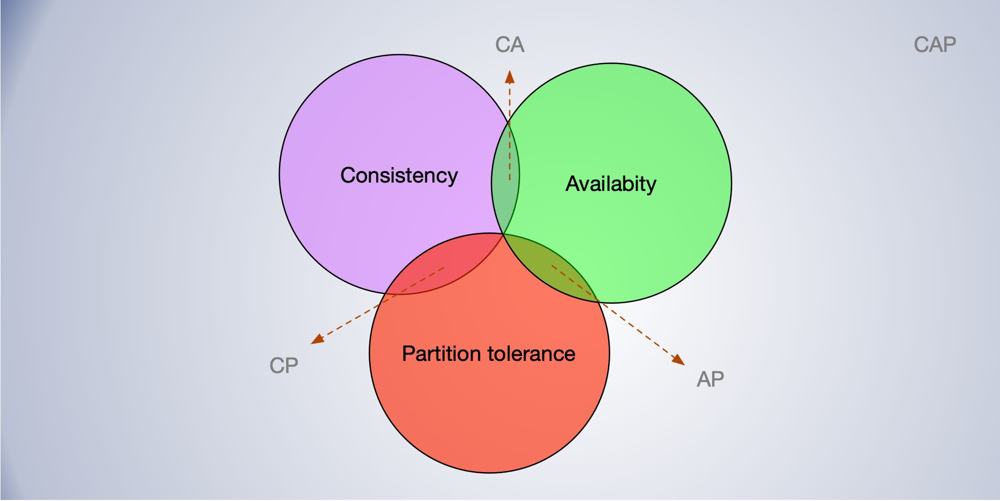
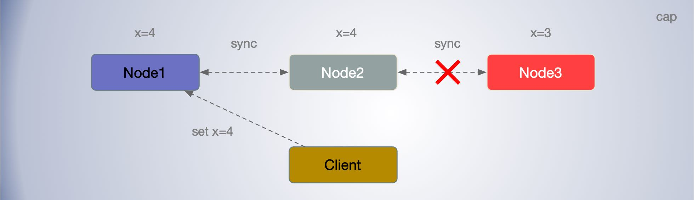

[TOC]

## CAP 理解

**CAP 理论** ：C（Consistency）代表一致性，A（Availability）代表可用性，P（Partition Tolerance）代表分区容错性，三者不可同时满足。

- C（Consistency）代表一致性，等同于所有节点访问同一份最新的数据副本。
- A（Availability）代表可用性，每次请求都能获取到非错的响应——但是不保证获取的数据为最新数据。
- P（Partition Tolerance）代表分区容错性，当出现网络联通问题，会把集群划分为彼此隔离的分区，但任意区域内节点上的数据依然可访问。

实际上，系统的分区如果不能在一定时间内达成数据一致性，就意味着发生了分区的情况，必须就当前操作在C和A之间做出选择。

### 一致性——强调正确性

一致性可以理解为客户端的每次读操作，不管访问哪个节点，要么读到的都是同一份最新写入的数据，要么读取失败。即可访问的节点都应该是相同的一份最新的数据副本。

一致性强调的是数据正确。即客户端读到的要么是最新的数据，要么就不能访问。

其实，一致性从弱到强可以分为：

- 最终一致性，经过一段时间达到一致性的弱一致性。
- 因果一致性（Casual Consistency），弱一致性，只对有因果关系的事件有一致性要求。
- 顺序一致性（Sequential Consistency），属于强一致性
- 线性一致性，也叫原子一致性，属于强一致性

### 可用性——强调可用不保证正确

可用性说的是任何来自客户端的请求，不管访问哪个非故障节点，都能得到响应数据，但不保证是同一份最新数据，可用性强调的是服务可用。

延迟，也是一个重要的参考因素，延迟超过一定时间，也可认为服务不可用。同样的，达成一致性也是需要考虑延迟大小。

一般来讲，采用 Gossip 协议实现最终一致性系统，它的可用性是最高的，因为哪怕只有一个节点，集群还能在运行并提供服务。

其次是 Paxos 算法、ZAB 协议、Raft 算法、Quorum NWR 算法、PBFT 算法、POW 算法，它们能容忍一定数节点故障。

最后是二阶段提交协议、TCC，只有当所有节点都在运行时，才能工作，可用性最低。

### 分区容错性——强调故障容错能力

如一个分布式系统发生了网络故障，被分割成了两个彼此独立无法通讯的两个分区。如果这两个分区依然能够同时运行，就可认为满组了分区容错性。

**理解CAP**：

想象两个节点分处隔离的两个分区。允许至少一个节点更新状态会导致数据不一致，即丧失了C性质。如果为了保证数据一致性，将分区一侧的节点设置为不可用，那么又丧失了A性质。除非两个节点可以互相通信，才能既保证C又保证A，这又会导致丧失P性质。

例如，当有3个节点，原本都是 x=3, 客户端向节点设置 x=4，但是Node3 节点发生了网络故障，无法与其他节点进行通讯，即发生了网络分区。如果要维持一致性 C，即每个节点都要能读到最新的数据副本，那么就只能舍弃Node3节点的可用性 A。如果不放弃Node3节点的可用性 A，就要舍弃数据的一致性 C (活着说是正确性)。即发生了分区故障时，我们需要在 C 和 A 之间作出取舍。

分布式系统涉及到多节点间的通讯，考虑到网络延迟和波动，节点间的分区故障几乎是必然的，所以在分布式系统中分区容错性是必须要考虑的。尤其是对于跨地区的系统，通常无法舍弃 P，那么就只能在数据一致性 C 和可用性 A 上做一个选择。

需要注意的，虽然 P 通常不能舍弃，但不是说分布式系统只能在C和A之间二选一，而是在发生网络分区时要做取舍。网络分区虽然不能忽略，但是更多的时候还是网络正常的，这时C和A还是可以兼得的。当然一致性同步是需要时间的，只要能保证在一定的时间窗口内完成同步，就可以认为满足了C。

## 分布式系统中的 CAP

在分布式系统设计中，分区容错性是必须保证的，不能因为节点间出现了分区故障，使得整个系统不工作。所以分布式系统几乎都是 CP 型或者 AP 型的。

CP 模型，舍弃了可用性，一定会读到最新数据。但是当出现网络故障，延迟过高发生了网络分区，就会业务的可用性。比如 Etcd，Hbase 就属于 CP 模型。

对于 CP 模型的 KV存储，适合用于提供基础服务，保存少量数据如配置信息和元数据，比如 Etcd。

AP 模型，舍弃了一致性，实现了服务的高可用。客户端通常不会得到响应错误，但由很大可能会读到旧数据。比如 Cassandra 和 Euraka， Consul。AP 模型依然舍弃了一致性，但是也会实现最终一致性。AP 型的 KV 存储，适合查询量大的场景，不要求数据的强一致性，目前广泛应用于分布式缓存系统。

CP 模型适合要求 ACID 场景，AP 模型更适合要求 BASE 的场景。可以认为 acid 和 base 是 cap 的两个不同的延伸方向。

如何根据业务特点，为系统设计合适的分区容错一致性模型，以实现集群能力。
在当发生分区错误时，应该如何保障系统稳定运行，不影响业务 ?

# 推荐阅读

[CAP理论十二年回顾："规则"变了](http://www.infoq.com/cn/articles/cap-twelve-years-later-how-the-rules-have-changed)

[Brewer’s conjecture and the feasibility of consistent, available, partition-tolerant web services](https://dl.acm.org/doi/10.1145/564585.564601)

