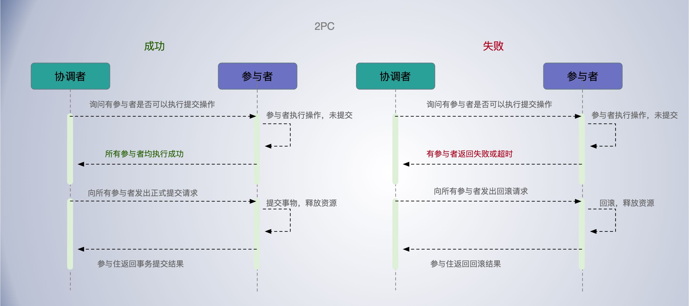
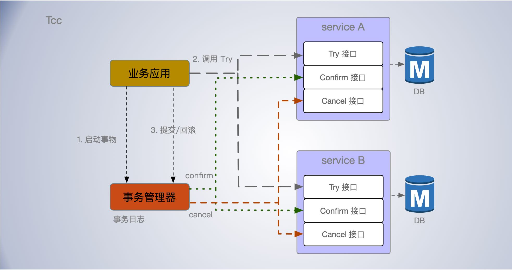

[TOC]


## ACID

在数据库管理系统，为保证事务（transaction）是正确可靠的，所必须具备的四个特性：

- 原子性（atomicity，或称不可分割性），要么全部执行，要么全部不执行；
- 一致性（consistency）；
- 隔离性（isolation，又称独立性）；
- 持久性（durability）；

ACID 理论是传统数据库常用的设计理念，追求强一致性模型。如果实现了操作的 ACID 特性，也就就实现了事务。

在单机上实现 ACID 也不难，比如可以通过锁、时间序列等机制保障操作的顺序执行，让系统实现 ACID 特性。


## 2PC

二阶段提交协议(Two-phase Commit Protocol) 简称 2PC， 是为了使分布式系统下的所有节点在进行事务提交时保持一致性而设计的一种协议。

为此引入了参与者和协调者的角色：

- 参与者(Participants)：执行的工作节点；

- 协调者(Coordinator)：掌控所有参与者的操作结果并最终指示这些节点是否要把操作结果进行真正的提交。在分布式系统中，每个节点知晓自己的操作成功或者失败，却无法知道其他节点的操作的成功或失败。

二阶段提交成立基于以下假设：

- 该分布式系统中，存在一个节点作为协调者，其他节点作为参与者。且节点之间可以进行网络通信。
- 所有节点都采用`预写式日志`，且日志被写入后即被保持在可靠的存储设备上，即使节点损坏不会导致日志数据的消失。
- 所有节点不会永久性损坏，即使损坏后仍然可以恢复。

整体实现思想是：参与者将操作成败通知协调者，由协调者根据所有参与者的反馈情报决定各参与者是否要提交操作还是中止操作。者主要分为两个阶段进行。


**第一阶段(提交请求阶段)**

1. 协调者节点向所有参与者节点询问是否可以执行提交操作，并开始等待各参与者节点的响应。
2. 参与者节点执行询问发起为止的所有事务操作，并将 Undo 信息和 Redo 信息写入日志。
3. 各参与者节点响应协调者节点发起的询问。如果参与者节点的事务操作实际执行成功，则它返回一个"同意"消息；如果参与者节点的事务操作实际执行失败，则它返回一个"中止"消息。

第一阶段也被称作投票阶段，即各参与者投票是否要继续接下来的提交操作。


**第二阶段(提交执行阶段)**

在第一阶段，所有参与者节点获得的响应消息都为"同意"时：

1. 协调者节点向所有参与者节点发出"正式提交"的请求。
2. 参与者节点正式完成操作，并释放在整个事务期间内占用的资源。
3. 参与者节点向协调者节点发送"完成"消息。
4. 协调者节点收到所有参与者节点反馈的"完成"消息后，完成事务。

在第一阶段，如果任一参与者节点响应消息为"终止"，或者协调者节点在第一阶段的询问超时之前无法获取所有参与者节点的响应消息时：

1. 协调者节点向所有参与者节点发出"`回滚操作`"的请求。
2. 参与者节点利用之前写入的Undo信息执行回滚，并释放在整个事务期间内占用的资源。
3. 参与者节点向协调者节点发送"回滚完成"消息。
4. 协调者节点收到所有参与者节点反馈的"回滚完成"消息后，取消事务。

第二阶段也被称作**完成阶段**，因为无论结果怎样，协调者都必须在此阶段结束当前事务。




二阶段提交算法中协调者和参与者之间的通信流程, "*" 所标记的操作意味着此类操作必须记录在稳固存储上

```
    协调者                                              参与者
                              QUERY TO COMMIT
                -------------------------------->
                              VOTE YES/NO           prepare*/abort*
                <-------------------------------
commit*/abort*                COMMIT/ROLLBACK
                -------------------------------->
                              ACKNOWLEDGMENT        commit*/abort*
                <--------------------------------  
end

```


**缺点**

1、**同步阻塞问题**

二阶段提交算法的最大缺点就在于它的执行过程中间，节点都处于阻塞状态。即节点之间在等待对方的响应消息时，它将什么也做不了。特别是，当一个节点在已经占有了某项资源的情况下，为了等待其他节点的响应消息而陷入阻塞状态时，当第三个节点尝试访问该节点占有的资源时，这个节点也将连带陷入阻塞状态。需要预留资源，在资源预留期间，其他人不能操作(如锁定相关的资源)。

另外，协调者节点指示参与者节点进行提交等操作时，如有参与者节点出现了崩溃等情况而导致协调者始终无法获取所有参与者的响应信息，这时协调者将只能依赖协调者自身的超时机制来生效。但往往超时机制生效时，协调者都会指示参与者进行回滚操作。这样的策略显得比较保守。


> 二阶段提交协议，不仅仅是协议，也是一种非常经典的思想。二阶段提交在达成提交操作`共识算法`中应用广泛，比如 XA 协议、TCC、Paxos、Raft 等。不仅要能理解二阶段提交协议，更能理解协议背后的二阶段提交的思想，当后续需要时，能灵活地根据二阶段提交思想，设计新的事务或一致性协议。


## 三阶段提交协议

三阶段提交协议（Three-phase commit protocol），是二阶段提交（2PC）的改进版本。主要有两个改动点。

- 引入超时机制， 同时在协调者和参与者中都引入超时机制。
- 在第一阶段和第二阶段中插入一个准备阶段，保证了在最后提交阶段之前各参与节点状态的一致。

3PC 针对二阶段提交协议的“协调者故障，参与者长期锁定资源”的痛点，通过引入了询问阶段和超时机制，来减少资源被长时间锁定的情况，不过这会导致集群各节点在正常运行的情况下，使用更多的消息进行协商，增加系统负载和响应延迟。因此也并未得到广泛的应用。

## XA协议——DB层事务

2PC 的传统方案是在数据库层面实现的，如Oracle、MySQL都支持2PC协议，为了统一标准减少行业内不必要的对接成本，需要制定标准化的处理模型及接口标准，国际开放标准组织 Open Group 定义`分布式事务处理模型` **DTP**（Distributed Transaction Processing Reference Model）。

DTP 模型定义如下角色 ：

- AP(Application Program) : 既应用程序，可以理解为使用DTP分布式事务的程序，事务的发起者。
- RM(Resource Manager) : 即资源管理器，可以理解为事务的参与者，一般情况下是指一个数据库实例，通过资源管理器对该数据库进行控制，资源管理器控制着分支事务。RM 提供访问接口，供外部程序来访问共享资源，RM 应该具有事务提交或回滚的能力。
- TM(Transaction Manager) : 事务管理器，负责协调和管理事务，事务管理器控制着全局事务，管理事务生命周期，并协调各个 RM。

**DTP 模型**定义 TM 和 RM 之间通讯的接口规范叫 **XA**，相当于为数据库提供的 2PC 接口协议。

TM 向 AP 提供应用程序编程接口，AP 通过 TM 提交及回滚事务。TM 通过 XA 接口来通知 RM 数据库事务的开始、结束以及提交、回滚等。

两阶段：

- **准备阶段**：RM 执行实际的业务操作，但不提交事务，资源锁定；

- **提交阶段**： TM 会接收 RM 在准备阶段的执行回复，只要有任一个RM执行失败或超时，TM会通知所有 RM 执行回滚操作；都回复成功，TM 将会通知所有 RM 提交该事务。提交阶段结束资源锁释放。 


XA 规范是个标准的规范，无论是否是相同的数据库，只要这些数据库（比如 MySQL、Oracle、SQL Server）支持 XA 规范，那么它们就能实现分布式事务，也就是能保证全局事务的一致性。

XA 规范是基于二阶段提交协议实现的，所以它也存在二阶段提交协议的局限。

- XA 规范存在单点问题，也就是说，因为事务管理器在整个流程中扮演的角色很关键，如果其宕机，比如在第一阶段已经完成了，在第二阶段正准备提交的时候，事务管理器宕机了，相关的资源会被锁定，无法访问。
- XA 规范存在资源锁定的问题，在进入准备阶段后，资源管理器中的资源将处于锁定状态，直到提交完成或者回滚完成。


### XA流程

- AP（应用程序）联系 TM（事务管理器）发起全局事务；
- TM 调用 `ax_open()` 建立与 RM 的会话；
- TM 调用 `xa_start()` 标记事务分支（Transaction branch）的开头；
- AP 访问 RM（资源管理器），并定义具体事务分支的操作，比如更新一条数据记录（UPDATE executed_table SET status = true WHERE id=100）和插入一条数据记录（INSERT into operation_table SET id = 100, op = ‘get-cdn-log’）；
- TM 调用 `xa_end()` 标记事务分支的结尾；
- TM 调用 `xa_prepare()` 通知 RM 做好事务分支提交的准备工作，比如锁定相关资源，也就是执行二阶段提交协议的提交请求阶段；

- TM 调用 `xa_commit()` 通知 RM 提交事务分支（xa_rollback() 通知 RM 回滚事务），也就是执行二阶段提交协议的提交执行阶段；

- TM 调用 `xa_close()` 关闭与 RM 的会话。


过程略显繁琐，操作之间有顺序要求，并且成对出现。

- 通过 ax_reg() 和 ax_unreg() 接口向 TM 注册和取消 RM 的 API

- 通过 xa_start() 和 xa_end() 在准备和标记事务分支的内容，

- xa_prepare() 和 xa_commit()（或者 xa_rollback()）执行二阶段提交协议，实现操作的原子性。

事务管理器只是标记事务，并不执行事务，最终是由应用程序通知资源管理器来执行事务操作的。

XA方案需要数据库支持XA协议，而且资源锁需要等到两个阶段结束才释放，性能很差。

### Mysql XA

在 MySQL 中，只有 InnoDB 引擎支持 XA 规范。

在 Mysql XA 中，客户端承担了 AP 和 TM 的职责，而 MySQL 数据库就在扮演资源管理器 RM 的角色。大致流程为：

- 创建一个唯一的事务 ID（xid），来唯一标识事务;
- 并调用 `XA START` 和 `XA END` 来定义事务分支对应的操作;
- 然后，执行 `XA PREPARE` 命令，来执行二阶段提交协议的提交请求阶段;
- 然后，调用 `XA COMMIT` 来提交事务（或者 `XA ROLLBACK` 回滚事务）;


比如，要在MySQL中执行XA事务，使用以下语句:

```
XA {START|BEGIN} xid [JOIN|RESUME]

XA END xid [SUSPEND [FOR MIGRATE]]

XA PREPARE xid

XA COMMIT xid [ONE PHASE]

XA ROLLBACK xid

XA RECOVER
```

每个XA语句都以XA关键字开头，并且大多数语句都需要一个 xid 值。 xid 是XA事务标识符。它指示语句应用于哪个事务。

xid 值通常由事务管理器生成。一个TM产生的值必须与其他TM产生的值不同。给定的TM必须能够在XA RECOVER语句返回的值列表中识别自己的xid值。

XA START xid使用给定的xid值启动XA事务。每个XA事务必须具有唯一的xid值，因此该值当前不能被另一个XA事务使用。

一个xid值有1到3个部分:

```
xid: gtrid [, bqual [, formatID ]]
```

- gtrid 是全局事务标识符，bqual是分支限定符，formatID 是一个数字，用于标识gtrid和bqual值所使用的格式。bqual和formatID是可选的。默认的bqual值是“if not given”。如果没有给出，默认的formatID值是1。

- gtrid和bqual必须是字符串字面量，每个最多64字节。gtrid和bqual可以通过几种方式指定。可以使用带引号的字符串('ab')、十六进制字符串(X'6162'， 0x6162)或位值(b'nnnn')。

- formatID为无符号整数。


`XA RECOVER` 语句可返回 MySQL 服务器上处于准备状态的XA事务的信息。输出包括服务器上每个此类XA事务的一行。

输出行如下所示(对于一个由 'abc'`, 'def', 7 组成的xid值示例):

```bash
mysql> XA RECOVER;
+----------+--------------+--------------+--------+
| formatID | gtrid_length | bqual_length | data   |
+----------+--------------+--------------+--------+
|        7 |            3 |            3 | abcdef |
+----------+--------------+--------------+--------+
```

MySQL XA 性能不高，适合在并发性能要求不高的场景中使用。不过严格的强一致性分布式事务，本身就很难做到高效。更多的场景，最终一致性就能满足需求了。


## TCC——业务层多个RM事务和最终一致性

TCC 相当于把全局事务拆分为多个 RM 本地事务来实现最终一致性的分布式事务。

TCC（Try-Confirm-Cancel）是 Try（初步操作）、Confirm（确认）、Cancel（撤销） 3 个操作的简称，它包含了  Try、Confirm/Cancel 2 个阶段。

每个阶段的逻辑由业务代码控制实现，每一个初步操作，最终都会被确认或取消。

**Try阶段：** 资源检查，预留

- 完成所有业务检查（一致性），预留业务资源(准隔离性)， 是保证资源预留的业务逻辑的正确性，如库存，余额是否充足。

- 如果 Try 阶段执行出错，就进入撤销阶段。

**Confirm阶段：**

- 确认执行业务操作，不做任何业务检查， 只使用Try阶段预留的业务资源。

**Cancel阶段：**

- 取消Try阶段预留的业务资源。


**预留如何实现？**

- 可以在表中引入一个额外字段，在预留阶段，更新额外字段的值，在确认阶段，将额外字段的值更新到原计划更新的那个字段。
- 下单需要预留库存。
- 转账要先冻结资金等，成功就转走，失败就解冻。

在 try、 cancel、 confirm 过程中都可能发生异常，所以在任何一步失败时，系统都能够要么回到最初状态。

TCC 的 3 个操作是需要在业务代码中编码实现的，为了实现一致性，确认操作和补偿操作必须是`幂等`的，因为这 2 个操作可能会失败重试。

TCC 本质上是补偿事务，它的核心思想是针对每个操作都要注册一个与其对应的确认操作和补偿操作（撤销操作）。



TCC 服务通常对外暴露三个接口：Try, Confirm, Cancel 接口；其中 Try 用于给其他业务系统调用； Confirm, Cancel 接口只需要暴露事务管理器即可，不必被其他业务系统感知到。这样一来， TCC 服务对于调用方业务来说，就是一个个 Try 接口服务。

TCC 理解起来比较简单，难点在于如何根据实际场景特点来实现预留、确认、撤销三个操作。


**案例**

假期旅游：预订酒店，机票，景点门票三者缺一不可。

Try ：

- 询问检查 酒店，机票，景点门票 是否充足；
- 预留酒店，机票，景点门票资源；都提交订单了，但是还未付款（付款倒计时中）

Confirm (需幂等)：

- 如果三种票都预留成功，分别付钱；

Cancel (需幂等)：

- 如果预订酒店，机票，景点门票有一个失败了，其他的也取消了，即释放预留的资源；

这种场景并不需要真正的强一致性，只需要满足最终一致性就可以了。

例如这样实现：

- 预留操作：执行 XA START 和 XA END 准备好事务分支操作，并调用 XA PREPARE，执行二阶段提交协议的提交请求阶段，预留相关资源。
- 确认操作：调用 XA COMMIT 执行确认操作。
- 撤销操作：调用 XA ROLLBACK 执行回滚操作，释放在 Try 阶段预留的资源。

TCC 模型和 DTP 模型都有事物管理器，不同的是：

- 在DTP模型中，阶段1的(prepare)和阶段2的(commit、rollback)，都是由 TM 进行调用的，并且这两个阶段对业务应用来说是无感知的。
- 在TCC模型中，阶段1的每个服务 try 接口是上层务应用调用，阶段2的(confirm、cancel接口)是事务管理器TM调用。这就是 TCC 分布式事务模型的二阶段异步化功能，从业务服务的第一阶段执行成功，主业务服务就可以提交完成，然后再由事务管理器框架异步的执行各从业务服务的第二阶段。这里牺牲了一定的隔离性和一致性的，但是提高了长事务的可用性。


**故障恢复**

事务日志是故障恢复的基础和前提，它记录了事务的各项数据。TCC事务框架做故障恢复时，可以根据事务日志的数据将中断的事务恢复至正确的状态，并在此基础上继续执行先前未完成的提交/回滚操作。

此外，Confirm/Cancel 可能会被多次调用，需要保障幂等性。这种幂等的能力最好能由 TCC 框架提供。

### TCC & XA(2pc)

**阶段一**

在 XA 中，各个 RM准 备提交各自的事务分支，事实上就是准备提交资源的更新操作(insert、delete、update等)；

而在 TCC 中，是主业务活动请求(try)各个从业务服务预留资源。

**阶段二**

 XA 根据第一阶段每个 RM 是否都 prepare 成功，判断是要提交还是回滚。如果都 prepare 成功，那么就 commit 每个事务分支，反之则 rollback 每个事务分支。

TCC中，如果在第一阶段所有业务资源都预留成功，那么 confirm 各个从业务服务，否则取消(cancel)所有从业务服务的资源预留请求。


XA 是资源层面的分布式事务，强一致性，在两阶段提交的整个过程中，一直会持有资源的锁。XA 事务中的两阶段提交内部过程是对开发者屏蔽的，其内部会委派给 TM 进行真正的两阶段提交，因此开发者从代码层面是感知不到这个过程的。从prepare 到 commit/rollback 过程中，资源实际上一直都是被加锁的。

TCC 解决分布式事物的思路是，把一个大事务拆解成多个小的本地事务，所以不会像 XA 从第一阶段到事务提交资源一直被锁定。try、confirm/cancel 在执行过程中，一般都会开启各自的本地事务，来保证方法内部业务逻辑的ACID特性。confirm/cancel 执行的本地事务逻辑确认/取消预留资源，以保证最终一致性，也就是 所谓的`补偿型事务`(Compensation-Based Transactions)。 

TCC 是一个业务层面的协议，可以理解为一种编程模型。TCC 而是在业务中实现了分布式事务。这样能减轻数据库的压力和资源锁定，但对业务代码的入侵性也更强，实现的复杂度也更高。

TCC 是在业务代码中编码实现的，与业务强耦合，TCC 可以跨数据库、跨业务系统实现资源管理，满足复杂业务场景下异构存储的事务需求，比如，TCC 可以将对不同的数据库、不同业务系统的多个操作通过编码方式，转换为一个原子操作，实现事务。


## 本地事务+事务消息


## seata


## 小结

事务是指具有 ACID 特性的一组操作，要么全部执行，要么全部不执行，实现的是系统状态的一致性。一般在支付，或其他需要原子操作的场景下比较常用。

实现分布式事务，最常用的方法是二阶段提交协议和 TCC，这两个算法的适用场景是不同的，二阶段提交协议实现的是数据层面的事务，比如 XA 规范采用的就是二阶段提交协议；TCC 实现的是业务层面的事务，比如当操作不仅仅是数据库操作，还涉及其他业务系统的访问操作时，这时就应该考虑 TCC 了。


## refrence

http://www.tianshouzhi.com/api/tutorials/distributed_transaction/388

https://servicecomb.apache.org/docs/distributed_saga_3/

https://time.geekbang.org/column/article/199663

http://seata.io/zh-cn/index.html

https://dev.mysql.com/doc/refman/5.6/en/xa.html

[tcc-transaction](https://github.com/changmingxie/tcc-transaction)：

[ByteTCC](https://github.com/liuyangming/ByteTCC)


