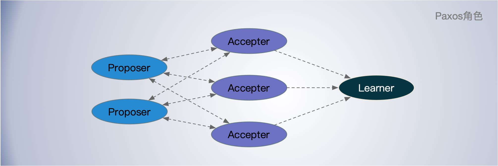
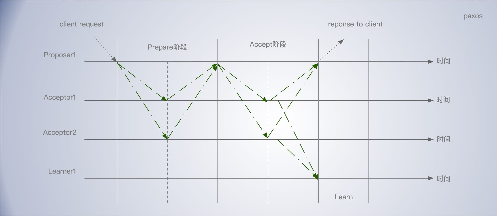
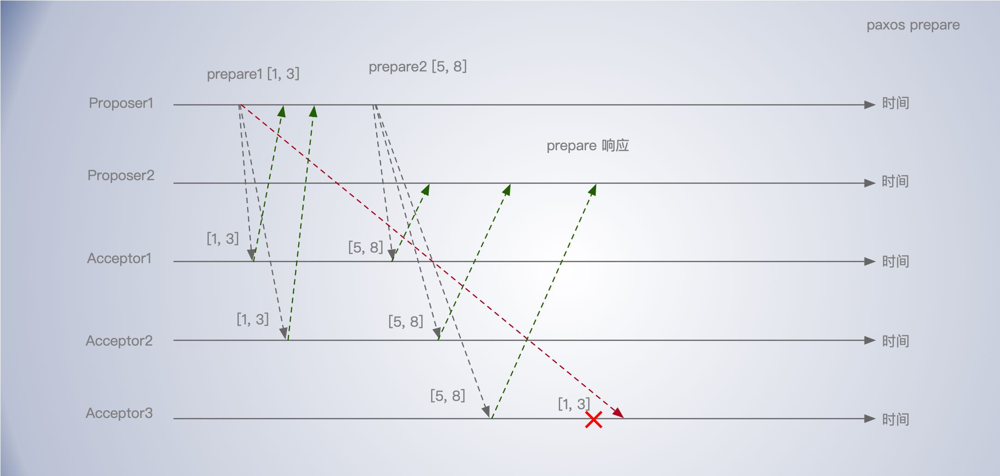
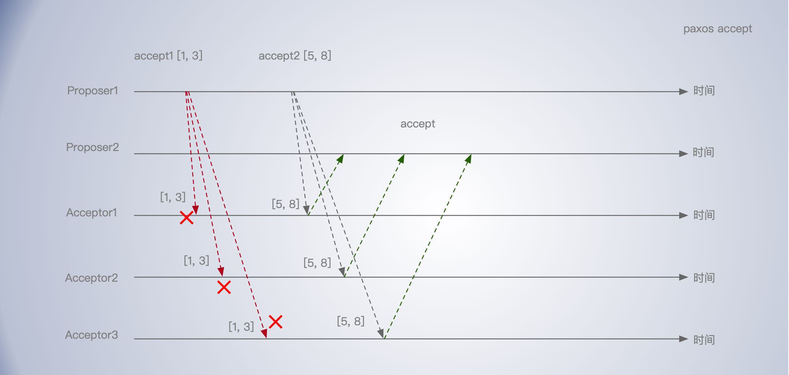
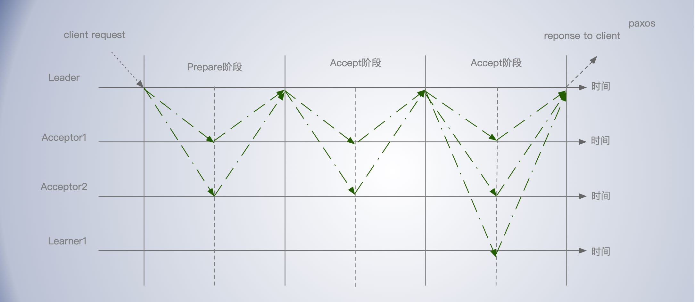

[TOC]


Paxos 算法属于分布式共识算法的一种，是由兰伯特提出的，是基于消息传递且具有高度容错特性的共识（consensus）算法。很多其他的共识算法都一在它基础上改进的来的，比如，`Fast Paxos` 算法、`Cheap Paxos` 算法、`Raft` 算法等等。

Paxos 算法包含 2 个部分：

- Basic Paxos 算法，描述的是多节点之间如何就某个值（提案 Value）达成共识；
- Multi-Paxos 思想，描述的是执行多个 Basic Paxos 实例，就一系列值达成共识。

需要注意的是，Paxos 常被误称为“一致性算法”。但是“一致性（`consistency`）”和“共识（`consensus`）”并不是同一个概念。Paxos是一个共识（consensus）算法。

分布式系统中的节点通信存在两种模型：共享内存（Shared memory）和消息传递（Messages passing）。

基于消息传递通信模型的分布式系统，不可避免的会发生以下错误：进程可能会慢、被杀死或者重启，消息可能会延迟、丢失、重复，在基础 Paxos 场景中，先不考虑可能出现消息篡改即拜占庭错误的情况。Paxos 算法解决的问题是在一个可能发生上述异常的分布式系统中如何就某个值达成一致，保证不论发生以上任何异常，都不会破坏决议的共识。

一个典型的场景是，在一个分布式数据库系统中，如果各节点的初始状态一致，每个节点都执行相同的操作序列，那么他们最后能得到一个一致的状态。为保证每个节点执行相同的命令序列，需要在每一条指令上执行一个“共识算法”以保证每个节点看到的指令一致。


## Basic Paxos

Basic Paxos 用于对单个值（Value）达成共识。

### 角色



**Proposer**：提议者

提议者提出提案 (Proposal)，用于投票表决。提案信息包括提案编号 (Proposal ID) 和提议的值 (Value)。

通常提议者为集群中收到客户端请求的节点

提议者代表的是接入和协调功能，收到客户端请求后，发起二阶段提交，进行共识协商；


**Acceptor**：接受者

参与决策，对每个提议的值进行投票，并存储接受的值。接受者回应提议者的提案。 收到提案后可以接受提案，若提案获得多数 接受者的接受，则称该提案被批准通过。

通常，集群中的所有节点都在扮演接受者的角色，参与共识协商，并接受和存储数据。

接受者代表投票协商和存储数据，对提议的值进行投票，并接受达成共识的值，存储保存；


**Learner**：学习者

学习者不参投票决策过程，直接从提议者/接受者学习最新达成一致的提案（Value）。

通常，学习者是数据备份节点，比如 “Master-Slave” 模型中的 Slave，被动地接受数据，容灾备份。

学习者代表存储数据，不参与共识协商，只接受达成共识的值，存储保存。


### 达成共识

Paxos 算法分成两个阶段来达成共识。

#### 准备（Prepare）阶段

1、发送 Prepare请求：`Proposer` 向 `Acceptor` 中的一个多数派(Majority)发出 Prepare 请求。即发送包含提案编号 n 的 `Prepare请求`，这个请求无需携带提案内容，只携带提案编号 n， 提案编号是全局唯一且递增的。

2、`Acceptor`向 `Proposer` 回复承诺：

`Acceptor` 收到 `Prepare请求` 后，会做出承诺：

- 不再接受提案编号小于等于当前请求的 `Prepare请求`。
- 不再通过提案编号小于当前请求的提案。

注意，上面的两个承诺，第一个的小于等于，第二个是小于。

`Acceptor` 在不违背以前作出的承诺的条件下，回复已经 `Accept` 过的提案编号最大的那个提案的编号和 Value，没有则返回空值。

acceptor 收到 prepare 消息后，如果提案的编号大于它已经回复的所有 prepare消息(回复消息表示接受accept)，则 acceptor 将自己上次接受的提案回复给 proposer，并承诺不再回复小于n的提案；

这个过程在任何时候中断都可以保证正确性。例如如果一个 proposer 发现已经有其他 proposer 提出了编号更高的提案，则有必要中断这个过程。因此为了优化，在上述 prepare 过程中，如果一个 acceptor 发现存在一个更高编号的提案，则需要通知 proposer，提醒其中断这次提案。

#### 接受（Accept）阶段

`Proposer` 收到多数 `Acceptor` 对 `prepare` 的回复后即开始进入 `Accept` 阶段。

- `Propose` 请求 : `Proposer` 收到多数 `Acceptor` 的 Promise 应答后，从应答中选择提案编号最大的提案的 Value，作为本次要发起的提案。如果所有应答的提案 Value 均为空值，则可以自己随意决定提案 Value。然后携带提案编号 n 和 Value，向所有回复 prepare请求的 `Acceptor` 发送 Propose 请求。

2.`Accept` 提案: `Acceptor` 收到 Propose 请求后，在不违背自己之前作出的承诺下，接受并持久化当前提案编号和提案 Value。

决议（value）只有在被 proposers 提出后才能被批准（未经批准的决议称为“提案（proposal）”）；在一次 Paxos 算法的执行实例中，只批准（chosen）一个 value；learners 只能获得被批准（chosen）的 value。

Proposer 收到多数Acceptors 的Accept后，决议形成，将形成的决议发送给所有 `Learner` 。




#### 案例

设置集群中 X 的值。

Proposer1 先发起提案 编号 n = 1， Value = 3，计作 [1,3] 。 然后 Proposer2 发起了另一个提案，编号 n = 5，Value = 8， 计作 [5,8]。

prepare 阶段：下面为了方便，显示了Value，实际上在 prepare 阶段，不需要携带 Value 信息。

- 首先，Proposer1 向 Acceptor1， Acceptor2 发起 prepare 请求 [1, 3]， 由于延迟，向 Acceptor3 点请求尚未传达慢了。并承诺以后不再响应提案编号小于等于 1 的 parepare 请求，不会接受编号小于 1 的提案。
- 然后，Proposer2 向 Acceptor1， Acceptor2， Accptor3 发起 prepare 请求 [5, 8]; 由于提案编号 5 比之间的大，且尚未通过任何提案，可以接受。 Accptor 承诺以后不再响应提案编号小于等于 5 的 prepare 请求，不会通过编号小于 5 的提案。
- Proposer1 向 Acceptor3 发送的 parepare 请求 [1, 3] 到达，由于提案编号 1 小于它之前响应的准备请求的提案编号 5，所以丢弃该准备请求，不做响应。




Accept 阶段：

- Proposer1 收到大多数的接受者的 prepare 响应后，根据响应中提案编号最大的提案的值，设置接受请求中的值。因为该值在来自节点 Acceptor1， Acceptor2 的 prepare 响应中都为空，所以就把自己的提议值 3 作为提案的值，发送接受请求 accept[1, 3]。

- Proposer2 收到大多数的接受者的响应后，根据响应中提案编号最大的提案的值，设置接受请求中的值。因为该值在来自节点 Acceptor1， Acceptor2, Acceptr3 的 prepare 响应中都为空，所以就把自己的提议值 8 作为提案的值，发送接受请求 accept[5, 8]。
- 当接受者收到接受请求[1, 3]的时候，由于提案的提案编号 1 小于三个节点承诺能通过的提案的最小提案编号 5，所以提案[1, 3]将被拒绝。
- 当接受者收到接受请求[5, 8]的时候，由于提案的提案编号 5 不小于三个节点承诺能通过的提案的最小提案编号 5，所以就通过提案[5, 8]，三个节点就 X 值为 8 达成了共识。
- 如果集群中有学习者，当接受者通过了一个提案时，就通知给所有的学习者。




### 容错能力

Paxos 算法运行在允许宕机故障的异步系统中，不要求可靠的消息传递，可容忍消息丢失、延迟、乱序以及重复。

它利用大多数 (Majority) 机制保证了 2F+1 的容错能力，即 2F+1 个节点的系统最多允许F个节点同时出现故障。可以这么理解：只要故障节点数没有达到一半，共识协商就可以正常工作。


### 小结

提案编号的大小代表着优先级，可以这么理解，根据提案编号的大小，接受者保证三个承诺，具体来说：

- 如果准备请求的提案编号，小于等于接受者已经响应的准备请求的提案编号，那么接受者将承诺不`响应`这个准备请求；

- 如果接受请求中的提案的提案编号，小于接受者已经响应的准备请求的提案编号，那么接受者将承诺不`通过`这个提案；

- 如果接受者之前有通过提案，那么接受者将承诺，会在准备请求的响应中，包含已经通过的最大编号的提案信息。

    

### Basic Paxos的问题

每次只能对单个值达成共识。每次需要两轮 RPC(Prepare、Accept) 来达成共识、性能差、延迟大。

如果多个提议者同时提交提案，可能出现因为提案编号冲突，在准备阶段没有提议者接收到过半的准备响应，协商失败，需要重新协商。比如，一个 5 节点的集群，如果 3 个节点作为提议者同时提案，就可能发生因为没有提议者接收大多数响应（比如 1 个提议者接收到 1 个准备响应，另外 2 个提议者分别接收到 2 个准备响应）。

## Multi-Paxos

Basic Paxos 每次只能就单个值（Value）达成共识；每次达成共识需要2个往返延迟开销大；多个提案者还容易引提案冲突导致协商失败。

如果要设置一组连续的被 Accept 的值（value），作为应用到一个分布式状态机的一组命令。如果每个命令都通过一个 Basic Paxos 算法实例来达到一致，会产生大量开销。这时候就需要使用 Multi-Paxos 了。

Multi-Paxos 算法是一个统称，它是指基于 Multi-Paxos 思想，通过多个 Basic Paxos 实例实现一系列值的共识的算法（比如 Chubby，Boxwood 的 Multi-Paxos 实现、Raft 算法等）。


### Leader 角色

Multi-Paxos 基于 Basic Paxos 做出最大的改进是引入了 Leader 角色：

首先，选举一个 `Leader`，由 `Leader` 统一进行提案给 `Acceptor` 进行表决。这样没有 Proposer 竞争，解决了活锁问题。

如何选举出 Leader ？兰伯特的论文中，并没有给出，不同的 Multi-Paxos 算法中有不同的实现。可以通过一次 Basic Paxos 来选举出一个 Leader。

如果 Leader 发生宕机，服务会陷入临时不可用，需要重新选举 Leader 才可以继续服务。

新当选领导者后，需要先作为学习者了解目前已被选定的指令。

### 优化 Basic Paxos 执行

在系统中 Leader 稳定不变的情况下（没有崩溃或改变），同一个 Leader 执行每轮 Paxos 算法实例时，Prepare 阶段就可以跳过，从而将两阶段变为一阶段，提高效率。 

Leader 稳定不变时，Multi-Paxos 通过改变 Prepare 阶段的作用范围至 同一个 Leader 后面提交的所有实例，使得 Leader 的连续提交只需要执行一次 Prepare 阶段，后续只需要执行 Accept 阶段，将两阶段变为一阶段，提高了效率。

为了区分连续提交的多个实例，每个实例使用一个 Instance ID 标识，Instance ID 由 Leader 本地递增生成。 




基本Paxos协议的一个实例和一个初始 Leader(Proposer), 

```
Client   Proposer      Acceptor     Learner
   |         |          |  |  |       |  | --- First Request ---
   X-------->|          |  |  |       |  |  Request
   |         X--------->|->|->|       |  |  Prepare(N)
   |         |<---------X--X--X       |  |  Promise(N,I,{Va,Vb,Vc})
   |         X--------->|->|->|       |  |  Accept!(N,I,V)
   |         |<---------X--X--X------>|->|  Accepted(N,I,V)
   |<---------------------------------X--X  Response
   |         |          |  |  |       |  |
```

式中V = (Va, Vb, Vc) 中最新的一个。

初始时需要执行一次 Prepare，在 Leader 稳定不变情况下，Basic Paxos 的后续实例(由I+1表示)使用相同的 Leader，就不需要执行 Prepare 阶段了。

```
Client   Proposer       Acceptor     Learner
   |         |          |  |  |       |  |  --- Following Requests ---
   X-------->|          |  |  |       |  |  Request
   |         X--------->|->|->|       |  |  Accept!(N,I+1,W)
   |         |<---------X--X--X------>|->|  Accepted(N,I+1,W)
   |<---------------------------------X--X  Response
   |         |          |  |  |       |  |
```

注意，这里要求 Leader 是稳定的，如何理解领导者处于稳定状态？
Leader 节点没有崩溃或变更，节点中的命令是最新的，不再需要通过 Prepare 请求来发现之前被大多数节点通过的提案，领导者可以独立指定提案中的值。准备阶段的意义，是发现接受者节点上，已经通过的提案的值。如果在所有接受者节点上，都没有已经通过的提案了，这时，领导者就可以自己指定提案的值了，那么，准备阶段就没有意义了，也就是可以省掉了。


### Chubby 的 Multi-Paxos 实现

通过引入主节点，实现了领导者（Leader）节点的特性。主节点作为唯一提议者，这样就不存在多个提议者同时提交提案的冲突问题。

主节点是通过执行 Basic Paxos 算法，进行投票选举产生的，并且在运行过程中，主节点会通过不断续租的方式来延长租期（Lease）。

实现了优化机制：“当领导者处于稳定状态时，省掉准备阶段，直接进入接受阶段”， 通过减少非必须的协商步骤来提升性能的。

Chubby 实现了成员变更，以此保证节点变更的时候集群的平稳运行。

在 Chubby 中，为了实现了强一致性，读操作也只能在主节点上执行。所有的读请求和写请求都由主节点来处理。当主节点从客户端接收到写请求后，作为提议者，将数据发送给所有的节点，并且在大多数的服务器接受了这个写请求之后，再响应给客户端成功

当主节点接收到读请求后，处理就比较简单了，主节点只需要查询本地数据，然后返回给客户端就可以了。

Chubby 所有读写都在主节点，虽然这样提升了数据的提交效率，但是所有写请求都在主节点处理，限制了集群处理写请求的并发能力，约等于单机。

Chubby 的 Multi-Paxos 实现中，也约定了“大多数原则”，能容错（n - 1）/2 个节点的故障。


### 其他

Basic Paxos 是经过证明的，而 Multi-Paxos 是一种思想，缺失实现算法的必须编程细节，这就导致，Multi-Paxos 的最终算法实现，是建立在一个未经证明的基础之上的，正确性是个问号。

实现 Multi-Paxos 算法，最大的挑战是如何证明它是正确的。 比如 Chubby 的作者做了大量的测试，和运行一致性检测脚本，验证和观察系统的健壮性。在实际使用时，建议优先考虑 Raft 算法，因为 Raft 的正确性是经过证明的。当 Raft 算法不能满足需求时，你再考虑实现和优化 Multi-Paxos 算法。


问：一个分布式系统中有5个节点，3个在一个机房A(机器编号A1，A2，A3)，2个在另一个机房B（机器编号B1，B2）。 

1. 如果节点A1的机架网络发生故障，导致A1与其他节点通信受阻，那么A1节点将会执行什么操作呢？ 
2. 通讯恢复以后A1节点如何进行数据同步呢？
3. 如果主节点为B1，A机房与B机房间通讯产生故障，A机房和B机房的节点将分别执行怎样的操作呢？

答：

1. A1节点，可以联系其他节点，联系领导者，获取最新的集群节点状态信息和领导者信息，拒绝写操作的执行。
2. 如果，同步数据，需要在代码实现设计实现，比如，可以请求领导者节点，把新通过的提案，都同步过来，更具体的实现，可以参考Raft的日志复制。
3. 节点B1，在leader leasing 过后，要主动退位，并拒绝执行写操作，A 机房的3个节点，将选举出新的领导者。


### 小结

Paxos 不易于理解学习，这个和算法提出者的表述也有一定关系。在 2012 年 NSDI 的一项非正式调查中，发现很少有人对 Paxos 感到满意，即使在经验丰富的研究人员也不太满意。

Paxos 没有为构建实际的实现提供一个良好的基础。没有一个被广泛认可的算法。Lamport 的描述主要是关于单一法令的 Paxos; 他概述了多种 paxos的可能方法，但遗漏了许多细节。

Paxos 架构对于构建实际系统来说比较困难。基于 Paxos 实际的系统最终与 Paxos 最终可能差很大。每个实现都从 Paxos 开始，但是发现实现它的困难性，然后开发出一个明显不同的体系结构。这既费时又容易出错。借用一位 Chubby 实现者的评论:

>  Paxos 算法的描述与真实系统的需求之间存在显著的差距，最终的系统将基于一个未经证实的协议。

由于这些问题，Paxos 并不利于构建系统或理解。在实际中不太推荐使用，可以使用其他共识算法代替，比如 Raft 。


## 扩展阅读

https://github.com/Tencent/phxpaxos/wiki

https://medium.com/@angusmacdonald/paxos-by-example-66d934e18522

https://zh.wikipedia.org/wiki/Paxos%E7%AE%97%E6%B3%95

https://time.geekbang.org/column/intro/279

[The Chubby lock service for loosely-coupled distributed systems](http://labs.google.com/papers/chubby-osdi06.pdf)

[Spanner: Google's Globally-Distributed Databas](https://ai.google/research/pubs/pub39966)

[The Chubby lock service for loosely-coupled distributed systems](https://static.googleusercontent.com/media/research.google.com/zh-CN//archive/chubby-osdi06.pdf)

