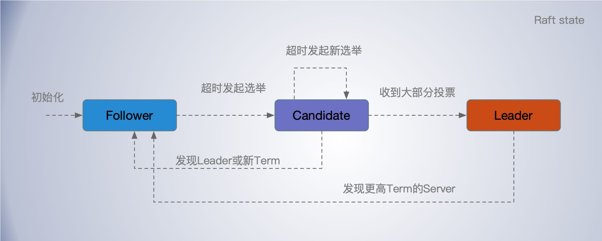
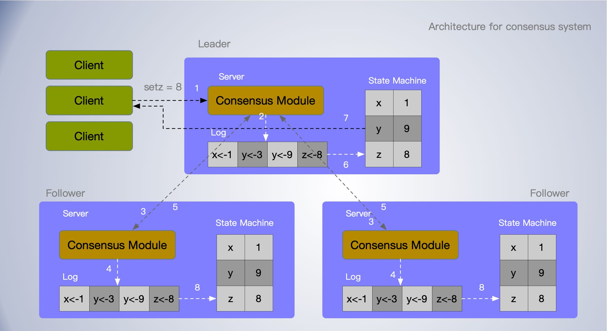
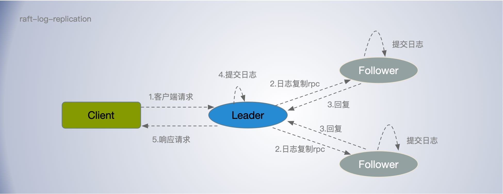
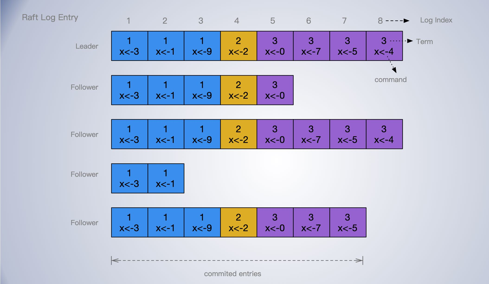
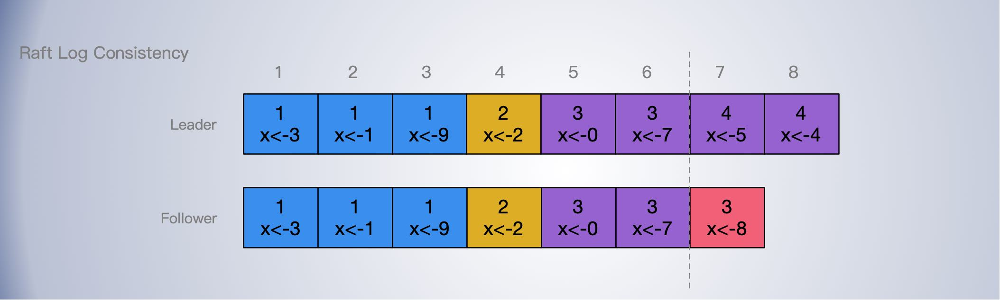
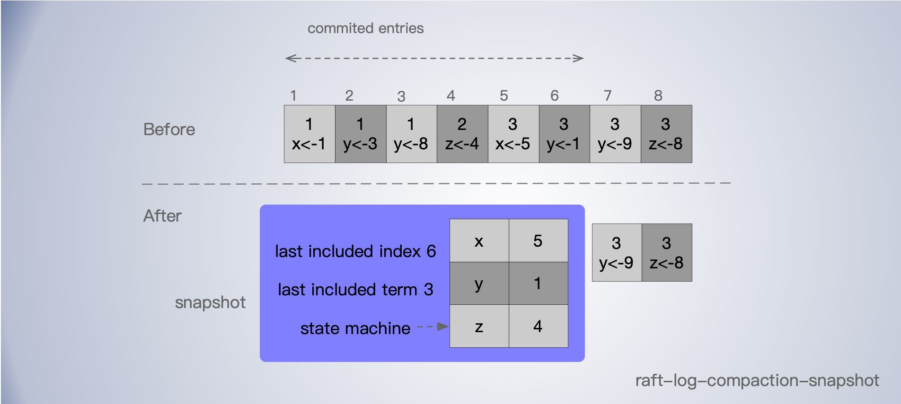
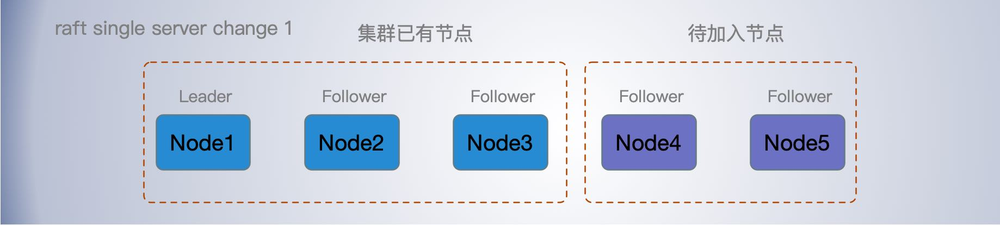
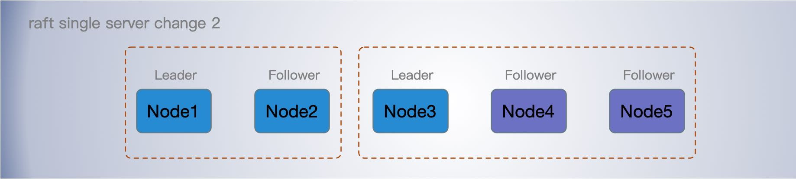
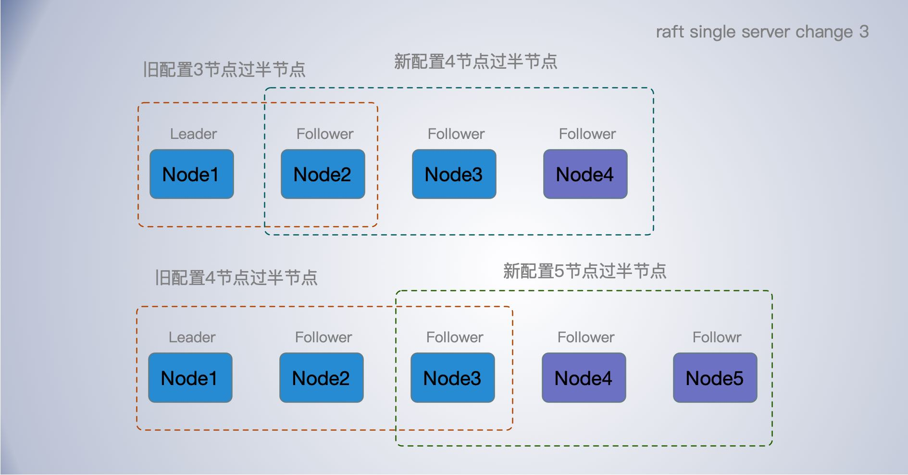

[TOC]

Raft 这一名字来源于 "Reliable, Replicated, Redundant, And Fault-Tolerant"（“可靠、可复制、可冗余、可容错”）的首字母缩写。

Raft 是用于管理复制日志的共识算法。它是 (Muilti)Paxos 演变而来，效率与Paxos相当，但结构与 Paxos 不同; Raft 比 Paxos 更容易理解，也为构建实用系统提供了更好的基础，更易实现。 为了提高可理解性，Raft分离了共识的关键要素，如领导人选举、日志复制和安全，并强制加强了一致性，以减少必须考虑的状态数量。Raft 还包括一个改变集群成员的新机制，它使用重叠的多数关系来保证安全。

Raft 的几个新颖的特点:

- 强领导模型： Raft 使用了比其他共识算法更强的领导形式。例如，日志条目只从 Leader 流向其他服务器。这简化了复制日志的管理，使 Raft 更容易理解。
- 使用随机超时机制来选举 Leader 。是的 Leader 选举按时间随机错开，提高选举成功率，减少冲突。
- 成员变更: Raft用于变更集群中服务器集合的机制使用了一种新的联合共识方法，在转换过程中两种不同配置的多数重叠。这允许集群在配置更改期间继续正常运行。

Raft 集群内的节点都对选举出的领袖采取信任，故 Raft 不是一种拜占庭容错算法。

鉴于 Paxos 教训，Raft 的设计目标: 为系统构建提供一个完整的、实用的，安全的，必须能够让大量用户轻松地理解。

Raft 主要分为这几个部分：领导者选举、日志复制、安全性和成员变更。

**适用于实际系统的共识算法通常具有以下特性**:

- 它们确保在所有非拜占庭条件下的安全性(从不返回错误结果)，包括网络延迟、分区、包丢失、重复和重新排序。
- 只要大多数节点正常，集群功能是就是可用的，并且可以相互通信，也可以与客户端通信。例如，一个由 5 台服务器组成的集群可以容忍任意两个节点故障。当故障节点恢复后; 它们可能会从稳定存储上的状态恢复，并重新加入集群。
- 它们不依赖于时间来确保日志的一致性:错误的时钟和极端的消息延迟在最坏的情况下可能导致可用性问题。
- 在通常情况下，只要集群的大多数成员响应了单轮远程过程调用，命令就可以完成;少数速度较慢的服务器不需要影响整个系统的性能。

简化状态空间，使系统更加一致并尽可能消除非确定性。

## 角色状态

### Leader 领导者

一个集群里只能有一个 Leader。Raft 算法是强领导者模型，一切都以领导者为准。

领导者三个主要工作： 

- 处理写请求；

- 管理日志复制；日志复制（AppendEntries）RPC 只能由领导者发起，这是实现强领导者模型的关键之一;

- 固定周期发送心跳信息，通知其他节点我是领导者，阻止跟随者发起新的选举，夺权，维持自己领导地位；

领导者一直担任领导者，任期也不会变，直到它自身出现问题，比如宕机或者因为网络延迟，其他节点发起一轮新的选举。

Raft 与 Basic Paxos 相比，引入了领导者节点，一切以领导者节点为准。并且对 Paxos 分 Prepare 和 Accept 两阶段达成共识做了优化，减少了一半的往返延时。

总体看来 Raft 与 Multi-Paxos 有诸多相似之处，但是 Raft 都是对 Basic Paxos 的痛点做的改善。但是在领导者选举，日志复制，超时机制，节点变更等诸多细节在实现上又有所不同。

### Follower 跟随者

普通的节点，主要负责接收和处理来自领导者的消息，当等待领导者心跳信息超时的时候，就主动站出来，推荐自己当候选人。

超时时间通常是150 ms或300 ms ？

### Candidate 候选人

当跟随者在超时时间内未收到心跳信息，就会变为候选人把自己的任期(Term)编号加1，并开始向其他节点发送(广播)请求投票（RequestVote）RPC 消息，通知其他节点来投票，如果赢得了大多数选票，就当选为领导者。

不是所有节点都能当选领导者，只有候选者日志完整度超过半数节点，才能当选领导者；因为如果候选者的日志完整性比跟随者低，跟随者会拒绝投票给它。

在 Raft 中，节点日志编号是连续的。最后一条日志项对应的任期编号值更大，日志索引号更大，则代表日志更加完整。比较日志完整性是比较uncommited 日志索引的大小。

## 领导者选举

### 任期

任期编号在 Raft 中有着非常重要的作用。领导者是有任期的，任期编号递增的数字，任期会随着重新选举出新领导者而变更。

跟随者在等待领导者心跳信息超时后，推举自己为候选人时，会增加自己的任期号。

在 Raft 算法中约定，*如果一个候选人或者领导者，发现自己的任期编号比其他节点小，那么它会立即恢复成跟随者状态*。

如果一个节点接收到一个包含较小的任期编号值的请求，那么它会直接拒绝这个请求。

### 选举规则

1、在初始状态下，集群中所有的节点都是跟随者的状态。

2、当跟随者在超时时间内未收到心跳信息，即认为当前没有领导者，就会变为候选人把自己的任期(Term)编号加 1，并开始向其他节点发送(广播)请求投票（RequestVote）RPC 消息，通知其他节点来投票，

3、如果赢得了大多数选票，就当选为领导者。如果超时仍没有选出新领袖，此任期自动终止，开始新的任期并开始下一场选举。

规则细节：

- 在一次选举中，赢得大多数选票的候选人，就可以当选为为领导者；
- 不是所有节点都能当选领导者，只有候选者日志完整度超过半数节点，才能当选领导者；因为如果候选者的日志完整性比跟随者低，跟随者会拒绝投票给它；
- 在 Raft 中，节点日志编号是连续的。最后一条日志项对应的任期编号值更大，日志索引号更大，则代表日志更加完整。比较日志完整性是比较uncommited 日志索引的大小；
- 在一次选举中，每个节点只能给一个任期编号投一次票，先来的拉票请求先得，前提是对应的候选人日志完整度和任期编号不低于自己；
- 如果候选人收到其他候选人的拉票、而且拉票的任期编号不小于自己的任期编号，就会自认落选，成为追随者，并认定来拉票的候选人为领袖；
- Raft 每个服务器的超时期限是随机的，这降低伺服务同时竞选的几率，也降低因两个竞选人得票都不过半而选举失败的几率；
- 如果候选人收到其他候选人的拉票、而且拉票的任期编号不小于自己的任期编号，就会自认落选，成为追随者，并认定来拉票的候选人为领袖？

服务节点状态变更

### 随机超时

一些会导致选举失败的情况，比如同一任期内，多个候选人同时发起选举，导致选票被瓜分，选举失败。

Raft 算法引入随机选举超时，把超时时间都分散开来，在大多数情况下只有一个服务器节点先发起选举，而不是同时发起选举，这样就能减少因选票瓜分导致选举失败的情况。

随机超时主要有两个方面：

- 跟随者等待领导者心跳信息超时的时间间隔，是随机的；

- 候选者等待选举超时的时间间隔，是随机的，即在一个随机时间间隔内，没有赢得过半票数，那么选举无效了，候选人发起新一轮的选举；

通过随机超时，可以避免出现多伦选举不出领导者的问题。

### 节点通讯

候选者在向别的节点发布请求投票的RPC时，广播给其他所有节点。

## 日志

节点上的数据都是以副本数据是以日志的形式存储。Raft 的处理客户端读写请求都是在领导者节点完成的，领导者处理客户端写请求的过程其实就是一个复制日志和应用日志项到状态机的过程。客户端每次操作都会追加日志到各节点。

Raft 日志数据只会从领导者流向其他节点，这样就简化了日志的管理， 而无须向 Paxos 那样需要 prepare 和 accept 两阶段才能达成共识，而且一切以领导者为准，也简化了日志一致性的处理。

### 复制状态机

共识算法通常出现在复制状态机的上下文中。

在这种方法中，一组服务器上的状态机计算相同状态的相同副本，即使某些服务器宕机，它们也可以继续运行。复制状态机用于解决分布式系统中的各种容错问题。例如，拥有单个 Leader 的大型集群，例如 GFS、HDFS 和 RAMCloud，通常使用一个单独的复制状态机来管理 Leader 选举和存储配置信息，这些信息必须在 Leader崩溃后才能保存。复制状态机的使用案例如 Chubby 和 ZooKeeper。

共识算法管理包含来自客户端的状态机命令的复制日志。状态机处理来自日志的相同命令序列，因此它们产生相同的输出。

复制的状态机通常使用复制的日志来实现。每个服务器存储一个包含一系列命令的日志，状态机按顺序执行这些命令。每个日志以相同的顺序包含相同的命令，因此每个状态机处理相同的命令序列。由于状态机是确定性的，每个状态机都计算相同的状态和相同的输出序列。

保持复制的日志一致是共识算法的工作。服务器上的共识模块从客户端接收命令并将它们添加到日志中。它与其他服务器上的共识模块通信，以确保每个日志最终以相同的顺序包含相同的请求，即使某些服务器失败。一旦正确地复制了命令，每个服务器的状态机将按照日志顺序处理它们，并将输出返回给客户机。因此，这些服务器似乎形成了一个单独的、高度可靠的状态机。

### Log Entry

日志项(Log Entry), 可以就是节点日志的组成单元，主要有三部分：

- 指令（Command），客户端请求指定的指令、状态机需要执行的指令, 比如客户端发出的 `set x = 1`;

- 索引值（Log index）, 即日志的序号，而且必须是连续，递增的；

- 任期编号（Term），创建该条日志项的领导者的任期编号；

Multi-Paxos 不要求日志是连续的，但在 Raft 中日志索引号必须是连续的。 Raft 中，日志不仅是数据的载体，日志的完整性还影响领导者选举的结果。也就是说，日志完整性最高的节点才能当选领导者。

### 日志复制过程

客户端向领导者发送写数据指令，领导者发送 `AppendEntriesRPC` 消息，将日志项复制到集群其他节点上。

- 领导者接收指令后，先写入自己记录中的新指令中(uncommited)，然后把指令转发给追随者。如果有追随者没反应，领导者会不断重发指令、直到每个追随者都成功将新指令写入记录为止。

- 当领导者接收到大多数节点的“复制成功”响应后，会将日志项应用到它的状态机，视为日志已存储(commit)， 并返回成功给客户端。
- 如果领导者没有接收到大多数的“复制成功”响应，就返回错误给客户端。

当追随者发现指令状态变成已存储，就会在其状态机上运行该指令。

领导者挂了，领导者的某些新指令可能还没复写到集群整体，造成集群的记录处于不一致的状态。新领导者会担起重返一致的责任，让每个追随者的记录都和它的一致，做法是：和每个追随者比对记录，找出两者一致的最后一个相同指令的日志项位置，然后用自己的日志项覆盖追随者与自己不同的日志项。这个操作完成后每个服务器的记录就会一致。

日志复制流程：

- 接收到客户端请求后，领导者基于客户端请求中的指令，创建一个新日志项，并附加到本地日志中。
- 领导者执行 `AppendEntriesRPC`，将新的日志项复制到跟随节点。
- 当日志条目被`安全复制`后，领导者将日志条目应用到其状态机，即日志被提交(commit)，并将执行结果返回给客户端。
- 当跟随者接收到心跳信息，或者新的日志复制 RPC 消息后，如果跟随者发现领导者已经提交了某条日志项，而它自己还没，那么跟随者就会按日志顺序将这条日志项应用到本地的状态机中，即执行 commit 操作。

领导者节点发送 AppendEntries RPC 请求中会带上 leaderCommit 表示领导者已提交的最大日志索引位置，跟随者可以根据此来提交自己的日志。

怎么确认是安全复制了？

- 当领导者将收到成功复制到大多数的服务器上的响应后，领导者会将这条日志项应用到它的状态机中，响应客户端；

- 如果有跟随者崩溃或运行缓慢，或者网络数据包丢失，领导者会无限期地重试 `AppendEntriesRPC` (即使在它已经响应客户端之后)，直到所有跟随者 最终存储所有日志条目；

Raft 保证提交(commit)的条目会被持久化存储的，并且最终将由所有可用的状态机执行。一旦创建日志的领导者在大多数服务器上复制了日志条目(例如图6中的条目7)，就会提交日志条目。

这也会提交leader日志中之前的所有条目，包括之前的leader创建的条目。第5.4节讨论了在领导者变更后应用此规则时的一些微妙之处，同时也说明了承诺的这个定义是安全的。leader跟踪它知道要提交的最高索引，并在未来的附录rpc(包括心跳)中包含该索引，以便其他服务器最终发现。

### 日志一致性

如何实现日志的一致？如何处理不一致日志问题？尤其是当一个新的 Leader 被选出来时，它的日志和其它的跟随者的日志可能不一样，这个时就需要一个机制来保证日志的一致性。

所有节点以领导者的日志为准，来实现各节点日志的一致的。

首先，领导者通过日志复制 RPC 的一致性检查，找到跟随者节点上，与自己相同日志项的最大索引值。也就是说，这个索引值之前的日志，领导者和跟随者是一致的，之后的日志是不一致的了。然后，领导者强制跟随者更新覆盖的不一致日志项，实现日志的一致。具体为：

- 领导者通过日志复制 RPC 消息，发送当前最新日志项到跟随者（假设当前需要复制的日志项是最新的），这个消息的 前一个日志项索引值 PrevLogEntry 为 7，前面一条日志项的 Term 值PrevLogTerm 值为 4。
- 如果跟随者在它的日志中，找不到与 PrevLogEntry 值为 7、PrevLogTerm 值为 4 的日志项，也就是说它的日志和领导者的不一致了，那么跟随者就会拒绝接收新的日志项，并返回失败信息给领导者。
- 这时，领导者会递减要复制的日志项的索引值，并发送新的日志项到跟随者，这个消息的 PrevLogEntry 值为 6，PrevLogTerm 值为 3。这样一条一条的往前移动，是为了找到跟随者与领导者的日志项是从哪个位置开始不一样的。
- 如果跟随者在它的日志中，找到了 PrevLogEntry 值为 6、PrevLogTerm 值为 3 的日志项，那么日志复制 RPC 返回成功，这样一来，领导者就知道在 PrevLogEntry 值为 6、PrevLogTerm 值为 3 的位置，跟随者的日志项与自己相同，从这个位置开始，该跟随者后面的日志项需要被覆盖掉。
- 领导者通过日志复制 RPC，复制并更新覆盖该索引值之后的日志项，最终实现了集群各节点日志的一致。

Leader 从后往前一个一个的试，来找到跟随者日志与自己不一致的起始位置，这中类似遍历查找的方式效率有点低。

领导者从来不会覆盖或者删除自己的日志。当一个含有 uncommited 日志的节点当选领导者后，它会把这些未提交的日志同步给其他跟随者。比如，在 Leader 只同步日志给了少数节点后挂掉，发生重新选举，就可能发生。

### 日志压缩

Raft 的日志在正常运行时不断增长，但在实际系统中，它不能无限制地增长。而且日志增过多，进行日志重放多时间也更多。如果没有日志“瘦身”操作，终将导致可用性问题。

**快照压缩**是最简单的压缩方法。在快照中，整个当前系统状态被写入稳定存储上的快照，然后该点之前的整个日志被丢弃。例如在 Chubby 和 ZooKeeper ，Redis 。

服务节点用一个快照代替已经提交的日志条目，快照包含最新提交的索引和任期用于定位旧日志项中被替换的部分。如下图，所以 6及之前的日志会被快照中的日志项替换。

每个节点都能建立快照，毕竟都从领导者获取代价太大，但是当跟随者落后太多时，需要通过领导者把快照发送给跟随者。

Raft 进行快照的基本思想。

每个服务器独立地拍摄快照，只覆盖其日志中提交的条目。大部分工作由状态机将其当前状态写入快照组成。

Raft还在快照中包含少量元数据:

- 最后包含的索引是快照替换的日志中最后一个条目的索引(状态机应用的最后一个条目)，
- 最后包含的术语是这个条目的术语。保留这些条目是为了支持对快照之后的第一个日志条目进行 AppendEntries 一致性检查，因为该条目需要先前的日志索引和术语。

为了启用集群成员关系更改，快照还包括日志中最后包含的索引的最新配置。一旦服务器完成了快照的编写，它可能会删除最后包含的索引之前的所有日志条目，以及之前的任何快照。

虽然服务器通常独立拍摄快照，但领导者必须偶尔向落后的追随者发送快照。尤其是异常缓慢的跟随者或加入集群的新服务器落后太多时。让这样的跟随者保持最新状态的方法是让`领导者通过网络向它发送快照`。

领导者使用一个 `InstallSnapshot` RPC 发送快照给太落后的跟随者。当跟随者收到快照时。

- 通常，快照将包含该跟随者日志中尚未包含的新信息，这时，跟随者会丢弃它的整个日志; 它完全被快照取代，并且这个日志可能有未提交的条目与快照冲突内容。

- 如果跟踪者接收到描述其日志前缀的快照(由于重传或错误)，则这部分日志被块覆盖，但快照之后的日志条目仍然有效，必须保留。

跟随者也能创建快照方法背离了 Raft 的强领导模型的原则。虽然有一个领导者在达成共识时有助于避免冲突的决定，但在快照的内容是之前已经达成共识的，所以没有决策冲突。数据仍然只从领导者流向追随者，只是追随者现在可以重新组织他们的数据。

如果只有领导者会创建一个快照，然后它会把这个快照发送给它的每个追随者。这会进一步加剧领导者热点问题，而且。

- 会浪费网络带宽，并减慢快照进程。每个跟随者从本地状态生成快照显然要比通过网络接收快照快得多。
- 而且这会使领导者的实现更加复杂。

快照到频率和时机也需要恰当。太频繁，会浪费磁盘带宽等资源; 太不频繁，就会有日志耗尽存储容量的风险，并且会增加重启期间重放日志所需的时间。

第二个性能问题是，写快照可能会花费大量时间，我们不希望影响正常的客户端请求。可以使用写时复制技术，这样就可以接受新的更新，而不会影响正在写的快照。另外，操作系统的写时复制支持(例如Linux上的fork)可以用于创建整个状态机的内存快照。

**InstallSnapshot RPC 方法详情**

该方法被领导者用来日志块(chunk)给跟随者。

请求参数

- term ： 领导者任期；
- leaderId：领导者id，用于跟随者重定向客户端请求；
- lastIncludedIndex：快照中的最新日志索引号，之前的日志将被快照覆盖掉；
- lastIncludedTerm：快照中最新的领导者任期；
- offset：chunk 在快照文件中的偏移量；
- data[]：从偏移量开始的快照块的原始字节；
- done：如果是最后一个快照块，则为 true；

响应参数：

- term：currentTerm 当前任期；

方法接收者实现：

1.如果 term < currentTerm，立即回复；
2.如果第一个chunk(偏移量为0)，则创建新的快照文件；
3.按照给定的偏移量将数据写入快照文件；
4.如果done为false，则回复并等待更多的数据块；
5.保存快照文件，丢弃索引较小的现有快照或部分快照；
6.如果现有的日志条目与快照最后包含的条目具有相同的索引和术语，则保留它和 reply 之后的日志条目；
7.丢弃整个日志；
8.使用快照内容(和加载快照的集群配置)重置状态机；

**增量压缩**

增量压缩方法，如日志清理和日志结构化合并树，也是可能的。这些工具一次操作一小部分数据，因此它们在一段时间内更均匀地分散了压缩的负载。它们首先选择一个积累了许多已删除和覆盖对象的数据区域，然后更紧凑地重写该区域中的活动对象，并释放该区域。与快照相比，这需要额外的机制和复杂性，因为快照总是在整个数据集上操作，从而简化了问题。尽管日志清理需要修改 Raft，但状态机可以使用与快照相同的接口实现 LSM 树。

## 安全性

如果任何服务器已经将特定的日志条目应用到其状态机，那么其他服务器就不能为相同的日志索引应用不同的命令。

Raft保证以下的安全性：

- 选举安全性：每个任期最多只能选出一个领导者。
- 领导者加性：领导者只会把新指令附加（append）在自己的记录尾端，不会改写或删除自己的已有指令。
- 日志匹配性：如果某个指令在两个日志记录中的任期和指令序号一样，则保证序号较小的指令也完全一样。
- 领导者完整性：如果某个指令在某个任期中存储成功，则保证存在于领导者该任期之后的记录中。
- 状态机安全性：如果某服务器在其状态机上运行了某个指令，其他服务器保证不会在同个状态上运行不同的指令。

状态机安全性则借由下述选举流程的限制所达到。

**追随者宕机**

当某个追随者宕机时，所有给它的转发指令和拉票的消息都会因没有回应而失败，此时发送端会持续重送。当这台追随者引导重新加入集群，就会收到这些消息，追随者会重新回应，如果转发的指令已经写入，不会重复写入。

**领导者宕机**

领导者宕机或断线时，每个已存储指令必定已经写入到过半的服务器中，此时选举流程会让记录最完整的服务器胜选。其中一个因素是Raft候选人拉票时会揭露自己记录最新一笔的信息，如果服务器自己的记录比较新，就不会投票给候选人。

**超时期限和可用性**

Raft 引导选举是基于超时，使得超时期限的选择至为关键。若遵守算法的时限需求：*广播时间 << 超时期限 << 平均故障间隔*，

就能达到稳定性(领导者节点稳定)。这三个时间定义如下：

- 广播时间： 是单一服务器发送消息给集群中每台服务器并得到回应的平均时间，需要测量得到。
- 超时期限： 是发动选举的超时期限，由部署 Raft 集群的人选定。
- 平均故障间隔： 是服务器发生故障之间的平均时间，可以测量或估计得到。

广播时间应该小于选举超时时间的一个数量级，以便领导者可以可靠地发送心跳消息，以阻止追随者开始选举;

选举超时时间应该比平均故障间隔小几个数量级，这样系统才能稳定运行。当领导者节点崩溃时，系统将在选举时间内不可用。

*广播时间*典型是 0.5ms 到 20ms，所以可以将*超时期限*设在 20ms 到 500ms, *平均故障间隔*通常是用周或月来计算的。

## 成员变更为

最初实现成员变更的是`联合共识`（Joint Consensus），但这个方法实现起来困难，后来 Raft 的作者就提出了一种改进后的方法，单节点变更（single-server changes）。

在集群中进行成员变更的最大风险是，可能会同时出现 2 个领导者，即 “脑裂”(Split-Brain)。

比如集群中有 Node1， Node2，Node3 三个节点，其中 Node1 位领导者， 集群配置为 [Node1， Node2，Node3]；然后准备加入两个节点 Node4， Node5:

在两个新节点`“同时”`加入集群时，刚好发生网络分区，Node1，Node2 为一个分区；Node3，Node4，Node5 为一个分区：

左边 Node1依然是 Leader，右边3个节点组成一个“大多数” Node3 当选为 Leader ， 这样就同时有两个 Leader。

为了解决这个问题，引入了单节点变更。

### 单节点变更

单节点变更，就是通过一次只允许变更一个节点实现成员变更，如果要变更多个需要执行多次节点变更。

还就上面那个例子，两个节点先加入一个节点 Node4 后：

- 首先，领导者 Node1 向新节点 Node4 同步数据；
- 然后，领导者将新配置 [Node1， Node2，Node3, Node4] 作为一个日志项，复制到新配置中所有4个节点上，然后将新配置的日志项应用到本地状态机，完成单节点变更。

Node5 节点的加入重复上述操作。

为什么这样就能保证不会出现多个领导者呢？

- 当有个新节点加入集群时，会变更配置，由于延时的原因，可能还没来得及把新配置同步到所有节点就出现了分区，无论是那个分区，都要满足获得大多数(过半节点)选票才能选出领导者；
- 每次只加入一个节点时，无论怎么网络分区，要想两个分区同时满有过半节点的情况，必然会出现两个分区有节点重复，但是由于在一个领导者任期内，节点只能投一次票，即公共的节点只能一边的分区投票，这样就只能选出一个领导者。

不管集群是偶数节点，还是奇数节点，不管是增加节点，还是移除节点，新旧配置的“大多数”都会存在重叠，都可以避免多领导者的情况。

但是，在分区错误、节点故障等情况下，如果并发执行单节点变更，那么就可能出现一次单节点变更尚未完成，新的单节点变更又在执行，导致集群出现 2 个领导者的情况。

如果遇到这种情况，可以在领导者启动时，创建一个 `NO_OP` 日志项（也就是空日志项），只有当领导者将 `NO_OP` 日志项应用后，再执行成员变更请求。？？

联合共识实现起来复杂，不好实现，所以绝大多数 Raft 算法的实现，采用的都是单节点变更的方法（比如 Etcd、Hashicorp Raft）。其中，Hashicorp Raft 单节点变更的实现，是由 Raft 算法的作者迭戈·安加罗（Diego Ongaro）设计的，很有参考价值。

### 联合共识

[Raft 论文劣质翻译，TODO]

到目前为止，我们一直假定集群配置(参与共识算法的服务器集)是固定的。在实践中，有时有必要更改配置，例如在服务器出现故障时更换服务器或更改复制程度。尽管这可以通过使整个集群脱机、更新配置文件，然后重新启动集群来实现，但这将使集群在转换期间不可用。此外，如果有任何手动步骤，它们有操作员出错的风险。为了避免这些问题，我们决定自动化配置更改，并将它们合并到Raft共识算法中。

为了保证配置改变机制的安全，在过渡期间不能出现两名领导人在同一任期内被选出的情况。不幸的是，任何服务器直接从旧配置切换到新配置的方法都是不安全的。不可能自动地同时切换所有的服务器，所以集群在转换过程中可能会分裂成两个独立的多数派(见图10)。

为了确保安全性，配置更改必须使用两阶段方法。实现这两个阶段有多种方法。例如，一些系统(例如[22])使用第一阶段禁用旧的配置，这样它就不能处理客户端请求;然后，第二阶段启用新配置。在Raft中，集群首先切换到一种过渡性的配置，我们称之为联合共识;一旦提交了联合共识，系统就会转换到新的配置。《联合共识》结合了新旧两种结构:

- 在这两种配置中，日志条目被复制到所有服务器。

- 任一配置中的任何服务器都可以作为leader。
- 协议(选举和入职承诺)要求在新旧配置中分别获得多数票。

联合共识允许单个服务器在不同时间在配置之间转换而不影响安全性。此外，联合共识允许集群在整个配置更改过程中继续服务客户机请求。

集群配置使用复制日志中的特殊条目进行存储和通信;图11说明了配置更改过程。当leader收到将配置从Cold更改为Cnew的请求时，它将联合共识的配置(图中为Cold,newin)存储为日志条目，并使用前面描述的机制复制该条目。一旦一个给定的服务器将新的配置条目添加到它的日志中，它就会将该配置用于所有未来的决策(服务器总是在它的日志中使用最新的配置，而不管该条目是否已提交)。这意味着leader将使用Cold, newrules来确定Cold, newlog条目何时被提交。如果领导者崩溃了，一个新的领导者可能被选择在Coldor Cold,new，取决于获胜的候选人是否收到Cold,new。在此期间，cnew无论如何都不能单方面做出决定。

一旦Cold,newhas被提交，任何一个Cold norcnew都不能在没有对方批准的情况下做出决定，并且Leader完整性属性确保只有具有Cold,newlog条目的服务器才能被选举为Leader。现在，对于leader来说，创建一个描述cnew的日志条目并将其复制到集群是安全的。同样，只要看到这个配置，它就会在每个服务器上生效。
当根据Cnew规则提交新的配置时，旧的配置是不相关的，不在新配置中的服务器可以关闭。如图11所示，cold和Cnew在任何时候都不可能进行单边决策;这保证安全。

对于重新配置，还有三个问题需要解决。第一个问题是，新服务器最初可能不存储任何日志条目。如果以这种状态将它们添加到集群中，它们可能需要一段时间才能赶上进度，在此期间可能不可能提交新的日志条目。为了避免可用性差距，Raft在配置更改之前引入了一个额外阶段，在这个阶段中，新的服务器以无投票权的成员身份加入集群(领先者将日志条目复制给它们，但它们不被考虑为多数)。一旦新的服务器跟上了集群的其他部分，重新配置就可以按照上面所述进行。

第二个问题是集群领导者可能不是新配置的一部分。在这种情况下，leader在提交了Cnewlog条目之后就退出(返回到follower状态)。这意味着leader在一段时间内(当它正在commit cnew时)正在管理一个不包含自己的集群;它复制日志条目，但自己并不占多数。leader过渡发生在Cnewis提交时，因为这是新配置可以独立操作的第一个点(总是可以从Cnew中选择leader)。在此之前，可能只有coldserver可以被选为leader。

第三个问题是移除的服务器(不在Cnew中的服务器)会破坏集群。这些服务器不会接收心跳信号，所以它们会暂停并开始新的选举。然后他们将发送带有新的任期号的RequestVote rpc，这将导致当前领导者恢复到follower状态。一个新的领导者最终会被选出来，但是删除的服务器将再次超时，这个过程将会重复，导致糟糕的可用性。

为了防止这个问题，服务器忽略RequestVote rpc当他们相信一个当前的领导者存在。具体来说，如果服务器在当前领导人的最小选举超时时间内收到RequestVote RPC，它不会更新其任期或授予其投票。
这不会影响正常的选举，每个服务器在开始选举前至少等待一个选举超时时间。然而，它有助于避免被移除的服务器造成的中断:如果一个领导者能够让它的集群心跳，那么它就不会被更大的术语数罢免。

## Raft 术语和实现规则

理清这些字段有助于 Raft 算法的代码实现。

### 状态

**服务器持久状态**

在响应 RPC 之前更新稳定存储

- currentTerm: 服务器看到的最新任期(初始化时为0，单调地增加)；
- votedFor：票投给了谁，在当前任期内获得节点选票的候选人id(如果没有则为null)；
- log[]：存储日志条目；

**服务器不稳定状态**

- commitIndex：已知要提交的最高日志条目的索引(初始化为0，单调增加)
- lastApplied：应用于状态机的最高日志条目的索引(初始化为0，单调增加)

**领导者不稳定状态**

选举后会重新初始化

- nextIndex[]：对于每个服务器，发送到该服务器的下一个日志条目的索引(初始化为 leader last log index + 1)

- matchIndex[]：对于每个服务器，已知要在服务器上复制的最高日志条目的索引(初始化为0，单调地增加)

### AppendEntries RPC

复制日志条目的 RPC 方法，由领导者调用来复制日志条目; 也用作心跳

**请求参数**

- term :领导者任期编号；
- leaderld：领导者id，这样跟随者可以重定向客户端；
- prevlogindex：紧接在新日志条目之前的日志条目索引；
- prevLoglndex：前一条日志条目的领导者任期编号；
- entries[]：要存储的日志条目(`心跳检测时为空`，可能会发送多个日志以提高效率)
- leaderCommit：领导者的 commitindex 即已知要提交的最高日志条目的索引；

**响应参数**

- term：服务器节点能看到的最新任期 currentTerm，用于 Leader 更新自己；
- success：如果 follower包含与 prevLogIndex 和 prevLogTerm 匹配的条目，则为true。即跟随者日志条目与领导者发送的相同；

**接收者实现**

- 如果 term < currentTerm，则返回 false；
- 如果在 prevLogIndex 的条目中没有一个与 prevLogTerm 匹配的条目，则返回false ；即跟随者日志条目与领导者发送的不匹配，后续要以领导者的为准覆盖掉；
- 如果一个现有的条目和一个新的条目冲突(相同的索引但是不同的任期)，删除现有的条目和它后面的所有条目；
- `附加日志中不存在的任何新条目？`

- 如果 leaderCommit > commitIndex，设置 commitIndex = min(leaderCommit, 最新条目的索引)

### RequestVote RPC

请求投票 RPC

**请求参数**

- term ：候选者当前任期；
- candidateId：候选者id ？？？
- lastLogIndex：候选者最新日志索引号，用于比较日志完整性；
- lastLogTerm：候选者最新日志条目的领导任期，低于投票者的，不会被投票；

**响应参数**

- term：投票者节点的 currentTerm, 用于候选者更新自己；
- voteGranted：true 表示候选者收到了投票；

**接收者实现**

- 如果term < currentTerm，则返回false；
- 如果 votedFor 为null (表示节点投票权还没用过)或 candidateId和候选者的日志至少和接收者的日志一样最新，就授予投票；

### 服务器规则

**所有服务节点**

- 如果 commitIndex > lastApplied: 增加 lastApplied，应用 log[lastApplied]到状态机；
- 如果 RPC 请求或响应中包含 term T > currentTerm:设置 currentTerm = T，(Leader 或 Candidate)转换为 follower；即领导者或候选者发现了更高的任期 Term，转为跟随者；

**跟随者节点**

- 回复候选人和领导的 RPC 请求；
- 如果选举超时，没有收到当前leader的 AppendEntries RPC或授予 candidate 投票: 转换为候选人；一共两种 RPC 请求，如果在超时时间内都没收到，就揭竿而起，变为候选人发起选举投票。

**候选者节点**

- 跟随者接收请求超时，转为候选人后，开始选举:
- 增加currentTerm；
- 为自己投票；
- 重置选举计时器；
- 发送RequestVote rpc到所有其他服务器；
- 如果投票来自大多数服务器:成为领导者；
- 如果收到来自领导者的 AppendEntries RPC 请求则转换为跟随者；
- 如果选举超时:开始新的选举；

**领导者节点**

- 在选举时: 发送初始空的 AppendEntries RPC(心跳)到每个服务器; 在空闲时间重复以防止选举超时；
- 如果从客户端收到命令: 追加条目到本地日志，在(先收到大多数节点等成功回复)日志条目应用到状态机后进行响应；
- 如果最后一个日志索引≥nextIndex的追随者: 发送AppendEntries RPC 与从nextIndex开始的日志项
    - 如果成功:更新 nextIndex 和 matchIndex的跟随者；
    - 如果由于日志不一致导致附录失败: 减少 nextindex 值进行重试；这是为了找出跟随者与领导者日志项相同的此时位置，然后覆盖后面；
- 如果存在一个日志索引号 N，N > commitIndex，并且大多数的 matchIndex[i]≥N, log[N].currentTerm == currentTerm,  则设置 commitIndex = N。  （如果有一个日志索引号 N，比领导者当前已提交的索引号大，且大部分跟随者的 N 索引日志位置的也和领导者匹配，并且这个日志项的任期也是当前的任期，那么直接把 commitIndex 修改为更大的日志索引号 N；）
    - 领导者提交落后了，匹配没落后？什么情况会发生这种现象？

## Raft 应用场景

## 小结

Raft 算法，可以很好地处理绝大部分场景的容错和一致性需求，比如分布式配置系统、分布式 NoSQL 存储等等，突破系统的单机限制等场景。相比于 Multi-Paxos 算法，Raft 是更加常用的分布式共识算法。是现在分布式系统开发首选的共识算法。绝大多数选用 Paxos 算法的系统（比如 Cubby、Spanner）都是在 Raft 算法发布前开发的，当时没得选；而全新的系统大多选择了 Raft 算法（比如 Etcd、Consul、CockroachDB）。

**Raft 不足**

## FAQ

Raft 算法如何保证在同一个时间，集群中只有一个领导者呢？

节点间如何通讯？

选举有哪些规则？

日志复制是干嘛的？怎么做，有什么用？

一些会导致选举失败的情况？

Raft 与 Paxos 有哪些不同？做了哪些改变？

Raft的任期编号是怎样进行初始化的？

如果没有任期 Term， 只有日志序号，还能实现选举和日志一致性的需求吗？

- 任期对于处理出现多个领导者，还是有帮助的
- 节点不会把票投给任期比自己小的，那能只根据日志索引号大小来吗？

引入了任期 Term ，带来了哪些便利？

为什么 Raft 不采用 paxos 方式选主 ？

- 不直接采用Basic Paxos，是因为在Raft中不是所有的节点都能当选领导者，只有大多数节点中日志最完整的节点才能当选领导者。

如果一个日志完整度最高的节点由于随机超时时间较长，没能帅率发起投票，没能当上领导者，那么多出部分日志要怎么处理？

- 如果新领导者不包含这部分日志，这部分日志会被覆盖，以领导者日志为准，实现各节点日志的一致。复制到大多数节点的日志项是不会被覆盖到，只有一部分被成功复制到少数节点的日志项，会被覆盖，也可能最终会被提交。

候选节点如何判断获得的票数已经过半，从而晋升为领导者？

- 每个节点都存储有集群配置，即成员的地址信息，所以，一个节点就能通过 rpc 消息和其它节点交互，知道了当前集群的成员数，也就能判断“接收多少票数时，票数过半了”。

节点是如何存储任期编号？集群如果关闭重启是否任期编号归零？会不会出现编号过大溢出情况？

- 任期编号，要持久化存储，并以原子变量的形式实现，集群重启，需要恢复到之前的值。
- 日志编号可以使用 uint64，一般够用。

虽然引入了随机超时来提高选举的成功率，但是如果一轮选举没有选出 Leader ，会进行第二轮选举吗？此时的第二轮选举任期编号会 +1 吗？

- 编号会加 1，因为一个节点对一个任期编号只有一张选票，投完就没了，如果不加一，也没法进行新一轮选举。

如果一个跟随者因为网络原因未收到领导者心跳，这时这个节点变成候选节点，此时这个节点发起的投票，其他正常的节点会回应投票结果么？

- 会进行投票。
- *这种情况，会导致领导者变更吗？*

受限于 Raft 的强领导者模型。所有写请求都在领导者节点上处理，整个集群的写性能等于单机性能。这样会造成集群接入性能低下，无法支撑海量或大数据量的时序数据。

受限于强领导者模型，以及 Raft 的节点和副本一一对应的限制，无法实现水平扩展，分布式集群扩展了读性能，但写性能并没有提升。这样会出现写性能低下，和因为架构上的限制，无法提升写性能的问题。

Raft的强领导模型，也相当于单机了。性能和吞吐量也会受到限制，只在 Leader 上进行读写。

- 读写请求和数据转发压力落在领导者节点，导致领导者压力。考虑到选举和心跳机制，共识达成成本，甚至性能可能还不如单机。
- 大规模跟随者的集群，领导者需要承担大量元数据维护和心跳通知的成本。
- 领导者单点问题，故障后直到新领导者选举出来期间集群不可用。
- 和 Chubby 一样，Raft 也没有突破只有主节点服务的限制，也只相当于一个只保证了可用性的单机系统。

**场景：** 假设集群有1 leader 多 follower。leader发出一条set x = 1，index为最新的appendEntries到所有的follower；只有一台follower响应了，所以 leader 对 client 返回fail， 对于客户端来说，提交失败了；这时leader挂了，剩余机器重新进行选举，前面那台follower又恰好当选为了 Leader 。这个 Leader 有最新的uncommited的日志，这部分日志怎么处理？

- 这个 uncommited的日志会被新的 Leader 复制给其他的 follower 节点。如果操作具有冥等性，比如 “set x = 1”，就没关系，不影响结果；如果操作不具有冥等性，需要实现客户端协议，确保只提交一次。
- 个人感觉，这就是个坑。难道不应该与客户端收到的一集 commit 的日志为准吗？
    - Raft 有一个“领导者只追加”原则，也就是 Leader 保证不会丢弃自己所持有的一切 log，不论是否commit，所以 uncommited 的日志也会被复制给其他节点，而不是丢弃。

在指定时间内没有收到大部分follower复制成功响应，只收到少数，那么领导者如何处理这次提交？

- 此时日志项仍处于未提交状态，领导者需要继续重试，按顺序复制日志项，只有当日志项被成功复制到大多数节点时，该日志项处于提交状态，然后被应用到状态机。

## 扩展阅读

https://raft.github.io/raft.pdf

http://thesecretlivesofdata.com/raft/ 

https://github.com/hashicorp/raft

https://raft.github.io/