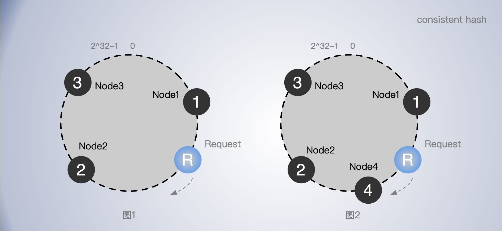

[TOC]


普通的哈希算法，当集群节点数变更时，大部分的数据节点都会受到影响，导致原本的请求无法命中原来的节点，数据的迁移成本是非常高的。尤其是在一些 KV 分布式缓存中，者可能导致大量请求无法命中缓存。使用一致哈希实现哈希寻址可以改善这种问题，即当集群节点变更时，移除或增加节点，只有少部分节点数据收到影响。

## 一致哈希实现哈希寻址

一致哈希算法，将整个哈希值空间组织成一个虚拟的圆环，也就是哈希环：一致哈希算法也用了取模运算，但是一致哈希算法是对 2^32 进行取模运算，即 0～2^32 从小到大顺时针方向分布在一个圆环上。

1、比如，有3个节点 node1，node2， node3 对节点的名字(一个字符串)计算出一个 hashKey 数值，假设计算hashKey 的函数为 `chash()`，按大小分别放到圆环上的不同位置，这样圆环会被三个节点分成不同的区域。

2、当有一个请求 R 来时，也使用 `chash()` 对请求进行也计算出一个 hashKey， 然后找到在圆环上的位置，如图1 中的 R。

3、R 沿着顺时针方向找到最近的节点，也就是 node2，即请求 R 落在了 node2 上 。

4、依次类推，后续请求会落在不同的区间，顺时针就会找到不同的节点上。

5、如果有节点挂掉，比如 node2 挂了，原本请求 R 应该落在 node2 上，就会继续往后寻找，直到找到下一个节点，也就是 node3。也就是说，node2节点挂了，只会影响 node2 前面最近的一个区间的数据。其他区间不受影响。

6、如果新增一个节点 node4 如图2，请求 R 顺指针找到的节点就从 node2 变成了 node4，即增加节点也只会影响其前面最近的一个区间的数据。



使用了一致哈希算法后，扩容或缩容的时候，都只影响变更节点前面最近的一个区间的数据。也就是说，一致哈希算法具有较好的容错性和可扩展性。


**分布不均匀问题**

需要注意的是，在哈希寻址中常出现的问题：落到不同的节点的请求可能分布不均匀。

在一致哈希中，如果节点太少，容易因为节点分布不均匀造成数据访问的冷热不均，即大多数访问请求都会集中少量几个节点上。

解决办法是增加虚拟节点，即对每一个服务器节点增加多个虚拟节点计算多个哈希值。比如原本的节点名为 node1，我们可以增加一些数据后缀来当作虚拟节点，如 node1-1，node1-2，node1-3 等等。这样一个 node1 节点就能分摊成多个虚拟节点落在哈希环上的不同位置。当请求落到虚拟节点上时，我们只要根据虚拟节点和真实节点的映射关系，比如保存在一个 map 里，就能找到真实的节点。

当然，如果真实节点挂了，虚拟节点对应的数据也自然会受到影响。


随着节点数越多，哈希环被分割的区间也越多，节点变更时，受影响数据的比例也越小。我们可以通过增加节点数降低节点宕机对整个集群的影响，以及故障恢复时需要迁移的数据量。

## 代码实现

```go
import (
	"encoding/binary"
	"errors"
	"fmt"
	"golang.org/x/crypto/blake2b"
	"hash/crc32"
	"sort"
	"strconv"
	"sync"
)

// 一致性哈希
// 常用于对请求寻址，根据请求找服务器节点

var ErrEmptyCircle = errors.New("empty circle")

type Consistent struct {
	circles       map[uint32]string // 存储虚拟节点副本索引与真实节点的对应关系
	nodes         map[string]bool   // 节点成员
	nodesReplicas int               // 每个节点到虚拟副本数
	sync.RWMutex

	sortedHashes uints		// 按大小存储虚拟节点索引，通过二分查找请求命中的位置
	count        int64		// 总节点数
	scratch      [64]byte
}

// 添加哈希环节点
func (c *Consistent) Add(node string) {
	c.Lock()
	defer c.Unlock()
	// 把 node 映射到 hash 环上
	c.add(node)
}

func (c *Consistent) add(node string) {
	// 记录虚拟节点与真实节点的映射关系
	for i := 0; i < c.nodesReplicas; i++ {
		c.circles[c.hashKey(c.replicasName(node, i))] = node
	}

	c.nodes[node] = true
	c.updateSortedHashes()
	c.count++
}

func (c *Consistent) updateSortedHashes() {
	hashes := c.sortedHashes[:0]

	//reallocate if we're holding on to too much (1/4th)
	if cap(c.sortedHashes) > (c.nodesReplicas*4) * len(c.circles) {
		hashes = nil
		fmt.Println(c.sortedHashes)
	}

	for k := range c.circles {
		hashes = append(hashes, k)
	}
	sort.Sort(hashes)
	c.sortedHashes = hashes
}

// 根据名称计算 hashKey 数值 用于放到 hash 环上
// CRC32 实现
func (c *Consistent) hashKey1(name string) uint32 {
	if len(name) < 64 {
		var scratch [64]byte
		copy(scratch[:], name)
		return crc32.ChecksumIEEE(scratch[:len(name)])
	}
	return crc32.ChecksumIEEE([]byte(name))
}

// 根据名称计算 hashKey 数值 用于放到 hash 环上
// Sum512 实现
func (c *Consistent) hashKey(key string) uint32 {
	out := blake2b.Sum512([]byte(key))
	return binary.LittleEndian.Uint32(out[:])
}

// 节点副本名称， 名字+数字后缀
func (c *Consistent) replicasName(node string, index int) string {
	return node + strconv.Itoa(index)
}

// 获取请求被映射对节点
func (c *Consistent) Get(name string) (string, error) {
	c.RLock()
	defer c.RUnlock()
	if len(c.circles) == 0 {
		return "", ErrEmptyCircle
	}

	key := c.hashKey(name)
	// 找到请求命中的虚拟节点索引
	nodeReplicasIndex := c.search(key)

	// 根据虚拟节点找到真实的节点
	index := c.sortedHashes[nodeReplicasIndex]
	return c.circles[index], nil
}

// 使用二分查找，找到 key 应该落在那个节点区间，
// 返回区间到上限值，即请求命中点虚拟节点
func (c *Consistent) search(key uint32) (i int) {
	i = sort.Search(len(c.sortedHashes), func(i int) bool {
		return c.sortedHashes[i] > key
	})
	if i >= len(c.sortedHashes) {
		i = 0
	}
	return
}

// 返回成员列表
func Member() {}

// 移除节点
func (c *Consistent) Remove(node string) {}

func New() *Consistent {
	c := new(Consistent)
	c.nodesReplicas = 100
	c.circles = make(map[uint32]string)
	c.nodes = make(map[string]bool)
	return c
}

type uints []uint32

func (x uints) Len() int { return len(x) }

func (x uints) Less(i, j int) bool { return x[i] < x[j] }

func (x uints) Swap(i, j int) { x[i], x[j] = x[j], x[i] }

```

测试代码：

```go
func TestConsistent_Get(t *testing.T) {
	c := New()
	c.Add("node1")
	c.Add("node2")
	c.Add("node3")
	c.Add("node4")
	c.Add("node5")
	c.Add("node6")
	c.Add("node7")
	c.Add("node8")
	c.Add("node9")
	c.Add("node10")

	servers := make(map[string]int)

	for i := 0; i < 10000; i++ {
		req := fmt.Sprintf("request_%d", i)
		server, err := c.Get(req)
		if s, ok := servers[server]; !ok {
			servers[server] = 1
		} else {
			s++
			servers[server] = s
		}
		if err != nil {
			log.Fatal(err)
		}
	}
	fmt.Println(servers)
}
```


采用 CRC32 计算 hashKey, 请求节点分布

```go
// nodesReplicas = 10
map[node1:1107 node10:1218 node2:1259 node3:1222 node4:1317 node5:1332 node6:370 node7:285 node8:961 node9:929]
// nodesReplicas = 20
map[node1:463 node10:1437 node2:1374 node3:1501 node4:559 node5:1132 node6:552 node7:645 node8:1136 node9:1201]
// nodesReplicas = 100
map[node1:870 node10:1195 node2:1062 node3:1045 node4:1245 node5:958 node6:956 node7:610 node8:1141 node9:918]

```

采用 SUM512 计算 hashKey，请求节点分布

```go
// nodesReplicas = 10
map[node1:1109 node10:1475 node2:770 node3:1094 node4:1151 node5:731 node6:735 node7:1023 node8:865 node9:1047]
// nodesReplicas = 20
map[node1:1122 node10:989 node2:788 node3:1031 node4:1030 node5:848 node6:860 node7:1129 node8:1218 node9:985]
// nodesReplicas = 100
map[node1:1043 node10:1005 node2:1000 node3:1095 node4:945 node5:980 node6:997 node7:965 node8:1040 node9:930]
```

单就请求分布均匀情况来看，后者更好。


## 扩展阅读

http://github.com/lafikl/consistent

https://github.com/stathat/consistent

https://ai.googleblog.com/2017/04/consistent-hashing-with-bounded-loads.html