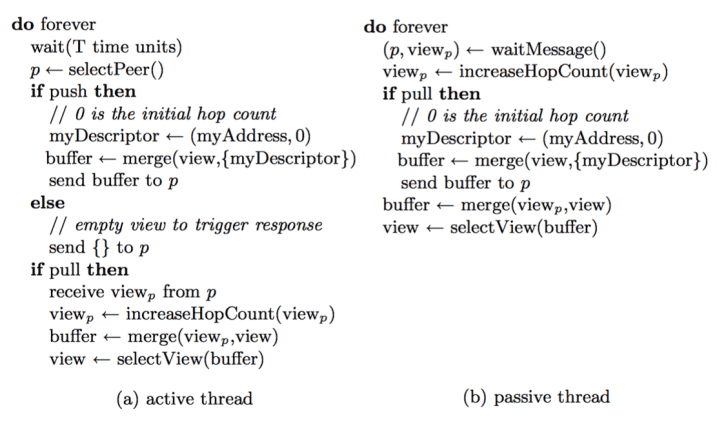
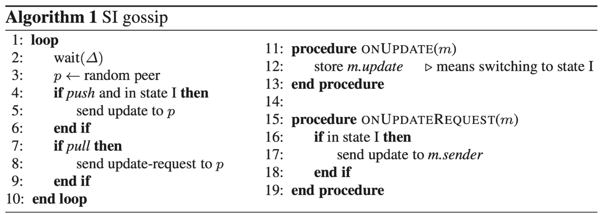
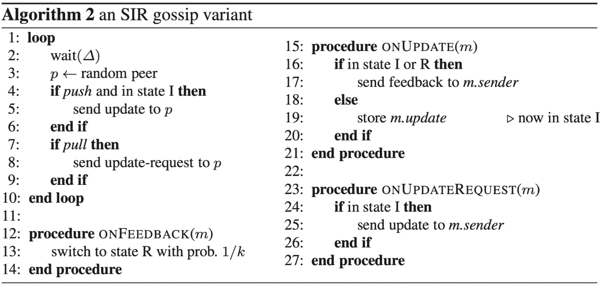
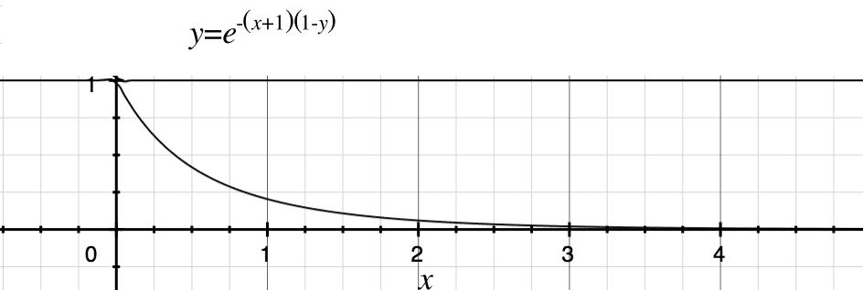
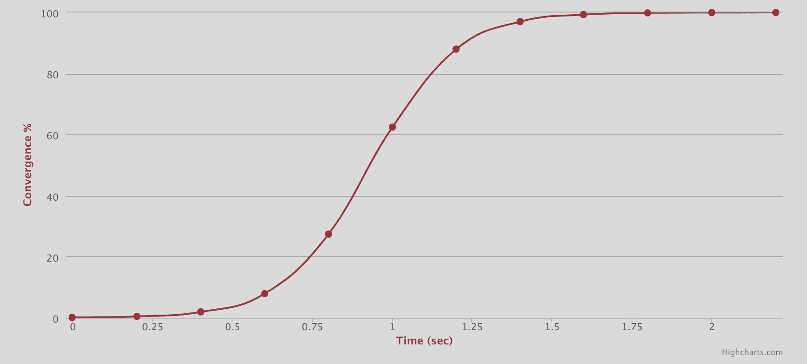

[TOC]

## 八卦协议

八卦在人类社会中扮演着非常重要的角色。八卦消息往往以惊人的速度在人们的小道上传播，通常在没有任何中央协调的情况下到达社区的几乎每个人。此外，谣言往往极其顽固:一旦传播，几乎不可能消除它。

`Gossip 协议`，顾名思义，就像流言蜚语或病毒一样，带有传染性，有一定的一种随机性地将信息传播到整个网络中，并在一定时间内，使得系统内的所有节点数据一致。就像人类社会中的八卦，病毒一样，一传十，十传百，只要传播渠道没被切断，最终会传播给所有人。因此 Gossip 有很多的别名“八卦协议”、“病毒感染算法”、“谣言传播算法”。

### 八卦协议定义

八卦协议在概念上非常简单，编码起来也不复杂。它们背后的基本思想是:一个节点希望与网络中的其他节点共享一些信息。然后周期性地从节点集合中随机选择一个节点并交换信息。接收信息的节点执行完全相同的操作。信息周期性地发送到N个目标，N个目标称为扇出。

如果fanout = 1，那么更新需要O(Log N)个周期才能到达所有节点。

关于八卦的正式定义有很多尝试，但并没有的标准定义

一般来说，我们可以观察到的以下性质:

- `节点选择必须是随机的`，或者至少保证有足够的对等体多样性。
- 在所有节点上只有本地信息可用(节点不知道整个系统的状态，并根据本地知识采取行动)。
- 周期性通信
- 每轮的传输和处理能力是有限的。
- 所有节点运行相同的协议。

根据 [`The Promise, and Limitations, of Gossip Protocols`](https://research.cs.cornell.edu/projects/Quicksilver/public_pdfs/2007PromiseAndLimitations.pdf)说法，八卦协议是满足以下属性的协议:

- 协议的核心包括周期的、成对的进程间交互。
- 在这些交互过程中交换的信息是有(小)限制的。
- 当节点交互时，其中一个或两个节点的状态以一种反映另一个节点状态的方式发生变化。例如，如果A ping B只是为了测量它们之间的往返时间，这就不是八卦互动。
- 不假定可靠的通信。
- 与典型的消息延迟相比，交互的频率较低，因此协议成本可以忽略不计。
- 同伴选择存在某种形式的随机性。对等选择可能在整个节点集中发生，也可能在较小的邻居集合中执行。

节点随机选择发送消息的节点。所有的八卦协议都依赖于一种服务，它为每个节点提供可以交换信息的对等节点。这个服务被称为`“对等抽样服务”`。

它们是是随机的，不可能模仿行为，算法的每次一次运行是不同的，可靠性水平可以很高; 除非考虑到恶意故障。

八卦协议的 `周期性局部通信`，`节点对等随机抽样`, `不假定可靠的通信` 似乎是核心特征，但是，在 `SIR模型` 中，多了个 removed 状态，节点是可以停止传播信息的。另外，在一些八卦协议中，相邻节点在每个周期中不是随机的，而是固定的和静态的。这样可以在一定程度上提升通信的效率，但是缺降低了可靠性和灵活性。

### 对等抽样服务

八卦协议需要一种方法来选择一个节点交换信息的对等采样服务。

通过 selectPeer或 getPeer, 从集合中返回一个对等/节点(peer)地址，理想情况下它应该是一个独立的统一随机抽样。

在一个八卦系统中，理想情况下，一个节点有一个包含系统中所有节点的表，然后当一个节点必须八卦一些信息时，它根据所有节点的统一随机样本选择一个节点子集，最后将信息发送给它们。但在这种情况下，成员关系表必须不断维护，并且在一个存在“变动”(由于联接、离开和故障而对参与节点集进行更改)的实际大型系统中，这是一项非常困难的任务。因此，尽管八卦协议和应用程序应该是可伸缩的，但对等端点的选择却不是。

通常假设对等点的选择遵循系统中所有节点的统一随机样本，这种假设使得严格地建立基于八卦的协议的许多理想特性成为可能，如可伸缩性、可靠性和效率。但通过大量的实验分析表明，它们都导致了不同的同伴抽样服务，而这些抽样服务都不是均匀随机的。

考虑到不同的网络拓扑结构，如随机网络、结构化网络(如环)或基于一些距离度量的邻近网络，例如基于语义或基于延迟的距离。在 `Gossip` 的很多实现中，节点选择并不是完全随机的，有些基于距离度量选择对等点。因为如果底层的物理网络拓扑结构中，随机通信就会给这些链路带来沉重的负载，这些链路会随着系统大小线性增长。在空间八卦中，节点倾向于拓扑中距离较近的节点，从而减轻了远距离链路的负载，但同时牺牲了一些传播速度。

### 八卦协议模型

流言蜚语类似于一种传染病，病毒扮演着一条信息的角色，而感染扮演者了解信息的角色。

流行病的传播与八卦有相似的性质。根据这种类比和惯例，我们可以把流行病学和流言的术语结合起来，将流行病学传播理论应用到流言系统中。

在讨论算法和理论模型时，我们将使用流行病学的术语。根据这个术语，每个节点可以处于三种状态之一，即

- susceptible (S): 节点尚未被感染，节点不知道更新 

- infected (I): 被感染，即节点知道更新并积极传播它

- removed (R): 该节点已出现更新，但未参与传播过程(在流行病学中，这相当于死亡或免疫)。

主要有 `SI` 模型和 `SIR` 模型。

- 在 `SI` 模型中，节点初始状态为S，可以变为状态I，一旦进入状态I，节点就不能再改变状态(I是一种吸收状态)。
- 在 `SIR` 模型中，我们允许状态I的节点切换到状态R。

#### SI 模型

在SI模型中实现八卦的算法见算法1。它以异步消息传递方式制定，其中每个节点执行一个进程(我们称之为活动线程)，而且，它有处理传入消息的消息处理程序。

- 在SI模型中，Push 永远不会终止，即使每个节点都收到了所有更新，也会不断地发送无用的更新。
- 在SI模型中，Pull 也不能终止，因为节点并不知道其他节点是否有新的更新数据。

在第3行中，我们假设一个节点可以从所有节点的集合中选择一个随机的对等节点。(随机对等抽样)。

该算法使用了两个重要的布尔参数 `push` 和 `pull`。至少有一个是真的，否则不会发送任何消息。根据这些参数，我们可以讨论 `push`, `pull`, `push-pull gossip`，每一种都有不同的动态和成本。在 `push-gossip` 中，易感染(susceptible)节点是被动的，感染(infected)节点是主动感染人群的。在 `pull` 和 `push-pull gossip` 中，每个节点都是活跃的。

#### SIR模型——减少冗余传输

在SI模型中，Push 永远不会终止，即使每个节点都收到了每个更新，也会不断地发送无用的更新。Pull 也不能在SI模型中终止，因为节点并不知道其他节点是否有新的更新数据。

SIR模型比 SI模型多了一种 removed 状态，处于 removed 状态节点虽然已经收到了更新数据，但是不会参与消息的进一步传递。

Removed 状态标记似乎棘手。确定一个节点何时应该停止共享信息/更新并不容易。理想情况下，当所有链接的节点都有更新时，节点应该停止共享更新。但这意味着该节点必须知道其他节点的状态。

引入 Removed 状态到目的，其实是牺牲少许的消息到达率，来`减少冗余传输`。

SI模型显然不够高效，尤其当所有节点都收到更新之后，即冗余传输过多。理想的状态，自然是最小冗余传输，节点都收到更新后能停止传输。

比如跟踪节点的传输周期，达到多少个周期停止本次更新传输，这样也可以实现 SIR 模型。

还可以，当节点接收到更新的对等节点时，就以固定的概率标记为 removed 状态。假设这个概率为1/k，参数 k 是节点在停止传输之前将更新发送给对等节点的平均次数。这隐含地假定了一种反馈机制，因为节点需要检查它们向其发送更新的对等节点是否已经知道更新。

也可以说 SIR 与 SI 模型最大的区别就是，SIR 模型多了一个传输的反馈机制。然后在 OnFeekback() 中，按一定概率把节点标记为 Removed 状态。

## 消息传播方式

八卦协议文献采用了流行病学文中的一些术语，即SIR模型。

### 直接邮寄（Direct Mail）

更新数据节点直接发送更新数据给其他节点，当数据发送失败时，将数据缓存到队列里，然后重传。这种方式简单直接，但是有一些问题：

- 发送节点时间复杂度 O(n)。
- 每个更新都被传播到所有节点，因此每个节点必须知道系统中的所有节点。
- `当节点长时间无响应或由于发送缓存队列溢出而导致消息被丢弃`。

Gossip 协议的消息传播方式有两种： 谣言传播（Rumor-mongering）和 反熵（Anti-entropy）

### 反熵（Anti-entropy）

熵（entropy）是热力学中表征物质状态的参量之一，表示体系混乱程度的度量，熵越大，表示越混论。“反熵”这个名字在这里仅仅意味着“反无序”。

反熵属于 `SI` 模型，以固定的周期，随机选择节点发送数据。所有参与节点只有两种状态：

- Suspective(易感染的)：处于 susceptible 状态的节点代表其并没有收到来自其他节点的更新。
- Infective(有传染性的)：处于 infective 状态的节点代表其有数据更新，并且会将这个数据分享给其他节点。

反熵传播过程是每个节点周期性地随机选择其他节点，然后通过互相交换自己的所有数据来消除两者之间的差异, 属于异步实现集群一致性收敛。

`反熵` 是 SI 纠错算法，用于消除节点间全量数据的差异。如果每个周期节点要传播所有数据，显然这个操作成本太大，因为节点可能非常大，而且大部分都非常相似。可以尝试通过如`校验和(Checksum)`，`最近更新列表`，`merkle树`等手段发现它们本地副本之间的区别，然后只传输丢失的更新。

`反熵`错误纠正通常比`散布谣言`的开销要大的得多。反熵可与直接邮件或谣言传播一起使用，通常新更新的数据会通过`谣言传播`，`反熵`则会偶尔运行来纠正没有传达的更新数据。由于谣言传播属于 `SIR 模型`，有节点会被标记为 `removed` 状态，可能会有一定比率的节点收不到更新的消息，节点从网络故障中恢复，这时可以用反熵应该修复这个问题。

#### 反熵优化 ？

可以尝试通过如`校验和(Checksum)`，`最近更新列表`，`merkle树`等手段发现它们本地副本之间的区别，然后只传输丢失的更新。

**减少数据传输**

反熵主要用于节点之间数据纠错消除差异，实现一致性收敛的目的。论文中和很多地方都提到了全量传输数据，这个代价比太大。我们需要通过一定手段减少使用全量传输的频率，同时尽可能的减少每次传输的数据量。

- 校验和
- 可以借鉴通信原理中数据校验方法，如奇偶校验、CRC校验和格雷码校验等方式，但是这些方式只能检测出错误，但是无法纠错，可以通过重传的方式进行纠错。 ？

**反熵协调机制**

第一种技术是一种新的协调机制，在过载的情况下，它积极地选择后来的更新还没有过时的更新，但没有停止还没有过时的更新。

第二种技术是针对反熵协议的流量控制机制。在这种机制中，每个参与者在本地适应其更新速率。该协议通过在交流闲谈新更新的参与者之间分配可用的网络容量来保证公平性。

虽然每一种技术本身都是有用的，但结合起来似乎特别有效。我们相信这两种技术都能得到进一步的改进，例如对不同类型的更新提供不同的性能，并适应不同类型的参与者，例如在不是所有参与者都有平等的网络访问的环境中。

### 谣言传播（Rumor-mongering）

`谣言传播`：使用 `SIR` 模型，仅传播新到达的数据。所有参与节点有三种状态：

- Susceptible：尚未收到更新数据，待传播
- Infective：收到数据更新并开始传播给其他节点。
- Removed：其已经接收到来自其他节点的更新，但是其并不会将这个更新分享给其他节点。

当一个节点有了新数据后，该节点变成活跃状态，并周期性地联系其他节点向其发送新数据，被传染的节点又成量传播者，直到所有的节点都存储了该新数据。谣言传播非常具有传染性，它适合动态变化的分布式系统。

**散布谣言(SIR模型)**

散布谣言(SIR模型)的比反熵更频繁地使用，因为需要的资源更少，节点只发送新的更新或具有感染性的更新列表。谣言散布与低流量网络快速更新。

`谣言在某一时刻被标记为Removed，并不再被分享，因此消息的数量是有限的，有可能更新不会到达所有的站点`，这个比例可以控制在很小。首先让我们看看如何决定一个节点何时应该处于“已删除”状态。

何时变为 Removed 状态 （SIR 模型中）

- 每次失败后以1/k的概率节点被标记为 Removed。
- 经过 k 次无效的消息传播后，节点变为 Removed 状态。

在SIR模型中，有一些可能更新不会到达所有的节点，但这个概率可以控制到无限小，谣言建模：

y 是指当八卦停止时不知道更新的节点或仍然处于易受影响(susceptible)的，即未被传播到节点所占的比例。
$$
y = e^{-(k+1))(1-y)))}
$$
用 x 表示 k，则

谣言未覆盖到范围 y =[0,1], 随着 k 的增加而减小。

- 如果 k = 1，大约 24% 的节点没有更新；
- 如果 k = 2，大约 6% 的节点没有更新；
- 如果 k = 5，大约 0.25% 的节点没有更新；

总体看来，传播的覆盖效率还是可以的。

用 Serf Convergence Simulator [模拟器](https://www.serf.io/docs/internals/simulator.html)。

假如参数：

- GOSSIP INTERVAL = 0.2 s
- GOSSIP FANOUT = 3 nodes
- nodes = 1000
- PACKET LOSS = 0.1 % lost packets
- NODE FAILURES = 0.1 %

覆盖率与时间的关系如图：

**直接邮寄与谣言传播**

`直接邮寄`（Direct Mail）更新和 `谣言传播` 的相似之处在于，它们都专注于传播单个更新，并且有一定的小概率错误。与`直接邮寄`不同，谣言传播 没有瓶颈节点，因此对本地故障不太敏感，对本地资源(如带宽)的要求也较少。这使得`Gossip`成为一个可扩展的解决方案。在发布单个更新时，`谣言传播`使用的消息总数略多一些。但是，在大量副本中频繁更新时，Gossip 的去中心化分摊还成本会更有优势。

## 节点通讯方式

主要有三种方式：推(push), 拉(pull), 推拉(Push/Pull)。

Push：有信息更新的节点向未更新的节点发送数据。 

- 节点 A 将数据 (key,value,version) 推送给 B 节点，B 节点更新 A 中比自己新的数据。一般拥有新信息的节点才会作为发起节点。
- 适用于更新不是非常多的场景。

Pull：所有节点都在积极进行更新。(节点不能提前知道新的更新，所以会连续地提取所有更新)。

- A 仅将数据 key, version 推送给 B，B 将本地比 A 新的数据（Key, value, version）推送给 A，A 更新本地。一般无新信息的节点才会作为发起节点。
- 所有节点都在积极进行更新。
- 当更新比较多时，使用节点主动拉取的方式。

Push/Pull：当有节点数据更新时，它会推送，也会拉出新的更新。

- 与 Pull 类似，只是多了一步，A 再将本地比 B 新的数据推送给 B，B 则更新本地。

在SI模型中，没有终止(removed)，所以 push 是不断发送更新，即使每个节点已经收到了每个更新。因为 pull 并不提前知道所有更新的列表，所以它必须不断请求更新。

在SIR模型中，当更新/信息被标记为 removed 时，将不会再次发送。然后，确定一个节点何时应该停止共享信息/更新并不容易。理想情况下，当所有链接的节点都有更新时，节点应该停止共享更新。但这意味着该节点必须知道其他节点的状态。

当有很多更新/新信息时，节点主动 pull 很有用，因为它很可能会找到一个有新更新的节点。当更新很少时，push 会更好，因为它不会带来过多流量开销。

在初始阶段，由于感染节点很少，push 策略更有效，每个节点轮询请求比较低效。传播的后阶段，由于有很多已感染节点时 pull 方式更有效的，

同样的，后阶段由于很多节点已经更新过了，随机选择节点 push 反倒也就不高效了。这就是为什么还有其他一些策略，比如[`先推后拉`](https://www.mitre.org/publications/technical-papers/minimumcost-firstpushthenpull-gossip-algorithm)，就是利用了这一点。

>  在一次同步中，Push 需要 1 次通讯，Pull 需要两次通讯，Push/Pull 需要 3 次通讯。虽然 Push/Pull 方式通信次数最多，但是可以同步两个节点的数据，实际效果 Push/Pull 反而最高效。

## Gossip 认知

 Gossip 是一种去中心化的分布式协议，消息在节点间节点像病毒一样逐个传播。因为是指数级传播，整体传播速度非常快。

**容错**（Fault-tolerance）

网络中任何节点的重启或者宕机都不会影响 gossip 协议的运行，具有天然的分布式系统容错特性。

相比之下，tcc，2pc 需要涉及节点都运行全部节点可用才行，Paxos， Raft 等也需要多半的节点正常才可用，当然它们也有更强的一致性要求。而 Gossip 在一致性和可用性做了折中，只要有节点存活，集群就能运行。

**去中心化**，不像很多其他分布式协议算法，没有所谓的 Leader/Follower 概念, Gossip 中所有节点都是对等的，没有所谓的中心节点，这样有利于避免热点问题。任何节点出现问题都不会阻止其他节点继续发送消息。任何节点都可以随时加入或离开，而不会影响系统的整体服务

**可扩展性**（Scalable）：允许节点的任意增加和减少，新增节点的状态最终会与其他节点一致。

### 最终一致性

Gossip 是一个带冗余的容错算法, 实现最终一致性的算法。Gossip 无法保证某一时刻，所有节点状态一直，但是最终会实现一直，这个“最终”到底是什么时候，不确定。

那如果出现了不一致或冲突，以谁为准呢？这个看具体场景。

- 以最新写入的数据为准，比如 AP 模型的 KV 存储常采用的就是这种方式。
- 如果不希望存储的数据被更改，以第一次写入的数据为准。

**实现最终一致性的具体方式**

- `读时修复`：在读取数据时，检测数据的不一致，进行修复。比如 Cassandra 的 Read Repair 实现，具体来说，在向 Cassandra 系统查询数据的时候，如果检测到不同节点的副本数据不一致，系统就自动修复数据。
- `写时修复`：在写入数据，检测数据的不一致时，进行修复。比如 Cassandra 的 Hinted Handoff 实现。具体来说，Cassandra 集群的节点之间远程写数据的时候，如果写失败就将数据缓存下来，然后定时重传，修复数据的不一致性。
- `异步修复`：这个是最常用的方式，通过定时对账检测副本数据的一致性，并修复。

在具体实践中，可以多种方式结合起来使用。

**Gossip 协议实现最终一致性**

- `直接邮寄`，即写时修复，直接发送更新数据，当数据发送失败时，将数据缓存在失败重试队列，然后重传。这种方式虽然存在丢数据问题，但是实现简单、数据同步及时，不需要校验数据一致性对比，性能消耗低。
- `反熵`，属于异步修复，节点间通过互相交换自己的所有数据来消除两者之间的差异，实现数据的最终一致性。主要有推、拉、推拉三种实现方式。实现反熵最不理想等方式就是节点间两两交换和比对自己所有的数据，这会执行反熵时成本会很高，这个需要好好优化，减少数据的传输量，同时节点选择方式也很关键。需要注意的是实现反熵时一般设计一个闭环的流程，一次修复所有节点的副本数据不一致，因为我们希望能在一个确定的时间范围内实现数据副本的最终一致性，而不是基于随机性的概率，在一个不确定的时间范围内实现数据副本的最终一致性。
- `谣言传播`，指的是当一个节点有了新数据后，这个节点变成活跃状态，并周期性地联系其他节点向其发送新数据，直到所有的节点都存储了该新数据。谣言与邮寄的方式有点类似，但属于是去中心化的方式。

在实际场景中，实现数据副本的最终一致性时，一般而言，直接邮寄的方式是一定要实现的，因为不需要做一致性对比，只是通过发送更新数据或缓存重传，来修复数据的不一致，性能损耗低。在存储组件中，节点都是已知的，一般采用反熵修复数据副本的一致性。当集群节点是变化的，或者集群节点数比较多时，这时要采用谣言传播的方式，同步更新数据，实现最终一致。

### 评价 gossip算法指标

- Residue：剩余未传播节点，越少越好
- Traffic：流量，节点之间发送的数据更新的平均数量，m = 总更新流量/节点总数。
- Convergence：收敛性
    - tvag: 所有节点获得更新所需的平均时间。
    - tlast: 最后一个节点获取更新所需的时间。

## 应用

Gossip 应用场景

- 数据库复制
- 信息传播
- 集群成员
- 失败的探测器
- 覆盖网络
- 聚合(例如计算平均值，总和，最大值)

Riak 使用八卦协议在集群中共享和通信环状态和桶属性。

在 [cassandra](https://docs.datastax.com/en/archived/cassandra/3.0/cassandra/architecture/archGossipAbout.html) 中，节点使用一种关于它们自己和它们谈论过的其他节点的八卦协议交换信息，因此所有节点都能快速了解集群中的所有其他节点。

Dynamo 采用基于 gossip 的分布式故障检测和成员协议。它传播成员关系更改，并维护最终一致的成员关系视图。每个节点每秒钟与随机选择的对等节点进行联系，两个节点有效地协调其持久的成员变更历史。

Dynamo gossip 协议是基于Gupta和Chandra在2001年引入的可扩展和高效的故障检测器

`Consul` 使用一个称为 serf 的 gossip 协议,有两个目的: 发现新成员和故障, 可靠和快速的事件广播事件，如领导人选举。`serf` 是基于“可伸缩的弱一致感染类型进程组成员协议”。

Amazon s3 使用一种八卦协议将服务器状态传播到系统。

## 小结

谣言传播过程是消息只包含最新 update，谣言消息在某个时间点之后会被标记为 removed 状态，并且不再被传播。缺点是系统有一定的概率会不一致，即以为又 removed 状态，可能有节点会收不到更新的数据，这个可以通过`反熵`消除差异。

gossip 没有考虑拜占庭容错问题，没有考虑恶意攻击的情况，但是一些安全八卦算法比基本版本的复杂很多，因此失去了很多八卦的原始优势。

八卦协议与分布式计算中“经典”方法的背离，在传统方法中，正确性和可靠性是最重要的，性能(尤其是速度和响应性)是次要的。

一个良好到八卦协议应该是简单、快速、廉价、极具可扩展性、最终一致性。任何技术方案都有其特定适用场景和限制。

总而言之，八卦算法是在特定假设下解决某些非常重要的问题的伟大工具。特别是，它们可以帮助构建被许多人认为是未来计算平台的巨大云计算系统，并为传感器网络编程提供工具。

- 八卦协议是基于周期性的信息交换，在此过程中所有节点与随机选择的对等节点通信。这种八卦通信模型支持实现信息传播、聚合或叠加拓扑构建等多种功能。
- 发送新消息的平均速率大致与驻留时间相反:1/log(n)
- 在新兴的云计算系统、传感器网络和其分布式动态系统中，八卦协议是一个关键的组成部分，这使得它们在实际应用中具有高度的相关性。

不足

- 不是非常高效率。消息会存在多次冗余传输的情况。

- 问题不好复现，许多八卦协议中固有的随机性使得很难再现和调试运行时出现的意外问题。

- 在某些情况下，流言协议不能很好地扩展，例如，事件的稳定增长会耗尽八卦信息通道的承载能力，我们的协议可能会出现故障。这种饱和发生的精确点取决于许多因素:事件进入系统的速率、事件大小、八卦传出和消息大小。

- 消息延迟，这个也是分布式系统永远要面对的问题之一，我们只能根据实际需求采取折中方案。

    

## FAQ

1、Gossip 中，遇到数据冲突，以谁为准？

- 取决于具体场景，比如 KV 数据，以新数据为准。
- 在一些场景也可以以第一次的为准。

2、Gossip 满足什么样条件算是达成了最终一致性？

- 所有节点数据都一直了

3、谣言何时停止？谣言传播可能会有很多消息被反复重传，会不会造成网络性能的下降？

- 尽管谣言传播能以去中心化的方式，在动态变化的集群中，实现数据副本的最终一致性，但通讯成本较高。

4、Gossip协议一般基于UDP实现？

## 扩展阅读

https://managementfromscratch.wordpress.com/2016/04/01/introduction-to-gossip/

https://www.mitre.org/publications/technical-papers/minimumcost-firstpushthenpull-gossip-algorithm

https://github.com/hashicorp/memberlist

https://citeseerx.ist.psu.edu/viewdoc/download?doi=10.1.1.218.6057&rep=rep1&type=pdf

http://publicatio.bibl.u-szeged.hu/1529/1/gossip11.pdf

https://www.consul.io/docs/architecture/gossip

https://www.serf.io/docs/internals/simulator.html

