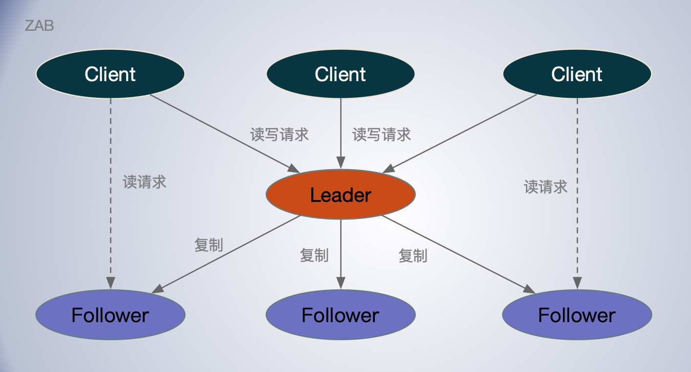
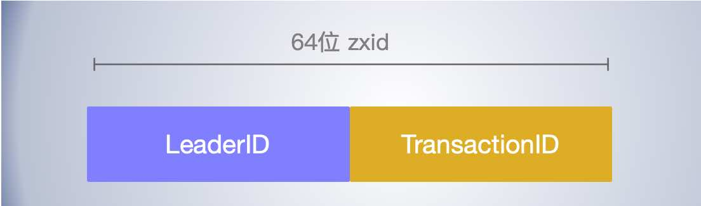

[TOC]

## Zookeeper 原子广播协议

ZAB 协议全称：*Zookeeper Atomic Broadcast*（Zookeeper 原子广播协议，是专门为 Zookeeper 实现分布式协调功能而设计。Zookeeper 主要是根据ZAB协议是实现数据同步和分布式系统数据一致性。

ZooKeeper，作为一个开源的分布式协调服务，使用比较广泛。

ZAB 协议是强领导模型，在集群中只有一个 Leader 节点，负责将所有客户端的写操作转化为事务(或提议proposal)。Leader 节点再数据写完之后，将向所有的 Follower 节点发送数据广播请求(或数据复制)，等待所有的 Follower 节点反馈。

只要超过半数 Follower 节点反馈成功，Leader 节点就会向所有的 Follower 服务器发送 commit 消息。即将 leader 节点上的数据同步到 Follower 节点之上。

数据的复制达成共识上，和 Raft 有点类似。

Zookeeper 就是在 `消息广播` 和 `崩溃恢复` 两个模式之间切。

## 消息广播

ZAB 协议的消息广播来在主从节点间进行消息复制，类似一个 *二阶段提交过程*，但只要求过半响应成功即可。对于客户端发送的写请求，全部由 Leader 接收，Leader 将请求封装成一个事务 Proposal，将其发送给所有 Follwer ，根据所有 Follwer 的反馈，如果超过半数成功响应，则执行 commit 操作（先提交自己，再发送 commit 给所有 Follwer）。 这个过程和 Raft 很相似。

### ZAB 如何实现操作的顺序性

ZAB 保证操作顺序性的，基于主备模式的原子广播协议。在 ZAB 中，*写操作必须在主节点上*执行。

如果客户端访问的节点是备份节点，它会将写请求转发给主节点，由主节点协调提交，成功后，主节点再回复该从节点，由它回复客户端。

当主节点接收到写请求后，它会基于写请求中的指令，来创建一个提案（Proposal），并使用一个唯一的 ID 来标识这个提案。唯一的 ID 就是指事务标识符（Transaction ID，也就是 zxid）。

**事务标识符**

事务标识符必须是唯一的、递增的。

事务标识符可以理解为 64 位的整型型变量，有任期编号 epoch 和计数器 counter 两部分组成，高 32 位为任期编号，低 32 位为计数器。事务标识符可表示为为 <1, 1> 和 <1, 2>。

- 任期编号，就是创建提案时领导者的任期编号，需要你注意的是，当新领导者当选时，任期编号递增，计数器被设置为零。
- 计数器，就是具体标识提案的整数。在同一个领导任期内计数器将递增，新的任期会重置计数器。

在创建完提案之后，主节点会按照顺序将提案广播到其他节点。保证了消息接收的顺序性。 *这样就有队首阻塞问题？性能？*

当主节点接收到提案的“大多数”的确认响应后，该提案提交（Committed），主节点会通知备份节点提交该提案。

主节点提交提案是有顺序性的。*主节点根据事务标识符大小，按照顺序提交提案*，如果前一个提案未提交，此时主节点是不会提交后一个提案的。

ZAB 也是*强领导者模型*，通过“一切以领导者为准”和严格按照顺序处理、提交提案，来实现操作的顺序性的。

### Multi-Paxos 无法保证操作的顺序性

本质上 Multi-Paxos 实现的是一系列值的共识，不关心最终达成共识的值是什么，不关心各值的顺序，就像我们在上面演示的过程那样。

Raft 可以实现操作的顺序性。

## 成员角色

ZAB 支持 3 种成员身份（领导者、跟随者、观察者）。

领导者（`Leader`）

- 所有的写请求都必须在领导者节点上执行，在同一时间集群只会有一个领导者。

跟随者（`Followe`）

- 跟随者可以直接处理并响应来自客户端的读请求，写请求，跟随者需要将它转发给领导者处理。
- 跟随者响应领导者的心跳，并参与领导者选举和提案提交的投票。
- 跟随者作为备份（Backup）节点， 集群可以有多个跟随者。

观察者（`Observer`）

- 只作为备份（Backup）节点，没有投票权，不参与领导者选举和提案提交的投票，类似 Paxos 中的学习者。

### 4种成员状态

- `LOOKING`：选举状态，该状态下的节点认为当前集群中没有领导者，会发起领导者选举。
- `FOLLOWING`：跟随者状态，当前节点是跟随者。
- `LEADING` ：领导者状态，当前节点是领导者。
- `OBSERVING`：观察者状态，当前节点是观察者。

## 崩溃恢复

比如 Leader 先本地提交了，然后 commit 请求没有发送出去就崩溃了，怎么办？

主节点故障即：Leader 失去与过半 Follwer 的联系，整个集群都无法写入了，这将是极其严重的灾难性故障。

议崩溃恢复要求满足如下2个要求：

- 确保已经被 Leader 提交的 proposal 被所有的 follower 提交。
- 确保丢弃那些只在 Leader 提出/复制，但没有提交的事务。

新选举出来的 Leader 不能包含未提交的 proposal，即新选举的 Leader 必须都是已经提交了的proposal的follower服务器节点。同时，新选举的Leader 节点中含有最高的ZXID。这样可以避免了 Leader 服务器检查 proposal 的提交和丢弃工作。

### Leader节点选举

当跟随者检测到连接领导者节点的读操作等待超时了，跟随者会变更节点状态，将自己的节点状态变更成 LOOKING，然后发起领导者选举。

接着，每个节点会创建一张选票，投给自己的。

对于每一张接收到选票，节点都需要进行领导者比较，也就将选票提议的领导者和自己提议的领导者进行比较，找出更适合作为领导者的节点。约定的规则如下：

- 优先检查任期编号（Epoch），任期编号大的节点作为领导者；
- 如果任期编号相同，比较事务标识符的最大值，值大的节点作为领导者；
- 如果事务标识符的最大值相同，比较集群 ID，集群 ID 大的节点作为领导者。

如果选票提议的领导者，比自己提议的领导者，更适合作为领导者，那么节点将调整选票内容，推荐选票提议的领导者作为领导者

获得多数选票的候选者状态变为 `LEADING`，没当选的候选者状态变为 `FOLLOWING`。

领导者选举的目标，是从大多数节点中选举出数据最完整的节点，即事务标识符值最大的节点。这个和 Paxos 和 Raft 类似。

任期编号、事务标识符最大值、集群 ID 的值的大小，决定了哪个节点更适合作为领导者，值大的节点更适合作为领导者。

## 处理读写请求

*写请求都在 Leader节点*上处理的，如果 Follower 收到写请求，会转发给 Leader 节点处理。

*读请求可以在任何节点上处理*，但是与领导者“失联”的节点不能处理读请求。

所以 Zookeeper 的写性能受单机限制。读性能可以水平扩展。

ZooKeeper 实现的是最终一致性。

当写请求对应的提案被复制到大多数节点上时，领导者会提交提案，并通知跟随者提交提案。

### 写请求处理

- 如果是跟随者收到写请求要先转给领导者；

- 领导者处理写请求，创建提案（Proposal），本地存储；
- 领导者将提案广播给所有的跟随者；
- 跟随者收到提案后，本地存储，并回复领导者；
- 领导者收到过节点的成功响应后，本地提交，并广播 commit 消息给跟随者；
- 跟随者收到 commit 消息后，本地提交。
- 如果是跟随者自己收到的客户端写请求需要再回复客户端。

### 读请求处理

读请求处理相对简单，节点只需要查询本地数据，然后响应数据给客户端就可以了。

但需要注意的是，与领导者失联的节点不能处理任何请求。

## Zookeeper

Zookeeper 提供的是最终一致性，为了读操作可以在任何节点上执行，客户端会读到旧数据。

如果客户端必须要读到最新数据，怎么办呢？

可以使用 `sync` 命令。你可以在执行读操作前，先执行 sync 命令，这样客户端就能读到最新数据了。

## ZAB 与 Raft

共同点：

- 都是强领导模型，只有一个领导者；写请求都受限于单机性能；

- 写请求都分为 prepare 和 commit 两个阶段；

- 都要求大多数节点成功；

- 都有 Leader， Follower 的角色；也都有 “任期” 的概念，一个是 Term， 一个是 Epoch；
- 领导者选举的目标都是选举出一个日志完整度更高的节点；

- 日志必须是连续的，以领导者的日志为准来实现日志一致等；因为他们的一致性要求都要达到顺序一致性以上；
- 都保证达成共识（已提交）后的日志不会再改变；

不同点

- ZAB 的读请求，可以人 Follower 节点， Raft 读写都在 Leader 节点上；

- ZAB 要实现操作的顺序性，而 Raft 的一致性要求更高，不仅仅是操作的顺序性，而是线性一致性；

领导者选举

- ZAB 采用的“相互推荐”的快速领导者选举（Fast Leader Election）；
- Raft 采用的是“随机超时，一张选票、先到先得”的自定义算法。Raft 的领导者选举，需要通讯的消息数更少，选举也更快；

日志复制

- Raft 和 ZAB 相同，都是以领导者的日志为准来实现日志一致，而且日志必须是连续的，也必须按照顺序提交。

一致性

- ZAB 的设计目标是操作的顺序性，在 ZooKeeper 中默认实现的是最终一致性，读操作可以在任何节点上执行；
- 而 Raft 的设计目标是强一致性（也就是线性一致性），所以 Raft 更灵活，Raft 系统既可以提供强一致性，也可以提供最终一致性。

写操作

- Raft 和 ZAB 相同，写操作都必须在领导者节点上处理。

读操作

- ZAB 读操作可以在任何节点上执行；
- Raft 只能在 Leader 节点上进行。

成员变更

- Raft 和 ZAB 都支持成员变更，其中 ZAB 以动态配置（dynamic configuration）的方式实现的。那么当你在节点变更时，不需要重启机器，集群是一直运行的，服务也不会中断。

其他

- 相比 ZAB，Raft 的设计更为简洁，比如 Raft 没有引入类似 ZAB 的成员发现和数据同步阶段，而是当节点发起选举时，递增任期编号，在选举结束后，广播心跳，直接建立领导者关系，然后向各节点同步日志，来实现数据副本的一致性。ZAB 的成员发现，可以和领导者选举合到一起，类似 Raft，在领导者选举结束后，直接建立领导者关系，而不是再引入一个新的阶段；数据同步阶段，是一个冗余的设计，可以去除的，因为 ZAB 不是必须要先实现数据副本的一致性，才可以处理写请求，而且这个设计是没有额外的意义和价值的。
- ZAB 和 ZooKeeper 强耦合；相比之下 Raft 的实现（比如 Hashicorp Raft）是可以独立使用的，编程友好。

## 扩展阅读

https://www.semanticscholar.org/paper/Zab:-High-performance-broadcast-for-primary-backup-Junqueira-Reed/b02c6b00bd5dbdbd951fddb00b906c82fa80f0b3

https://cwiki.apache.org/confluence/display/ZOOKEEPER/Zab+vs.+Paxos

