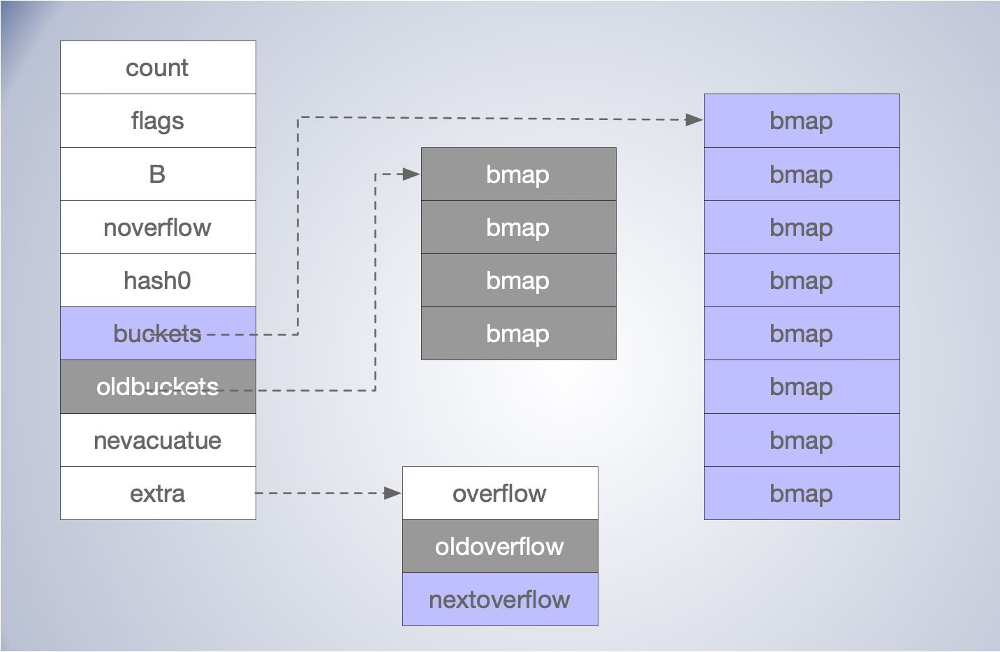
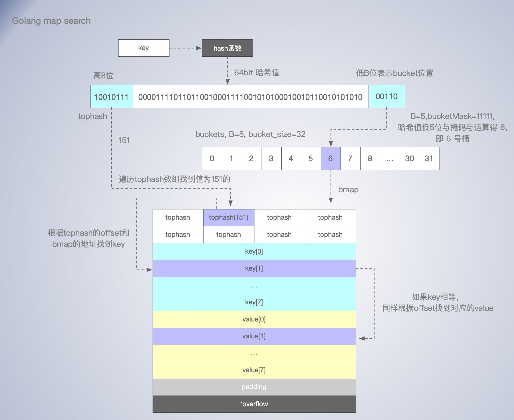
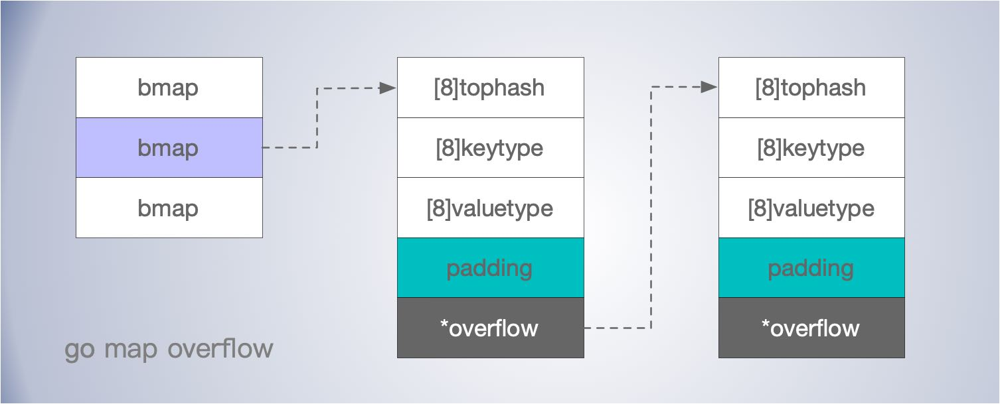

[TOC]


除了数组之外，map 应该是最为常用的数据结构了，也叫哈希表，字典，映射表。map 维护着键值对之间映射关系。在没有过多哈希冲突情况下，通过 key 可以实现时间复杂度的 O(1) 快速查找对应的值。

## 哈希表(hash table)

哈希表用的是类似数组支持按照下标随机访问数据的特性。知道下标就可以O(1)定位对应的值.

哈希表用的就是数组支持按照下标随机访问的时候，时间复杂度是 O(1) 的特性。通过散列函数把元素的键值映射为下标，然后将数据存储在数组中对应下标的位置。

在实现 map 时，主要的问题有：

- *哈希函数*怎么设计
- *哈希冲突*怎么解决
- 哈希扩容*rehash*问题
- 哈希*缩容*问题


**装载因子** = 存储元素个数 / 槽位数

### 哈希函数

哈希函数的选择在很大程度上能够决定 map 的读写性能。

- 哈希函数映射的结果一定要尽可能均匀分布数据；如果分布不均匀会有更多的哈希冲突，极端情况下就退化为 O(n) 的时间复杂度了。
- 不能计算复杂，消耗过多CPU；
- 关键字长度，数据特点，分布，散列表大小
- 数据分析法，根据数据特点设计哈希函数
- ASCII码进位相加，取模

### 哈希冲突解决

就算哈希函数结果分布均匀，很多时候，哈希函数输入的范围都会大于输出的范围，出现哈希冲突，即多个key被映射到同一个槽位的情况还是经常出现的。这就需要解决哈希碰撞的问题，常见方法的就是开放寻址法和链表法。

#### 开放寻址法

**开放寻址法**: 遇到冲突沿着数组索引 `index` 往下有找空位插入，也就可能占了别人的位置，（所以哈希冲突太多就不好使了），查找则对应位置被占了，往下找，知道找到或者遇到空位。(线性探测)

```
index := hash(key) % array.len  // 计算哈希值，并取模
```

- 为了查找方便，需要标记已删除的数据位置，
- 开放寻址法来实现，底层的数据结构通常是数组，由于是数组存储，对cpu缓存相对友好，但是不能存储太大量的数据（哪有那么多的连续的内存空间啊）。
- 但冲突代价更高，装载因子不能太大，超过 70% ，就可能会有大量的散列冲突，导致大量的探测、再散列等，性能会下降很多。内存间利用率不高；
- 所以开始寻址法，需要关注装载因子，对性能影响至关重要。


#### 链表法

与开放地址法相比，链表法是哈希表最常见的实现方法，大多数的编程语言都用链表法实现哈希表。可以理解为经过哈希映射后对应一个 bucket。

当多个 key 被映射到同一个 bucket 后，通过链表把他们连接起来。

- 相比开发寻址平均查找长度会小一些。
- 存储value的内存可以动态申请的，更节省内存。

- 相比开发寻址，装载因子相对可以大很多，可存储的数据量更大
- 如果存储小对象，指针占用空间比例会大；
- bucket 值之间链表存储，对cpu缓存不够友好；

二次探测，


### 哈希算法

将任意长度的二进制值串映射为固定长度的二进制值串，这个映射的规则就是哈希算法

要点：

1. 从哈希值不能反向推导出原始数据（所以哈希算法也叫单向哈希算法)
2. 对输入数据非常敏感，哪怕原始数据只修改了一个 Bit，最后得到的哈希值也大不相同；
3. 散列冲突的概率要很小，对于不同的原始数据，哈希值相同的概率非常小；
4. 哈希算法的执行效率要尽量高效，针对较长的文本，也能快速地计算出哈希值。

知名应用：md5，sha，crc
全加密、唯一标识、数据校验、散列函数、负载均衡、数据分片、分布式存储。

MD5哈希值是固定的 128 位二进制串.最多能表示 2^128 个数据


### rehash

**扩容**
当装载因子较大时，需要申请新的空间，把数据搬过去，搬迁时可能还需要重新计算哈希值，如果数据量很大时，可能导致变慢。

动态扩容，比如当装载因子达到某个阈值如0.75时，重新申请翻倍的空间；新数据插入新的空间，旧数据分批搬过去。（期间的查找，先找新的空间，没找到去老的空间找）


## Go Map 实现

Go 语言运行时同时使用了多个数据结构组合表示哈希表，其中使用 hmap (src/runtime/map.go) 结构体来表示哈希：

```go
// A header for a Go map.
type hmap struct {
   
    count     int		// 元素个数，调用 len(map) 时，直接返回此值
    flags     uint8  	// 操作标示
    B         uint8		// buckets 的对数，len(buckets) == 2^B
    noverflow uint16	// overflow 的 bucket 近似数
    hash0     uint32	 // 哈希的种子，计算 key 的哈希的时候会传入哈希函数
    buckets    unsafe.Pointer	// 指向 buckets 数组，大小为 2^B
    oldbuckets unsafe.Pointer 	//扩容的时候就的 bucket，buckets 长度为是 oldbuckets 的两倍
    nevacuate  uintptr	// 指示扩容进度，小于此地址的 buckets 迁移完成
    extra *mapextra 	// optional fields
}

type mapextra struct {
	overflow    *[]*bmap
	oldoverflow *[]*bmap
	nextOverflow *bmap
}
```

单个桶已经装满时就会使用 `extra.nextOverflow` 中桶存储溢出的数据。



### 桶

`hmap.buckets` 是一个指针，指向的是一个 `runtime.bmap` 结构体，它就是所谓的“桶”或者“槽位”，每个 `runtime.bmap`  能存储8个key。

每个桶在申请内存时，会分配一片连续的内存空间。

```go
type bmap struct {
	 tophash [bucketCnt]uint8 // 存储key哈希值的高8位
}
```

`tophash` 存储了键的哈希的高 8 位，通过比较不同键的哈希的高 8 位可以减少访问键值对次数以提高性能。


使用位图，一个字节正好8位。来提高是否存在的效率。


在编译期间，桶会被动态创建为新的结构体:

```go
type bmap struct {
    topbits  [8]uint8
    keys     [8]keytype
    values   [8]valuetype
    pad      uintptr
    overflow uintptr
}
```


### 创建

初始化时，可以通过字面量和 make() 函数两种方法进行创建。

```go
make(map[k]v, hint)
```

- 如果map被分配到栈上，且 hint <= 8(bucketSize) 时或缺省hint 都会调用 runtime.makemap_small 来进行快速初始化，
- 如果 hint > 8，则调用 runtime.makemap()，这是主要的初始化函数。

```go
func makemap(t *maptype, hint int, h *hmap) *hmap {
	mem, overflow := math.MulUintptr(uintptr(hint), t.bucket.size)
	if overflow || mem > maxAlloc { // 内存检查
		hint = 0
	}

	if h == nil {
		h = new(hmap)
	}
	h.hash0 = fastrand()  // 获取哈希种子

    // 根据装载因子寻找一个合适的 B
	B := uint8(0)
	for overLoadFactor(hint, B) {
		B++
	}
	h.B = B
	
    // 如果 B 等于 0，跳过， buckets 就会在赋值的时候再分配
	if h.B != 0 {
		var nextOverflow *bmap
		h.buckets, nextOverflow = makeBucketArray(t, h.B, nil) // 分配一片连续的空间
		if nextOverflow != nil {
			h.extra = new(mapextra)
			h.extra.nextOverflow = nextOverflow
		}
	}
	return h
}

```

计算内存是否超出最大值。

获取哈希种子。

计算出需要的最小需要的桶的数量。

根据传入的 `B` 计算出的需要创建的桶数量并使用 runtime.makeBucketArray 在内存中分配一片连续的空间，用于存储数据。


正常桶和溢出桶在内存中的存储空间是连续的，只是被 runtime.hmap 中的不同字段引用，当溢出桶数量较多时会通过 runtime.newobject 创建新的溢出桶。


### 查找

在访问 map 时，根据访问方式和平台主要有 runtime.mapaccess1，runtime.mapaccess2，runtime.mapaccessK 等一系列方法，实现打大同小异。

根据 key 通常访问一个 map 主要有两种方式是

1.  `v := hash[key]`， 使用 runtime.mapaccess1，该函数仅会返回一个指向目标值的指针；
2.  `v，ok := hash[key]`，使用 runtime.mapaccess2，除了返回目标值之外，它还会返回一个用于表示该键值是否存在的 bool 值。


```go
// go1.15
func mapaccess2(t *maptype, h *hmap, key unsafe.Pointer) (unsafe.Pointer, bool) {
	...
    // 并发写和读冲突检测
	if h.flags&hashWriting != 0 {
		throw("concurrent map read and map write")
	}
	hash := t.hasher(key, uintptr(h.hash0))
    // 用于计算bucket的掩码，如果 B = 3，那么结果用二进制表示就是 111
    // 如果 B = 4，那么结果用二进制表示就是 1111
	m := bucketMask(h.B)
    // 根据掩码 m ，按位与运算，找到出对应序号的 bucket 地址
	b := (*bmap)(unsafe.Pointer(uintptr(h.buckets) + (hash&m)*uintptr(t.bucketsize)))
	if c := h.oldbuckets; c != nil { // oldbuckets 不为 nil，说明发生了扩容
		if !h.sameSizeGrow() {
			// 新bucket是旧的2倍，之前只有一半的 bucket，需要除 2
			m >>= 1
		}
        // 求出 key 在老的 map 中的 bucket 位置
		oldb := (*bmap)(unsafe.Pointer(uintptr(c) + (hash&m)*uintptr(t.bucketsize)))
		if !evacuated(oldb) {
			b = oldb
		}
	}
    
     // tophash 取哈希值的高 8 位的值
	top := tophash(hash)
bucketloop: // 循环查找 tophash 和 key 是否存在
	for ; b != nil; b = b.overflow(t) {
		for i := uintptr(0); i < bucketCnt; i++ {
			if b.tophash[i] != top {
				if b.tophash[i] == emptyRest {
					break bucketloop
				}
				continue
			}
			k := add(unsafe.Pointer(b), dataOffset+i*uintptr(t.keysize))
			if t.indirectkey() { // 如果 key 是指针的话，还需要找到引用的对象
				k = *((*unsafe.Pointer)(k))
			}
			if t.key.equal(key, k) { // key 相等时根据 offset 获取value值
				e := add(unsafe.Pointer(b), dataOffset+bucketCnt*uintptr(t.keysize)+i*uintptr(t.elemsize))
				if t.indirectelem() {
					e = *((*unsafe.Pointer)(e))
				}
				return e, true  // 找到，并返回value
			}
		}
	}
	return unsafe.Pointer(&zeroVal[0]), false //没找到返回零值
}
```

在 64 为机器上，key 经过哈希计算后得到哈希值，共 64 个 bit 位。

- 高八位存储 tophash
- 假设 B = 5，则 bucket 数量为 2^5 = 32 个。
- 根据 B 的值，哈希值低 5位用于表示当前的 key 位于的bucket 中。

上述 `bucketloop` 就是查找的核心逻辑，大致查找过程为：

- 查找时遍历 `bmap.tophash` 数组找到 tophash 的index，如果没有则说明不在这个桶里。
- 然后根据找到 tophash 的index 和 bmap 的地址定位到 key 的位置，比较key 是否相等。
- 如果 key 相等，则返回对应 index 的 value 值。
- 如果没找到，且 overflow bucket 不为空，还会继续寻找 *overflow bucket，过程类似。



如何从哈希的高8位找到 bmap 中的 tophash 的？

- for 循环遍历，先 bmap 在 tophash 数组，遍历次数装载因子和溢出桶数量而增大。

overflow bucket 什么时候使用？

- 同一个bucket 桶的bmap 自多存 8 个 key，满了之后就会使用到溢出桶。

整理

- 查找时，如果存在并发的写操作，会导致 panic
- 不同类型的 key，所用的 hash 算法是不一样，在编译期确定具体可以参考 algarray。

- 查找过程还是用到for循环，数组的遍历，当然次数通常只有数次，不会随着数据样本线性增长。

- 所以对于数据样本不多的情况下，直接遍历数组的查找性比map能会更好。

    

### 赋值

在理解了 map 的内存布局，查找过程，写入的逻辑理解起来就相对简单些了。map 写入的核心函数为 `runtime.mapassign()`。

mapassign 有几个变种，是由编译器决定具体用哪一个函数的。选择依据 key 的类型是否是 string，如果不是 string，那么根据 key 的类型大小做选择。

- 先函数会根据传入的键拿到对应的哈希和桶。
- 遍历正常桶和 overflow 桶，比较桶中存储的 `tophash` 和键的哈希，如果找到了相同结果就会返回目标位置的地址。
- 如果桶都满了，会调用 runtime.hmap.newoverflow 创建新桶，通过 overflow 指针，连接到现在通上。
- 如果当前没找到，会为其分配新的存储空间，并返回对应的地址。
- `runtime.mapassign()` 中没有直接把value写进去，而是只节返回地址。赋值操作是由额外的汇编函数 `runtime.mapassign_fast64(SB)` 完成的, 这是在编译期间，由编译器插入的。这个可以通过go程序对应的汇编代码看到。



从上述图可以看出，如果桶溢出，多个 bmap 之间是通过 overflow 指针连接成了一个链表。

- 所以 Go map 是使用 “链表发” 解决哈希冲突问题的。在查找 key 时相当于两层循环，外层遍历同一个 bucket 槽位的 bmap 链表。
- 里面循环遍历 tophash 数组。

溢出桶其实也算是链表发解决冲突的一种实现，过多的溢出桶，或过高的装载因子会带来 map 读写性能的下降，最终需要冲突 map 扩容来解决。

在 map 的赋值过程中，还涉及到 map 扩容的逻辑。

### 扩容

什么时候会触发扩容？

- **biggerSizeGrow** :装载因子 loadFactor >= 6.5 , 即元素个数 >= 桶个数 * 6.5 。
- **sameSizeGrow**: 使用了太多 overflow 桶，进行 sameSizeGrow 扩容。
    - 当 bucket 总数 < 2^15 时，如果 overflow 桶总数 >= bucket 的总数，则认为 overflow 的桶太多了。
    - 当 bucket 总数 >= 2^15 时，那我们直接和 2^15 比较，overflow 桶 >= 2^15 时，即认为溢出桶太多了。

```go
func mapassign(t *maptype, h *hmap, key unsafe.Pointer) unsafe.Pointer {
	...
    // 判断是否需要扩容，以及是否处于扩容，避免二次扩容造成混乱。
	if !h.growing() && (overLoadFactor(h.count+1, h.B) || tooManyOverflowBuckets(h.noverflow, h.B)) {
		hashGrow(t, h)
		goto again
	}
	...
}
```

装载因子过大时，说明大部分桶都快满了。如果插入新元素，有大概率需要挂在 overflow 的桶上。扩容时桶的数量加倍，也就是 B = B + 1。

**等量扩容**

如果溢出桶太多，会导致扩容，这种是等量扩容 `sameSizeGrow` 。等量还能叫扩容？这种场景，主要是针对：由于数据不断的插入，桶数量会增加，随着删除桶存储空间会变的稀疏，造成内存利用率不高。通过适当的移动 bucket 中的值，创建新的桶，旧的溢出桶会被GC回收，来实现存储更加紧凑，提高内存利用率。


扩容的主要逻辑在 `runtime.hashGrow` 中。

```go
func hashGrow(t *maptype, h *hmap) {
	// 如果已经超过了 load factor 的阈值，那么需要对 map 进行扩容，即 B = B + 1，bucket 总数会变为原来的二倍
	bigger := uint8(1)
	if !overLoadFactor(h.count+1, h.B) {
		bigger = 0
		h.flags |= sameSizeGrow // 如果还没到阈值，那么只需要保持相同数量的 bucket，横向等量扩容
	}
	oldbuckets := h.buckets
	newbuckets, nextOverflow := makeBucketArray(t, h.B+bigger, nil)

	flags := h.flags &^ (iterator | oldIterator)
	if h.flags&iterator != 0 {
		flags |= oldIterator
	}
    
	// 提交扩容结果
	h.B += bigger  // 增加 B 来扩容桶的数量，bigger 为0或1
	h.flags = flags
	h.oldbuckets = oldbuckets   // 调整指针指向旧的 bucket
	h.buckets = newbuckets		// 调整指针指向新的 bucket
	h.nevacuate = 0
	h.noverflow = 0

    // 调整溢出桶的指针
	if h.extra != nil && h.extra.overflow != nil {
		// Promote current overflow buckets to the old generation.
		if h.extra.oldoverflow != nil {
			throw("oldoverflow is not nil")
		}
		h.extra.oldoverflow = h.extra.overflow
		h.extra.overflow = nil
	}
	if nextOverflow != nil {
		if h.extra == nil {
			h.extra = new(mapextra)
		}
		h.extra.nextOverflow = nextOverflow
	}
 
	// the actual copying of the hash table data is done incrementally
	// by growWork() and evacuate().
}
```

在扩容的过程中会通过 `runtime.makeBucketArray` 创建一组新桶和预创建的溢出桶，然后将原有的桶数组设置到 `hmap.oldbuckets` 指针上并将新的空桶设置到 `hmap.buckets` 指针上。

在 runtime.evacuate  中，会进行 rehash 数据的迁移。

```go
func growWork(t *maptype, h *hmap, bucket uintptr) {
	evacuate(t, h, bucket&h.oldbucketmask())
	if h.growing() {
		evacuate(t, h, h.nevacuate)
	}
}
```

在 map 赋值和删除中，都可能触发 `runtime.growWork` 执行。


## 缩容

什么？ Go 的 map 是不会缩容的？可以看下这个 https://github.com/golang/go/issues/20135


### 删除

```go
mapdelete
```

todo

## 问题及思考

**为什么 map 的遍历 key 是无序的？**

- 在用 map 进行存储时， key 与 bucket 数据之间并没有明显的线性关系，尤其是在进行哈希扩容和缩容后，往往 key 的存储顺序会发生较大的变化。
- 根据 map 特点，key的顺序不是非常的关键，在实现时，优先关注的是哈希函数结果是否分布均匀，开销是否小，内存利用率是否高。rehash成本等等。作为语言基础且使用高频数据结构性能很重要。
- Go 的map 每次遍历，有一个哈希中子，引入随机性，可以避免工程师对 map 的 key 顺序的假设和依赖。
- 其实如果需要一个映射表的key 顺序固定，也是可以实现的，有些第三方的库就提供了此功能。但作为 语言的基础的 map，权衡投入收益没必要。

**map是线程安全的吗，能支持并发读吗？为什么？**

- 不是线程安全的，可以只并发的读
- 通过写标志为检测，在并发的写是会导致 panic 
- 为什么不是线程安全的？没必要，map 的使用大部分场景不需要并发的写，增加线程安全会带来额外的开销。
- 如果需要考虑线程安全问题，可以使用 sync.Map 。或者其他的如写时复制，lockfree 等实现。

**可以为map的元素取址吗，为什么？**

- 因为 value 的地址随着 rehash 的变化的，功能不可以对 map 的value地址做假设。语言编译就做了限制，常规手段，是不能取址的。
- 如果通过其他 hack 的方式，例如 unsafe.Pointer 等获取到了 key 或 value 的地址，也不能长期持有，因为一旦发生rehash，key 和 value 的位置就会改变，旧地址也就失效了。

如何比较两个map相等？


**开放寻址法与链表发解决哈希冲突，各有什么优劣？**

开放寻址

- 数组存储的索引和值存储数据，实现简单，数组对 CPU cacheline 相对更友好。
- 遇到冲突根据index后移，装载因子不能太大，通常超过70%，就会造成大量冲突，寻址。
- 内存利用率不高，数组存储需要连续内存，一定程度限制了大小。

链表法

- 在每个槽位内，通过链表实现多个value的存储。
- 内存可以根据需要申请，利用率更高。
- 可以接受更大的装载因子，存更多的数据。
- 链表存储，存小对象时，指针占空间多，没有数组对 CPU 缓存友好。


**go map 是怎么根据 key 找到对应的值的？**

- 先根据 key 计算出哈希值
- 根据哈希值的低 B 位找到 bucket ，遍历 bucket 中的bmap 和 溢出桶，先找到丢  tophash 的 index 再凭此比较 key，找到 value。


**哪些情况会触发 map 扩容？**

- 装载因子过高，大于 6.5。
- 溢出桶太多，进行等量扩容，调整桶存储内容分布，创建新的桶，就的溢出桶会被GC回收，使得存储空间紧凑。


**目前的 go map 会收缩吗？**

- 不会
-  https://github.com/golang/go/issues/20135

## reference

https://blog.golang.org/maps

https://github.com/cch123/golang-notes/blob/master/map.md

https://github.com/golang/go/issues/16070

https://github.com/golang/go/issues/20135