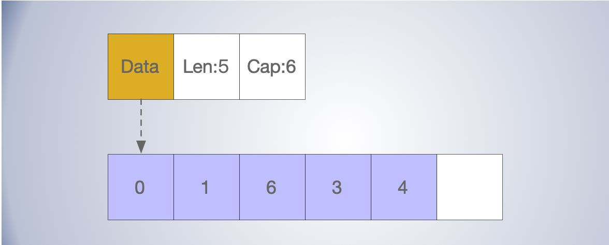

# 数组&切片

[TOC]


# 数组

数组应该是最长用的数据结构了，数组是由相同类型元素的集合组成。数组要求在内存中分配一片连续的内存空间，相比链等不连续的数据结构，对CPU更加的友好，通过索引可以在 O(1) 的时间复杂度快速访问。

数组最常见的是一维数组，多维数组在一些场景场景，如图形计算，有会用到。

数组在大小在初始化之后，通常无法再改变大小。

不同长度的数组，通常属于不同的类型。

数组的类型是由元素类型 `Elem` 和数组的大小 `Bound`，共同构成了数组的，类型在编译期间通过 `cmd/compile/internal/types.NewArray` 生成。

```go
// cmd/compile/internal/types.NewArray
// NewArray returns a new fixed-length array Type.
func NewArray(elem *Type, bound int64) *Type {
	if bound < 0 {
		Fatalf("NewArray: invalid bound %v", bound)
	}
	t := New(TARRAY)
	t.Extra = &Array{Elem: elem, Bound: bound}
	t.SetNotInHeap(elem.NotInHeap())
	return t
}
```

# 切片

切片可以算是动态数组，长度不固定，可以随着元素的增加自动扩容。

与数组不同的是，切片在编译期间生成的类型，不包括长度。

```go
// cmd/compile/internal/types.NewSlice
// NewSlice returns the slice Type with element type elem.
func NewSlice(elem *Type) *Type {
	if t := elem.Cache.slice; t != nil {
		if t.Elem() != elem {
			Fatalf("elem mismatch")
		}
		return t
	}

	t := New(TSLICE)
	t.Extra = Slice{Elem: elem}
	elem.Cache.slice = t
	return t
}
```

## 内存布局

与 map 相比，切片的数据结构就简单很多了，只有：

- 指向底层数组的指针；
- 当前长度 len；
- 当前 slice 的 容量cap。

```go
// runtime/slice.go
type slice struct {
    array unsafe.Pointer
    len   int
    cap   int
}

```

在运行时，也可以有反射包的 `reflect.SliceHeader` 结构体表示.

```go
type SliceHeader struct {
	Data uintptr
	Len  int
	Cap  int
}
```

在存储上，切片相当于在一片数组上，增加了基指针，长度，容量从而实现了动态变化的属性。

- Data 指针，未必是从数组的起始位置开始的。
- 当底层数组内存不足时，追加元素会自动扩容。




## 初始化

切片主要有三种初始化方式：

- 基于现在的数组或切片的片段初始化切片； 这种方式修改新切片元素，会影响原数组(切片) 的元素。
- 字面量初始化；
- 使用关键字 make；

```go
// 下表截取
slice1 := arr[0:3] 
slice1 := slice1[0:5]

// 字面量初始化
slice1 := []int{1, 2, 3, 4} 

// make 关键字初始化
slice := make([]int, 0, 6)

// new
slice := new([]int)
```


通过 make 关键字的会被编译转换为 `runtime.makeslice` 实现，溢出判断，然后调用 `runtime.mallocgc` 分配内存：

```go
func makeslice(et *_type, len, cap int) unsafe.Pointer {
	mem, overflow := math.MulUintptr(et.size, uintptr(cap))
	if overflow || mem > maxAlloc || len < 0 || len > cap {
		mem, overflow := math.MulUintptr(et.size, uintptr(len))
		if overflow || mem > maxAlloc || len < 0 {
			panicmakeslicelen()
		}
		panicmakeslicecap()
	}

	return mallocgc(mem, et, true)
}
```

使用new关键字，会被编译器转化为 `runtime.newobject`

```go
func newobject(typ *_type) unsafe.Pointer {
    return mallocgc(typ.size, typ, true)
}
```


## 扩容

当容量不足时，切片就需要扩容，

- 如果 cap <= 1024 , 会加倍的扩张存储空间；
- 如果 cap > 1024 , 就按照 1.25 的增长因子进行扩容。


```go
func growslice(et *_type, old slice, cap int) slice {
	...
	newcap := old.cap
	doublecap := newcap + newcap
	if cap > doublecap {
		newcap = cap
	} else {
		if old.len < 1024 {  // 小于 1024 , 会加倍的扩张存储空间， 否则按 1.25 倍增长
			newcap = doublecap
		} else {
			// Check 0 < newcap to detect overflow
			// and prevent an infinite loop.
			for 0 < newcap && newcap < cap {
				newcap += newcap / 4
			}
			// Set newcap to the requested cap when
			// the newcap calculation overflowed.
			if newcap <= 0 {
				newcap = cap
			}
		}
	}

	var overflow bool
	var lenmem, newlenmem, capmem uintptr
    // 根据切片中的元素大小对齐内存
	switch {
	case et.size == 1:
		lenmem = uintptr(old.len)
		newlenmem = uintptr(cap)
		capmem = roundupsize(uintptr(newcap)) // roundupsize 将待申请的内存向上取整
		overflow = uintptr(newcap) > maxAlloc
		newcap = int(capmem)
	case et.size == sys.PtrSize:
		lenmem = uintptr(old.len) * sys.PtrSize
		newlenmem = uintptr(cap) * sys.PtrSize
		capmem = roundupsize(uintptr(newcap) * sys.PtrSize)
		overflow = uintptr(newcap) > maxAlloc/sys.PtrSize
		newcap = int(capmem / sys.PtrSize)
	case isPowerOfTwo(et.size):
		...
	}

	if overflow || capmem > maxAlloc {
		panic(errorString("growslice: cap out of range"))
	}

	var p unsafe.Pointer
	if et.ptrdata == 0 {
		p = mallocgc(capmem, nil, false)
		// The append() that calls growslice is going to overwrite from old.len to cap (which will be the new length).
		// Only clear the part that will not be overwritten.
		memclrNoHeapPointers(add(p, newlenmem), capmem-newlenmem)
	} else {
		// Note: can't use rawmem (which avoids zeroing of memory), because then GC can scan uninitialized memory.
		p = mallocgc(capmem, et, true)
		if lenmem > 0 && writeBarrier.enabled {
			// Only shade the pointers in old.array since we know the destination slice p
			// only contains nil pointers because it has been cleared during alloc.
			bulkBarrierPreWriteSrcOnly(uintptr(p), uintptr(old.array), lenmem-et.size+et.ptrdata)
		}
	}
	memmove(p, old.array, lenmem) // 数据拷贝

	return slice{p, old.len, newcap}
}

```


内存对齐处理

todo


## 拷贝

在使用 `copy(dst, src)` 的形式对切片进行拷贝时, 发生在编译期间和运行时期间略有不同，但是最终都会通过汇编方法 memmove 进行拷贝处理。

```go
slicecopy
memmove
```

拷贝方式都会通过 `runtime.memmove` 将整块内存的内容拷贝到目标的内存区域中：

todo


## reference

https://blog.golang.org/slices

https://github.com/cch123/golang-notes/blob/master/slice.md

https://draveness.me/golang/docs/part2-foundation/ch03-datastructure/golang-array-and-slice/#


