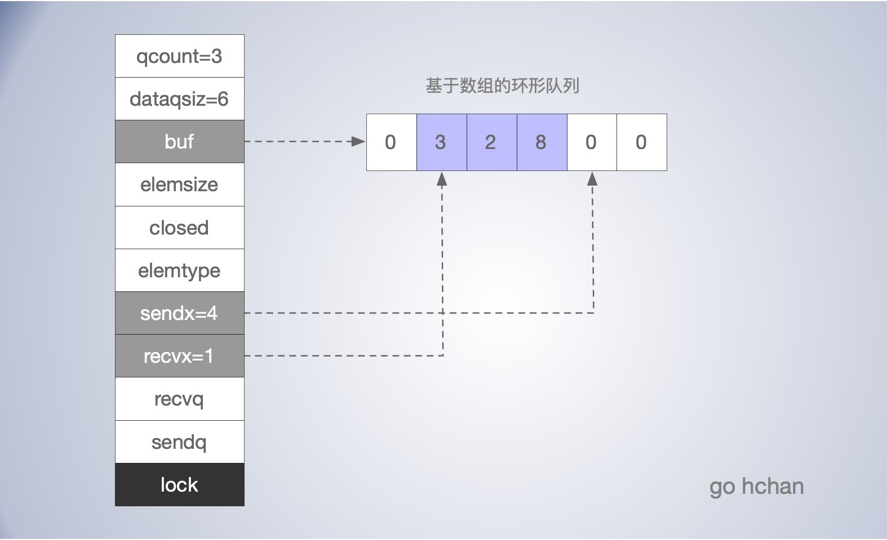

[TOC]


## CSP

在很多主流的编程语言中，多个线程传递数据的方式一般都是共享内存，为了解决线程冲突的问题，在 Go 语言中 Goroutine 会通过 Channel 传递数据。这也是官方推荐的方式，`不要通过共享内存的方式进行通信，而是应该通过通信的方式共享内存`。

Go 语言提供的这种并发模型，又称为*通信顺序进程*（Communicating sequential processes，*CSP*），Goroutine 和 Channel 分别对应 CSP 中的实体和传递信息的媒介，Goroutine 之间会通过 Channel 传递数据。

Channel 的一些特性：

- channel 是并发安全的，其底层读写也设计锁操作。
- 满足 FIFO 先进先出。

- 先从 Channel 读取数据的 Goroutine 会先接收到数据。
- 先向 Channel 发送数据的 Goroutine 会得到先发送数据的权利。
- 可分为阻塞和非阻塞通道。

## 内存布局

在 `runtime.hchan` 定义了 channel 的数据结构：

```go
type hchan struct {
    qcount   uint           // 当前队列中元素个数
  	dataqsiz uint           // 环形队列长度，即可以存放的元素个数，创建通道时 通过make() 指定
    buf      unsafe.Pointer // 环形队列指针
    elemsize uint16         // 元素的大小
    closed   uint32         // 标识关闭状态
    elemtype *_type         // 元素类型， runtime._type
  
    sendx    uint           // 队列下标，指示元素写入时存放到队列中的位置
    recvx    uint           // 队列下标，接收操作处理到的位置
  
    recvq    waitq          // 等待读消息的goroutine对应的sudog队列
    sendq    waitq          // 等待写消息的goroutine对应的sudog队列
  
    
    //lock 保 护hchan中的所有字段，以及在这个通道上被阻塞的sudogs中的几个字段。
    //在持有这个锁时不要更改另一个G的状态(特别是，不要准备好一个G)，因为这会在堆栈收缩时导致死锁。
    lock mutex              
}
```

里面最为核心的就是三个队列：

- `hchan.buf` 基于数组的环形队列，有缓冲的 channel 用它暂存数据

- `hchan.recvq` 和 `hchan.sendq` 是两个链表，分别用于保存因缓冲区不足，发送和接收阻塞在此 channel 上的 goroutine 列表，即 sudog 队列 。



### sudog队列

向 channel 写数据，如果 channel 缓冲区已满或者没有缓冲区，当前 goroutine 会被阻塞，根据读写，分别被放入 `recvq` 和 `sendq` 队列。

- `hchan.recvq`，因读阻塞的 goroutine 队列，会被向 channel 写入数据的 goroutine 唤醒；
- `hchan.sendq`，因写阻塞的 goroutine 队列，会被从channel读数据的goroutine唤醒；

 `recvq` 和 `sendq` 队列基于基于双向链表实现：

```go
type waitq struct {
	first *sudog 	//sudog 表示一个在等待列表中的 Goroutine
	last  *sudog
}

type sudog struct {
	g *g
	next *sudog
	prev *sudog
	elem unsafe.Pointer // data element (may point to stack)
	...
}
```

一般情况下 `recvq` 和 `sendq` 至少有一个为空，例外同一个goroutine使用select语句向channel一边写数据，一边读数据。

## 初始化

创建通道的主要逻辑在 `runtime.makechan` 或者 `runtime.makechan64` 函数中，后者用于处理缓冲区大小大于 2 的 32 次方的情况。

channel 通过 make 关键字创建，主要有缓冲和非缓冲通道。非缓冲通道，就相当于 size 为 0 的情况，如果接受方没有取走数据，发送方就会一直阻塞，我们可以使用非缓冲通道作为用来做同步通信使用。

```go
// go 1.15
func makechan(t *chantype, size int) *hchan {
	elem := t.elem

	// compiler checks this but be safe.
	if elem.size >= 1<<16 {
		throw("makechan: invalid channel element type")
	}
	if hchanSize%maxAlign != 0 || elem.align > maxAlign {
		throw("makechan: bad alignment")
	}

	mem, overflow := math.MulUintptr(elem.size, uintptr(size))
	if overflow || mem > maxAlloc-hchanSize || size < 0 {
		panic(plainError("makechan: size out of range"))
	}

	var c *hchan
	switch {
	case mem == 0: // 通道无缓冲区时
		// Queue or element size is zero.
		c = (*hchan)(mallocgc(hchanSize, nil, true))
		// Race detector uses this location for synchronization.
		c.buf = c.raceaddr()
	case elem.ptrdata == 0:
		// 如果 Channel 中存储的类型不是指针类型，为当前的 Channel 和底层的数组分配一块连续的内存空间
		c = (*hchan)(mallocgc(hchanSize+mem, nil, true))
		c.buf = add(unsafe.Pointer(c), hchanSize)
	default:
		// 其他分别为 hchan 和 buf 单独分配内存
		c = new(hchan)
		c.buf = mallocgc(mem, elem, true)
	}

	c.elemsize = uint16(elem.size)
	c.elemtype = elem
	c.dataqsiz = uint(size)
	lockInit(&c.lock, lockRankHchan)
    
	return c
}

```

通道的初始化没有什么复杂的逻辑，相比发送和接收要简单些：

- 如果通道无缓冲区时，就只会为 runtime.hchan 分配一段内存空间；
- 如果 Channel 中存储的类型不是指针类型，为当前的 Channel 和底层的数组分配一块连续的内存空间；
- 其他情况下，会单独为 runtime.hchan 和缓冲区分配内存；

## 发送数据

向通道发送数据，使用类似 `c <- x` 的语句，进过编译之后，使用使用到 `runtime.chansend1`, 最终发送数据的逻辑都落到了 `runtime.chansend` 函数中。其从上到下主体逻辑为：

- 开头有一个 channel 是否为 nil 的判断，如果为 nil ，发送方的 goroutine 会被 gopark 挂起，即阻塞，而且会被一直阻塞下去。这个特性可以阻塞发送方向通道发送数据，在一些场景，还有有用的。
- 加锁，后续遇到 return 和 panic 先释放锁。所以 chan 的底层还是有锁开销的。高频场景还是要有针对性的优化策略。
- 判断通道是否关闭，在已经关闭的通道发送数据会导致 panic。
- **直接发送**：如果 `hchan.recvq` 不为空，说明环形buf中没数据，则直接获取一个 sudog，直接把数据投递给它(数据直接从一个 goroutine 的栈拷贝到另一个 goroutine 的栈)，而不是放入环形 buf 中，因为并这样不会破坏 FIFO 特性，而且少了一次的拷贝，return。
- **有缓冲区**：判断通道缓冲区是否有剩余空间，有则发送，顺便调整发送索引位置sendx和总元素数，return。
- **无空余缓冲区**：会获取一个 sudog 对象，把发送的 goroutine 信息打包方进去，然后把 sudog 加入到 sendq 队列。

```go
func chansend1(c *hchan, elem unsafe.Pointer) {
	chansend(c, elem, true, getcallerpc())
}

func chansend(c *hchan, ep unsafe.Pointer, block bool, callerpc uintptr) bool {
	if c == nil { // nil channel 发送数据会永远阻塞下去
		if !block {
			return false
		}
        // 挂起当前 goroutine
		gopark(nil, nil, waitReasonChanSendNilChan, traceEvGoStop, 2)
		throw("unreachable")
	}

	if debugChan {
		print("chansend: chan=", c, "\n")
	}

	if raceenabled {
		racereadpc(c.raceaddr(), callerpc, funcPC(chansend))
	}

	if !block && c.closed == 0 && full(c) {
		return false
	}

	var t0 int64
	if blockprofilerate > 0 {
		t0 = cputicks()
	}

	lock(&c.lock)

	if c.closed != 0 { // 在已经关闭的通道发送数据会导致 panic
		unlock(&c.lock)
		panic(plainError("send on closed channel"))
	}

    // 如果 recvq 不为空，则直接获取一个 sudog，直接把数据投递给它，而不是放入环形 buf 中。
	if sg := c.recvq.dequeue(); sg != nil {
		send(c, sg, ep, func() { unlock(&c.lock) }, 3)
		return true
	}

    // 判断环形buf是否满了，qcount < dataqsiz 说明没满 
	if c.qcount < c.dataqsiz {
		qp := chanbuf(c, c.sendx)
		if raceenabled {
			raceacquire(qp)
			racerelease(qp)
		}
		typedmemmove(c.elemtype, qp, ep) // 将 goroutine 的数据拷贝到 buf 中
		c.sendx++ // 发送 index 加一
		if c.sendx == c.dataqsiz { // 发送索引到数组末尾了重置到开头
			c.sendx = 0
		}
		c.qcount++  // 总的元素++
		unlock(&c.lock)
		return true  // 发送完毕，解锁
	}

	if !block {
		unlock(&c.lock)
		return false
	}

	// 在 channel 上阻塞，receiver 会帮我们完成后续的工作
	gp := getg()
	mysg := acquireSudog()  // 返回一个 sudog 对象，并把当前发送 goroutine 的信息打包方进入
	mysg.releasetime = 0
	if t0 != 0 {
		mysg.releasetime = -1
	}
	// No stack splits between assigning elem and enqueuing mysg
	// on gp.waiting where copystack can find it.
	mysg.elem = ep
	mysg.waitlink = nil
	mysg.g = gp
	mysg.isSelect = false
	mysg.c = c
	gp.waiting = mysg
	gp.param = nil
    // 将当前这个发送 goroutine 打包后的 sudog 入队到 channel 的 sendq 队列中
	c.sendq.enqueue(mysg) 
	// 挂起发送 goroutine ，休眠
	atomic.Store8(&gp.parkingOnChan, 1)
	gopark(chanparkcommit, unsafe.Pointer(&c.lock), waitReasonChanSend, traceEvGoBlockSend, 2)
	
	KeepAlive(ep) // 确保待发送的值保持活着，直到接收方将其复制出去。

	// 被唤醒后要执行的代码
	if mysg != gp.waiting {
		throw("G waiting list is corrupted")
	}
	gp.waiting = nil
	gp.activeStackChans = false
	if gp.param == nil {
		if c.closed == 0 {
			throw("chansend: spurious wakeup")
		}
        // 唤醒后发现 channel 被人关了，panic 
		panic(plainError("send on closed channel"))
	}
	gp.param = nil
	if mysg.releasetime > 0 {
		blockevent(mysg.releasetime-t0, 2)
	}
	mysg.c = nil
	releaseSudog(mysg)
	return true
}
```


直接发送数据时会调用 `runtime.send`

- 调用 `runtime.sendDirect` 将发送的数据直接拷贝到 `x = <-c `表达式中变量 x 所在的内存地址上；
- 调用 `runtime.goready` 将等待接收数据的 Goroutine 标记成可运行状态 Grunnable。 并把该 Goroutine 放到发送方所在的处理器的 `runnext` 上等待执行，该处理器在下一次调度时会立刻唤醒数据的接收方； `runnext` 指向的 G 在调度中具有比 P 上其他可运行 G 更高的优先级，这可以让因通道阻塞的 Goroutine 尽快的被唤醒执行。

```go

func send(c *hchan, sg *sudog, ep unsafe.Pointer, unlockf func(), skip int) {
	...
	if sg.elem != nil {
		sendDirect(c.elemtype, sg, ep)
		sg.elem = nil
	}
	gp := sg.g
	unlockf()
	gp.param = unsafe.Pointer(sg)
	if sg.releasetime != 0 {
		sg.releasetime = cputicks()
	}
	goready(gp, skip+1)
}
```


## 接收数据

从通道上接收数据主要有两种方式：

```go
x <- c
x, ok <- c
```

经过编译器编译之后会转为 `runtime.chanrecv1` 和 `runtime.chanrecv2` 两种不同函数的调用，但是这两个函数最终会调用 `runtime.chanrecv`。

```go
func chanrecv1(c *hchan, elem unsafe.Pointer) {
	chanrecv(c, elem, true)
}

func chanrecv2(c *hchan, elem unsafe.Pointer) (received bool) {
	_, received = chanrecv(c, elem, true)
	return
}

```


`runtime.chanrecv` 的实现逻辑和 `runtime.chansend` 的实现非常相似：

- 开头有一个 channel 是否为 nil 的判断，如果为 nil ，接收方的 goroutine 会被 gopark 挂起，即阻塞，而且会被一直阻塞下去。
- 如果 Channel 已经关闭并且缓冲区没有任何数据，runtime.chanrecv 会直接返回
- 加锁。
- **直接接收**：如果 `sendq` 队列中存在等待发送的 Goroutine，会将 `recvx` 索引所在的数据拷贝到接收goroutine所在的内存空间上，并将 `sendq` 队列中 goroutine 的数据拷贝到缓冲区，并将其唤醒；
- **有缓冲区元素**：判断通道缓冲区是否有数据，有则直接从缓冲区获取数据，调整环形 buf 的index ，return。
- **阻塞接收**：会获取一个 sudog 对象，把发送的 goroutine 信息打包方进去，然后把 sudog 加入到 recvq 队列。

```go
func chanrecv(c *hchan, ep unsafe.Pointer, block bool) (selected, received bool) {
	// 与方一样，在 nil channel 上进行 recv 操作，会永远阻塞
	if c == nil {
		if !block {
			return
		}
		gopark(nil, nil, waitReasonChanReceiveNilChan, traceEvGoStop, 2)
		throw("unreachable")
	}

	
	if !block && empty(c) {
        // 非阻塞且没内容可收的情况下要直接返回 零值
		if atomic.Load(&c.closed) == 0 {
			return 
		}
		if empty(c) {
			// The channel is irreversibly closed and empty.
			if raceenabled {
				raceacquire(c.raceaddr())
			}
			if ep != nil {
				typedmemclr(c.elemtype, ep)
			}
			return true, false
		}
	}

	var t0 int64
	if blockprofilerate > 0 {
		t0 = cputicks()
	}

	lock(&c.lock)

	if c.closed != 0 && c.qcount == 0 {
		if raceenabled {
			raceacquire(c.raceaddr())
		}
		unlock(&c.lock)
		if ep != nil {
			typedmemclr(c.elemtype, ep)
		}
		return true, false
	}

    // 与直接发送类似，如果发送队列不为空，
    // 如果没缓冲区，则直接从发送 goroutine 中取数据
    // 如果有缓冲区，先从缓冲区获取数据，然后将等待的一个 goroutine 上的数据拷贝到 缓冲区，唤醒对方。
	if sg := c.sendq.dequeue(); sg != nil {
		recv(c, sg, ep, func() { unlock(&c.lock) }, 3)
		return true, true
	}

    // 如果缓冲区由元素
	if c.qcount > 0 {
		// Receive directly from queue
		qp := chanbuf(c, c.recvx)
		if raceenabled {
			raceacquire(qp)
			racerelease(qp)
		}
		if ep != nil { // 从 buffer 里拷贝数据
			typedmemmove(c.elemtype, ep, qp)
		}
		typedmemclr(c.elemtype, qp)
		c.recvx++
		if c.recvx == c.dataqsiz {
			c.recvx = 0
		}
		c.qcount--
		unlock(&c.lock)
		return true, true
	}

	if !block {
		unlock(&c.lock)
		return false, false
	}

	// no sender available: block on this channel.
	gp := getg()
	mysg := acquireSudog()
	mysg.releasetime = 0
	if t0 != 0 {
		mysg.releasetime = -1
	}
	// 打包接收 goroutine 到 sudog 放入 recvq
	mysg.elem = ep
	mysg.waitlink = nil
	gp.waiting = mysg
	mysg.g = gp
	mysg.isSelect = false
	mysg.c = c
	gp.param = nil
	c.recvq.enqueue(mysg)
	// 挂起
	atomic.Store8(&gp.parkingOnChan, 1)
	gopark(chanparkcommit, unsafe.Pointer(&c.lock), waitReasonChanReceive, traceEvGoBlockRecv, 2)

	...
	return true, !closed
}

```


## 关闭

关闭通道是通过关键字 `close` 实现。在运行时的主要逻辑在 `runtime.closechan` 中。

```go
func closechan(c *hchan) {
	if c == nil {  // 关闭一个 nil channel 会直接 panic
		panic(plainError("close of nil channel"))
	}
	// 上锁，这个锁的粒度比较大，一直到释放完所有的 sudog 才解锁
	lock(&c.lock) 
	if c.closed != 0 { // 重复关闭会导致 panic, 思考：这个不能是个幂等操作吗？
		unlock(&c.lock)
		panic(plainError("close of closed channel"))
	}
	...
	c.closed = 1  // 设置关闭状态

	var glist gList

	// 释放所有接收等待的 gourinte
	for {
		sg := c.recvq.dequeue()
		if sg == nil { // 弹出的 sudog 是 nil，读队列已经空了，break
			break
		}
		if sg.elem != nil { // sg.elem unsafe.Pointer，指向 sudog 的数据元素
			typedmemclr(c.elemtype, sg.elem) // 释放对应的内存
			sg.elem = nil
		}
		...
		glist.push(gp)  // 将 goroutine 入 glist
	}

    // 释放所有发送等待的 gourinte，注意由于通道关闭，他们将会 panic
	for {
		sg := c.sendq.dequeue()
		if sg == nil { // 弹出的 sudog 是 nil，写队列已经空了，break
			break
		}
		...
		glist.push(gp) // 将 goroutine 入 glist
	}
	unlock(&c.lock)

	// Ready all Gs now that we've dropped the channel lock.
	for !glist.empty() {
		gp := glist.pop()
		gp.schedlink = 0
		goready(gp, 3) // 使 g 的状态切换到 Grunnable
	}
}

```

当 Channel 是 nil 或者已经被关闭时，执行关闭会导致 panic。

主要的逻辑是将 `recvq` 和 `sendq` 两个队列中处于等待发送或接收端 goroutine 挨个放入列表 `gList` 中，顺便清除所有 `sudog` 上未被处理的元素。

最后会遍历 gList 为所有被阻塞的 goroutine 调用 `runtime.goready`，使它们的状态切换到 grunnable， 触发调取。

## 问题及思考

**怎么知道通道是否关闭了？**


**怎么合理的关闭通道，防止往关闭的通道发数据？**

- 往关闭的通道发数据导致 panic
- 执行关闭时，如果通道为 nil 或者已经关闭了也会导致 panic
- 如果通道为 nil ，发送方和接收方都无法发送数据。

假设有一个通道，三个发送者，三个接收者，怎么关闭通道？

- 通常建议从发送端关闭通道。


**什么情况下，数据会直接从一发送 goroutine 栈拷贝接收 goroutine 的栈上？**

- recvq 上有等待的 goroutine 时，说明缓冲区没数据，可直接拷贝过去，减少复制成本


**runtime 是如何实现，尽快的调度收到数据解除阻塞的 goroutine 的？**

- 接收数据的 goroutine 会变为可运行状态，并被放入 P 的 runnext 指针上，这样会被调度器有限调度。

**channel 底层是有锁的，使用时如何提升性能？**

- 如果业务允许，适当按一定的粒度拆分成多个 channel ，多组发送和消费模式，这样可以适当的减少锁的竞争。
- 批量化发送，如把一组数据放到数组或切片中打包一起发送，到通道。

**当通道缓冲区满了，发送方被阻塞的大致实现原理？**

- 缓冲区满了，会获取一个 sudog 对象，把发送方 goroutine 信息打包进去，放入 sendq 发送 goroutine 等待队列，这是通过链表实现的。
- 调用 gopark 挂起 goroutine 。


实现一个 lockfree


## reference

https://talks.golang.org/2013/advconc.slide#1