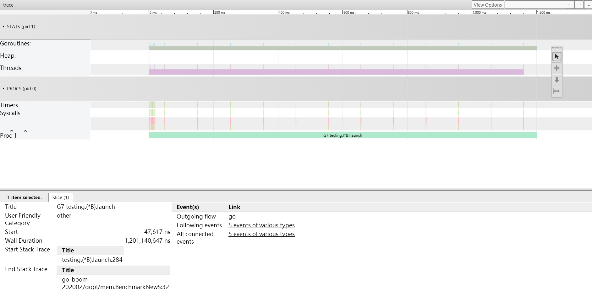
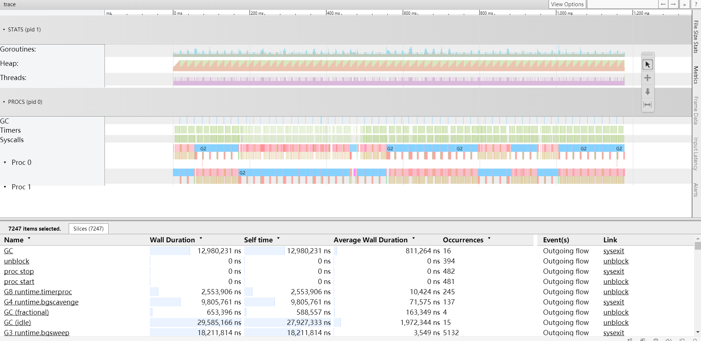

## 返回引用逃逸的性能对比


使用指针可以避免拷贝，但是使用指针数很多情况下（如函数返回时）导致变量的作用域超出函数的调用栈，导致内存逃逸到堆内存上。


功能代码：

```go
type S struct {
	a int64
	b string
	c float64
}

//返回结构体副本
func NewS() S {
	return S{
		100, "sword", 1.333,
	}
}

//返回结构体指针 （内存逃逸）
func NewSptr() *S {
	return &S{
		100, "sword", 1.333,
	}
}
```

性能测试：

```go
//测试 返回结构体副本性能 
func BenchmarkNewS(b *testing.B) {
	var s S
	f, err := os.Create("stack.out")
	if err != nil {
		log.Panic(err)
	}
	defer f.Close()
	//开启追踪运行信息，并写入f
	if err = trace.Start(f); err != nil {
		panic(err)
	}

	//执行性能基准测试
	for i := 0; i < b.N; i++ {
		s = NewS()
		s.a = 10
		s.b = "aaa"
		s.c = 1.3333
	}

	trace.Stop()
	b.StopTimer()// StopTimer stops timing a test. This can be used to pause the timer
	_ = fmt.Sprintf("%v", s.a)
}

//返回结构体指针性能 （内存逃逸）
func BenchmarkNewSptr(b *testing.B) {
	var s *S
	f, err := os.Create("heap.out")
	if err != nil {
		log.Panic(err)
	}
	defer f.Close()
	//开启追踪运行信息，并写入f
	if err = trace.Start(f); err != nil {
		panic(err)
	}

	//执行性能基准测试
	for i := 0; i < b.N; i++ {
		s = NewSptr()
		s.a = 10
		s.b = "aaa"
		s.c = 1.3333
	}

	trace.Stop()
	b.StopTimer()// StopTimer stops timing a test. This can be used to pause the timer
	_ = fmt.Sprintf("%v", s.a)
}
```

运行基准测试`go test -bench=. -benchmem -memprofile memprofile.out -cpuprofile profile.out`
测试结果：

```go
//BenchmarkNewS-2      	288926017	   4.17 ns/op	  0 B/op	       0 allocs/op
//BenchmarkNewSptr-2   	5580040	       212 ns/op	      32 B/op	   1 allocs/op
//从测试结果看，使用结构体副本比指针快很多，差了不止一个数量级
```

#### 通过go tool trace 分析
```
go tool trace heap.out
go tool trace stack.out

# go tool trace heap.out
Parsing trace...
Splitting trace...
Opening browser. Trace viewer is listening on http://127.0.0.1:50790

# go tool trace stack.out
Parsing trace...
Splitting trace...
Opening browser. Trace viewer is listening on http://127.0.0.1:33595

```
通过浏览器访问:
stack.out (使用结构体副本)



heap (使用指针)



通过对比发现，由于没有使用堆，因此没有垃圾收集器，也没有额外的 goroutine。使用指针迫使 go 编译器将变量逃逸到堆，由此增大了垃圾回收器的压力，产生了更多的系统调用。与栈相比，在堆上为变量分配内存是多么消耗资源。与在堆上分配内存并共享指针相比，代码在栈上分配结构体并复制副本要快得多。

堆内存回收代价大造成，要是这个内存块需要在不同函数中传递，并且内存块的生命周期比较长，那还是用指针比较好。


