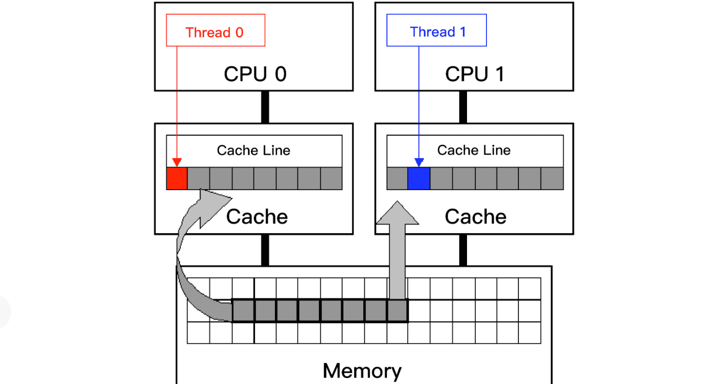

## CPU 伪共享缓存

假设两个处理器 A 和 B, 都在各自本地 Cache Line 里有同一个变量的拷贝时，此时该 Cache Line 处于 Shared 状态。当处理器 A 在本地修改了变量，除去把本地变量所属的 Cache Line 置为 Modified 状态以外，还必须在另一个处理器 B 读同一个变量前，对该变量所在的 B 处理器本地 Cache Line 发起 Invaidate 操作，标记 B 处理器的那条 Cache Line 为 Invalidate 状态。

随后，若处理器 B 在对变量做读写操作时，如果遇到这个标记为 Invalidate 的状态的 Cache Line，即会引发 Cache Miss，从而将内存中的数据拷贝到 Cache Line 里，然后处理器 B 再对此 Cache Line 对变量做读写操作。Cache Line 伪共享问题，就是由多个 CPU 上的多个线程同时修改自己的变量引发的。这些变量表面上是不同的变量，但是实际上却存储在同一条 Cache Line 里。


现代 CPU 为了保证缓存相对于内存的一致性，必须实时监测每个核对缓存相对应的内存位置的修改。如果不同核所对应的缓存，其实是对应内存的同一个位置，那么对于这些缓存位置的修改，就必须轮流有序地执行，以保证内存一致性。

但是，这将导致核与核之间产生竞争关系，因为一个核对内存的修改，将导致另外的核在该处内存上的缓存失效。在多线程的场景下就会导致这样的问题。*当多线程修改看似互相独立的变量时，如果这些变量共享同一个缓存行，就会在无意中影响彼此的性能，这就是伪共享*。

下面这张 Intel 公司提供的图，两个线程运行在不同的核上，每个核都有自己单独的缓存，并且两个线程访问同一个缓存行。



如果线程 0 修改了缓存行的一部分，比如一个字节，那么为了保证缓存一致性，这个核上的整个缓存行的 64 字节，都必须写回到内存；这就导致其他核的对应缓存行失效。其他核的缓存就必须从内存读取最新的缓存行数据。这就造成了其他线程（比如线程 1）相对较大的停顿。

这个问题就是伪共享缓存。之所以称为“伪共享”，是因为，`单单从程序代码上看，好像线程间没有冲突，可以完美共享内存，所以看不出什么问题。由于这种冲突性共享导致的问题不是程序本意，而是由于底层缓存按块存取和缓存一致性的机制导致的，所以才称为“伪共享”`。

**策略**

`我们开发程序时，不同线程的数据要尽量放到不同的缓存行，避免多线程同时频繁地修改同一个缓存行`。

> 假如我们要写一个多线程的程序来做分布式的统计工作，为了避免线程对于同一个变量的竞争，我们一般会定义一个数组，让每个线程修改其中一个元素。当需要总体统计信息时，再将所有元素相加得到结果。

这个问题的解决方案，是让每个元素单独占用一个缓存行，比如 64 字节，也就是*按缓存行的大小对齐*（Cache Line Alignment）。具体方法怎么实现呢？其实就是插入一些无用的字节（Padding）。这样的好处，是多个线程可以修改各自的元素和对应的缓存行，不会存在缓存行竞争，也就避免了“伪共享”问题。比如go中的结构体内存对齐。

尤其是第三个方案解决的伪共享缓存问题，对大多数程序员和运维人员而言，不太容易理解。为什么难理解？是因为它牵扯了软件（比如多线程）和硬件（比如缓存一致性和缓存行的大小）的交互。

当多线程共用同一个缓存行，并且各自频繁访问时，会导致严重的称为“伪共享”的性能问题。


测试：

```go
// cache line false sharing
type X struct {
	a int64
	b int64
	c int64
}

func (x *X) Incr() {
	atomic.AddInt64(&x.a, 1)
	atomic.AddInt64(&x.b, 1)
	atomic.AddInt64(&x.c, 1)
}


type XPad struct {
	a int64
	_ [56]byte  // padding
	b int64
	_ [56]byte  // padding
	c int64
}

func (x *XPad) Incr() {
	atomic.AddInt64(&x.a, 1)
	atomic.AddInt64(&x.b, 1)
	atomic.AddInt64(&x.c, 1)
}
```

Bench 代码

```go
func BenchmarkX_Incr(b *testing.B) {
	x := X{}
	b.RunParallel(func(pb *testing.PB) {
		for pb.Next() {
			x.Incr()
		}
	}) 
}

func BenchmarkXPad_Incr(b *testing.B) {
	x := XPad{}
	b.RunParallel(func(pb *testing.PB) {
		for pb.Next() {
			x.Incr()
		}
	})
}
```

运行情况为：

```
BenchmarkX_Incr-4   	29065308	        52.7 ns/op
BenchmarkXPad_Incr-4   	36949635	        29.3 ns/op
```

从运行结果看，增加了 padding 实现`缓存行对齐`的运行速度明显比较快。

