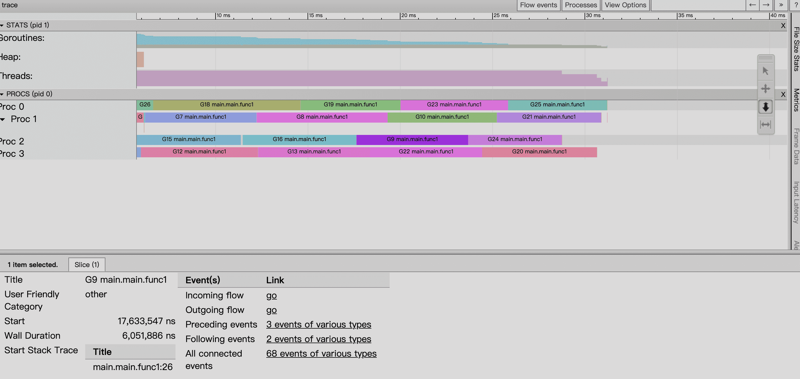

执行跟踪捕获范围广泛的执行事件，例如 goroutine 创建/阻塞/解除阻塞，syscall 进入/退出/阻塞，gc相关事件、堆大小的变化、处理器启动/停止等。能捕获纳秒级精度的时间戳和堆栈跟踪事件。生成的跟踪可以使用 `go tool trace trace.out` 进行解释。

支持跟踪使用标准测试构建的测试和基准测试包被内置到.`go test` 中。例如，运行

在当前目录中测试并写入跟踪文件(`trace.out`)。


查看文档

```bash
go doc runtime/trace
```


```go
import (
	"os"
	"runtime/trace"
	"sync"
)

func main() {
	// trace 代码
	f, err := os.Create("trace.out")
	if err != nil {
		panic(err)
	}
	defer f.Close()
	err = trace.Start(f)
	if err != nil {
		panic(err)
	}
	defer trace.Stop()

	//逻辑代码
	var wg sync.WaitGroup
	for i := 0;i < 20 ;i++ {
		wg.Add(1)
		go func() {
			a := 0

			for i := 0; i < 1e7; i++ {
				a += 1
			}
			wg.Done()
		}()
	}
	wg.Wait()
}
```

运行会生成 `trace.out` 文件

```bash
go run main.go
```

 `trace.out` 文件并启动可视化界面：

```bash
$ go tool trace trace.out
2020/12/25 12:15:00 Opening browser. Trace viewer is listening on http://127.0.0.1:62349

# 也可指定 http 端口
go tool trace -http="localhost:26666" ./trace.out
```

通过浏览器访问，主要有以下选项

```
View trace：查看跟踪，能看到一段时间内 goroutine 的调度执行情况，包括事件触发链；

Goroutine analysis：Goroutine 分析

Network blocking profile：网络阻塞概况

Synchronization blocking profile：同步阻塞概况

Syscall blocking profile：系统调用阻塞概况

Scheduler latency profile：调度延迟概况

User defined tasks：用户自定义任务

User defined regions：用户自定义区域

Minimum mutator utilization：最低 Mutator 利用率
```


## View trace

基于上述，浏览器页面点击 View trace， 查看 goroutine 的调度执行情况。



查看 goroutine：

- Start：开始时间（就是时间轴上的刻度）
- Wall Duration：持续时间（这个 goroutine 在这个处理器上连续执行的小段时间）
- Start Stack Trace：协程调用栈（切进来执行的 goroutine 调用栈）
- End Stack Trace：切走时候时候的调用栈
- Incoming flow：触发切入的事件
- Outgoing flow：触发切走的事件
- Preceding events：这个协程相关的之前所有的事件
- Follwing events：这个协程相关的之后所有的事件
- All connected：这个协程相关的所有事件


## reference

https://about.sourcegraph.com/go/an-introduction-to-go-tool-trace-rhys-hiltner/

