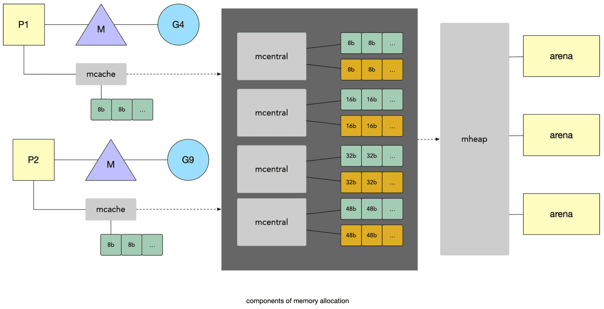

# 内存分配

[TOC]


## 栈(Stack)和堆(Heap)

内存空间包含两个重要区域 — 栈区（Stack）和堆区（Heap）。函数调用的参数、返回值以及局部变量大都会被分配到栈上，这部分内存会由编译器进行管理。

不同编程语言使用不同的方法管理堆区的内存，C, C++ 等编程语言会由工程师主动申请和释放内存，Go 以及 Java 等编程语言会由工程师和编译器共同管理，堆中的对象由内存分配器分配并由垃圾收集器回收。


**栈 (stack)** 是计算机内存中的一个特殊区域，般由编译器自动进行分配和释放，用来存储函数的参数和临时变量。当计算任务完成时，变量的内存将被自动删除，不会长期存在，效率非常高，栈部分主要包含方法、局部变量和引用变量。

**堆(Heap)**是编程语言用来存储全局变量的内存。默认情况下，所有全局变量都存储在堆内存空间中。它支持动态内存分配。堆不是为您自动管理的，也不是由CPU严格管理的。它更像是内存中的一个自由浮动的区域。使用堆内存的优点是: 它允许您访问全局变量。 堆对内存大小没有任何限制，它可以提供操作系统所能提供的最大内存。缺点是内存管理在堆内存中更为复杂，因为它是全局使用的，它需要更多的时间来计算，与栈相比，它的执行时间太长了。


**堆和栈的区别**

最早的CPU是没有堆或栈的。为了完成机器指令的功能，必须要有一种机制来更好地建立编程的函数调用结构，于是栈的概念成型了。栈成为CPU指令集的标配，一个独立的 stack pointer 也和 IP（指令执行指针）并列成为CPU硬件架构的标配，高级语言和机器语言从而有了标准的函数调用的实施方案。

因为`栈上变量难以动态管理，且生存周期受制`。于是一套可用内存管理框架也在逐渐成熟，这些技术框架也从操作系统理论发展中受益，最后约定俗成地被称为heap而已。

栈(stack)空间更小(heap)，速度仅次于寄存器。堆空间更大，速度慢于堆。在高级语言中，栈通常由编译器分配，程序员无法直接控制，而堆则可以被人为的控制。

- 栈是线性的数据结构，而堆是层次化的数据结构。
- 栈内存永远不会变成碎片，而堆内存可以变成碎片，因为首先分配内存块，然后释放。
- 栈只访问局部变量，而堆允许访问全局变量。
- 栈变量不能调整大小，而堆变量可以调整大小 （Go的内核线程栈大小固定，G 的栈是可以动态增加的）。
- 栈内存是在一个连续块中分配的，而堆内存是按任意随机顺序分配的。
- 栈不需要释放变量，而在堆中则需要释放变量。
- 栈分配和释放是由编译器指令完成的，而堆分配和释放是由程序员完成的。


## 内存管理策略及原则

内存申请，涉及系统调用，频繁的调用，代价太大，


基本策略

1.每次从操作系统申请一大块内存(比如1MB),以减少系统调用。 

2.将申请到的大块内存按照特定大小预先切分成小块,构成链表。

3.为对象分配内存时,只须从大小合适的链表提取一个小块即可

4.回收对象内存时,将该小块内存重新归还到原链表,以便复用。 

5.如闲置内存过多,则尝试归还部分内存给操作系统、降低整体开销。


## 内存分配器

**内存分配器**只管理内存块,并不关心对象状态。且它不会主动回收内存，垃圾回收器在完成清理操作后，触发内存分配器的回收操作。业界比较出名的内存分配器有 Google 的 TCMalloc 和 Facebook 的 Jemalloc。


## 多级缓存分配策略

Golang 运行时的内存分配算法参考了 Google 的 `TCMalloc算法`，全称 `Thread-Caching Malloc`，即线程缓存分配。核心思想就是把内存分为多级管理。它将可用的堆内存采用多级分配的方式进行管理：每个线程都会自行维护一个独立的内存池，进行内存分配时优先从该内存池中分配，当内存池不足时才会向全局内存池申请，以避免不同线程对全局内存池的频繁竞争。

TCMalloc 主要采用三级缓存的策略，分配器都会引入线程缓存（Thread Cache）、中心缓存（Central Cache）和页堆（Page Heap）三个组件分级管理内存。对应到 Go 的内存分配器分别为 `mcache`, `mcentral`, `mheap`。

Go 根据对象大小的不同，采取了不同的分配策略。运行时根据对象的大小将对象分成微对象、小对象和大对象三种：

- 微对象，大小为 (0, 16B)
- 小对象，大小为 [16B, 32KB]
- 大对象，大小为 (32KB, +∞)

大部分情况下，对象都在 32KB 以下的微小对象，对于这些对象，Go会先尝试从名为 `mcache` 的本地线程缓存中获取内存，这部分通常线程独占的，无需锁操作，当线程缓存不能满足需求时，就会使用中心缓存 `mcentral` 作为补充解决小对象的内存分配问题；`mcentral`是多线程共享的，需要加锁操作。在遇到 32KB 以上的对象时，内存分配器就会选择页堆(`mheap`)直接分配大量的内存。

## 堆内存地址布局

### 线性内存

在 Go 语言 1.10 以前的版本，堆区的内存空间都是连续的；但是在 1.11 版本，Go 团队使用稀疏的堆内存空间替代了连续的内存，解决了连续内存带来的限制以及在特殊场景下可能出现的问题。

Go在程序启动的时候，会先向操作系统申请一块内存（注意这时还只是一段虚拟的地址空间，并不会真正地分配内存），切成小块后自己进行管理。

申请到的内存块被分配了三个区域，在X64上分别是512MB，16GB，512GB大小。


- `spans` 区域存储了指向内存管理单元 `runtime.mspan` 的指针数组，每个内存单元会管理几页的内存空间，每页大小为 8KB；
- `bitmap` 为每个对象提供4bit标记位，用于标识 `arena` 标识`arena`区域哪些地址保存了对象，是否包含指针、GC标记等信息。

- `arena` 区域是所谓堆区，Go动态分配的内存都是在这个区域，它把内存分割成`8KB`大小的页，一些页组合起来称为`runtime.mspan`。


`spans区域`存放一些指针，该指针指向`runtime.mspan`，每个`runtime.mspan`是一些`arena`分割的页组合起来的内存管理基本单元。所以`spans`区域的最大大小就是`(512GB/8KB)*8B=512MB`。除以8KB是计算`arena`区域的页数，而最后乘以8B是计算`spans`区域所有指针的大小。创建`mspan`的时候，按页填充对应的`spans`区域，在回收`object`时，根据地址很容易就能找到它所属的`mspan`。

Go 语言在垃圾回收时会根据指针的地址判断对象是否在堆中，并通过上一段中介绍的过程找到管理该对象的 `runtime.mspan`。这些都建立在堆区的内存是连续的这一假设上。这种设计虽然简单并且方便，但是在 C 和 Go 混合使用时会导致程序崩溃：

> 1. 分配的内存地址会发生冲突，导致堆的初始化和扩容失败;
> 2. 没有被预留的大块内存可能会被分配给 C 语言的二进制，导致扩容后的堆不连续;

线性的堆内存需要预留大块的内存空间，但是申请大块的内存空间而不使用是不切实际的，不预留内存空间却会在特殊场景下造成程序崩溃。虽然连续内存的实现比较简单。

### 稀疏内存

稀疏内存是 Go 语言在 1.11 中提出的方案。Go 语言在 1.11以后，每次向系统申请的内存`arena`会放到 `heapArena` 数组里，一个二维数组

```go
[1 << arenaL1Bits]*[1 << arenaL2Bits]*heapArena
```

不同平台和架构的二维数组大小可能完全不同，如果我们的 Go 语言服务在 Linux 的 x86-64 架构上运行，二维数组的一维大小会是 1，而二维大小是 4,194,304，因为每一个指针占用 8 字节的内存空间，所以元信息的总大小为 32MB。由于每个 `runtime.heapArena`都会管理 64MB 的内存，整个堆区最多可以管理 256TB 的内存，这比之前的 512GB 多好几个数量级。

每个`arenas`都有一个相关联的 `heapArena` 对象来存储元数据。和前面类似，`heapArena` 依然是分为：spans区域，bitmap区域，arena区域。

相当于把之前的一整块，化分成了很多个小区域，通过 heapArena 数组进行管理。这使用稀疏的内存布局不仅能移除堆大小的上限，还能解决 C 和 Go 混合使用时的地址空间冲突问题。不过因为基于稀疏内存的内存管理失去了内存的连续性，这也使内存管理变得更加复杂

heapArena 对象本身被分配到堆外。


**内存管理抽象层**

因为所有的内存最终都是要从操作系统中申请的，为了屏蔽不同系统之间的差异，Go 语言的运行时构建了操作系统的内存管理抽象层，该抽象层将运行时管理的地址空间分成以下的四种状态

- None：内存没有被保留或者映射，是地址空间的默认状态

- Reserved：运行时持有该地址空间，但是访问该内存会导致错误

- Prepared：内存被保留，一般没有对应的物理内存访问该片内存的行为是未定义的可以快速转换到 Ready 状态
- Ready：可以被安全访问

`runtime` 包中包含多个操作系统对状态转换方法的实现，所有的实现都包含在以 `mem_` 开头的文件中，主要方法：

```
runtime.sysAlloc 会从操作系统中获取一大块可用的内存空间，可能为几百 KB 或者几 MB；
runtime.sysFree  会在程序发生内存不足（Out-of Memory，OOM）时调用并无条件地返回内存；
runtime.sysReserve 会保留操作系统中的一片内存区域，对这片内存的访问会触发异常；
runtime.sysMap  保证内存区域可以快速转换至准备就绪；
runtime.sysUsed 通知操作系统应用程序需要使用该内存区域，需要保证内存区域可以安全访问；
runtime.sysUnused 通知操作系统虚拟内存对应的物理内存已经不再需要了，它可以重用物理内存；
runtime.sysFault 将内存区域转换成保留状态，主要用于运行时的调试

```

## 内存管理组件

Go 语言的内存分配器包含:

- 内存管理单元 `runtime.mspan`;
- 线程缓存 `runtime.mcache`;
- 中心缓存 `runtime.mcentral`;
- 页堆 `runtime.mheap`;


### mcache

当申请的内存是 32kb 以下的小块内时，Go 会优先从一个叫做的 *mcache* 的本地缓存给程序分配内存。在每个逻辑处理器 P 上都有一个线程缓存 mcache ，与 P 的本地运行队列类似，这里也可以起到加速，减少全局大锁的作用。

mcache 中是不同大小的 mspan 内存管理单元，按照大小是否包含指针，从8kb 到 32kb 分了大概 67*2 类的 *mspan*。切割成不同的大小，这有点类似 slab 的内存管理。有一定的内存浪费，但是可以减少内存碎片问题。


在小于 32K 的对象，其实又分为微小对象和小对象，这样做是为了更加高效的利用内存。

### mcentral

mcentral 位于 mcache 的下一级，当 mcache 缓存的内存不足时，可以从 mcentral 申请。

mcentral 是所有 P 共享的，它的主要作用是为所有 mcache 提供切分好的 mspan 资源。每个 central 会持有一种特定大小的全局 mspan 列表，包括已分配出去的和未分配出去的。 每个 mcentral 对应一种 mspan，当工作线程的 mcache 中没有合适(也就是特定大小的)的mspan 时就会从 mcentral 去获取。

由于 mcentral 被所有的工作线程共同享有，存在竞争问题，因此从 mcentral 获取资源时需要加锁。

在 mcentral 中 sizeclass 相同的 span 会以双向链表的形式组织在一起，主要分为：

- `nonempty` 表示链表里还有空闲的 mspan 待分配。
- `empty` 表示这条链表里的 mspan 都被分配了 object 或缓存 mcache 中。


mcache 从 mcentral 获取和归还 mspan 的流程：

- 获取mspan 加锁；从 nonempty 链表找到一个可用的mspan；并将其从 nonempty 链表删除；将取出的 mspan 加入到 empty 链表；将 mspan 返回给工作线程；释放锁。
- 归还 加锁；将 mspan 从 empty 链表删除；将mspan 加入到 nonempty 链表；解锁。

### mheap

当 mcentral 没有空闲的 mspan 时，会向 *mheap* 申请。而 mheap 没有资源时，会向操作系统申请新内存。mheap 主要直接用于大与32K的大对象的内存分配，以及管理未切割的内存，用于给 mcentral 切割成小对象。

当一个 mcache 从 mcentral 申请 mspan 时，只需要在独立的 mcentral 中使用锁，并不会影响申请其他规格的 mspan。


`mheap` 是有 `area` 组成的也就是 `runtime.heapArena` 对象，每个 `runtime.heapArena` 是一个二维数组，每个都会管理 64MB 的内存。

`mheap` 这部分区域其实也就收我们所说的`堆内存`，当然`栈内存`其实也是基于堆内存分配的。

如果 arena 区域没有足够的空间，会调用 `runtime.mheap.sysAlloc` 从操作系统中申请更多的内存。

### Go程序内存布局总览

所有的 Go 语言程序都会在启动时初始化如上图所示的内存布局，每一个处理器都会被分配一个线程缓存 `runtime.mcache` 用于处理微对象和小对象的分配，它们会持有内存管理单元 `runtime.mspan`。

每个类型的内存管理单元都会管理特定大小的对象，当内存管理单元中不存在空闲对象时，它们会从 `runtime.mheap` 持有的 *134* 个中心缓存 `runtime.mcentral` 中获取新的内存单元，中心缓存属于全局的堆结构体 `runtime.mheap`，它会从操作系统中申请内存。

在 amd64 的 Linux 操作系统上，`runtime.mheap` 会持有 4,194,304 runtime.heapArena，每一个 runtime.heapArena 都会管理 *64MB* 的内存，单个 Go 语言程序的内存上限也就是 256TB。





## Go 内存分配流程

Go 程序在启动时会创建一个很大的虚拟地址内存空间，但并没有真正分配那么多内存，操作系统也只是承诺但并不会立刻分配那么多的内存，真正的物理内存分配在写操作导致`缺页中断`时发生。

- *微对象*(0, 16B)内存分配，直接向mcache的tiny对象分配器申请，如果空间不足，则向 mcache的tinySpanClass规格的span链表申请，如果没有，则向mcentral申请对应规格mspan，依旧没有，则向mheap申请，最后都用光则向操作系统申请。
- *小对象*([16B, 32KB])内存分配，先向本线程mcache申请，发现mspan没有空闲的空间，向mcentral申请对应规格的mspan，如果mcentral对应规格没有，向mheap申请对应页初始化新的mspan，如果也没有，则向操作系统申请，分配页。
- *大对象*内存分配，直接向mheap申请spanclass=0，如果没有则向操作系统申请。

简而言之： 大对象直接从 mheap 获取 span，小对象从 mcache.alloc[sizeclass] 获取 object, 微小对象组合使用 cache.tiny object。


### 整体流程


### 微对象 无指针

Go 中小于 16 字节的对象划分为微对象，它会使用P 上线程缓存 mcache 上提高性能，通常会被放入 spanclass 为2的 span 中。主要用来分配较小的字符串以及从栈上逃逸的临时变量。

*微分配器可以将多个较小的内存分配请求合入同一个内存块中*，只有当内存块中的所有对象都被标记需要回收时，整片内存才可能被回收，这样有一定的内存浪费。

微分配器管理的对象*不可以是指针类型*，管理多个对象的内存块大小 `maxTinySize` 是可以调整的，在默认情况下，内存块的大小为 16 字节。`maxTinySize` 的值越大，组合多个对象的可能性就越高，内存浪费也就越严重；`maxTinySize` 越小，内存浪费就会越少，不过无论如何调整，8 的倍数都是一个很好的选择。

线程缓存 `runtime.mcache` 中的 `tiny` 字段指向了 `maxTinySize` 即16字节大小的块的起始地址。

在申请微对象内存时，如果当前块中还包含大小合适的空闲内存，运行时会通过基地址和偏移量获取并返回这块内存：

当内存块中不包含空闲的内存时，下面的这段代码会从先线程缓存找到 spanClass 对应的内存管理单元 `runtime.mspan`，调用 `runtime.nextFreeFast` 获取空闲的内存；当不存在空闲内存时，会调用 `runtime.mcache.nextFree` 从中心缓存或者页堆中获取可分配的内存块


### 小对象 16B~32K

小对象是指大小为 16 字节到 32,768 字节的对象以及所有小于 16 字节的指针类型的对象，小对象的分配可以被分成以下的三个步骤：

1. 确定分配对象的大小以及跨度类 `runtime.spanClass`；
2. 从线程缓存、中心缓存或者堆中获取内存管理单元并从内存管理单元找到空闲的内存空间；
3. 调用 `runtime.memclrNoHeapPointers` 清空空闲内存中的所有数据；

确定待分配的对象大小以及跨度类需要使用预先计算好的 `size_to_class8`、`size_to_class128` 以及 `class_to_size` 字典，这些字典能够帮助我们快速获取对应的值并构建 `runtime.spanClass`

1.计算待分配对象对应的规格( size class) 

2.从 `mcache.alloc` 数组找到规格相同的 span 

3.从 span.freelist 链表提取可用 object 

4.如span. freelist为空,从 central获取新span 

5.如 central. nonempty为空,从 mheap 获取,并切分成 object链表。

6.如heap没有大小合适的闲置span,向操作系统申请新内存块。

### 大对象

运行时对于大于 32KB 的大对象会单独处理，不会从线程缓存或者中心缓存中获取内存管理单元，而是直接在系统的栈中调用 `runtime.largeAlloc` 函数分配大片的内存。该函数会计算分配该对象所需要的页数，它会按照页数为在堆上申请内存。申请内存时会创建一个跨度类为 0 的 `runtime.spanClass` 并调用  `runtime.mheap.alloc` 分配一个管理对应内存的管理单元。


## 问题及思考

**堆和栈的区别？**

- 栈是线性的数据结构，而堆是层次化的数据结构。
- 栈内存永远不会变成碎片，而堆内存可以变成碎片，因为首先分配内存块，然后释放。
- 栈只访问局部变量，而堆允许访问全局变量。
- 栈变量不能调整大小，而堆变量可以调整大小 （Go的内核线程栈大小固定，G 的栈是可以动态增加的）。
- 栈内存是在一个连续块中分配的，而堆内存是按任意随机顺序分配的。
- 栈不需要释放变量，而在堆中则需要释放变量。
- 栈分配和释放是由编译器指令完成的，高级语言中，栈不能被工程师直接操控，而堆分配和释放是由程序员完成的。

**说说多级缓存分配策略？**

- Go 的内存分配，衍生子 TCmalloc ，即 thread cache malloc。主要分配三级缓存来管理内存。 核心思想就是把内存分为多级管理。它将可用的堆内存采用多级分配的方式进行管理：每个线程都会自行维护一个独立的内存池，进行内存分配时优先从该内存池中分配，当内存池不足时才会向全局内存池申请，以避免不同线程对全局内存池的频繁竞争。
- 在 Go 中主要对应 mheap， mcentral，mcache。
- 对于小对象，每次申请内存会优先从 P 缓存 mcache 申请，如果不足再从 central 申请并缓存，再不足就从 mheap申请，再不足会通过系统调用 malloc 从系统申请内存，比如一个 64 M 的 arena 内存块。

- 超过 32K 的大对象，会直接从 mheap 申请。

内存碎片是如何产生的，Go 是怎么解决的？

**列举一些 Go 内存分配器的提升性能一些优化手段？**

- 减少系统调用 malloc ，批量申请内存，然后自行维护管理
- 三级缓存策略， mheap， mcentral，mcache，分为 P 缓存和中心缓存，有限 P 缓存，批量申请，可以减少全局大锁的开销。
- 使用不同的 spanclass 的 mspan 管理切割管理内存，有点类似 slab ，可以减少内存碎片问题。
- mheap 下是有 arena 块连接组成，每个 64 M，实现稀疏内存管理，不用预留大块连续的内存空间。

**Go内存分配根据对象的大小，分成那几类？分配上有什么不同？**

- *微对象*(0, 16B)内存分配，分配到 spanlcas = 2 的 mspan，多个对象可共享一个 mspan。
- *小对象*([16B, 32KB])内存分配，先向本线程mcache申请，发现mspan没有空闲的空间，向mcentral申请对应规格的mspan，如果mcentral对应规格没有，向mheap申请对应页初始化新的mspan，如果也没有，则向操作系统申请，分配页。
- *大对象*内存分配，直接向mheap申请spanclass=0，如果没有则向操作系统申请。

# 参考及推荐阅读

雨痕Go语言学习笔记

[Go: Memory Management and Allocation](https://medium.com/a-journey-with-go/go-memory-management-and-allocation-a7396d430f44)

https://draveness.me/golang/docs/part3-runtime/ch07-memory/golang-memory-allocator/

https://qcrao.com/2019/03/13/graphic-go-memory-allocation/

https://golang.org/src/runtime/

https://medium.com/@ankur_anand/a-visual-guide-to-golang-memory-allocator-from-ground-up-e132258453ed


