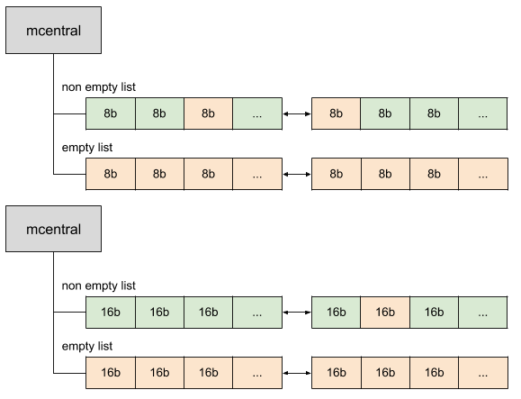
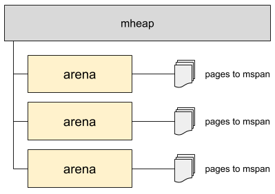

[TOC]

## page

内存页，一块8K 大小的内存空间。Go 与操作系统之间的内存申请和释放，都是以page 为单位的。

## mspan 内存管理单元

内存块，一个或多个连续的内存页page组成一个span ，对应`runtime.mspan`。

线程缓存会通过中心缓存的 `runtime.mcentral.cacheSpan` 方法获取新的内存管理单元，该方法的实现比较复杂，大致分成以下几个部分：

1. 从有空闲对象的 runtime.mspan 链表中查找可以使用的内存管理单元；
2. 从没有空闲对象的 runtime.mspan 链表中查找可以使用的内存管理单元；
3. 调用 runtime.mcentral.grow 从堆中申请新的内存管理单元；
4. 更新内存管理单元的 allocCache 等字段帮助快速分配内存；


```go
//go:notinheap
type mspan struct {
	next *mspan     //链表下一个span地址
	prev *mspan     // 链表前一个span地址
	list *mSpanList // For debugging. TODO: Remove.

	startAddr uintptr // mspan在arena区域的首地址
	npages    uintptr // 该span占用arena区域page的数量

	manualFreeList gclinkptr // 空闲对象列表  list of free objects in mSpanManual spans


	// freeindex是0到nelems之间的位置索引,标记下一个可用空对象索引位置
	freeindex uintptr
	nelems uintptr // number of object in the span. span 管理的对象数，尤其是对于 tiny 对象，会多个合并存储在一个内存块中。
 
	// Cache of the allocBits at freeindex. allocCache is shifted
	// such that the lowest bit corresponds to the bit freeindex.
	// allocCache holds the complement of allocBits, thus allowing
	// ctz (count trailing zero) to use it directly.
	// allocCache may contain bits beyond s.nelems; the caller must ignore
	// these.
    // allocCache — allocBits 的补码，可以用于快速查找内存中未被使用的内存；
	allocCache uint64

	// allocBits and gcmarkBits hold pointers to a span's mark and
	// allocation bits. The pointers are 8 byte aligned.
	// There are three arenas where this data is held.
	// free: Dirty arenas that are no longer accessed
	//       and can be reused.
	// next: Holds information to be used in the next GC cycle.
	// current: Information being used during this GC cycle.
	// previous: Information being used during the last GC cycle.
	// A new GC cycle starts with the call to finishsweep_m.
	// finishsweep_m moves the previous arena to the free arena,
	// the current arena to the previous arena, and
	// the next arena to the current arena.
	// The next arena is populated as the spans request
	// memory to hold gcmarkBits for the next GC cycle as well
	// as allocBits for newly allocated spans.
	//
	// The pointer arithmetic is done "by hand" instead of using
	// arrays to avoid bounds checks along critical performance
	// paths.
	// The sweep will free the old allocBits and set allocBits to the
	// gcmarkBits. The gcmarkBits are replaced with a fresh zeroed
	// out memory.
	allocBits  *gcBits
	gcmarkBits *gcBits

	// sweep generation:
	// if sweepgen == h->sweepgen - 2, the span needs sweeping
	// if sweepgen == h->sweepgen - 1, the span is currently being swept
	// if sweepgen == h->sweepgen, the span is swept and ready to use
	// if sweepgen == h->sweepgen + 1, the span was cached before sweep began and is still cached, and needs sweeping
	// if sweepgen == h->sweepgen + 3, the span was swept and then cached and is still cached
	// h->sweepgen is incremented by 2 after every GC

	sweepgen    uint32
	divMul      uint16        // for divide by elemsize - divMagic.mul
	baseMask    uint16        // if non-0, elemsize is a power of 2, & this will get object allocation base
	allocCount  uint16        // number of allocated objects
	spanclass   spanClass     // size class and noscan (uint8)
	state       mSpanStateBox // mSpanInUse etc; accessed atomically (get/set methods)
	needzero    uint8         // needs to be zeroed before allocation
	divShift    uint8         // for divide by elemsize - divMagic.shift
	divShift2   uint8         // for divide by elemsize - divMagic.shift2
	elemsize    uintptr       // computed from sizeclass or from npages
	limit       uintptr       // end of data in span
	speciallock mutex         // guards specials list
	specials    *special      // linked list of special records sorted by offset.
}
```


## sizeclass

空间规格，每个span 都带有一个sizeclass ， 决定 span 中的 page 数量。

根据 runtime/sizeclasses.go 中 `_NumSizeClasses`, 截止 go 1.15 共有 67 个 class.


```go
const _NumSizeClasses = 67

// 单位 字节B
var class_to_size = [_NumSizeClasses]uint16{0, 8, 16, 32, 48, 64, 80, 96, 112, 128, 144, 160, 176, 192, 208, 224, 240, 256, 288, 320, 352, 384, 416, 448, 480, 512, 576, 640, 704, 768, 896, 1024, 1152, 1280, 1408, 1536, 1792, 2048, 2304, 2688, 3072, 3200, 3456, 4096, 4864, 5376, 6144, 6528, 6784, 6912, 8192, 9472, 9728, 10240, 10880, 12288, 13568, 14336, 16384, 18432, 19072, 20480, 21760, 24576, 27264, 28672, 32768}

var class_to_allocnpages = [_NumSizeClasses]uint8{0, 1, 1, 1, 1, 1, 1, 1, 1, 1, 1, 1, 1, 1, 1, 1, 1, 1, 1, 1, 1, 1, 1, 1, 1, 1, 1, 1, 1, 1, 1, 1, 1, 1, 2, 1, 2, 1, 2, 1, 3, 2, 3, 1, 3, 2, 3, 4, 5, 6, 1, 7, 6, 5, 4, 3, 5, 7, 2, 9, 7, 5, 8, 3, 10, 7, 4}

```


## object

object 对象，用来存储一个变量数据内存空间，一个span 在初始化时，会被切割成一堆不同规格的object。例如给一个变量所谓内存分配，就通过Go中 `runtime.newobject()` 是分配一个object出去。

## mcache 线程缓存

每个工作线程都会绑定一个 mcache，相当于线程缓存，缓存可用的`mspan`资源，Goroutine 申请内存时，首先从其所在线程的缓存 mcache 中分配，如果 mcache 没有可用span ，再从 mcentral 中获取，并缓存到 mcache 中。从 mcache 上分配内存空间是不需要加锁的，在同一时间里，只有一个线程在其上面运行，不会出现竞争，开销极小。

runtime.mcache 是 Go 语言中的线程缓存，主要用来缓存用户程序申请的微小对象。每一个线程缓存都持有 67 * 2 个 runtime.mspan，这些内存管理单元都存储在结构体的 alloc 字段中,`alloc=[numSpanClasses]*mspan` .

为什么每一个线程缓存都持有 67 * 2 个 runtime.mspan ？由于SpanClasses一共有67种，为了满足指针对象和非指针对象，这里为每种规格的span同时准备scan和noscan两个，因此一共有134个mspan缓存链表，分别用于存储指针对象和非指针对象，这样对非指针对象扫描的时候不需要继续扫描它是否引用其他对象，GC扫描对象的时候对于noscan的span可以不去查看bitmap区域来标记子对象, 这样可以大幅提升标记的效率。

线程缓存在刚刚被初始化时是不包含 runtime.mspan 的，只有当用户程序申请内存时才会从上一级组件获取新的 runtime.mspan 满足内存分配的需求。

```go
//go:notinheap
type mcache struct { 

   tiny             uintptr //16byte 申请tiny对象的起始地址，用于分配给小雨 16B 的 tiny 对象，多个 tiny 对象可能被合并。
   tinyoffset       uintptr //从起始地址tiny开始的偏移量
   local_tinyallocs uintptr //tiny对象分配的数量   

   alloc [numSpanClasses]*mspan // 134种可分配的mspan list，其中numSpanClasses=134，索引是splanclassId

   stackcache [_NumStackOrders]stackfreelist //栈缓存


   local_largefree  uintptr                  // 大对象释放字节数
   local_nlargefree uintptr                  // 释放的大对象数量
   local_nsmallfree [_NumSizeClasses]uintptr // 每种规格小对象释放的个数

   ...
   flushGen uint32 //扫描计数
}
```


**初始化**

mcache 通过 `runtime.allocmcache()` 进行初始化， 

```go
var emptymspan mspan 

func allocmcache() *mcache {
	var c *mcache
	systemstack(func() {
		lock(&mheap_.lock)
		c = (*mcache)(mheap_.cachealloc.alloc())
		c.flushGen = mheap_.sweepgen
		unlock(&mheap_.lock)
	})
	for i := range c.alloc {   // 已分配的mspan
		c.alloc[i] = &emptymspan
	}
	c.next_sample = nextSample()
	return c
}
```

初始化后的 runtime.mcache 中的所有 runtime.mspan 都是空的占位符 emptymspan。


**微分配器**

线程缓存中还包含几个用于分配微对象的字段，下面的这三个字段组成了微对象分配器，专门为 16 字节以下的对象申请和管理内存：

```go
type mcache struct {
	tiny             uintptr   	//16byte 申请小对象的起始地址
	tinyoffset       uintptr	//从起始地址tiny开始的偏移量
	local_tinyallocs uintptr	//tiny对象分配的数量
}
```

`微分配器只会用于分配非指针类型的内存`，上述三个字段中 `tiny` 会指向堆中的一片内存，`tinyOffset` 是下一个空闲内存所在的偏移量，最后的 `local_tinyallocs` 会记录内存分配器中分配的对象个数。


## mcentral 中心缓存

mcentral 的主要作用就是来管理 span，Go 维护每个大小类(class)的span的列表，称为 mcentral，其中包含空闲对象和不包含空闲对象的span。相同 class 大小的 span 会以双向链表的形式组织在一起。当分配一块大小为 n 的内存时，系统计算 n 应该使用哪种 sizeclass ，然后根据sizeclass 的值去找到一个可用的span 来用作分配。找到合适的 span 后，会返回给上层使用。

```go
// Central list of free objects of a given size.
// go 1.15
//go:notinheap
type mcentral struct {
	lock      mutex
	spanclass spanClass
	nonempty mSpanList // list of spans with a free object, ie a nonempty free list   有空闲的span列表
	empty    mSpanList // list of spans with no free objects (or cached in an mcache) 已经被使用的span列表
	partial [2]spanSet // list of spans with a free object
	full    [2]spanSet // list of spans with no free objects
	nmalloc uint64 	   // 从该 mcentral 已经分配的mspan对象的累计计数统计，原子写
}
```

mcentral 结构中有一个 lock 字段；因为并发情况下，很有可能多个线程同时从 mcentral 那里申请内存的，必须要用锁来避免冲突。

mcentral维护两个 mSpanList 类型的双链表。

- nonempty 中的列表中至少有一个槽是空闲的可以分配的，可能包含一些正在使用的内存。
- empty 列表表示没有空闲对象。

当垃圾收集器清理内存时，它可以清理span的一部分——标记为不再使用的那部分——并将其放回 nonempty 列表中。




mcentral 构体在初始化时，两个链表都不包含任何内存，程序运行时会扩容结构体持有的两个链表，`nmalloc` 字段也记录了该结构体中分配的对象个数。

如果 mcentral 的 empty list 中没有span可用，会从 mheap 堆中申请新的 span 并链接到 mcentral 中。


## mheap 页堆

大对象（大小> 32kb的对象）直接从mheap分配。

当 mcentral 的 nonempty为空即 mcentral 空间不足了，再被申请的时候，那么它会向mheap申请新的页。

Go 程序启动时候会创建一块虚拟内存空间，真正需要的时候才会发生缺页中断，向系统申请真正的物理空间。

`runtime.mheap` 是内存分配的核心结构体，Go 语言程序只会存在一个全局的结构，而堆上初始化的所有对象都由该结构体统一管理，该结构体中包含两组重要的字段，其中一个是全局的中心缓存列表 `central`，另一个是管理堆区内存区域的 `arenas` 以及相关字段。

页堆中包含一个长度为 134 的 runtime.mcentral 数组，其中 67 个为跨度类需要 scan 的中心缓存，另外的 67 个是 noscan 的中心缓存.

Go 语言所有的内存空间都由如下所示的二维矩阵`runtime.heapArena`管理的，这个二维矩阵管理的内存可以是不连续的：

不同平台上 Go 语言程序管理的堆区大小以及 `runtime.heapArena` 占用的内存空间：

| 平台           | 地址位数 | Arena 大小 | 一维大小 | 二维大小   |
| -------------- | -------- | ---------- | -------- | ---------- |
| */64-bit       | 48       | 64MB       | 1        | 4M (32MB)  |
| windows/64-bit | 48       | 4MB        | 64       | 1M (8MB)   |
| */32-bit       | 32       | 4MB        | 1        | 1024 (4KB) |
| */mips(le)     | 31       | 4MB        | 1        | 512 (2KB)  |

在除了 Windows 以外的 64 位操作系统中，每一个 `runtime.heapArena` 都会管理 64MB 的内存空间。

runtime 每个版本都在不停的变化，如下是 go 1.12 中的结构体：

```go
//go:notinheap
type mheap struct {
   lock      mutex
   free      mTreap // 空闲的并且没被os收回的二叉树堆，大对象用
   scav      mTreap // 空闲的并且已经被os收回的二叉树堆，大对象用
   sweepgen  uint32 // 扫描计数值，每次gc后会自增2
   sweepdone uint32 // 扫描状态，用于判断是否可以进行一次扫描
   sweepers  uint32 // number of active sweepone calls

   allspans []*mspan // 所有的spans


   //sweepSpans的长度是2,sweepSpans[h.sweepgen/2%2]保存当前正在使用的span列表
   //sweepSpans[1-h.sweepgen/2%2]保存等待sweep的span列表,由于sweepgen每次gc+2,因此
   //sweepSpans [0],sweepSpans [1]每次身份互相交换
   sweepSpans [2]gcSweepBuf

   _ uint32 // align uint64 fields on 32-bit for atomics

   pagesInUse         uint64  // 正在被使用的页数量
   pagesSwept         uint64  // 扫描的页面数量
   pagesSweptBasis    uint64  // 用做扫描比例的初始基点
   sweepHeapLiveBasis uint64  // 用做扫描比例的初始处于存活状态的初始基点
   sweepPagesPerByte  float64 //扫描比 


   //是一个全局page页要被回收的位置，通过它/单个heapArena的总页数可以判断出是第几个heapArena
   //通过它%单个heapArena总page数，可以确定在这个heapArena的位置
   reclaimIndex uint64 

   reclaimCredit uintptr //多归还的pages,是回收对象在heapArena释放的   
   scavengeCredit uintptr //多回收给os的字节，下次回收可先扣减这个值，不足再回收真正的空间

   // Malloc stats.
   largealloc  uint64                  // 大对象分配的字节数
   nlargealloc uint64                  // 大对象分配的数量
   largefree   uint64                  // 大对象释放的字节数
   nlargefree  uint64                  // 大对象释放的数量
   nsmallfree  [_NumSizeClasses]uint64 // 小对象释放的数量


   arenas [1 << arenaL1Bits]*[1 << arenaL2Bits]*heapArena//arenas数组集合，管理各个heapArena


   allArenas []arenaIdx //所有arena序号集合,可以根据arenaIdx算出对应arenas中的哪一个heapArena

   sweepArenas []arenaIdx //扫描周期开始时allArenas的一个快照   

   //各个规格的mcentral集合
   central [numSpanClasses]struct {
      mcentral mcentral
      pad      [cpu.CacheLinePadSize - unsafe.Sizeof(mcentral{})%cpu.CacheLinePadSize]byte
   }

   spanalloc             fixalloc // span*的内存分配器（只是分配空结构）
   cachealloc            fixalloc // mcache*的内存分配器
   treapalloc            fixalloc // treapNodes*的内存分配器
   specialfinalizeralloc fixalloc // specialfinalizer*的内存分配器
   specialprofilealloc   fixalloc // specialprofile*的内存分配器
   speciallock           mutex    // lock for special record allocators.
   arenaHintAlloc        fixalloc // allocator for arenaHints

	...
}
```


堆区的初始化会使用 `runtime.mheap.init` 方法，两类变量比较重要：

1. `spanalloc`、`cachealloc` 以及 `arenaHintAlloc` 等 `runtime.fixalloc`类型的空闲链表分配器；
2. `central` 切片中 `runtime.mcentral`类型的中心缓存；


## arena

每当 `mheap` 堆需要内存时，会相操作系统申请一块连续的内存区域，这个区域就叫 `arena`。对于64位架构为64Mb，对于大多数其他架构为4Mb。所以 `mheap` 主要是有一系列`arena` 内存块组成。`arena` 的元数据信息作存储到对应的 `heapArena` 中。




## heapArena

在golang1.11版本以后，申请的内存空间会放在一个 `heapArena数组里`，由 `arenas [1 << arenaL1Bits]*[1 << arenaL2Bits]*heapArena`表示，用于应用程序内存分配，下面展示一下数组中一块heapArena虚拟内存空间区域分配，

数组中一块heapArena虚拟内存空间区域分配依然是分为：spans区域，bitmap区域，arena区域。

- spans区域：存放span指针地址的地方，每个指针大小是8Byte
- bitmap区域：用于标记arena区域中哪些地址保存了对象, 并且对象中哪些地址包含了指针，主要用于GC。`bitmap区域`标识`arena`区域哪些地址保存了对象，并且用`4bit`标志位表示对象是否包含指针、`GC`标记信息。在`bitmap`中一个字节大小的内存对应`arena`区域中4个地址。
- arena区域：就是我们所谓的堆区，Go程序动态分配的内存都是在这个区域，它把内存分割成`8KB`大小的页，一些页组合起来称为`mspan`。

```go
type heapArena struct {
	bitmap [heapArenaBitmapBytes]byte
	spans [pagesPerArena]*mspan
	pageInUse [pagesPerArena / 8]uint8
	pageMarks [pagesPerArena / 8]uint8
	pageSpecials [pagesPerArena / 8]uint8
	zeroedBase uintptr
}
```


`heapArena` 并不存在 `arena` 里，所以叫做 off-heap。

## pool

程序动态申请内存空间，是要使用系统调用的，系统调用涉及内核态用户态的切换，上下文等切换，开销较大。

频繁申请很小的内存空间，容易出现大量内存碎片，增大操作系统整理碎片的压力。而且与空间局部性原则相背，不利于 CPU 快速访问。

通常应用中，会一次性申请一个连续的大内存空间，然后该空间进行管理和重复利用，这样既减少了频繁系统调用的开销，也能减少内存碎片。

池的概念可以复用一些资源，减少开销，尤其是对于一些申请和回收是昂贵操作，例如线程池，连接池等各种资源池。对于堆内存的管理，通常也会用池来进行管理。

内存池会少有一定的内存浪费，内存利用率的高低也要取决于内存的管理策略。

当内存池不足时，会相系统重新申请新的内存。同样，当内存池中闲置太多太久的内存时，也会把内存归还给系统。

## off-heap memory

off-heap memory 堆外内存

一般情况下，runtime 会尝试使用普通的方法来申请内存（堆上内存，gc 管理的），然而在某些情况 runtime 必须申请一些不被 gc 所管理的堆外内存（unmanaged memory）。这是很必要的，因为有可能该片内存就是内存管理器自身，或者说调用者没有一个 `P`（比如在调度器初始化之前，是不存在 `P` 的）。

有三种方式可以申请堆外内存：

- `sysAlloc` 直接从操作系统获取内存，申请的内存必须是系统页表长度的整数倍。可以通过 `sysFree` 来释放。
- `persistentalloc` 将多个小的内存申请合并在一起为一个大的 `sysAlloc` 以避免内存碎片（fragmentation）。然而，顾名思义，通过 `persistentalloc` 申请的内存是无法被释放的。
- `fixalloc` 是一个 `SLAB`风格的内存分配器，分配固定大小的内存。通过 `fixalloc` 分配的对象可以被释放，但是内存仅可以被相同的 `fixalloc` 池所重用。所以 `fixalloc` 适合用于相同类型的对象。

通常来说，使用以上三种方法分配内存的类型都应该被标记为 `//go:notinheap`。

在堆外内存所分配的对象不应该包含堆上的指针对象，除非同时遵守了以下的规则：

1. 所有在堆外内存指向堆上的指针都必须是垃圾回收的根（garbage collection roots）。也就是说，所有指针必须可以通过一个全局变量所访问到，或者显式地使用 `runtime.markroot` 来标记。
2. 如果内存被重用了，堆上的指针在被标记为 GC 根并且对 GC 可见前必须 以 0 初始化（zero-initialized）。不然的话，GC 可能会观察到过期的（stale）堆指针。参见 `Zero-initialization versus zeroing`.


```go
// notInHeap 是用更底层的分配器，比如 sysAlloc 或者 persistentAlloc 分配的堆外内存
//
// 一般情况下，最好将具体的类型标记为 go:notinheap
// 在不可能的情况下，也会直接使用 notInHeap 这个结构(比如在 allocator 内部)。
//
//go:notinheap
type notInHeap struct{}

func (p *notInHeap) add(bytes uintptr) *notInHeap {
    return (*notInHeap)(unsafe.Pointer(uintptr(unsafe.Pointer(p)) + bytes))
}
```


