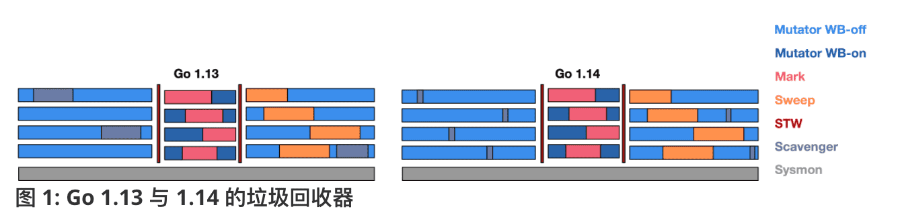
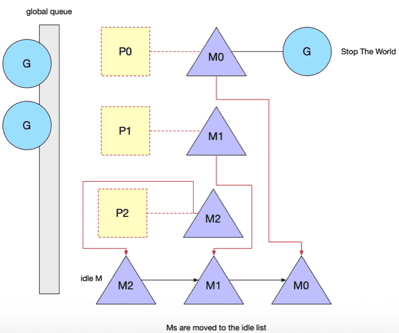

[TOC]


Mutator——赋值器，通常指代用户代码程序。

Collector——回收器，负责内存对象回收。

## 垃圾回收算法

### 引用计数

对每个对象维护一个引用计数，当引用该对象的对象被销毁时，引用计数减1，当引用计数器为0是回收该对象。

对象可以很快的被回收，不会出现内存耗尽或达到某个阀值时才回收。不能很好的处理循环引用，而且实时维护引用计数，有也一定的代价。如PHP就是采用引用计数进行垃圾回收。

### 标记-清除算法（Mark-Sweep）

标记-清扫算法是第一种自动内存管理，基于`追踪的垃圾收集算法`。执行过程可以分成标记（Mark）和清除（Sweep）两个阶段。

- 标记阶段(Mark phase)：从根变量开始遍历所有引用的对象，引用的对象标记为"被引用"，没有被标记的在清楚阶段会被回收。

- 清除阶段(Sweep phase)：遍历堆中的全部对象，回收未被标记的垃圾对象并将回收的内存加入空闲链表；


首先从 root *根对象*开始遍历， 根对象是 mutator 不需要通过其他对象就可以直接访问到的对象，包括全局变量和 goroutine 栈上指向堆的指针。

mark 有两个过程。

- 从 root 开始遍历，标记为灰色。遍历灰色队列。

- re-scan 全局指针和栈。因为 mark 和用户程序是并行的，所以在过程 1 的时候可能会有新的对象分配，这个时候就需要通过写屏障（write barrier）记录下来。re-scan 再完成检查一下。

Stop The World 有两个过程。

1. 第一个是 GC 将要开始的时候，这个时候主要是一些准备工作，比如 enable write barrier。
2. 第二个过程就是上面提到的 re-scan 过程。如果这个时候没有 stw，那么 mark 将无休止。


## Go 垃圾回收

Go 实现的垃圾回收器是无分代（对象没有代际之分）、不整理（回收过程中不对对象进行移动与整理）、并发（与用户代码并发执行）的三色标记清扫算法。

GC的效率对程序的运行速度影响很大，Go 语言为了实现高性能的并发垃圾收集器，使用`三色抽象`、`并发增量回收`、`混合写屏障`、`调步算法`以及用户程序协助等机制将垃圾收集的暂停时间优化至毫秒级以下，从早期的版本看到今天，经历了很多的变化，很多特性也是经过多个版本逐步引入的。虽然 Go 的垃圾回收实现越来越复杂，但其核心目标一直是减少 STW 时间，加快垃圾回收速度，最大限度的降低的应用程序的影响。

Go 内存单元并不会在变成垃圾立刻被回收，而是被标记，直到到达某个阈值或者固定时间长度出发 GC 回收。

标记清扫垃圾回收核心流程是：

- Stop the World
- Mark：通过 Root 和 Root 直接间接访问到的对象， 来寻找所有可达的对象，并进行标记。
- Sweep：对堆对象迭代，已标记的对象置位标记。所有未标记的对象加入 freelist， 可用于再分配。
- Start the Wrold

### 发展


**Go 1.1, 1.3：并行清扫与精准标记**

在 Go 1.3 时候，官方将三色标记清扫算法的垃圾回收代码改为并行，从而缩短了用户代码的停止时间，但是这仍然会造成大量的空隙，如果用户代码是一个 Web 应用，且正在处理一个非常重要的请求，则会对请求延迟造成巨大的影响。


WB —— Writer Barrier

**Go 1.5：并发回收**

为了解决 STW 问题，官方在 Go 1.5 开始使用 Dijkstra 写屏障技术让垃圾回收与用户代码得以并行执行。
从而只有在执行写屏障和很短一段时间内才需要进行 STW。


**Go 1.8, 1.9：混合写屏障**

Go 团队在 1.8 引入混合屏障将 STW 进一步缩短，到这里 Go GC 性能有了很大的提升。


**Go 1.14：页分配器**

Go 1.14，使用全新的页分配器优化内存分配的速度，向操作系统归还内存的操作页完全得到并发。




## GC 的优化之路

GC的效率对程序的运行速度影响很大，Go 语言为了实现高性能的并发垃圾收集器，使用`三色标记`、`并发增量回收`、`混合写屏障`、`调步算法`以及用户程序协助等机制将垃圾收集的暂停时间优化至毫秒级以下(GC 压力不大的情况下 STW 时间还是很短的)。

### 并发收集器

- mark 和 sweep 阶段就多个线程(协程)并发执行的。

- 用户程序 mutator 和 垃圾收集器 collector 可以同时运行，但是还是需要 STW 

后台清扫相对比较容易实现的，因为标记之后，哪些对象是存活，哪些是要被清扫是已知的，清扫的是不再引用的对象。sweep 结束前，这些对象不会再被分配到，所以 sweep 和 mutator 运行共存。无论全局还是栈不可能能访问的到这些对象，可以安全清理。


并发垃圾收集 — 利用多核的计算资源，在用户程序执行时并发标记和清除垃圾；

并发（Concurrent）的垃圾收集不仅能够减少程序的最长暂停时间，还能减少整个垃圾收集阶段的时间，通过开启读写屏障、利用多核优势与用户程序并行执行，并发垃圾收集器确实能够减少垃圾收集对应用程序的影响：

并不是所有阶段都可以垃圾收集器与用户程序一起运行，部分阶段还是需要暂停用户程序的。当然，因为读写屏障的引入，并发的垃圾收集器也一定会带来额外开销。

并发垃圾收集器会在扫描对象之前暂停程序做一些标记对象的准备工作，其中包括启动后台标记的垃圾收集器以及开启写屏障。如果应用程序申请内存的速度超过后台GC的速度，运行时就会让申请内存的用户 goroutine 来`辅助垃圾收集`，在标记和标记终止阶段结束之后就会进入异步的清理阶段，将不用的内存增量回收。

增量和并发的垃圾收集需要提前触发并在内存不足前完成整个循环，避免程序的长时间暂停。


### 三色标记法

三色标记(Tri-color Mark)是对标记清除法的改进，标记清除法在整个执行时要求长时间 STW，Go 从 1.5 版本开始改为三色标记法，初始将所有内存s视为为白色对象，然后将 roots 加入待扫描队列(进入队列即被视为变成灰色)，然后使用并发 goroutine 扫描队列中的指针，如果指针还引用了其他指针，那么被引用的也进入队列，被扫描的对象视为黑色。


象的引用状态标记在 `span` 的 `gcmarkBits`。

三色，对应了垃圾回收过程中对象的三种状态：

- 白色：起初所有对象都是白色，对象未被标记即未被引用，gcmarkBits对应的位为0（该对象将会在本次GC中被清理）
- 灰色：对象还在标记队列中等待
- 黑色：活跃的对象，已被标记象被引用，gcmarkBits对应的位为1（该对象不会在本次GC中被清理）

大至流程：

- 起初所有对象都是白色
- 根据引用关系扫描找出所有可达的对象(第一步主要是扫描根对象), 标记为灰色, 放入待处理队列。 
- 从队列提取灰色对象, 将其引用对象标记为灰色放人队列, 自身标记为黑色。
- 写屏障监视对象内存修改, 重新标色或放回队列。

当完成全部扫描和标记工作后, 对象剩下白色和黑色, 白色代表待回收和黑色活跃对象,清理操作只须将白色对象内存收回即可。

### 三色不变性

为了减少 STW 的时间，实现多个 *Mutator* 与 *Mark* 并发执行，想要在并发或者增量的标记中保证标记正确性，我们需要达成以下两种三色不变性(Tri-color invariant) 中的任意一种。

- 强三色不变性：黑色对象不会指向白色对象，只会指向灰色对象或者黑色对象。
- 弱三色不变性：黑色对象指向的白色对象必须包含一条从灰色对象经由多个白色对象的可达路径。

**对象丢失**，即引用对象被错误回收。

前提说明：黑色代表对象已经被扫描过了，本次标记不会被重复扫描；灰色代表待扫描对象；白色时初始颜色，尚未访问到。

> 条件 1:黑色对象 A 增加了对白色对象 C 的新引用；
>
> 条件 2:灰色对象 B 移除了对白色对象 C 的旧引用；

当条件 1 和 2 同时发生时，上述 C 对象丢失，因为扫描器访问不到 C，C 被当作白色(垃圾)回收。

避免上述问题最简单的方式就是 STW，即在 GC 扫描标记阶段直接禁止用户程序修改引用关系。但是 STW 非常影响程序性能，很多追求实时的应用程序无法接受长时间的 STW，所以历代版本 runtime 如何缩短 STW 的时间就是热点问题了。


**强三色不变性**

黑色对象不能直接指向白色对象，只能指向灰色对象或者黑色对象；

强制性不允许黑色对象引用白色对象。不存在黑色对象引用白色对象的情况了，因为白色会强制变成灰色

**弱三色不变性**

黑色对象指向的白色对象必须包含一条从灰色对象经由多个白色对象的可达路径。所有被黑色对象引用的白色对象都处于灰色保护状态.


### 内存屏障

如果要实现上述三色不变性，最简单的方式就是 STW，但是这会导致程序的停止运行，影响征程服务。

为了满足上述条件，Go 通过`内存屏障`技术来解决。屏障技术就是在并发或者增量标记过程中保证三色不变性的重要技术。

垃圾收集中的屏障技术更像是一个`钩子方法`或者说类似一个`拦截器`，它是在用户程序读取、创建、更新对象指针时执行的一预先设定段代码逻辑。根据操作类型的不同，我们可以将它们分成：

- 读屏障（Read barrier）
- 写屏障（Write barrier）


#### 插入屏障

**Dijkstra插入写屏障**：满足强三色不变，在标记期间，黑色对象上添加新引用对象，新引用对象要标记为灰色。

伪代码如下：

```python
# 灰色赋值器 Dijkstra 插入屏障, 添加下游对象
writePointer(slot, ptr):
    shade(ptr)  # 进行插入(下面的赋值)前，把新引用对象标记为灰色
    *slot = ptr # 当前下游对象 slot = 新下游对象ptr  
```

流程：

- 初始，所有对象都是白色；
- 遍历根对象，放入灰色待处理集合；
- 遍历灰色对象，将所有可达的白色节点标为灰色，已经遍历过的灰色对象，标为黑色。
- 在此期间，如果为黑色对象添加新的对象，需要标记为灰色，放入待处理集合

> Dijkstra插入写屏障，通过比较简单的方式满足了强三色不变性，缺点也很明显:
>
> 因为栈和对上的对象在垃圾收集中都被认为是根对象，对于栈上的根对象，为了保证内存的安全：
>
> - 要么为栈上的对象增加写屏障，这会大幅度增加写入指针的额外开销；
> - 要么在标记阶段完成重新对栈上的对象进行扫描，而这个对栈对象重新扫描需要 STW 操作；
>
> 显然这两种方法各有各的缺点，垃圾收集算法的设计者需要在这两者之前做出权衡。

Dijkstra插入写屏障没有在所有的垃圾收集根对象上开启插入写屏障。因为根对象一般包括全局变量和栈对象，如果运行时需要在几百个 Goroutine 的栈上都开启写屏障，会带来巨大的额外开销，所以 Go 团队在实现上选择了在标记阶段完成时**STW 暂停程序、将所有栈对象标记为灰色并重新扫描**。

#### 删除屏障

**Yuasa删除屏障**：满足弱三色不变，拦截删除操作，具体操作就是：被删除的对象，如果自身为白色，则标记为灰色。*其目的就是保护灰色对象到白色对象的路径不会断。*

伪代码如下：

```python
writePointer(slot, ptr):
    shade(*slot)
    *slot = ptr
```

Yuasa 删除写屏障，一旦该写屏障开始工作，它会保证开启写屏障时堆上所有对象的可达，所以也被称作快照垃圾收集（Snapshot GC）。在老对象的引用被删除时，将白色的老对象涂成灰色，这样删除写屏障就可以保证弱三色不变性，老对象引用的下游对象一定可以被灰色对象引用。

在并标记期间，被删除的对象，如果自身为灰色或者白色，那么被标记为灰色，这样其引入的白色对象依然可以被后续扫描到。这样会导致一个对象即使被删除了依旧可以活过这一轮，在下一轮GC中才被清理掉，降低了回收精度。

Yuasa 删除屏障则需要在GC开始时 STW 扫描堆栈来记录初始快照，这个过程会记录开始时刻的所有存活对象，但结束时无需STW。


#### 混合屏障

**混合屏障（Hybrid write barrier）**：

Dijkstra 插入写屏障在标记开始时无需STW，但根对象没有屏障保护，结束时需要STW来重新扫描栈，标记栈上引用的白色对象的存活。Yuasa删除屏障则需要在GC开始时STW扫描堆栈来记录初始快照，这个过程会记录开始时刻的所有存活对象，但结束时无需STW。

Go1.8 版本引入的混合写屏障结合了Yuasa的删除写屏障和Dijkstra的写入写屏障的优点，避免了标记终止阶段的重扫成本。

混合屏障基本思想是：对正在被覆盖的对象进行着色，且如果当前栈未扫描完成，则同样对指针进行着色。

*混合写屏障满足的是变形的弱三色不变式，允许黑色对象引用白色对象；白色对象处于灰色保护状态，但是只由堆上的灰色对象保护。*

伪代码如下：

```python
HybridWritePointer(slot, ptr):
    shade(*slot)
    if current stack is grey:
        shade(ptr)
    *slot = ptr
```

- GC开始将栈上的对象全部扫描并标记为黑色(STW，开启写屏障，之后不再进行第二次重复扫描)
- GC期间，栈上新建的根对象，均标记为黑色。
- GC期间，被删除的对象标记为灰色。
- GC期间，被添加的对象标记为灰色。

在 Go 1.8 之前，为了减少写屏障的成本，没有启用栈上写操作的写屏障，导致需要在标记结束阶段重新扫描栈上根对象。

*有了混合写屏障之后，就不需要重扫描栈内存了*，在垃圾收集阶段，将所有在堆和栈上新创建的对象标记为黑色，以免新对象被误回收了，这样也就无需再次扫描根对象了。

将被覆盖的对象标记成灰色并在当前栈没有扫描时将新对象也标记成灰色。

## GC 阶段 

|            阶段            | 说明                                                         | 赋值器状态 |
| :------------------------: | :----------------------------------------------------------- | :--------: |
| 清扫终止 sweep termination | STW， 为下一个阶段的并发标记做准备工作，启动写屏障           |    STW     |
|      标记 mark phase       | 解除STW，启用辅助标记，扫描标记对象，                        |  并发标记  |
| 标记终止 mark termination  | STW， 停止写屏障，停止辅助标记，                             |    STW     |
|    内存清扫 sweep phase    | 将需要回收的内存归还到堆中，写屏障处于关闭状态，申请新内存会触发清理 |    并发    |

### 清理终止阶段

**清理终止阶段 sweep termination**：为下一个阶段的并发标记做准备工作，启动写屏障。

​	a. 执行 STW *暂停程序*；

​	b. 如果当前垃圾收集循环是强制触发的，我们还需要处理还未被清理的内存管理单元(spans)；

​	收集根对象，清理上一轮未清扫完的span，启用写屏障和辅助GC，辅助GC将一定量的标记和清扫工作交给用户goroutine来执行。

### 标记阶段

**标记阶段 mark phase**:扫描所有根对象和通过根对象可达的对象，并标记它们

​	a. 将状态切换至 `_GCmark`、开启写屏障、用户程序协助（Mutator Assiste）并将根对象入队；

​	b. 恢复执行程序，标记进程和用于协助的用户程序会开始并发标记内存中的对象，写屏障会将被覆盖的指针和新指针都标记成灰色，而所有新创建的对象都会被直接标记成黑色；

​	c. 开始扫描根对象，包括所有 Goroutine 的栈、全局对象以及不在堆中的运行时数据结构，扫描 Goroutine 栈期间会*暂停当前处理器*, 注意是暂停当前处理器，不是整个程序；

​	d. 依次处理灰色队列中的对象，将对象标记成黑色并将它们指向的对象标记成灰色，这反过来可能会将这些指针添加到工作队列中；

​	e. 由于GC工作分布在本地缓存中，GC使用分布式终止算法来检测是否有其他根标记作业或灰色对象等剩余的工作，发现标记阶段完成后进入标记终止阶段；


**写屏障**

垃圾收集开始时，需要打开写屏障（Write Barrier），这样方便垃圾收集器和应用程序将并发执行。

为了打开写屏障，必须停止每个goroutine。此动作通常非常快，平均在10到30微秒之内完成。暂停所有的 goroutine 的方法是让垃圾收集器观察并等待每个 goroutine 进行函数调用。等待函数调用是为了保证 goroutine 停止时处于安全点。如果某个 goroutine 在一个 for 循环中，没有进行函数调用，在对应的 P 进行函数调用之前，垃圾收集器可能无法启动。在老的 Go 版本中这还会导致调度器无法抢占，这个问题在调度器引入基于信号的抢占之后，得以解决。例如：

```go
func add(numbers []int) int {
    var v int
    for _, n := range numbers {
             v += n
     }
     return v
}
```

goroutine 的运行时间取决于切片 numbers 的大小。这段代码可以阻止垃圾收集器启动。更糟糕的是，当垃圾收集器等待它时，其他P也无法提供服务。所以 goroutine 在合理的时间范围内进行函数调用对于 GC 来说是至关重要的。


原则上垃圾收集器占用的 CPU 资源不会超过 25%，对于一个4 个 P的Go程序，一个P将专门用于垃圾收集工作。

标记阶段需要标记出在堆内存哪些还在使用，哪些不再使用的对象。

- 首先检查所有现 goroutine 的堆栈，以找到堆内存的根指针，扫描 Goroutine 栈期间会暂停当前处理器。
- 然后收集器必须从那些根指针遍历堆内存图，标记可以回收的内存。
- 当标记工作在P1上进行时，应用程序可以在P2，P3和P4上继续进行。

如果 GC 的压力太大，25%的 CPU不够用怎么办？

#### 应用程序辅助标记

如果在后台执行的垃圾收集器不够快，为了保证用户程序分配内存的速度不会超出后台任务的标记速度，运行时还引入了标记辅助技术，即运行时就会让申请内存的应用程序辅助完成垃圾收集的扫描阶段。

**分配多少内存就需要完成多少标记任务**，应用程序 goroutine 成为 Mark Assist（协助标记）中的时间长度与它申请的堆内存大小成正比。Mark Assist有助于更快地完成垃圾收集。

方法 `runtime.gcAssistAlloc()` 用于辅助标记，申请内存时调用的 `runtime.gcAssistAlloc` 类似 *“借债”* 和扫描内存时调用的 `runtime.gcFlushBgCredit` 类似*“还债”*，通过“借债”和“还债”，来实平衡内存申请和回收尽量处于平衡。

`runtime.g` 有一个 `gcAssistBytes` 字段，即每个 Goroutine 持有的 `gcAssistBytes` 表示当前协程辅助标记的字节数，全局垃圾收集控制器持有的 `bgScanCredit` 表示后台协程辅助标记的字节数，当本地 Goroutine 分配了较多的对象时，可以使用公用的信用 `bgScanCredit` 偿还。

```go
func mallocgc(size uintptr, typ *_type, needzero bool) unsafe.Pointer {
	...
	var assistG *g
	if gcBlackenEnabled != 0 {
		assistG = getg()
		if assistG.m.curg != nil {
			assistG = assistG.m.curg
		}
		assistG.gcAssistBytes -= int64(size)

		if assistG.gcAssistBytes < 0 {
			gcAssistAlloc(assistG) // 
		}
	}
	...
	return x
}

func gcAssistAlloc(gp *g) {}
```


垃圾收集器的一个设计目标是减少对 Mark Assists的需求。如果任何本次垃圾回收最终需要大量的Mark Assist才能完成工作，则垃圾收集器会提前开始下一个垃圾收集周期。这样做可以减少下一次垃圾收集所需的Mark Assist。 

在标记阶段，Go 必须确保它标记内存的速度要比进行新分配的速度快。实际上，如果收集器标记4Mb内存，而程序在相同的时间段内分配相同的内存，垃圾收集器将必须在完成后立即触发。

垃圾收集器执行应该小于10ms，不能占用超过 25%的 CPU。否则程序的运行性能会受到明显的影响。

### 标记终止

**标记终止阶段 mark termination**:

- 将状态切换至 `_GCmarktermination` 并关闭辅助标记的用户程序；

- 清理处理器上的线程缓存；停止写屏障

当并发标记阶段完成，会进入标记终止阶段。最终关闭写屏障，执行各种清理任务，并计算下一个垃圾回收周期的目标。

一直处于循环中的 goroutine 也可能导致 STW 延长（类似前面开启写屏障时等待安全点）。在引入混合写屏障之后，在标记结束阶段无需重新对栈进行扫描。

然后调用 `startTheWorldWithSema()` 用于将被 `stopTheWorldWithSema` 暂停的程序恢复。

### 清扫阶段——并发清理

在标记完成后，需要关闭混合写屏障、唤醒所有协助垃圾收集的用户程序、恢复用户 Goroutine 的调度，通过调用 `runtime.gcMarkTermination` 进入标记终止阶段。

**清理阶段 sweep phase**:

​	a. 将状态切换至 `_GCoff` 开始清理阶段，初始化清理状态并关闭写屏障；

​	b. 恢复用户程序，所有新创建的对象会标记成白色；

​	c. 后台并发清理所有的内存管理单元，当 Goroutine 申请新的内存管理单元时就会触发清理；

调用 `runtime.gcSweep` 重置清理阶段的相关状态并在需要时阻塞清理所有的内存管理单元, `_GCmarktermination` 状态在垃圾收集中并不会持续太久，它会迅速转换至 `_GCoff` 并恢复应用程序，到这里垃圾收集的全过程基本上就结束了。

*用户程序在申请内存时才会惰性回收内存*。

清扫过程并不会处理释放的对象内存置为零值。而是在分配重新使用的时候，重新 reset。
在每个 mspan 内有一个 bitmap 的字段 allocBits，他表示上一次 GC 之后每一个 object 的分配情况，1：表示已分配，0：表示未使用或释放。

另外，内部还使用 allocCache 来加速寻找 freeobject。更新内存管理单元的 allocCache 等字段帮助快速分配内存；


```go
//go:notinheap
type mspan struct {
	...
	// freeindex是0到nelems之间的位置索引,标记下一个可用空对象索引位置
	freeindex uintptr
 
	// Cache of the allocBits at freeindex. allocCache is shifted
    // allocCache — allocBits 的补码，可以用于快速查找内存中未被使用的内存；
	allocCache uint64

    // 通过位操作表示每个内存块的分配情况， 1 表示已分配，0表示未分配。
	allocBits  *gcBits
    // 用于标记内存块被引用情况， 1 表示被引用，0 表示未引用。
	gcmarkBits *gcBits

	...
}
```


GC 将会启动去释放不再被使用的内存。在标记期间，GC 会用一个位图 gcmarkBits 来跟踪在使用中的内存，1 使用，0 未使用。正在被使用的内存被标记为黑色，不能够到达的那些内存会保持为白色。

我们可以使用 `gcmarkBits` 精确查看可用于分配的内存。Go 把 `gcmarkBits` 的值付给 `allocBits`，这个操作就是内存清理，即经过GC标记之后allocBits 上哪些内存被用了，哪些没被引用。


#### 清理内存策略

然而必须每个 *span* 都来一次类似的处理，需要耗费大量时间。*Go* 的目标是在清理内存时不阻碍执行，并为此提供了两种策略。

1、在后台启动一个 worker 等待清理内存，一个一个 mspan 处理。当开始运行程序时，Go 将设置一个后台运行的 Worker(唯一的任务就是去清理内存)。

```go
// The main goroutine.
func main() {
    ...
    gcenable()
    ...
}

func gcenable() {
	// Kick off sweeping and scavenging.
	c := make(chan int, 2)
	go bgsweep(c)
	go bgscavenge(c)
	<-c
	<-c
	memstats.enablegc = true // now that runtime is initialized, GC is okay
}
```


由于后台只有一个 worker 在清理内存块，清理过程可能会花费一些时间，如果没有清理完成，再下一个GC开始前，也就是*标记清理阶段*会继续执行清理。


2、当申请分配内存时候 lazy 触发。

当应用程序 goroutine 尝试在堆内存中分配新内存时，会触发该操作。

这种方式是即时执行。由于这些内存段已经被分发到每一个处理器 P 的本地缓存 mcache 中，因此很难追踪首先清理哪些内存。这就是为什么 Go 首先将所有内存段移动到 mcentral 的原因。然后，它将会让本地缓存 mcache 再次请求它们，去即时清理。

lazy清理导致的延迟和吞吐量降低被分散到每次内存分配时。


## GC触发时机

GC 触发太早会过多浪费CPU资源，太晚可能会导致堆内存占用过高。

**堆内存阈值 gcTriggerHeap**

Go 语言运行时的默认配置会在堆内存达到上一次垃圾收集的 2 倍时，触发新一轮的垃圾收集，这个行为可以通过环境变量 `GOGC` 调整，在默认情况下它的值为 100，即增长 100% 的堆内存才会触发 GC。

出于性能原因，并且为了避免不断地启动一个循环，如果堆大小小于4MB * GOGC，垃圾收集器将不会被触发——当GOGC设置为100%时，低于4MB将不会触发。


**后台定时触发 gcTriggerTime**

在一定时间内没有触发，就会触发新的循环，该出发条件由 `forcegcperiod` 控制，到 go 1.15 为 2 分钟。

垃圾收集器监视的第二个指标是两个垃圾收集器之间的延迟。如果它没有被触发超过两分钟，将强制一个周期。


**手动触发 gcTriggerCycle**

通过 runtime.GC 手动出发，触发类型 gcTriggerCycle。


## STW(Stop The World)

STW(Stop The World) 即暂停整个程序来进行GC。

*为什么一定要 STW ？*

因为在标记阶段需要对对应的引用情况进行标记，回收没有被引用的对象，如果标记的时候，程序同时修改引用关系，就会造成标记不准确，如果错误回收了正在使用的内存对象，必然导致程序异常。

1.3 以前的版中，整个标记清扫过程都需要 STW，如果 GC 压力很大，STW 暂停的时间甚至可以达到秒级，这是大部分程序都无法忍受的。

1.5 版本在标记过程中使用三色标记法。标记和清扫都并发执行的，但标记阶段的前后需要两次 STW 来做 GC 的准备工作和栈的 re-scan。

- 开始阶段需要扫描栈和堆上的根对象，为了标记的精确需要 STW，
- 标记结尾，还会对栈对象进行重新扫描。


哪些阶段会 STW。

- 开启写屏障这个必须要 STW
- 扫描根对象时
- 标记终止阶段，停止写屏障


这个阶段的第一步， 又 P0 抢占所有正在运行的 goroutine，被抢占之后这些 goroutine 会被悬停在一个相对安全的状态，常见的为函数调用时触发。暂停所有的 goroutine 的方法是让垃圾收集器观察并等待每个 goroutine 进行函数调用。等待函数调用是为了保证 goroutine 停止时处于安全点。

处理器 P (无论是正在运行代码的处理器还是已在 idle 列表中的处理器) 都会被被标记成停止状态 (stopped)， 不再运行任何代码。调度器把每个处P 的 M  从各自对应的处理器 P 分离出来， 放到 idle 列表中去。

Goroutine 会被放到一个全局队列中等待。




## GC trace

使用环境变量 `GODEBUG` 可以控制运行时的调试变量，格式为：`name=val`。

gctrace = 1选项生成GC trace。每次发生垃圾收集时，运行时都会将GC trace信息写入stderr。可以观察 GC 时间占比，Gc 回收内存大小，下次出发GC 的堆阈值，使用处理数量等信息。

> gc # @#s #%: #+#+# ms clock, #+#/#/#+# ms cpu, #->#-># MB, # MB goal, # P

```
格式： gc # @#s #%: #+#+# ms clock, #+#/#/#+# ms cpu, #->#-># MB, # MB goal, # P

gc #        GC序号，在每次GC时递增
@#s         程序运行到目前的秒数
#%          自程序启动花费在GC上的时间百分比
#+...+#     wall-clock/CPU times for the phases of the GC 阶段标记CPU 世间占比
#->#-># MB  GC开始堆大小，结束堆大小，剩余活跃堆内存大小
# MB goal   下一次出发 GC 堆阈值
# P         当前使用处理器数量
```

以代码为例：

```go
func main() {
	x := make([]int64, 0)
	for i := 0; i < 20000; i++ {
		x = append(x, int64(i))
		time.Sleep(time.Microsecond * 10)
	}
}
```

运行 `GODEBUG=gctrace=1 go run main.go`

```
gc 1 @0.003s 10%: 0.042+3.7+0.020 ms clock, 0.16+0.39/2.3/5.3+0.083 ms cpu, 4->6->5 MB, 5 MB goal, 4 P
gc 2 @0.014s 6%: 0.007+1.7+0.013 ms clock, 0.030+0/1.2/2.3+0.055 ms cpu, 8->9->7 MB, 10 MB goal, 4 P
gc 3 @0.033s 4%: 0.020+2.2+0.016 ms clock, 0.083+0.50/1.9/0.90+0.064 ms cpu, 12->13->8 MB, 14 MB goal, 4 P
gc 4 @0.050s 5%: 0.021+3.6+0.012 ms clock, 0.087+0.98/3.5/1.3+0.050 ms cpu, 16->16->10 MB, 17 MB goal, 4 P
gc 5 @0.099s 4%: 0.24+4.0+0.017 ms clock, 0.97+0.53/3.7/2.3+0.070 ms cpu, 19->19->12 MB, 20 MB goal, 4 P
gc 6 @0.128s 4%: 0.039+6.9+0.024 ms clock, 0.15+0/6.5/8.6+0.096 ms cpu, 23->24->14 MB, 24 MB goal, 4 P
```

以gc 6 为例：

> gc 6 @0.128s 4%: 0.039+6.9+0.024 ms clock, 0.15+0/6.5/8.6+0.096 ms cpu, 23->24->14 MB, 24 MB goal, 4 P

`gc 6 @0.128s 4%` 依次表示： gc 6 --- 目前程序运行0.128s----目前花在GC上时间共占4%

`0.039+6.9+0.024 ms clock`  依次表示：本次GC标记前STW 时间 0.039ms，并发标记6.9ms，标记终止关闭写屏障和清理STW 时间为 0.024ms

```
0.039ms     : STW        : Mark Start       - Write Barrier on  本次GC标记前STW 时间
6.9ms       : Concurrent : Marking   并发标记6.9ms
0.024ms     : STW        : Mark Termination - Write Barrier off and clean up 标记终止关闭写屏障和清理STW 时间为 0.024ms
```

`0.15+0/6.5/8.6+0.096 ms cpu` ：CPU 时间，

```
0.15ms      : STW        : Mark Start  标记开始
0ms         : Concurrent : Mark - Assist Time (GC performed in line with allocation) 辅助标记
6.5ms       : Concurrent : Mark - Background GC time		后台并发标记
8.6ms       : Concurrent : Mark - Idle GC time				空闲GC 时间 ？
0.096ms     : STW        : Mark Term						标记结束 STW 时间
```

`23->24->14 MB, 24 MB goal` 堆内存信息

```
23MB        : Heap memory in-use before the Marking started
24MB        : Heap memory in-use after the Marking finished
14MB        : Heap memory marked as live after the Marking finished
24MB        : Collection goal for heap memory in-use after Marking finished
```

**gcpacertrace**

GODEBUG=gctrace=1,gcpacertrace=1 go run main.go

GODEBUG=gcpacertrace=1 go run main.go


## 其他

内存回收操作不是盯着单个对象, 而是以span为基本单位。通过比对 bitmap 里的扫描标记, 逐步将 object 收归原span, 最终上交 central或 heap 复用。

遍历span, 将收集到的不可达 object 合并到 freelist链表。如该span已收回全部object、那么就将这块完全自由的内存还给 central, 以便后续复用。

- 大对象:整个span就是个 object, 直接交还heap
- 无论是向操作系统申请内存, 还是清理回收内存, 只要往heap里放span, 都会尝试合并左右相邻的闲置span, 以构成更大的自由块
- Go GC 应该算是 Go runtime 中改进最为频繁的部分之一了，很主要的目的就是在不断缩短 STW 时间。
- GoGC 的基本特征是“非分代、非紧缩、写屏障、并发标记清理”
- 某些时候, 对象分配速度可能远快于后台标记。这会引发一系列恶果, 比如堆恶性扩张, 甚至让垃圾回收永远无法完成。


### 增量收集器

增量垃圾收集 — 增量地标记和清除垃圾，降低应用程序暂停的最长时间；

增量式（Incremental）的垃圾收集是减少程序最长暂停时间的一种方案，它可以将原本时间较长的暂停时间切分成多个更小的 GC 时间片，虽然从垃圾收集开始到结束的时间更长了，但是这也减少了应用程序暂停的最大时间：

需要注意的是，增量式的垃圾收集需要与三色标记法一起使用，为了保证垃圾收集的正确性，我们需要在垃圾收集开始前打开写屏障，这样用户程序对内存的修改都会先经过写屏障的处理，保证了堆内存中对象关系的强三色不变性或者弱三色不变性。

虽然增量式的垃圾收集能够减少最大的程序暂停时间，但是会增加一次 GC 循环的总时间，在垃圾收集期间，因为写屏障的影响用户程序也需要承担额外的计算开销，所以增量式的垃圾收集也不是只有优点的。


### 调步算法——最佳触发时机

过早的触发 GC 会浪费 CPU资源，过晚的触发 GC，会导致堆内存占用过多。

**垃圾收集协调机制**，Go 语言 v1.5 引入并发垃圾收集器的同时使用垃圾收集调步（Pacing）算法计算触发的*垃圾收集的最佳时间*，确保触发的时间既不会浪费计算资源，也不会超出预期的堆大小。

优化堆的增长速度和垃圾收集器的 CPU 利用率

该算法用于确定何时开始垃圾收集。该算法依赖于运行中的应用程序的信息以及应用程序分配内存的压力。压力即应用程序在给定时间内分配堆内存的速度。正是压力决定了垃圾回收器的速度。

在垃圾收集器开始收集之前，它会计算预期完成垃圾收集的时间。一旦垃圾收集器开始运行，会影响正在运行的应用程序，造成延迟，拖慢用程序。


可以将GC百分比值更改为大于100的值。这将增加在下一次收集启动之前可以分配的堆内存量。也导致垃圾收集时间更长。

降低GC频率并非提高性能的有效方法。降低频率会导致垃圾收集器在收集期间完成更多的工作。

### GC 延迟

GC 延迟主要有两种类型的原因。

1.STW 延迟，随着 Go GC 的不断优化 STW 是时间已经，减少了很多。但是

- 在标记终止阶段，即开始标记阶段前，需要暂停程序，即 STW。
- 在标记阶段，扫描 Goroutine 栈根对象时，需要暂停当前处理。

正常 STW 应该在毫秒级或以下，如果 GC 压力很大的话，会 STW 时长增加，频次也会增加。所以如何更高效的使用内存，减少 GC 压力对于写出一个高性能的程序只管重要。


2.垃圾标记和清扫占用 CPU 资源。应用程序 Goroutine 与垃圾收集器的Goroutine 共享P或完成Mark Assist。

例如，在一台 4 核的物理机上，那么GC开始后，收集器会占用 25% 计算资源在后台来扫描并标记内存中的对象。此外其他用户 Goroutine 可能参与辅助标记，又会占用额外的 CPU 资源。


## 问题及思考​ 

**根对象，指的什么？**

- 根对象，又叫做根集合，是不需要其他对象就可以访问到的对象，在标记过程时最先检查。
- 全局变量：程序在编译期就能确定的那些存在于程序整个生命周期的变量。
- 每个 goroutine 的栈，这栈的变量有指向堆内存的对象。
- 寄存器：寄存器的值可能表示一个指针，参与计算的这些指针可能指向某些赋值器分配的堆内存区块。

**哪写阶段需要暂停程序或处理器，为何要暂停**

- 在标记开始阶段开启写屏障，扫描根对象时需要 STW；
- 在标记终止阶段，停止写屏障，停止辅助标记；

**强三色不变性，弱三色不变性**

- 强制黑色对象，不可以指向白色对象
- 弱三色不变性，黑色对象可以指向白色对象了，但是白色对象必须有一条灰色对象到达它的引用路径

**三色不变性，主要用在什么场景，为了解决什么问题？**

- 为了时间程序和垃圾标记同时运行，而不影响标记的准确性，即在标记过程中，如果要能运行应用程序，修改引用关系应该遵循三色不变性

**三色不变性通过什么手段年实现？**

- 主要通过屏障技术实现，写屏障，删除屏障，混合屏障。核心目标是尽可能的让用户程序与GC标记同时运行，又不影响标记的准确性（删除屏障还是有点精度不够问题）。
- 通过屏障技术，核心的思想是保护灰色对象到白色对象的路径不断。

**插入屏障，删除屏障，混合屏障**

- 插入写屏障，满足强三色不变性，在标记开始时无需 STW，可直并发进行，但结束时需要 STW 来重新扫描栈，标记栈上引用的白色对象的存活。
- 删除写屏障，满足弱三色不变性，保护灰色到白色的路径不中断，删除写屏障则需要在 GC 开始时 STW 扫描堆栈来记录初始快照，这个过程会保护开始时刻的所有存活对象，但结束时无需 STW。
- 插入写屏障在标记开始时无需STW，但根对象没有屏障保护，结束时需要STW来重新扫描栈，标记栈上引用的白色对象的存活。删除屏障则需要在GC开始时STW扫描堆栈来记录初始快照，这个过程会记录开始时刻的所有存活对象，但结束时无需STW。混合写屏障，结合了两者的有点。

- 混合写屏障满足的是变形的弱三色不变式，允许黑色对象引用白色对象；白色对象处于灰色保护状态，但是只由堆上的灰色对象保护。
- 通过混合写屏障，解决了之前 GC 标记结束阶段要重新扫描栈的问题。

**为何Yuasa删除写屏障在开始阶段需要STW，而Dijkstra插入写屏障开始不需要STW？**

- Yuasa 删除写屏障也叫快照垃圾收集（Snapshot GC），在开开始阶段需要 STW 来扫描记录堆和栈的初始快照，来获取灰色到白色对象的路径，后续的删除写屏障是基于这些路径的，即删除老对象时，通过置灰来维持灰色到白色对象的路劲不会断。

- Dijkstra插入写屏障保证的是插入对象时被置灰，以满足强三色不变性——黑色对象不直接指向白色对象，所以可以直接开始，而无需 STW，但是由于性能的原因，栈上没有实现，而是选择再标记结束阶段 STW 并重新扫描栈对象。（话说直接把栈上的标记为黑色不就行了吗，是的，混合屏障就是这么干的）

**为什么说Yuasa删除写屏障损失了一定的回收精度？**

- 因为在删除对象时，要把该对象标记为灰色，这样原本是白色（要回收的）会再次被置为灰色，这样就需要到下一轮才能被再次标为白色。
- 即导致部分白色对象要延迟一轮才能被回收。

**为什么说不停for循环可能会影响性能？**

- 在 STW 时，必须停止每个 goroutine，此动作通常非常快，平均在10到30微秒之内完成。暂停所有的 goroutine 的方法是让垃圾收集器观察并等待每个 goroutine 进行函数调用。等待函数调用是为了保证 goroutine 停止时处于安全点。如果某个 goroutine 在一个 for 循环中，没有进行函数调用，在对应的 P 进行函数调用之前，垃圾收集器可能无法启动 (总不能for循环指令一般给停了吧，这可能导致程序执行异常)。在老的 Go 版本中这还会导致调度器无法抢占，这个问题在调度器引入基于信号的抢占之后，得以解决。

- 此外，在GC等待安全暂停点的同时。其他P也无法提供服务。所以 goroutine 在合理的时间范围内进行函数调用对于 GC 来说是至关重要的。

**为什么开始阶段需要 STW， 为什么没法去除？**

- 初始化 GC 任务时，包括开启写屏障(write barrier)和开启辅助 GC(mutator assist)，统计 root 对象的任务数量等，为了标记的准确性，需要 STW 。

- 通过屏障技术和三色不变性已经可以大大减少 STW 的时间，实现了 mutator 和 collector 的并发运行了，但是在栈上加屏障代价太大，会大大降低程序的性能，原本一两条指令就可以搞定的事情需要几十条指令，相比之下还不如直接 STW。

**哪些时机会触发 GC ？**

- 堆内存阈值 gcTriggerHeap， 默认是内存增长一倍触发

- sysmon 定时触发 gcTriggerTime， 如果超过两分钟没触发，会触发
- 手动触发 gcTriggerCycle，通过 runtime.GC() 手动出发

**解释下，辅助 GC(mutator assist)，什么情况下会发生？**

- 通常当申请内存的速度快过GC的速度时会发生辅助标记，此时一个 G 如果要申请内存，会触发这个 G 辅助标记，即谁申请，谁辅助标记，并且辅助标记的字节和时间长度与申请的内存大小成正比。

- 每个 G 有一个 `gcAssistBytes` 字段，即每个 Goroutine 持有的 `gcAssistBytes` 表示当前协程辅助标记的字节数。就像借钱和还钱一样，实现收支平衡。

**为什么在标记结束阶段需要 rescan 栈？**

- 通过三色标记和屏障技术，基本上实现了 Mutator 和 collector 同时运行，对内存可以使用读写屏障更新标记期间的引用关系变更，但是栈上加屏障开销太大，所以采用了结束时在重新扫描一次的方式，代替在栈上加屏障保护。
- 并且这段时间还是需要 STW。

**为什么有了混合写屏障，在标记结束时，就不需要重扫描栈内存了？**

- 在垃圾标记阶段，将所有在堆和栈上新创建的对象标记为黑色，以免新对象被误回收了，这样也就无需再次扫描根对象了。

**GC所占的CPU资源一般不超过25%，如果GC压力太大，会怎样？**

- 默认情况下 GC 会控制CPU的占用不超过 25%，但是如果 GC 压力很大，还是会有更多的资源参与进来的。
- 用户 goroutine 在申请内存时会参与辅助标记，切申请的越多内存，参与的辅助标记越多。
- 如果 GC 过于忙碌，会在可能会在一轮结束就触发新一轮 GC。


**如何观察 Go GC？**

- GODEBUG=gctrace=1 打印出日志信息
- go tool trace 可以图形化观测

- 通过方法 debug.ReadGCStats()
- 直接打印 runtime.MemStats 对象信息


**有了 GC，为什么还会发生内存泄露？**

在 Go 中，由于 goroutine 的存在，所谓的内存泄漏除了附着在长期对象上之外，还存在多种不同的形式。

- 预期能被快速释放的内存因被根对象引用而没有得到迅速释放
- goroutine 泄漏，比较常见，例如持续不断地产生新的 goroutine，而没有管控好 goroutine 的声明周期


**其他**

- 分代式 GC ？

    

## 参考及推荐阅读

https://golang.org/src/runtime/mgc.go

https://draveness.me/golang/docs/part3-runtime/ch07-memory/golang-garbage-collector/

https://medium.com/a-journey-with-go/go-how-does-the-garbage-collector-watch-your-application-dbef99be2c35

https://blog.golang.org/ismmkeynote

https://www.ardanlabs.com/blog/2018/12/garbage-collection-in-go-part1-semantics.html

https://spin.atomicobject.com/2014/09/03/visualizing-garbage-collection-algorithms/

https://zhuanlan.zhihu.com/p/77943973


https://qcrao91.gitbook.io/go/gc/gc#13-gc-guan-zhu-de-zhi-biao-you-na-xie

https://www.ardanlabs.com/blog/2018/12/garbage-collection-in-go-part1-semantics.html

https://engineering.linecorp.com/en/blog/go-gc/

https://github.com/changkun/Go-Questions/blob/master/GC/GC.md

https://www.bookstack.cn/read/qcrao-Go-Questions/spilt.14.GC-GC.md

https://github.com/golang-design/under-the-hood