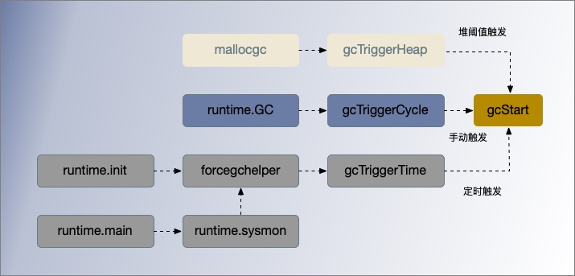

# GC 标记准备阶段

[TOC]


## 说明

```
基于 Go 1.15
GC 核心代码文件 
	runtime/mgc.go
	runtime/mgcmark.go
	runtime/mgcwork.go
```


常见的状态迁移方法包括以下几个

```


runtime.sysmon 和 runtime.forcegchelper — 后台运行定时检查和垃圾收集；
runtime.GC — 用户程序手动触发垃圾收集；
runtime.mallocgc — 申请内存时根据堆大小触发垃圾收集；
```

## gcinit() GC初始化入口

```go
func schedinit() {
 	...
    gcinit()
}

func gcinit() {
	if unsafe.Sizeof(workbuf{}) != _WorkbufSize {
		throw("size of Workbuf is suboptimal")
	}

	// No sweep on the first cycle.
	mheap_.sweepdone = 1

	// Set a reasonable initial GC trigger.
	memstats.triggerRatio = 7 / 8.0

	// Fake a heap_marked value so it looks like a trigger at
	// heapminimum is the appropriate growth from heap_marked.
	// This will go into computing the initial GC goal.
	memstats.heap_marked = uint64(float64(heapminimum) / (1 + memstats.triggerRatio))

    // 设置 GOGC，用于计算出发GC 的CPU 阈值
	_ = setGCPercent(readgogc())

	work.startSema = 1
	work.markDoneSema = 1
	lockInit(&work.sweepWaiters.lock, lockRankSweepWaiters)
	lockInit(&work.assistQueue.lock, lockRankAssistQueue)
	lockInit(&work.wbufSpans.lock, lockRankWbufSpans)
}
```


## gcStart() 准备并开启GC状态



启动垃圾收集都会调用 `runtime.gcStart()`，它的主要职责就是把全局的垃圾收集状态`runtime.gcphase`从`_GCOff`修改为 `_GCmark` 并做一些准备工作：

1.在开启新一轮标记之前，在循环中不断调用 `runtime.sweepone` 清理已经被标记的内存单元，完成上一个垃圾收集循环的收尾工作。检查是否满足垃圾收集条件；

2.调用 `gcBgMarkStartWorkers()` 开启为每个处理开启后台标记进程;

3.使用 `systemstack(stopTheWorldWithSema)` 暂停程序，在**STW**期间做了哪些事情：

- 调用  `finishsweep_m()`, 在开启新一轮标记之前，循环调用`sweepone()`先完成上一轮剩余的内存单元清理工作。
- 调用 `clearpools()` , 在我们开始GC之前清除池。如果我们等待，它们的内存直到下一个GC周期才会被回收。 ??
- 调用 `gcController.startCycle()` 重置 GC 控制器的状态，计算 GC 的生命周期各项指标；
- 调用 `setGCPhase(_GCmark)` 修改GC 状态从 `_GCOff` 修改为 `_GCmark`；	
- 调用 `gcBgMarkPrepare()` 函数初始化后台扫描需要的状态, 这个必须在启用 Mutator assists 辅助标记前执行；
- 调用 `gcMarkRootPrepare()` 函数扫描栈上、全局变量等根对象并将它们加入队列；
- 调用  `gcMarkTinyAllocs()` 将 mcache 中活跃的tiny 对象标为灰色；
- 设置全局变量 `gcBlackenEnabled`为 1，这样用户程序和后台标记任务可以将对象涂黑；所有 P 都启用了写屏障，可以启用用户程序辅助标记来并发收集垃圾，有助于缓解mutator施加内存分配压力。

3.调用 `startTheWorldWithSema` 恢复重启程序；


```go
// `runtime.gcphase`从`_GCmark`修改为 `_GCmark` 
// 接收 runtime.gcTrigger 作为出发 GC的类型，可以根据这个触发 _GCoff 退出的结构体找到所有触发的垃圾收集的代码
func gcStart(trigger gcTrigger) {
	// Since this is called from malloc and malloc is called in
	// the guts of a number of libraries that might be holding
	// locks, don't attempt to start GC in non-preemptible or
	// potentially unstable situations.
	mp := acquirem()
	if gp := getg(); gp == mp.g0 || mp.locks > 1 || mp.preemptoff != "" {
		releasem(mp)
		return
	}
	releasem(mp)
	mp = nil

    // 完成上一个垃圾收集循环的收尾工作，理已经被标记的内存单元 span
	// 不应该在后台模式下被调用，因为部分扫描应该刚刚完成扫描？
	//但是舍入错误等，可能会留下一些 span 未清扫。在强制模式下，这是必要的，因为GC可以在清扫周期的任何时候强制执行。
	//我们在这里持续地检查变迁条件，以防这个G被延迟到下一个GC周期。
    // 在循环中不断调用 runtime.sweepone 清理已经被标记的内存单元，完成上一个垃圾收集循环的收尾工作
	for trigger.test() && sweepone() != ^uintptr(0) {
		sweep.nbgsweep++
	}

    // 执行 GC 初始化和清扫终止变迁
	semacquire(&work.startSema) 
	// 再次检查是否满足启动GC条件
	if !trigger.test() {
		semrelease(&work.startSema)
		return
	}

	work.userForced = trigger.kind == gcTriggerCycle //  判断是否用户强制触发GC


	mode := gcBackgroundMode  // 后台并发标记模式
	if debug.gcstoptheworld == 1 {  // 从环境变量 GODEBUG 获取 gcstoptheworld 参数设置
		mode = gcForceMode   // stop-the-world GC now, concurrent sweep
	} else if debug.gcstoptheworld == 2 {
		mode = gcForceBlockMode // stop-the-world GC now and STW sweep (forced by user)
	}

	// Ok, we're doing it! Stop everybody else
	semacquire(&gcsema)
	semacquire(&worldsema) // 通过 semacquire 获取全局的 worldsema 信号量

	if trace.enabled {
		traceGCStart()
	}

	// Check that all Ps have finished deferred mcache flushes.
	for _, p := range allp {
        // flushGen 指示最后一次刷新mcache的扫描期间。
        // 如果flushGen != mheap.sweepgen，这个mcache的 spans 已经陈旧了，需要冲洗一下才能清扫。
		if fg := atomic.Load(&p.mcache.flushGen); fg != mheap_.sweepgen {
			println("runtime: p", p.id, "flushGen", fg, "!= sweepgen", mheap_.sweepgen)
			throw("p mcache not flushed")
		}
	}

	gcBgMarkStartWorkers()  // 后台启动用于处理标记任务的工作 Goroutine 与处理器绑定，并休眠等待唤醒

	systemstack(gcResetMarkState) // gcResetMarkState 重置标记前的全局状态(并发或STW)，并重置所有G的栈扫描状态。

	work.stwprocs, work.maxprocs = gomaxprocs, gomaxprocs
	if work.stwprocs > ncpu {
		// This is used to compute CPU time of the STW phases,
		// so it can't be more than ncpu, even if GOMAXPROCS is.
		work.stwprocs = ncpu
	}
	work.heap0 = atomic.Load64(&memstats.heap_live)
	work.pauseNS = 0
	work.mode = mode

	now := nanotime()
	work.tSweepTerm = now
	work.pauseStart = now
	if trace.enabled {
		traceGCSTWStart(1)
	}
	systemstack(stopTheWorldWithSema)  // STOP THE WORLD
	// 在开启新一轮标记之前，先完成之前的清理工作
	systemstack(func() {
		finishsweep_m() // 在 STW 条件下执行清理任务，确保没有未清理的
	})

	// clearpools before we start the GC. If we wait they memory will not be
	// reclaimed until the next GC cycle.
    // 在我们开始GC之前清除池。如果我们等待，它们的内存直到下一个GC周期才会被回收。
	clearpools()

	work.cycles++

	gcController.startCycle()
	work.heapGoal = memstats.next_gc

	// In STW mode, disable scheduling of user Gs. This may also
	// disable scheduling of this goroutine, so it may block as
	// soon as we start the world again.
	if mode != gcBackgroundMode {
		schedEnableUser(false)
	}

	// 进入并发标记阶段，开启写屏障
	// 因为程序处于STW，所有P将观察到写屏障被启用时，我们开始世界和开始扫描。
	// 必须在启用辅助程序之前启用写屏障，因为必须在标记任何非叶子堆对象之前启用它们。
    // 由于分配会被阻塞，直到有辅助标记才会发生，所以我们希望尽早启用帮助
    // 修改全局的垃圾收集状态为 _GCmark 
	setGCPhase(_GCmark) // 
    // 初始化后台扫描需要的状态
	gcBgMarkPrepare() 	// Must happen before assist enable.
	gcMarkRootPrepare() // 扫描栈上、全局变量等根对象并将它们加入队列

	// 标记所有活跃的tinyalloc块。因为我们从这些分配中分配，它们需要像其他分配一样是黑色的。
    // 另一种方法是使来自它的每个分配中的小块变黑，这将减慢小分配器的速度。
	gcMarkTinyAllocs() // 将所有处理器的 mcache 中活跃的tiny 对象标为灰色，必须处于 STW

    // 以启动写屏障
    // 垃圾收集处于标记阶段时，gcBlackenEnabled被置为 1，辅助垃圾收集的用户程序和后台标记的任务可以将对象涂黑
	atomic.Store(&gcBlackenEnabled, 1) 

	// Assists and workers can start the moment we start
	// the world.
	gcController.markStartTime = now

	// In STW mode, we could block the instant systemstack
	// returns, so make sure we're not preemptible.
	mp = acquirem()

	// Concurrent mark.
	systemstack(func() {
		now = startTheWorldWithSema(trace.enabled)
		work.pauseNS += now - work.pauseStart
		work.tMark = now
	})

	// Release the world sema before Gosched() in STW mode
	// because we will need to reacquire it later but before
	// this goroutine becomes runnable again, and we could
	// self-deadlock otherwise.
	semrelease(&worldsema)
	releasem(mp)

	// Make sure we block instead of returning to user code
	// in STW mode.
	if mode != gcBackgroundMode {
		Gosched()
	}

	semrelease(&work.startSema)
}
```


通过 `semacquire` 获取全局的 `worldsema` 信号量

   

## sysmon()

在运行时入口函数 mainmain里,会专门启动一个监控任务 sysmon,它每隔一段时间就会检查heap里的闲置内存块


```go
// The main goroutine.
// runtime.main()
func main() {
    ...
    if GOARCH != "wasm" { // no threads on wasm yet, so no sysmon
		systemstack(func() {
			newm(sysmon, nil, -1)
		})
	}
    ...
    
}

// Always runs without a P, so write barriers are not allowed.
//
//go:nowritebarrierrec
func sysmon() {
    ...
    // check if we need to force a GC
    if t := (gcTrigger{kind: gcTriggerTime, now: now}); t.test() && atomic.Load(&forcegc.idle) != 0 {
        lock(&forcegc.lock)
        forcegc.idle = 0
        var list gList
        list.push(forcegc.g)
        injectglist(&list)
        unlock(&forcegc.lock)
    }
    ...
}
```


## STW

### stopTheWorldWithSema()


```go
var worldsema uint32 = 1 // 持有worldsema让M试图阻止世界的权利。

func stopTheWorldWithSema() {
   _g_ := getg()

   // If we hold a lock, then we won't be able to stop another M
   // that is blocked trying to acquire the lock.
   if _g_.m.locks > 0 {
      throw("stopTheWorld: holding locks")
   }

   lock(&sched.lock)
   sched.stopwait = gomaxprocs  //程序中活跃的最大处理数 gomaxprocs
   atomic.Store(&sched.gcwaiting, 1)
   preemptall()
   // stop current P
   _g_.m.p.ptr().status = _Pgcstop // Pgcstop is only diagnostic.
   sched.stopwait--
   // try to retake all P's in Psyscall status
   for _, p := range allp {
      s := p.status
      if s == _Psyscall && atomic.Cas(&p.status, s, _Pgcstop) {
         if trace.enabled {
            traceGoSysBlock(p)
            traceProcStop(p)
         }
         p.syscalltick++
         sched.stopwait-- // 每停止一个处理器，就减1，直到所有处理器都停止
      }
   }
   // stop idle P's
   for {
      p := pidleget()
      if p == nil {
         break
      }
      p.status = _Pgcstop
      sched.stopwait--
   }
   wait := sched.stopwait > 0
   unlock(&sched.lock)

    // 等待已经在运行的 P 停止。
   if wait {
      for {
         // wait for 100us, then try to re-preempt in case of any races
         if notetsleep(&sched.stopnote, 100*1000) {
            noteclear(&sched.stopnote)
            break
         }
         preemptall() // 暂停程序主要使用了 preemptall 函数
      }
   }

   // sanity checks
   bad := ""
   if sched.stopwait != 0 {
      bad = "stopTheWorld: not stopped (stopwait != 0)"
   } else {
      for _, p := range allp {
         if p.status != _Pgcstop {
            bad = "stopTheWorld: not stopped (status != _Pgcstop)"
         }
      }
   }
   if atomic.Load(&freezing) != 0 {
      // Some other thread is panicking. This can cause the
      // sanity checks above to fail if the panic happens in
      // the signal handler on a stopped thread. Either way,
      // we should halt this thread.
      lock(&deadlock)
      lock(&deadlock)
   }
   if bad != "" {
      throw(bad)
   }
}

// 暂停程序会使用 runtime.preemptall 抢占所有的处理器。通知其他 goroutines 停止。
// 如果处理器刚开始运行goroutine，它可能无法通知goroutine。
// 不需要持有锁。
// 如果向至少一个goroutine发出抢占请求，返回true。
func preemptall() bool {
	res := false
	for _, _p_ := range allp { // 遍历每个 P 
		if _p_.status != _Prunning {
			continue
		}
		if preemptone(_p_) {  // 调用 preemptone 通知正在处理器P上运行的 goroutine 停止。
			res = true
		}
	}
	return res
}
```

`runtime.stopTheWorldWithSema` 会依次停止当前处理器，处理器的状态会被更新为 `_Pgcstop`。

`runtime.stopTheWorldWithSema` 暂停程序主要使用了 `runtime.preemptall` 函数。`runtime.preemptall` 遍历每个 P ，在通过 `runtime.preemptone` 遍历停止每个 P 上在运行的 G。

`startTheWorldWithSema` 通常需要和 `stopTheWorldWithSema` 成对使用。


`stopTheWorldWithSema` 是 STW 的核心实现。调用者先获取 `worldsema`, 然后在系统栈上运行

```go
semacquire(&worldsema, 0)
m.preemptoff = "reason"
systemstack(stopTheWorldWithSema)
```

当调用结束时，调用者必须分别调用startTheWorld或撤销这三个操作:

```go
m.preemptoff = ""
systemstack(startTheWorldWithSema)
semrelease(&worldsema)
```

允许获取 `worldsema` 一次，然后执行多个 `startTheWorldWithSema/stopTheWorldWithSema` 对。其他的P能够在连续调用. `startTheWorldWithSema` 和 `stopTheWorldWithSema` 之间执行。持有 `worldsema` 会导致任何其他goroutines调用 `stopTheWorld` 阻塞。

### startTheWorldWithSema()

`startTheWorldWithSema()` 用于将被 `stopTheWorldWithSema` 暂停的恢复

- 调用 `runtime.netpoll` 从网络轮询器中获取待处理的任务并加入全局队列；
- 调用 `runtime.procresize` 扩容或者缩容全局的处理器；
- 调用 `runtime.notewakeup` 或者 r`untime.newm` 依次唤醒处理器或者为处理器创建新的线程；
- 如果当前待处理的 Goroutine 数量过多，创建额外的处理器辅助完成任务；

```go
func startTheWorldWithSema(emitTraceEvent bool) int64 {
	mp := acquirem() // disable preemption because it can be holding p in a local var
    // 从网络轮询器中获取待处理的任务并加入全局队列
	if netpollinited() {
        // netpoll检查就绪的网络连接。返回可运行的goroutines列表。
		list := netpoll(0) // 非阻塞
		injectglist(&list) // 将可运行的 goroutine 加入全局队列
	}
	lock(&sched.lock)

	procs := gomaxprocs
	if newprocs != 0 {
		procs = newprocs
		newprocs = 0
	}
	p1 := procresize(procs) // 返回带有本地工作的P列表，它们需要由调用者进行调度。
	sched.gcwaiting = 0
	if sched.sysmonwait != 0 {
		sched.sysmonwait = 0
		notewakeup(&sched.sysmonnote)
	}
	unlock(&sched.lock)

    // 调用 runtime.notewakeup 或者 runtime.newm 依次唤醒处理器或者为处理器创建新的线程
	for p1 != nil {
		p := p1
		p1 = p1.link.ptr()
		if p.m != 0 {
			mp := p.m.ptr()
			p.m = 0
			if mp.nextp != 0 {
				throw("startTheWorld: inconsistent mp->nextp")
			}
			mp.nextp.set(p)
			notewakeup(&mp.park)
		} else {
			// Start M to run P.  Do not start another M below.
			newm(nil, p, -1)
		}
	}

	// Capture start-the-world time before doing clean-up tasks.
	startTime := nanotime()
	if emitTraceEvent {
		traceGCSTWDone()
	}

	wakep() // 如果当前待处理的 Goroutine 数量过多，创建额外的P辅助完成任务；

	releasem(mp)

	return startTime
}
```


## gcBgMarkStartWorkers()

`runtime.gcBgMarkStartWorkers()` 为每个处理器创建用于执行后台标记任务的 Goroutine， 启动后会陷入休眠状态，

```go
func gcStart() {
    ...
    gcBgMarkStartWorkers()
}

func gcBgMarkStartWorkers() {
    // 为每个处理器创建用于执行后台标记任务的 Goroutine
    // gcBgMarkWorker Goroutine 在启动后都会陷入休眠等待调度器的唤醒：
	for _, p := range allp {
		if p.gcBgMarkWorker == 0 {
			go gcBgMarkWorker(p)
			notetsleepg(&work.bgMarkReady, -1)
			noteclear(&work.bgMarkReady)
		}
	}
}
```


并发标记由多个 MarkWorker goroutine 共同完成,通过函数 `runtime.gcBgMarkWorker` 在回收任务开始前创建 goroutine 绑定到P，这些 Mark worker 预 P 一一对应, 然后进入休眠状态, 直到被调度器唤醒。后续会在满足垃圾收集条件时，被 `gcController.findRunnableGCWorker()` 唤醒。

调用 `runtime.gopark` 触发休眠，休眠的 Goroutine 不会进入运行队列，唤醒后，会根据处理器 `gcMarkWorkerMode` 选择不同的标记执行策略，不同的执行策略都会调用 `runtime.gcDrain` 扫描工作缓冲区 `runtime.gcWork`。

```go
//获取当前 P 及 G 打包成 parkInfo 类型的结构体并主动陷入休眠等待唤醒；
//根据处理器上的 gcMarkWorkerMode 模式决定扫描任务的策略；
//所有标记任务都完成后，调用 runtime.gcMarkDone 方法完成标记阶段；
func gcBgMarkWorker(_p_ *p) {
	gp := getg() // 返回当前 goroutine 指针

    //获取当前处理器以及 Goroutine 打包成 parkInfo 类型的结构体并主动陷入休眠等待唤醒
    //先存储处理器和当前 Goroutine
	type parkInfo struct {
		m      muintptr // Release this m on park.
		attach puintptr // If non-nil, attach to this p on park.
	}
    // 我们把park传递给gopark解锁函数，所以它不能放在栈上(见gopark)。通过禁用抢占来防止死锁递归启动GC。
	gp.m.preemptoff = "GC worker init"
	park := new(parkInfo)
	gp.m.preemptoff = ""

	park.m.set(acquirem())
	park.attach.set(_p_)
	// 通知 gcBgMarkStartWorkers 这个 worker 已经准备好了。
	// 在此之后，后台标记工作器将由gcController.findRunnable协同调度。因此，它永远不能被抢占，
    // 因为这将把它放到_Grunnable中，并把它放到运行队列中。
    // 相反，当设置preempt标志时，它将自己放入_Gwaiting中，由gcController唤醒。在适当的时候找到。
	notewakeup(&work.bgMarkReady)

	for {
        // gopark 触发休眠，将 g 设置为休眠状态，直到被 gcController.findRunnable 唤醒
		// We can't releasem yet since even the call to gopark
		// may be preempted.
		gopark(func(g *g, parkp unsafe.Pointer) bool {
			park := (*parkInfo)(parkp)

            // G 不再运行，所以允许抢占
			releasem(park.m.ptr())

			// If the worker isn't attached to its P,
			// attach now. During initialization and after
			// a phase change, the worker may have been
			// running on a different P. As soon as we
			// attach, the owner P may schedule the
			// worker, so this must be done after the G is
			// stopped.
			if park.attach != 0 {
				p := park.attach.ptr()
				park.attach.set(nil)
				// cas the worker because we may be
				// racing with a new worker starting
				// on this P.
				if !p.gcBgMarkWorker.cas(0, guintptr(unsafe.Pointer(g))) {
					// The P got a new worker.
					// Exit this worker.
					return false
				}
			}
			return true
		}, unsafe.Pointer(park), waitReasonGCWorkerIdle, traceEvGoBlock, 0)

		// Loop until the P dies and disassociates this
		// worker (the P may later be reused, in which case
		// it will get a new worker) or we failed to associate.
		if _p_.gcBgMarkWorker.ptr() != gp {
			break
		}

		// Disable preemption so we can use the gcw. If the
		// scheduler wants to preempt us, we'll stop draining,
		// dispose the gcw, and then preempt.
		park.m.set(acquirem())

		if gcBlackenEnabled == 0 {
			throw("gcBgMarkWorker: blackening not enabled")
		}

		startTime := nanotime()
		_p_.gcMarkWorkerStartTime = startTime

		decnwait := atomic.Xadd(&work.nwait, -1)
		if decnwait == work.nproc {
			println("runtime: work.nwait=", decnwait, "work.nproc=", work.nproc)
			throw("work.nwait was > work.nproc")
		}

		systemstack(func() {
            // 标记我们的goroutine为可抢占，这样它的栈就可以被扫描。
            // 这让两个标记workers互相扫描(否则，它们会死锁)。我们不能修改G栈上的任何东西。
            // 然而，栈收缩对于mark workers是禁用的，所以从G栈中读取是安全的。
			casgstatus(gp, _Grunning, _Gwaiting)
            //根据处理器上的 gcMarkWorkerMode 模式决定扫描任务的策略
			switch _p_.gcMarkWorkerMode {
			default:
				throw("gcBgMarkWorker: unexpected gcMarkWorkerMode")
			case gcMarkWorkerDedicatedMode:  // 全力标记，直到任务结束
				gcDrain(&_p_.gcw, gcDrainUntilPreempt|gcDrainFlushBgCredit)
				if gp.preempt {
					//被抢占了。这是一个有用的信号，可以将所有内容从运行队列中踢出，以便它可以在其他地方运行。
					lock(&sched.lock)
					for {
						gp, _ := runqget(_p_)
						if gp == nil {
							break
						}
						globrunqput(gp)
					}
					unlock(&sched.lock)
				}
				// Go back to draining, this time
				// without preemption.
				gcDrain(&_p_.gcw, gcDrainFlushBgCredit)
			case gcMarkWorkerFractionalMode:
				gcDrain(&_p_.gcw, gcDrainFractional|gcDrainUntilPreempt|gcDrainFlushBgCredit)
			case gcMarkWorkerIdleMode:
				gcDrain(&_p_.gcw, gcDrainIdle|gcDrainUntilPreempt|gcDrainFlushBgCredit)
			}
			casgstatus(gp, _Gwaiting, _Grunning)
		})

		// Account for time.
		duration := nanotime() - startTime
		switch _p_.gcMarkWorkerMode {
		case gcMarkWorkerDedicatedMode:
			atomic.Xaddint64(&gcController.dedicatedMarkTime, duration)
			atomic.Xaddint64(&gcController.dedicatedMarkWorkersNeeded, 1)
		case gcMarkWorkerFractionalMode:
			atomic.Xaddint64(&gcController.fractionalMarkTime, duration)
			atomic.Xaddint64(&_p_.gcFractionalMarkTime, duration)
		case gcMarkWorkerIdleMode:
			atomic.Xaddint64(&gcController.idleMarkTime, duration)
		}

		// Was this the last worker and did we run out
		// of work?
		incnwait := atomic.Xadd(&work.nwait, +1)
		if incnwait > work.nproc {
			println("runtime: p.gcMarkWorkerMode=", _p_.gcMarkWorkerMode,
				"work.nwait=", incnwait, "work.nproc=", work.nproc)
			throw("work.nwait > work.nproc")
		}

		// 如果此工作线程达到后台标记完成点，则向主GC goroutine发出信号。
		if incnwait == work.nproc && !gcMarkWorkAvailable(nil) {
			// Make this G preemptible and disassociate it
			// as the worker for this P so
			// findRunnableGCWorker doesn't try to
			// schedule it.
			_p_.gcBgMarkWorker.set(nil)
			releasem(park.m.ptr())

			gcMarkDone()  // 调用 gcMarkDone 方法完成标记

			// Disable preemption and prepare to reattach
			// to the P.
			//
			// We may be running on a different P at this
			// point, so we can't reattach until this G is
			// parked.
			park.m.set(acquirem())
			park.attach.set(_p_)
		}
	}
}


```

调度器在 `runtime.schedule` 中还可以通过垃圾收集控制器的 `runtime.gcControllerState.findRunnabledGCWorker` 方法寻找可运行的 Markworker 执行后台标记任务。


## gcTriggerKind GC 触发类型

```go
type gcTriggerKind int

const (
   // 堆内存的分配阈值触发
   gcTriggerHeap gcTriggerKind = iota

   // 定时任务出发，如果一定时间内没有触发，就会触发新的循环，由 runtime.forcegcperiod 变量控制，默认为 2 分钟；
   gcTriggerTime

   // 主动出发，如果当前没有开启垃圾收集，则触发新的循环；
   gcTriggerCycle
)
```


### forcegchelper() 后台触发

在 `runtime.init()`中开启一个 Goroutine 运行 `runtime.forcegchelper()` 用于强制触发垃圾收集,该 Goroutine 会主动陷入休眠，在统监控器 `runtime.sysmon` 通过 `gcTrigger.test()` 方法计算是否满足垃圾收集条件，满足则唤醒 `runtime.forcegchelper()`，调用 `runtime.gcStart()` 方法尝试启动新一轮的垃圾收集。

```go
// start forcegc helper goroutine
func init() {
	go forcegchelper()
}
// forcegchelper 在大多数时间都是休眠状态的，但是它会被系统监控器 runtime.sysmon 在满足垃圾收集条件时唤醒
func forcegchelper() {
	forcegc.g = getg()
	lockInit(&forcegc.lock, lockRankForcegc)
	for {
		lock(&forcegc.lock)
		if forcegc.idle != 0 {
			throw("forcegc: phase error")
		}
		atomic.Store(&forcegc.idle, 1)
        //当前 G 主动陷入休眠等待其他 Goroutine 的唤醒，在统监控器 runtime.sysmon 在满足垃圾收集条件时唤醒
		goparkunlock(&forcegc.lock, waitReasonForceGCIdle, traceEvGoBlock, 1)  
		// this goroutine is explicitly resumed by sysmon
		if debug.gctrace > 0 {
			println("GC forced")
		}
		gcStart(gcTrigger{kind: gcTriggerTime, now: nanotime()}) // 开启 GC 收集
	}
}

// Puts the current goroutine into a waiting state and unlocks the lock.
// The goroutine can be made runnable again by calling goready(gp).
func goparkunlock(lock *mutex, reason waitReason, traceEv byte, traceskip int) {
	gopark(parkunlock_c, unsafe.Pointer(lock), reason, traceEv, traceskip)
}

// Always runs without a P, so write barriers are not allowed.
//go:nowritebarrierrec
func sysmon() {
    ...
    // check if we need to force a GC
    if t := (gcTrigger{kind: gcTriggerTime, now: now}); t.test() && atomic.Load(&forcegc.idle) != 0 {
        lock(&forcegc.lock)
        forcegc.idle = 0
        var list gList
        list.push(forcegc.g)
        injectglist(&list)
        unlock(&forcegc.lock)
    }
    ...
}
```

### runtime.GC() 手动触发

用户程序会通过 runtime.GC 函数主动出发GC，该方法在调用时会阻塞直到当前垃圾收集循环完成，在垃圾收集期间也可能会通过 STW 暂停整个程序，这种方式多在测试中使用。

```go
// GC runs a garbage collection and blocks the caller until the
// garbage collection is complete. It may also block the entire
// program.
func GC() {
   // 等待上一个循环的标记终止、标记和标记终止阶段完成；
   n := atomic.Load(&work.cycles)
   gcWaitOnMark(n)

   // 触发新一轮的GC
   gcStart(gcTrigger{kind: gcTriggerCycle, n: n + 1})
   // 等待手动的GC 结束
   gcWaitOnMark(n + 1)

    // 返回前完成此轮扫描。这样做既是为了完成周期，也是因为runtime.GC()经常被用作测试和基准测试的一部分，
    // 以使系统进入一个相对稳定和隔离的状态。
    // 持续调用 runtime.sweepone 清理全部待处理的内存管理单元并等待所有的清理工作完成，
    // sweepone 扫描一些未清理的堆span，并返回返回堆的页面数，如果没有需要清理的内容，则返回 ^uintptr(0)。
   for atomic.Load(&work.cycles) == n+1 && sweepone() != ^uintptr(0) {
      sweep.nbgsweep++
      Gosched() // 等待期间会调用 runtime.Gosched 让出处理器，以便让其他 G 运行
   }

   for atomic.Load(&work.cycles) == n+1 && atomic.Load(&mheap_.sweepers) != 0 {
      Gosched()
   }

   // 已经完成了清理工作，可以发布稳定堆 profile 文件，可以用于做内存分析。
   mp := acquirem()
   cycle := atomic.Load(&work.cycles)
   if cycle == n+1 || (gcphase == _GCmark && cycle == n+2) {
      mProf_PostSweep() // 记录阶段的堆内存状态快照到 runtime.memRecord，我们可以获取这时的内存状态
   }
   releasem(mp)
}
```

### mallocgc() 触发 GC

在通过 `runtime.mallocgc()` 分配堆内存时之后可能会触发垃圾收集计算，满足触发条件则 `gcStart`。

1. 在申请微对象和小对象时，当前线程的内存管理单元中不存在空闲空间时，需要调用 runtime.mcache.nextFree 方法从中心缓存获取新mspan时，触发垃圾收集计算。
2. 申请超过32KB多大对象时，触发垃圾收集计算。

通过 `gcTrigger.test()` 方法计算是否满足垃圾收集条件，触发类型为 `gcTriggerHeap` 。

```go

func mallocgc(size uintptr, typ *_type, needzero bool) unsafe.Pointer {
	shouldhelpgc := false
	...
	if size <= maxSmallSize {
		if noscan && size < maxTinySize {
			...
            // 在申请微对象和小对象时，当前线程的内存管理单元中不存在空闲空间时，
            // 需要调用 runtime.mcache.nextFree 方法从中心缓存获取新mspan时，触发垃圾收集计算
			v := nextFreeFast(span)
			if v == 0 {
				v, _, shouldhelpgc = c.nextFree(tinySpanClass) // shouldhelpgc
			}
            
			...
		} else {
			...
			v := nextFreeFast(span)
			if v == 0 {
				v, span, shouldhelpgc = c.nextFree(spc) // shouldhelpgc
			}
		  ...
		}
	} else {
        // 申请超过32KB多大对象时，触发垃圾收集计算
		shouldhelpgc = true  							// shouldhelpgc
        systemstack(func() {
			span = largeAlloc(size, needzero, noscan)
		})
		...
	}
	...
	if shouldhelpgc {
        // 计算是否满足触发 GC 条件，触发类型 gcTriggerHeap
		if t := (gcTrigger{kind: gcTriggerHeap}); t.test() {
			gcStart(t)
		}
	}

	return x
}
```

## gcTrigger.test() GC能否触发

计算垃圾收集触发条件是否满足。

```go
// test 报告触发器条件是否满足，这意味着_GCoff 阶段的退出条件已经满足，满足了开始垃圾收集的条件了。
func (t gcTrigger) test() bool {
	if !memstats.enablegc || panicking != 0 || gcphase != _GCoff {
		return false
	}
	switch t.kind {
	case gcTriggerHeap:
        // 当内存中存活的对象字节数heap_live大于触发垃圾收集的堆大小gc_trigger时，新一轮的垃圾收集就会开始。
		return memstats.heap_live >= memstats.gc_trigger
	case gcTriggerTime:
		if gcpercent < 0 {
			return false
		}
		lastgc := int64(atomic.Load64(&memstats.last_gc_nanotime))
		return lastgc != 0 && t.now-lastgc > forcegcperiod
	case gcTriggerCycle:
		// t.n > work.cycles, but accounting for wraparound.
		return int32(t.n-work.cycles) > 0
	}
	return true
}
```


`heap_live` — 表示垃圾收集中存活对象字节数。为了减少锁竞争，运行时只会在中心缓存分配或者释放内存管理单元以及在堆上分配大对象时才会更新；

`gc_trigger` — 表示触发标记时的堆内存大小。在标记终止阶段调用 `runtime.gcSetTriggerRatio` 更新触发下一次垃圾收集的堆大小；

当内存中存活的对象字节数大于触发垃圾收集的堆大小时，新一轮的垃圾收集就会开始。


## gcControllerState

### startCycle()

`startCycle()` 重置 GC 控制器的状态并计算新GC周期的估计值。调用者必须持有 `worldsema`。

根据全局处理器的个数以及垃圾收集的 CPU 利用率计算出 `dedicatedMarkWorkersNeeded` 和 `fractionalUtilizationGoal` 以决定不同标记模式模式的工作协程的数量。

后台标记任务的 CPU 利用率为 25%，如果主机是 4 核或者 8 核，那么垃圾收集需要 1 个或者 2 个专门处理相关任务的 Goroutine；不过如果主机是 3 核或者 6 核，因为无法被 4 整除，所以这时需要 0 个或者 1 个专门处理垃圾收集的 Goroutine，运行时需要占用某个 CPU 的部分时间，使用 `gcMarkWorkerFractionalMode` 模式的协程保证 CPU 的利用率。

### revise()

软硬堆目标分离算法

### endCycle()

垃圾收集调步算法

### enlistWorker()

### findRunnableGCWorker()

findRunnableGCWorker 为 P 寻找后台可运行的 mark worker 用于标记任务。 

```go
// This must only be called when gcBlackenEnabled != 0.
func (c *gcControllerState) findRunnableGCWorker(_p_ *p) *g {
    //如果mutator辅助标记和mark worker 被允许标黑对象，gcBlackenEnabled为1，
    //只有当gcphase == _GCmark时才能设置为 1。
	if gcBlackenEnabled == 0 { 
		throw("gcControllerState.findRunnable: blackening not enabled")
	}
	if _p_.gcBgMarkWorker == 0 {
		// The mark worker associated with this P is blocked
		// performing a mark transition. We can't run it
		// because it may be on some other run or wait queue.
		return nil
	}

	if !gcMarkWorkAvailable(_p_) {
		// No work to be done right now. This can happen at
		// the end of the mark phase when there are still
		// assists tapering off. Don't bother running a worker
		// now because it'll just return immediately.
		return nil
	}

	decIfPositive := func(ptr *int64) bool {
		if *ptr > 0 {
			if atomic.Xaddint64(ptr, -1) >= 0 {
				return true
			}
			// We lost a race
			atomic.Xaddint64(ptr, +1)
		}
		return false
	}

    // 通过 dedicatedMarkWorkersNeeded 决定专门执行标记任务的 Goroutine 数量
    // 并根据执行标记任务的时间和总时间决定是否启动 gcMarkWorkerFractionalMode 模式的 Goroutine；
	if decIfPositive(&c.dedicatedMarkWorkersNeeded) {
		// This P is now dedicated to marking until the end of
		// the concurrent mark phase.
		_p_.gcMarkWorkerMode = gcMarkWorkerDedicatedMode
	} else if c.fractionalUtilizationGoal == 0 { // 处理器的个数敲好是 4 的倍数，则不需要启动
		// No need for fractional workers.
		return nil
	} else {
		// Is this P behind on the fractional utilization
		// goal?
		//
		// This should be kept in sync with pollFractionalWorkerExit.
		delta := nanotime() - gcController.markStartTime
		if delta > 0 && float64(_p_.gcFractionalMarkTime)/float64(delta) > c.fractionalUtilizationGoal {
			// Nope. No need to run a fractional worker.
			return nil
		}
		// 启动 gcMarkWorkerFractionalMode 模式的 mark worker.
		_p_.gcMarkWorkerMode = gcMarkWorkerFractionalMode
	}

	// Run the background mark worker
	gp := _p_.gcBgMarkWorker.ptr()
	casgstatus(gp, _Gwaiting, _Grunnable)
	if trace.enabled {
		traceGoUnpark(gp, 0)
	}
	return gp
}
```


## gcMarkRootPrepare() 扫描根对象

`runtime.gcMarkRootPrepare()` 扫描栈上、全局变量等根对象并将它们加入队列，并初始化与扫描相关的状态。

执行 `runtime.gcMarkRootPrepare()`  期间需要处于 STW 状态。即*扫描根对象时，要STW*

```go
// The world must be stopped.
func gcMarkRootPrepare() {
	work.nFlushCacheRoots = 0

	// Compute how many data and BSS root blocks there are.
	nBlocks := func(bytes uintptr) int {
		return int(divRoundUp(bytes, rootBlockBytes))
	}

	work.nDataRoots = 0
	work.nBSSRoots = 0

	// Scan globals.
	for _, datap := range activeModules() {
		nDataRoots := nBlocks(datap.edata - datap.data)
		if nDataRoots > work.nDataRoots {
			work.nDataRoots = nDataRoots
		}
	}

	for _, datap := range activeModules() {
		nBSSRoots := nBlocks(datap.ebss - datap.bss)
		if nBSSRoots > work.nBSSRoots {
			work.nBSSRoots = nBSSRoots
		}
	}

	// Scan span roots for finalizer specials.
	//
	// We depend on addfinalizer to mark objects that get
	// finalizers after root marking.
	if go115NewMarkrootSpans {
		// We're going to scan the whole heap (that was available at the time the
		// mark phase started, i.e. markArenas) for in-use spans which have specials.
		//
		// Break up the work into arenas, and further into chunks.
		//
		// Snapshot allArenas as markArenas. This snapshot is safe because allArenas
		// is append-only.
		mheap_.markArenas = mheap_.allArenas[:len(mheap_.allArenas):len(mheap_.allArenas)]
		work.nSpanRoots = len(mheap_.markArenas) * (pagesPerArena / pagesPerSpanRoot)
	} else {
		// We're only interested in scanning the in-use spans,
		// which will all be swept at this point. More spans
		// may be added to this list during concurrent GC, but
		// we only care about spans that were allocated before
		// this mark phase.
		work.nSpanRoots = mheap_.sweepSpans[mheap_.sweepgen/2%2].numBlocks()
	}

	// Scan stacks.
	//
	// Gs may be created after this point, but it's okay that we
	// ignore them because they begin life without any roots, so
	// there's nothing to scan, and any roots they create during
	// the concurrent phase will be scanned during mark
	// termination.
	work.nStackRoots = int(atomic.Loaduintptr(&allglen))

	work.markrootNext = 0
	work.markrootJobs = uint32(fixedRootCount + work.nFlushCacheRoots + work.nDataRoots + work.nBSSRoots + work.nSpanRoots + work.nStackRoots)
}
```


## GC 状态变迁函数


runtime.gcStart — 从 _GCoff 转换至 _GCmark 阶段，进入并发标记阶段并打开写屏障；
runtime.gcMarkDone — 如果所有可达对象都已经完成扫描，调用 runtime.gcMarkTermination；
runtime.gcMarkTermination — 从 _GCmark 转换 _GCmarktermination 阶段，进入标记终止阶段并在完成后进入 _GCoff；


