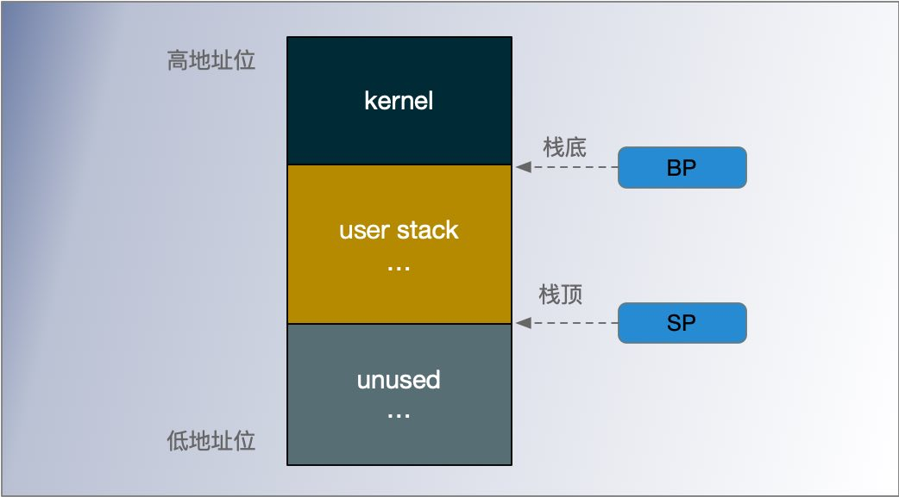
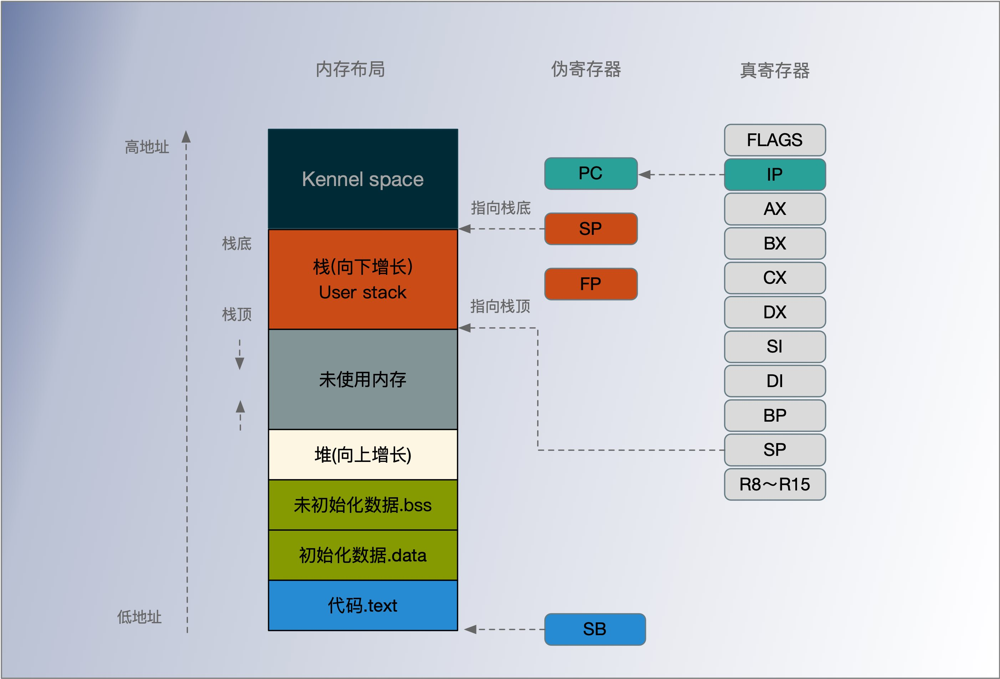
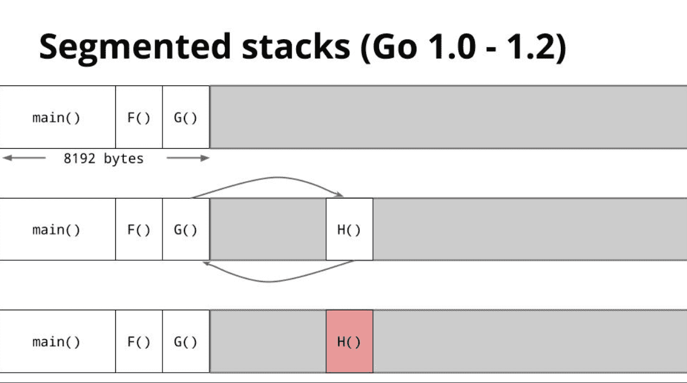
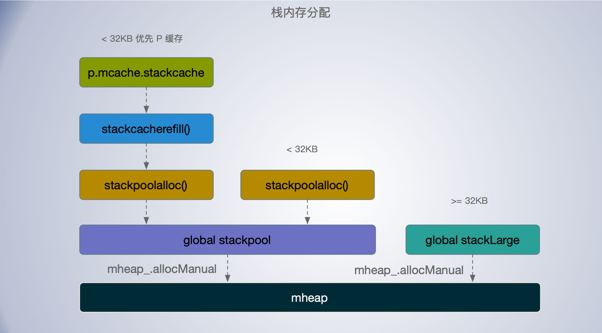

[TOC]


## 栈内存布局

**栈 (stack)** 是内存中的特殊区域，一般由编译器自动进行分配和释放，工程师无法控制，用来存储函数的参数和局部变量。当计算任务完成时，变量的内存将被自动删除，不会长期存在，这种线性的内存分配策略有着极高地效率。




栈寄存器在是 CPU 寄存器中的一种，它的主要作用是跟踪函数的调用栈，Go 语言的汇编代码中包含 BP(base pointer) 和 SP(stack pointer) 两个栈(真)寄存器，它们分别存储了栈的基址指针和栈顶的地址，栈内存与函数调用的关系非常紧密，BP 和 SP 之间的内存就是当前函数的调用栈。

栈区内存都是从高地址向低地址扩展的，即栈底是地址高位，栈顶在地址地位。当应用程序申请或者释放栈内存时只需要修改 SP 寄存器的值，这种线性的内存分配方式与堆内存相比更加快速，占用极少的额外开销。


栈内存通常用来存储函数的参数和局部变量，多数架构上默认栈大小都在 2 ~ 4 MB 左右，如果一个应用的线程很多，线程栈内存就会占用较多的内存。

在一些调用比较深的场景如递归，可能还会导致调用栈调用栈溢出。

Linux 系统，用户空间调用栈(user stack)为 8MB ，栈从地址高位向地位增长。当程序运行时栈内存占用超过上限，程序会崩溃掉并报告segment错误。




栈可以简单得理解成一次函数调用内部申请到的内存，它们会随着函数的返回把内存还给系统。

当一个函数被调用时，会在两个相关的栈边界间进行上下文切换。从调用函数切换到被调用函数，如果函数调用时需要传递参数，那么这些参数值也要传递到被调用函数的栈中。Go 语言中栈之间的数据传递是按值传递的


## Goroutine 栈

每个 Goroutine 都有一个自己的栈，该栈范围只能 Goroutine 自己使用，初始化时 Goroutine 最小栈内存为 2KB，在 不同的 Go 版本中，最小栈的大小也增变来变去。

- v1.0 ~ v1.1 — 最小栈内存空间为 4KB
- v1.2 — 将最小栈内存提升到了 8KB
- v1.3 — 使用连续栈替换之前版本的分段栈
- v1.4 — 将最小栈内存降低到了 2KB

在运行的过程中，G 的栈的大小会动态的扩大和收缩。

```go
// Stack describes a Go execution stack.
type stack struct {
	lo uintptr
	hi uintptr
}


type g struct {
    // Goroutine 的栈内存范围 [stack.lo, stack.hi)
	stack       stack   // offset known to runtime/cgo
	stackguard0 uintptr // offset known to liblink
	stackguard1 uintptr // offset known to liblink
    ...
}
```

- stack.lo: 栈空间的低地址；
- stack.hi: 栈空间的高地址，栈的增长方向上从高位向低地址位；
- stackguard0: stack.lo + StackGuard, 用于stack overlow 的检测
- _StackGuard: 常量，保护区大小，常量Linux上为880字节
- StackSmall: 常量，大小为128字节，用于小函数调用的优化


### _StackGuard

每个goroutine 的 g->stackguard0 被设置为指向栈底部以上的 `_StackGuard` 字节,即 

```go
g.stackguard0 = g.stack.lo + _StackGuard
```

每个函数都将其栈指针 SP 与 g->stackguard0 进行比较，以检查是否溢出。

```go
gp.preempt = true

// 设置为 StackPreempt 导致下次栈检查溢出
gp.stackguard0 = stackPreempt
```

设置`gp.preempt = true` 表示可抢占信号。Goroutine 中的每次调用都通过将当前的栈指针与 gp->stackguard0 进行比较来检查堆栈溢出。将 P 的 stackguard0 设为 stackPreempt 导致该 P 中正在执行的 G 进行下一次函数调用时， 导致栈空间检查失败。进而触发 morestack（汇编代码实现），然后进行一连串的函数调用，最终会调用 `goschedImpl` 函数，进行解除 P 与当前 M 的关联，让该G进入 `_Grunnable` 状态，插入全局G列表 runq，等待下次调度。

触发的一系列函数如下： `morestack() -> newstack() -> gopreempt_m() -> goschedImpl() -> schedule()`


在 Goroutine 初始化时：

```go
// Allocate a new g, with a stack big enough for stacksize bytes.
func malg(stacksize int32) *g {
	newg := new(g)
	if stacksize >= 0 {
		stacksize = round2(_StackSystem + stacksize)
		systemstack(func() {
			newg.stack = stackalloc(uint32(stacksize))
		})
		newg.stackguard0 = newg.stack.lo + _StackGuard
		newg.stackguard1 = ^uintptr(0)
		// Clear the bottom word of the stack. We record g
		// there on gsignal stack during VDSO on ARM and ARM64.
		*(*uintptr)(unsafe.Pointer(newg.stack.lo)) = 0
	}
	return newg
}

func mstart() {
	_g_ := getg()

	osStack := _g_.stack.lo == 0 
	if osStack {
		// Initialize stack bounds from system stack.
		// Cgo may have left stack size in stack.hi.
		// minit may update the stack bounds.
		size := _g_.stack.hi  
		if size == 0 {   
			size = 8192 * sys.  
		}
		_g_.stack.hi = uintptr(noescape(unsafe.Pointer(&size)))
		_g_.stack.lo = _g_.stack.hi - size + 1024
	}
	// Initialize stack guard so that we can start calling regular Go code.
	_g_.stackguard0 = _g_.stack.lo + _StackGuard
	// This is the g0, so we can also call go:systemstack
	// functions, which check stackguard1.
	_g_.stackguard1 = _g_.stackguard0
    

}
```


## 分段栈 连续栈

### 分段栈 segment stack

分段栈是 Go 语言在 v1.3 版本之前的实现，在早期的 Go 实现中，所有 Goroutine 在初始化时都会分配一块固定大小的内存空间， 如 在 Go 1.2 中 初始大小为 8KB。

后续的栈扩容时，会创建新的栈空间，同一个 Goroutine 的多个栈空间会以链表的形式串联起来这些栈片段，不需要时会释放掉对应的栈内存。

分段栈能够按需为当前 Goroutine 分配内存和减少栈内存的占用，但是有比较明显的问题：“热分裂” (Hot split) 。

**热分裂**：如果栈快满了，那么下一次的函数调用会强制触发栈扩容。当函数返回时，有会触发栈收缩。如果在一个循环中调用函数，栈的分配和释放就会造成巨大的额外开销。

因为分段栈热分裂的问题，go 1.2 把初始栈的大小增大为 8K，试图降低热分裂的问题，这样必然也会导致每个 Goroutine 浪费更多的内存。直到后来了**连续栈**(contiguous stack)，栈大小才改为2KB。


```go
// Hot split problem
func G(items []string) {
	for item := range items {
		H(item)
	}
}
```

每次调用 H() 都会触发新的栈片段的分配和回收。




### 连续栈 contiguous stack

为什么连续栈能解决上述热分裂问题？

在连续栈中，栈空间不足时，会申请一片更大，通常是原来2倍大的栈空间，并将原栈中的所有值都拷贝到新栈中，新的局部变量或者函数调用就有充足的内存空间。

在连续栈中，栈不足导致的扩容会经历以下几个步骤：

1. 调用 `runtime.newstack` 在内存空间中分配更大的栈内存空间；
2. 调用 `runtime.copystack` 将旧栈中的所有内容复制到新栈中；
3. 将指向旧栈对应变量的指针重新指向新栈；
4. `runtime.stackfree` 销毁并回收旧栈的内存空间；

由于连续栈多了数据的拷贝过程，以及旧站指针到新栈的调整，会有额外的开销，但是这样解决了之前的热分裂问题，而且初始的栈降为了 2K。

在 GC 期间，如果栈区的空间使用率不超过 1/4，会使用 runtime.shrinkstack 进行栈收缩，大小减半。


## 变量 stackpool stackLarge

runtime.stackpool 为结构体数组，表示全局栈缓存，通常用于小于 32KB 的栈分配；

```go
// order = log_2(size/FixedStack)
// There is a free list for each order.
var stackpool [_NumStackOrders]struct {
	item stackpoolItem
	_    [cpu.CacheLinePadSize - unsafe.Sizeof(stackpoolItem{})%cpu.CacheLinePadSize]byte
}

//go:notinheap
type stackpoolItem struct {
	mu   mutex
	span mSpanList
}

```

栈内存的分配上成倍增大的，最小的为 FixedStack，例如在Linux 平台最小为 2KB，后续依次次为 4KB, 8KB，16KB，32KB等，其中大于等于32KB的是为大栈。

FixedStack在不同的系统上是不同的，我们必须改变NumStackOrders来保持相同的最大缓存大小。

```
 OS               | FixedStack | NumStackOrders
 -----------------+------------+---------------
 linux/darwin/bsd | 2KB        | 4
 windows/32       | 4KB        | 3
 windows/64       | 8KB        | 2
 plan9            | 4KB        | 3
```

runtime.stackLarge 表示大栈缓存，通常用于大于等于 32KB 的栈分配；

```go
// Global pool of large stack spans.
var stackLarge struct {
	lock mutex
	free [heapAddrBits - pageShift]mSpanList // free lists by log_2(s.npages)
}

// mSpanList heads a linked list of spans.
//
//go:notinheap
type mSpanList struct {
	first *mspan // first span in list, or nil if none
	last  *mspan // last span in list, or nil if none
}
```

从全局变量 `runtime.stackpool` 和 `runtime.stackLarge` 的结构体组成可以看出，其底层已依赖了堆内存常见到堆内存管理单元 `mspan`。可以认为 Go 语言的栈内存都是分配在堆上的。

`runtime.stackpool` 和 `runtime.stackLarge` 会在运行时初始化时被 `runtime.stackinit` 函数会初始化。


## 栈内存分配

运行时会在 Goroutine 的初始化函数 `runtime.malg` 或者在 `runtime.gfget` 获取到 G 没有分配栈时会调用 `runtime.stackalloc` 分配一个指定大小的栈内存空间，根据线程缓存和申请栈的大小，该函数会通过三种不同的方法分配栈空间：

- 如果申请的栈空间小于 32KB，会在全局栈缓存池或者线程的栈缓存中初始化内存
    - 如果Goroutine 没有分配处理器 P 或者 G 对应的OS线程暂时不可抢占，则调用 `runtime.stackpoolalloc` 从全局缓存池分配栈内存；
    - 其他情况，分配小对象栈时，通过 `runtime.stackcacherefill` 从线程缓存 `p.mcache` 中分配，如果线程缓存不足，也是调用 `runtime.stackpoolalloc` 从全局缓存池分配栈内存并缓存起来；
- 如果申请的栈空间大于等于 32KB ，从全局的大栈缓存 runtime.stackLarge 中获取内存空间，若缓存不足，则如会调用 `mheap_.allocManual` 从堆上申请一片的内存空间缓存起来；

从上面栈内存的分配策略来看，与堆内存分配有点相似，都用到了mspan 缓存; 为了减少锁开销，提高性能都分为了线程缓存(p.mcache.stackcache)和 全局缓存(stackpool 和 stackLarge)，也根据大小进行了分类；




## 栈扩容

编译器会在 cmd/internal/obj/x86.stacksplit 函数中为函数调用插入 runtime.morestack 运行时检查，它函数调用之前检查当前 Goroutine 的栈内存是否充足，如果当前栈需要扩容，我们会保存一些栈的相关信息并调用 runtime.newstack 创建新的栈：


调用 `runtime.newstack` 创建新的栈，替换旧栈，主要用来栈扩容和栈收缩。

在几函数调用之前运行 `runtime.morestack`，检查当前 Goroutine 的栈内存是否充足，如果当前栈需要扩容，会保存一些栈的相关信息,然后创建新的栈。

当 G 被设置可抢占时：

- 如果当前线程 M 为不可栈状态时，则直接调用 gogo(&gp.sched) 触发调取；

- 如果在 `runtime.scanstack` 被标记为需要栈收缩,即 `gp.preemptShrink` 为 true，则调用 `runtime.shrinkstack` 进行栈收缩。 

- 如果因在 GC 根标记 `runtime.markroot` 期间, G 被 `runtime.suspendG` 挂起，则调用 `runtime.preemptPark` 被动让出当前处理器的控制权并将 Goroutine 的状态修改至 `_Gpreempted`；

- 其他则调用 `runtime.gopreempt_m` 主动让出当前处理器的控制权, 解除与P，M 的关系，放入全局运行队列；

如果当前 Goroutine 未设置为可抢占，调用 `runtime.copystack` 申请一个为原来 2 倍的栈空间替换就的栈，最后调用 gogo(&gp.sched) 。


## 栈收缩 1/2 1/4

与扩容不同，栈收缩不是在函数调用时发生的，是由垃圾回收器在 根标记期间执行 `runtime.scanstack` 扫描 Goroutine 栈内存时主动触发的。基本过程是计算当前使用的空间，小于栈空间的1/4的话， 执行栈的收缩，将栈收缩为现在的1/2。如果新栈的大小低于程序的最低限制 `_FixedStack` (linux 为2KB)，那么缩容的过程就会停止。

```go
func shrinkstack(gp *g) {
	gstatus := readgstatus(gp)
    ...
	// 收缩目标是一半大小
	oldsize := gp.stackAlloc
	newsize := oldsize / 2
	// 栈最小不能小于 _FixedStack 
	if newsize < _FixedStack {
		return
	}
	// 如果使用空间超过1/4, 则不收缩
	avail := gp.stack.hi - gp.stack.lo
	if used := gp.stack.hi - gp.sched.sp + _StackLimit; used >= avail/4 {
		return
	}
	// 用较小的栈替换当前的栈
	copystack(gp, newsize, false)
}
```


## morestack()


Go 运行时判断栈空间是否足够，所以在 call function 中会插入 runtime.morestack，

在编译期间通过计算 sp、func stack framesize 确定需要哪个函数调用中插入 runtime.morestack。


## 栈扩容收缩的影响


## 怎么调试排查栈扩容收缩


## TODO

systemstack


```

The per-goroutine g->stackguard is set to point StackGuard bytes
above the bottom of the stack.  Each function compares its stack
pointer against g->stackguard to check for overflow.  
To cut one
instruction from the check sequence for functions with tiny frames,
the stack is allowed to protrude StackSmall bytes below the stack
guard.  Functions with large frames don't bother with the check and
always call morestack.  The sequences are (for amd64, others are
similar):

	guard = g->stackguard
	frame = function's stack frame size
	argsize = size of function arguments (call + return)

	stack frame size <= StackSmall:
		CMPQ guard, SP
		JHI 3(PC)
		MOVQ m->morearg, $(argsize << 32)
		CALL morestack(SB)

	stack frame size > StackSmall but < StackBig
		LEAQ (frame-StackSmall)(SP), R0
		CMPQ guard, R0
		JHI 3(PC)
		MOVQ m->morearg, $(argsize << 32)
		CALL morestack(SB)

	stack frame size >= StackBig:
		MOVQ m->morearg, $((argsize << 32) | frame)
		CALL morestack(SB)

```


## 问题及思考

**stack多大呢？是固定的还是动态变化的呢?**

- 在 Linux 操作系统中执行 `pthread_create` 系统调用，进程会启动一个新的线程，根据不同的平台，大小不同，通常在 2 ~ 4 MB。
- goroutine 的栈初始大小，不同的版本不同，go1.4 以后，一个 goroutine 初始栈的为 2K，后续根据需要回动态扩大和收缩，最大为 1G。
- 即 Go 的内核线程 M 的栈大小是固定的，goroutine 栈可以动态变化。

**stack动态变化的话，什么时候扩容和缩容呢？如何实现的呢?**

- 在函数调用时，会触发一个 runtime.morastack() 的汇编函数，在这里会进行栈检查，是否需要栈扩容。（ps：调度器也是通过这个函数实现实现调度的）。
- 在进行函数调用时，需要分配栈空间，如果空间不足会创建一个原来2倍大的栈，并把原栈的数据拷贝和指针调整过去。
- 与扩容不同，栈收缩不是在函数调用时发生的，是在*GC的根标记期间*执行 `runtime.scanstack` 扫描 Goroutine 栈内存时主动触发的。当栈空间使用不足1/4时，会进行栈收缩，收缩为原来的1/2大小。

**对比栈内存与堆内存分配的异同？**

- 从上面栈内存的分配策略来看，与堆内存分配有点相似，都用到了mspan 缓存; 为了减少锁开销，提高性能都分为了线程缓存(p.mcache.stackcache)和 全局缓存(stackpool 和 stackLarge)，也根据大小进行了分类；
- 栈内存的收缩也是由 GC 触发的，在 GC 标记期间会进行栈扫描计算是否需要栈收缩。

**为什么Go从分段栈演进连续栈？**

- 在Go早期版本，采用分段栈，即一个 goroutine 的栈空间不是连续的。有个*热分裂问题*，即当前栈快满了时，如果调用一个新的函数，就会申请一段新的栈空间，用完又会回收，如果在一个for循环中连续的调用函数，就会不断的申请和释放占内存，这对程序的性能影响很大。所以才有段时间 go 的默认goroutine栈被改为 8K。
- 直到后来采用了连续栈，才把 goroutine 的初始栈大小降到了 2k。
- 连续栈相比分段栈，在栈扩容是增加了数据的拷贝和栈指针调整的开销，但是降低了每个 goroutine 的默认栈的大小，而且解决了热分裂问题。


*对服务有什么影响吗？*


*如何排查栈扩容缩容带来的问题呢?*


## reference


https://github.com/golang/go/blob/master/src/cmd/compile/internal/gc/escape.go

https://zhuanlan.zhihu.com/p/28409657

https://blog.cloudflare.com/how-stacks-are-handled-in-go/

https://docs.google.com/document/d/1wAaf1rYoM4S4gtnPh0zOlGzWtrZFQ5suE8qr2sD8uWQ/pub