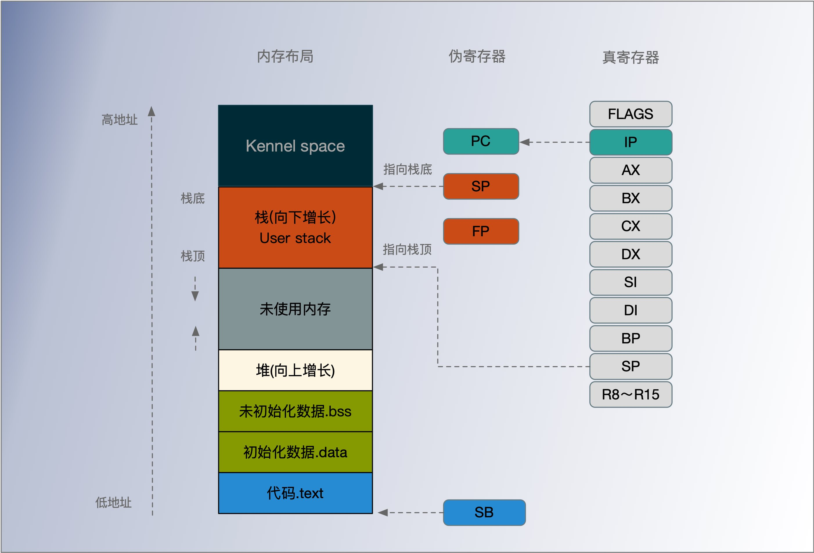

## 伪寄存器

大部分寄存器符号都依赖于架构。Go汇编为了简化汇编代码的编写，引入了 PC、FP、SP、SB 四个伪寄存器，它们不是真正意义上的寄存器，而是被工具链维持出来的虚拟寄存器，它们所有架构上都完全一样。四个伪寄存器加其它的通用寄存器就是 Go 汇编语言对 CPU 的重新抽象，该抽象的结构也适用于其它非X86类型的体系结构。

四个伪寄存器和X86/AMD64的内存和寄存器的相互关系如下图：




在AMD64环境，

`PC伪寄存器` 程序计数器，其实是 IP 指令计数器寄存器的别名。

`FP伪寄存器` 对应的是函数的帧指针，一般用来访问函数的参数和返回值。

`SP伪栈指针` 对应的是当前函数栈帧的底部（不包括参数和返回值部分），一般用于定位局部变量。伪SP是一个比较特殊的寄存器，因为还存在一个同名的SP真寄存器。真SP寄存器对应的是栈的顶部，一般用于定位调用其它函数的参数和返回值。

当需要区分伪寄存器和真寄存器的时候只需要记住一点：*伪寄存器一般需要一个标识符和偏移量为前缀，如果没有标识符前缀则是真寄存器*。比如: 

- `(SP)`、`+8(SP)`  没有标识符前缀为真SP寄存器，
- `a(SP)`、`b+8(SP)` 有标识符为前缀表示伪寄存器。

`SB伪寄存器` 全局静态基指针，一般用来声明函数或全局变量。伪寄存器 SB 可以看作是内存的起始地址


### SB:全局静态基指针

SB: 全局静态基指针，一般用来声明函数或全局变量。

伪寄存器 SB 可以看作是内存的起始地址，所以 foo(SB) 就是 foo 在内存中的地址。语法中有两种修饰符，<> 和 +N （N是一个整数）。

```asm
foo(SB) ;foo 在内存中的地址
```


第一种情况 `foo<>(SB)` 代表了一个私有元素，只有在同一个源文件中才可以访问，类似于 Go 里面的小写命名。

标记 `<>`，这个跟在符号名之后，表示该全局变量只在当前文件中生效，类似于 C 语言中的 static。如果在另外文件中引用该变量的话，会报 `relocation target not found` 的错误。

```asm
DATA divtab<>+0x00(SB)/4, $0xf4f8fcff
DATA divtab<>+0x04(SB)/4, $0xe6eaedf0
...
DATA divtab<>+0x3c(SB)/4, $0x81828384     
GLOBL divtab<>(SB), RODATA, $64   				;声明并初始化 divtab<> ，一个只读的 64字节的表，包含4字节的整数值; 。

GLOBL runtime·tlsoffset(SB), NOPTR, $4    ;声明 runtime·tlsoffset，一个4字节的隐式归零变量，不包含指针
```

第二种属于对相对地址加上一个偏移量后得到的地址，所以 `foo+8(SB)` 就指向 foo 之后 8 个字节处的地址。

```
foo+8(SB)    //指向 foo 之后 8 个字节处的地址
```

### FP:引用函数的输入参数

FP: 使用形如 `symbol+offset(FP)` 的方式，引用函数的输入参数。例如

```
arg0+0(FP)  //第一个参数
arg1+8(FP)  //第二个参数
```

使用 FP 不加 symbol 时，无法通过编译，在汇编层面来讲，symbol 并没有什么用，加 symbol 主要是为了提升代码可读性。

另外，官方文档虽然将伪寄存器 FP 称之为 frame pointer，实际上它根本不是 frame pointer，按照传统的 x86 的习惯来讲，frame pointer 是指向整个 stack frame 底部的 BP 寄存器。

假如当前的 callee 函数是 add，在 add 的代码中引用 FP，该 FP 指向的位置不在 callee 的 stack frame 之内，而是在 caller 的 stack frame 上。

在一台 64 位机器上， 0(FP) 是第一个参数， 8(FP) 就是第二个参数。为了引用这些参数，编译器会强制它们的命名使用，这是出于清晰和可读性的考虑。

```
MOVL foo+0(FP) //CX 会把虚拟的 FP 寄存器中的第一个参数放入到物理上的 CX 寄存器，
MOVL bar+8(FP) //DX 会把第二个参数放入到 DX 寄存器中。
```

### PC:跳转和分支

PC: 实际上就是在体系结构的知识中常见的 pc 寄存器，在 x86 平台下对应 ip 寄存器，amd64 上则是 rip。除了个别跳转之外，手写 plan9 代码与 PC 寄存器打交道的情况较少。

### SP:栈指针

SP: plan9 的这个 SP 寄存器指向当前栈帧的局部变量的开始位置，使用形如

```
symbol+offset(SP)
```

引用函数的局部变量。offset 的合法取值是 [-framesize, 0)，注意是个左闭右开的区间。假如局部变量都是 8 字节，那么第一个局部变量就可以用 `localvar0-8(SP)` 来表示。这也是一个词不表意的寄存器。与硬件寄存器 SP 是两个不同的东西，在栈帧 size 为 0 的情况下，伪寄存器 SP 和硬件寄存器 SP 指向同一位置。手写汇编代码时，如果是 `symbol+offset(SP)` 形式，则表示伪寄存器 SP。如果是 `offset(SP)` 则表示硬件寄存器 SP。务必注意。对于编译输出(go tool compile -S / go tool objdump)的代码来讲，目前所有的 SP 都是硬件寄存器 SP，无论是否带 symbol。


