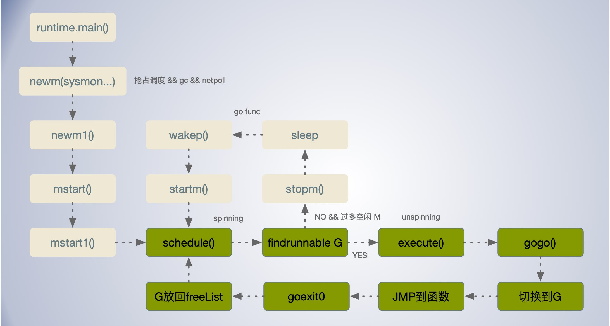

[TOC]

## g

```go
type g struct {
	// stackguard0 is the stack pointer compared in the Go stack growth prologue.
	// It is stack.lo+StackGuard normally, but can be StackPreempt to trigger a preemption.
	// stackguard1 is the stack pointer compared in the C stack growth prologue.
	// It is stack.lo+StackGuard on g0 and gsignal stacks.
	// It is ~0 on other goroutine stacks, to trigger a call to morestackc (and crash).
    // 栈相关的字段
	stack       stack   // 当前 Goroutine 的栈内存范围 [stack.lo, stack.hi)
	stackguard0 uintptr // offset known to liblink， 用于调度器抢占式调度， gp.stack.lo + _StackGuard
	stackguard1 uintptr // offset known to liblink

	_panic       *_panic // innermost panic - offset known to liblink
	_defer       *_defer // innermost defer
	m            *m      // 当前 Goroutine 占用的线程，可能为空;
	sched        gobuf   // 存储 Goroutine 的调度相关的数据，G 切换时，用于保存 G 的上下文
	syscallsp    uintptr        // if status==Gsyscall, syscallsp = sched.sp to use during gc
	syscallpc    uintptr        // if status==Gsyscall, syscallpc = sched.pc to use during gc
	stktopsp     uintptr        // expected sp at top of stack, to check in traceback
	param        unsafe.Pointer // 用于传递参数，睡眠时其他goroutine可以设置param，唤醒时该goroutine可以获取
	atomicstatus uint32 // Goroutine 的状态
	stackLock    uint32 // sigprof/scang lock; TODO: fold in to atomicstatus
	goid         int64  // Goroutine 的 ID
	schedlink    guintptr
	waitsince    int64      // g被阻塞的大约时间，为什么是大约？
	waitreason   waitReason // if status==Gwaiting

    //与抢占密切相关的字段
	preempt       bool // 抢占信号, duplicates stackguard0 = stackpreempt
	preemptStop   bool // 抢占时将状态修改成 `_Gpreempted`; otherwise, just deschedule
	preemptShrink bool // 在同步安全点收缩栈

	// asyncSafePoint is set if g is stopped at an asynchronous
	// safe point. This means there are frames on the stack
	// without precise pointer information.
	asyncSafePoint bool

	paniconfault bool // panic (instead of crash) on unexpected fault address
	gcscandone   bool // g has scanned stack; protected by _Gscan bit in status
	throwsplit   bool // must not split stack
	// activeStackChans indicates that there are unlocked channels
	// pointing into this goroutine's stack. If true, stack
	// copying needs to acquire channel locks to protect these
	// areas of the stack.
	activeStackChans bool
	// parkingOnChan indicates that the goroutine is about to
	// park on a chansend or chanrecv. Used to signal an unsafe point
	// for stack shrinking. It's a boolean value, but is updated atomically.
	parkingOnChan uint8

	raceignore     int8     // ignore race detection events
	sysblocktraced bool     // StartTrace has emitted EvGoInSyscall about this goroutine
	sysexitticks   int64    // cputicks when syscall has returned (for tracing)
	traceseq       uint64   // trace event sequencer
	tracelastp     puintptr // last P emitted an event for this goroutine
	lockedm        muintptr
	sig            uint32
	writebuf       []byte
	sigcode0       uintptr
	sigcode1       uintptr
	sigpc          uintptr
	gopc           uintptr         // G 的 PC，程序计数器，指 goroutine 的创建者 ？
	ancestors      *[]ancestorInfo // ancestor information goroutine(s) that created this goroutine (only used if debug.tracebackancestors)
	startpc        uintptr         // pc of goroutine function 任务函数
	racectx        uintptr
	waiting        *sudog         // sudog structures this g is waiting on (that have a valid elem ptr); in lock order
	cgoCtxt        []uintptr      // cgo traceback context
	labels         unsafe.Pointer // profiler labels
	timer          *timer         // cached timer for time.Sleep
	selectDone     uint32         // are we participating in a select and did someone win the race?

	// Per-G GC state

	// gcAssistBytes is this G's GC assist credit in terms of
	// bytes allocated. If this is positive, then the G has credit
	// to allocate gcAssistBytes bytes without assisting. If this
	// is negative, then the G must correct this by performing
	// scan work. We track this in bytes to make it fast to update
	// and check for debt in the malloc hot path. The assist ratio
	// determines how this corresponds to scan work debt.
	gcAssistBytes int64 // 存储了当前 Goroutine gc 辅助标记的对象字节数。
}
```


`g.stack Goroutine` 的栈内存，简单的线性区域，地址范围 [stack.lo, stack.hi) ，从高地址位向低地址位增长。

## gobuf 调度信息存储

**gobuf** 存储 Goroutine 的调度相关的数据，

```go
type gobuf struct {
	// The offsets of sp, pc, and g are known to (hard-coded in) libmach.
	sp   uintptr   // 栈指针（Stack Pointer），指向栈顶
	pc   uintptr   // 程序计数器（Program Counter） pc 寄存器的作用就是存储程序接下来运行的位置,下次访问的内存地址
	g    guintptr  // 持有 runtime.gobuf 的 Goroutine
	ctxt unsafe.Pointer
	ret  sys.Uintreg // 系统调用的返回值
	lr   uintptr
	bp   uintptr // for GOEXPERIMENT=framepointer
}

type g struct {
    sched        gobuf   // 存储 Goroutine 的调度相关的数据，G 切换时，用于保存 G 的上下文
    ...
}
```

`g.sched` 字段用于存放 goroutine 的相关调度信息。在创建 goroutine 是，在 runtime.newproc1 中会设置

```go
func newproc1(fn *funcval, argp unsafe.Pointer, narg int32, callergp *g, callerpc uintptr) *g {
	...
    newg.sched.pc = funcPC(goexit) + sys.PCQuantum
	newg.sched.g = guintptr(unsafe.Pointer(newg))
	gostartcallfn(&newg.sched, fn)
	...
}

// adjust Gobuf as if it executed a call to fn
// and then did an immediate gosave.
func gostartcallfn(gobuf *gobuf, fv *funcval) {
	var fn unsafe.Pointer
	if fv != nil {
		fn = unsafe.Pointer(fv.fn)
	} else {
		fn = unsafe.Pointer(funcPC(nilfunc))
	}
	gostartcall(gobuf, fn, unsafe.Pointer(fv))
}

// adjust Gobuf as if it executed a call to fn with context ctxt
// and then did an immediate gosave.
func gostartcall(buf *gobuf, fn, ctxt unsafe.Pointer) {
	sp := buf.sp
	if sys.RegSize > sys.PtrSize {
		sp -= sys.PtrSize
		*(*uintptr)(unsafe.Pointer(sp)) = 0
	}
	sp -= sys.PtrSize
	*(*uintptr)(unsafe.Pointer(sp)) = buf.pc
	buf.sp = sp
	buf.pc = uintptr(fn)
	buf.ctxt = ctxt
}


```

栈指针 sp 中存储了 `runtime.goexit` 函数的程序计数器，而 pc 中存储了传入函数的程序计数器。pc 寄存器的作用就是存储程序接下来运行的位置.


程序计数器(Program Counter简称PC):是用于存放下一条指令所在单元的地址的地方，即下一步要访问的内存地址。

## newproc() 分配G准备运行

创建 goroutine 等核心逻辑都在 runtime.newproc1 函数中。

1. 获取或者创建新的 Goroutine 结构体；调用 `runtime.gfget()` 从处理器 P 的 `gFree` 队列中，寻找是否有可用的 G (status == Gdead) 如果没有则从全局调度器的 `sched.gFree` 列表中获取 `runtime.g`结构体；再没有则返回空。然后通过 `runtime.malg` 函数创建新的结构体，分配`_StackMin` 大小也就是 2KB 的栈空间，然后把新创建的 Goroutine 添加到全局列表 `runtime.allgs`
2. 将传入的参数移到 Goroutine 的栈上；
3. 更新 Goroutine 调度相关的属性，设置栈指针 SP，程序计数器 PC ，并更新其状态到 _Grunnable；
4. 将 Goroutine 加入处理器的运行队列；
5. 尝试调用 `runtime.wakep()` 唤醒 P 运行 G


```go
func newproc(siz int32, fn *funcval) {
	argp := add(unsafe.Pointer(&fn), sys.PtrSize)
	gp := getg()
	pc := getcallerpc()
	systemstack(func() {
		newg := newproc1(fn, argp, siz, gp, pc)

		_p_ := getg().m.p.ptr()
		runqput(_p_, newg, true)

		if mainStarted { // 如果主 M 已经启动
			wakep()
		}
	})
}

//go:systemstack
func newproc1(fn *funcval, argp unsafe.Pointer, narg int32, callergp *g, callerpc uintptr) *g {
	_g_ := getg()

	if fn == nil { // 任务函数如果为nil，则抛出异常
		_g_.m.throwing = -1 // do not dump full stacks
		throw("go of nil func value")
	}
	acquirem() // disable preemption because it can be holding p in a local var
	siz := narg
	siz = (siz + 7) &^ 7

	if siz >= _StackMin-4*sys.RegSize-sys.RegSize { // 参数太大则抛出异常
		throw("newproc: function arguments too large for new goroutine")
	}

	_p_ := _g_.m.p.ptr()
    newg := gfget(_p_)  // 从处理器 P 的 gFree 队列中，寻找是否有可用的 G (status == Gdead)
	if newg == nil {
		newg = malg(_StackMin) // 没有现成可用的，就新创建一个 G 并分配 2KB 栈空间
		casgstatus(newg, _Gidle, _Gdead) // 更新状态 为 _Gdead
		allgadd(newg) // 把新创建的 Goroutine 添加到 全局列表 runtime.allgs
	}
	if newg.stack.hi == 0 {
		throw("newproc1: newg missing stack")
	}

	if readgstatus(newg) != _Gdead { // G 状态一定得是 _Gdead
		throw("newproc1: new g is not Gdead")
	}
	// 参数大小+稍微一点空间
	totalSize := 4*sys.RegSize + uintptr(siz) + sys.MinFrameSize // extra space in case of reads slightly beyond frame
	totalSize += -totalSize & (sys.SpAlign - 1)                  // align to spAlign
	sp := newg.stack.hi - totalSize // 计算G栈顶sp位置，高位地址见去参数的占用空间
	spArg := sp
	if usesLR {
		// caller's LR
		*(*uintptr)(unsafe.Pointer(sp)) = 0
		prepGoExitFrame(sp)
		spArg += sys.MinFrameSize
	}
    // 如果有参数
	if narg > 0 {
        // 将函数的全部参数拷贝到栈上，argp 和 narg 分别是参数的内存空间和大小
		memmove(unsafe.Pointer(spArg), argp, uintptr(narg)) //进行字节拷贝
        //这是堆栈到堆栈的拷贝。如果启用了写屏障，并且源堆栈是灰色的(目标总是黑色的)，那么执行屏障复制。
        //我们在memmove之后做这个操作，因为目标堆栈上可能有垃圾。
		if writeBarrier.needed && !_g_.m.curg.gcscandone {
			f := findfunc(fn.fn)
			stkmap := (*stackmap)(funcdata(f, _FUNCDATA_ArgsPointerMaps))
			if stkmap.nbit > 0 {
				// We're in the prologue, so it's always stack map index 0.
				bv := stackmapdata(stkmap, 0)
				bulkBarrierBitmap(spArg, spArg, uintptr(bv.n)*sys.PtrSize, 0, bv.bytedata)
			}
		}
	}

    
    // 设置新的 Goroutine 结构体的参数，包括栈指针、程序计数器并更新其状态到 _Grunnable
    // 初始化G的gobuf，保存sp，pc，任务函数等
	memclrNoHeapPointers(unsafe.Pointer(&newg.sched), unsafe.Sizeof(newg.sched))
	newg.sched.sp = sp
	newg.stktopsp = sp
    // 保存goexit的地址到sched.pc，后面会调节 goexit 作为任务函数返回后执行的地址，goroutine结束后会调用goexit
    // funcPC(goexit) 获取 goexit 程序计数器
	newg.sched.pc = funcPC(goexit) + sys.PCQuantum // +PCQuantum so that previous instruction is in same function
	newg.sched.g = guintptr(unsafe.Pointer(newg))
	gostartcallfn(&newg.sched, fn) // 将当前的pc压入栈，保存g的任务函数为pc
	newg.gopc = callerpc
	newg.ancestors = saveAncestors(callergp)
	newg.startpc = fn.fn
	if _g_.m.curg != nil {
		newg.labels = _g_.m.curg.labels
	}
    // 判断g的任务函数是不是runtime系统的任务函数，是则sched.ngsys加1
	if isSystemGoroutine(newg, false) {
		atomic.Xadd(&sched.ngsys, +1)
	}
	casgstatus(newg, _Gdead, _Grunnable)

	if _p_.goidcache == _p_.goidcacheend {
		// Sched.goidgen is the last allocated id,
		// this batch must be [sched.goidgen+1, sched.goidgen+GoidCacheBatch].
		// At startup sched.goidgen=0, so main goroutine receives goid=1.
		_p_.goidcache = atomic.Xadd64(&sched.goidgen, _GoidCacheBatch)
		_p_.goidcache -= _GoidCacheBatch - 1
		_p_.goidcacheend = _p_.goidcache + _GoidCacheBatch
	}
	newg.goid = int64(_p_.goidcache) // 生成唯一的goid
	_p_.goidcache++
	if raceenabled {
		newg.racectx = racegostart(callerpc)
	}
    // 如果启动了go trace，记录go create事件
	if trace.enabled {
		traceGoCreate(newg, newg.startpc)
	}
	releasem(_g_.m)

	return newg
}
```

newproc1()  根据传入的函数指针，参数创建一个状态为 `_Grunnable` 的 Groutine；

`gfget(_p_)` 从处理器 P 的 gFree 队列中，寻找是否有可用的 G (status == Gdead)；

funcPC(goexit) 获取 goexit 程序计数器；

gostartcallfn(&newg.sched, fn) 保存G 的任务函数 fn 为 程序计数器 pc；


```
本地队列    _p_.gFree -->gfget()|
全局队列 sched.gFree  -->gfget()|--> newproc --> go func 启动Goroutine
新建G   new --> malg()-------->|
```

**globrunqget**: 调度器每61次就会 `runtime.globrunqget`  从全局运行队列查找

**runqget**:用 `runtime.runqget`  从 P 本地运行队列查找，

**findrunnable**:`runtime.findrunnable`  从本地或者全局的运行队列中获取待执行的 Goroutine；调用 `findrunnable` 函数会触发工作窃取，从其它的处理器的队列中随机获取一些 Goroutine, 优先级依次为：

- 调用 `runtime.runqget`  从 P 本地运行队列查找,找到则 return；
- 调用 `runtime.globrunqget`  从全局运行队列查找，找到则 return；
- 调用 `runtime.netpoll` 从网络轮询器中查找，找到则 return；
- 通过 `runtime.runqsteal` 函数尝试从其他随机的处理器中窃取待运行的 Goroutine，在该过程中还可能窃取处理器中的计时器；


## gfget() 获取 dead G

`runtime.gfget()` 从处理器 P 的 gFree 队列中，寻找是否有可用的 G (status == Gdead)

从 Goroutine 所在处理器的 `gFree` 列表获取,如果没有则从全局调度器的 `sched.gFree` 列表中获取。

如果 gFree 队列有可用可用的 Goroutine，则从队列头部返回一个；否则返回空。

```go
// Get from gfree list.
// If local list is empty, grab a batch from global list.
func gfget(_p_ *p) *g {
retry:
    // 如果当前处理器 P 的gFree 队列空的，且全局队列不空
	if _p_.gFree.empty() && (!sched.gFree.stack.empty() || !sched.gFree.noStack.empty()) {
		lock(&sched.gFree.lock)
		// 就从全局队列搬 32 个到当前处理器的 gFree 队列
		for _p_.gFree.n < 32 {
			// Prefer Gs with stacks.
			gp := sched.gFree.stack.pop()
			if gp == nil {
				gp = sched.gFree.noStack.pop()
				if gp == nil {
					break
				}
			}
			sched.gFree.n--
			_p_.gFree.push(gp)
			_p_.gFree.n++
		}
		unlock(&sched.gFree.lock)
		goto retry
	}
	gp := _p_.gFree.pop()
	if gp == nil {
		return nil
	}
	...
}
```


## malg() new G 结构体

创建一个新的 Goroutine ，并通过 `runtime.stackalloc` 分配足 `stacksize` 字节栈空间。通过 `runtime.malg` 创建的 Goroutine 会存储到全局变量 `runtime.allgs` 中。新创建的 Goroutine 状态为 `_Gidle`。

```go
func malg(stacksize int32) *g {
	newg := new(g)
	if stacksize >= 0 {
		stacksize = round2(_StackSystem + stacksize)
		systemstack(func() {
			newg.stack = stackalloc(uint32(stacksize)) // 分配栈空间
		})
		newg.stackguard0 = newg.stack.lo + _StackGuard // 堆栈保护是一个比堆栈底部高出这么多字节的指针 ？
		newg.stackguard1 = ^uintptr(0)
		// Clear the bottom word of the stack. We record g
		// there on gsignal stack during VDSO on ARM and ARM64.
		*(*uintptr)(unsafe.Pointer(newg.stack.lo)) = 0
	}
	return newg
}

```

`runtime._StackSystem` 字段表示一些额外的字节，用来添加到每个堆栈，通常是在保护区域下面，用于特定的操作系统目的，如信号处理。在Windows、Plan 9和iOS上使用，因为它们不使用单独的堆栈。

然后调用 runtime.stackalloc 分配栈内存；


Go 代码分配的最小栈为 `_StackMin = 2048B`;


## runqput() 放入待运行队列

runqput() 尝试把 Goroutine 加到 处理本地运行队列 `p.runq`, 队列长度为256 如果本地运行队列满了，把 Goroutine 加到全局队列。

当 next 为 false, 将 Goroutine 加入处理器持有的本地运行队列；

如果 next 为 true, 将 Goroutine 设置到处理器的 `runnext` 上作为下一个处理器执行的任务。

如果本地运行队列已满，则把本地队列中的一部分 Goroutine 和待加入的 Goroutine 通过 `runqputslow` 添加到调度器持有的全局运行队列上；

```go
type p struct {
    // Queue of runnable goroutines. Accessed without lock.
    runqhead uint32
	runqtail uint32
	runq     [256]guintptr
    ...
}

func runqput(_p_ *p, gp *g, next bool) {
	if randomizeScheduler && next && fastrand()%2 == 0 {
		next = false
	}

	if next {
	retryNext:
		oldnext := _p_.runnext
		if !_p_.runnext.cas(oldnext, guintptr(unsafe.Pointer(gp))) {
			goto retryNext
		}
		if oldnext == 0 {
			return
		}
		// Kick the old runnext out to the regular run queue.
		gp = oldnext.ptr()
	}

retry:
	h := atomic.LoadAcq(&_p_.runqhead) // load-acquire, synchronize with consumers
	t := _p_.runqtail
	if t-h < uint32(len(_p_.runq)) {
		_p_.runq[t%uint32(len(_p_.runq))].set(gp)
		atomic.StoreRel(&_p_.runqtail, t+1) // store-release, makes the item available for consumption
		return
	}
	if runqputslow(_p_, gp, h, t) {
		return
	}
	// the queue is not full, now the put above must succeed
	goto retry
}

```


## schedule() 调度器主函数

Go runtime 的调度从`runtime.schedule`开始， 找到一个可运行的 Goroutine 然后执行。

果当前因 GC 处于 STW 状态, 则调用 `runtime.gcstopm` 休眠当前的 M。

`runtime.schedule` 会从3个不同地方查找待执行的 Goroutine。

- 当全局运行队列中有待执行的 Goroutine 时，通过 `schedtick` 每调度61次就用 `runtime.globrunqget` 从全局的运行队列中查找 Goroutine；

- 调用 `runtime.runqget` 从处理器本地的运行队列中查找待执行的 Goroutine, ；

- 如果前两种方法都没有找到 Goroutine，就会通过 `runtime.findrunnable`进行阻塞地查找 Goroutine；

通过 `runtime.execute` 函数执行获取的 Goroutine，做好准备工作后，它会通过 runtime.gogo 将 Goroutine 调度到当前线程上。




## execute() 执行 G 任务函数

通过 `runtime.execute` 函数执行获取的 Goroutine，做好准备工作后，它会通过 `runtime.gogo` 将 Goroutine 调度到当前线程M上执行。

如果 `inheritTime` 为 true 则使用当前的剩余的时间片，否则重开一个时间片。

```go
//go:yeswritebarrierrec
func execute(gp *g, inheritTime bool) {
	_g_ := getg()
    // 在更新 G 状态为 _Grunning 之前，先分配一个 M
	_g_.m.curg = gp
	gp.m = _g_.m
	casgstatus(gp, _Grunnable, _Grunning) // 更新 goroutine 状态
	gp.waitsince = 0  // 被阻塞时间 ？
	gp.preempt = false // 不可抢占
    // goroutine 中的每次调用都通过将当前的栈指针与 g.stackguard0 进行比较来检查堆栈溢出。
	gp.stackguard0 = gp.stack.lo + _StackGuard
	if !inheritTime {
		_g_.m.p.ptr().schedtick++
	}
    
	hz := sched.profilehz
	if _g_.m.profilehz != hz {
		setThreadCPUProfiler(hz)
	}
	if trace.enabled {
		if gp.syscallsp != 0 && gp.sysblocktraced {
			traceGoSysExit(gp.sysexitticks)
		}
		traceGoStart()
	}
    
	gogo(&gp.sched) // 调度并执行，汇编实现
}
```

    // goroutine 中的每次调用都通过将当前的栈指针与gp->stackguard0进行比较来检查堆栈溢出。
    // 设置 stackguard0 设为 stackPreempt，导致该 P 中正在执行的G进行下一次函数调用时栈空间检查失败。


### gogo()

`runtime.gogo` 函数可以实现将 Goroutine 调度到当前线程上。通过汇编代码实现

```go
func gogo(buf *gobuf)
```

函数时，将调用方的返回地址加入栈寄存器 SP 中，然后跳转到目标函数；当目标函数返回后，会从栈中查找调用的地址并跳转回调用方继续执行剩下的代码。

runtime.goexit 的程序计数器被放到了栈 SP 上；

待执行函数的程序计数器被放到了寄存器 BX 上；

```
// amd64
// func gogo(buf *gobuf)
// restore state from Gobuf; longjmp
TEXT runtime·gogo(SB), NOSPLIT, $16-8
	MOVQ	buf+0(FP), BX		// gobuf 移到 BX 中
	MOVQ	gobuf_g(BX), DX		// gobuf.g 运行的 goroutine 移到 DX
	MOVQ	0(DX), CX			// 确保 Goroutine 不为空
	get_tls(CX)					// 从tls 线程本地缓存获取 g 指针
	MOVQ	DX, g(CX)			
	MOVQ	gobuf_sp(BX), SP	// restore SP , 将 runtime.goexit 函数的 PC 放入 栈指针 SP 中
	MOVQ	gobuf_ret(BX), AX
	MOVQ	gobuf_ctxt(BX), DX
	MOVQ	gobuf_bp(BX), BP
	MOVQ	$0, gobuf_sp(BX)	// clear to help garbage collector
	MOVQ	$0, gobuf_ret(BX)	// gobuf.ret
	MOVQ	$0, gobuf_ctxt(BX)	// gobuf.ctxt
	MOVQ	$0, gobuf_bp(BX)
	MOVQ	gobuf_pc(BX), BX    // 获取待执行函数的程序计数器
	JMP	BX	//  开始执行
	
```


 Go 函数调用通常会使用 `CALL` 指令，该指令会将调用方的返回地址加入栈寄存器 SP 中，然后跳转到目标函数；当目标函数返回后，会从栈中查找调用的地址并跳转回调用方继续执行剩下的代码。

```
	MOVL gobuf_sp(BX), SP  // 将 runtime.goexit 函数的 PC 恢复到 SP 中
	MOVL gobuf_pc(BX), BX  // 获取待执行函数的程序计数器
	JMP  BX                // 开始执行
```


## TLS 本地线程存储

每个运行的 Goroutine 的 g 指针保存在当前运行 Goroutine 的系统线程的局部存储 `TLS(Thread Local Storage)` 中, TLS 类似线程局部存储的地址。

每次调用 `get_tls(r)`，就会将当前的 Goroutine 的地址放到寄存器 r 中。

`get_tls` 是一个宏函数，在 `runtime/go_tls.h` 头文件中定义, AMD64平台，get_tls宏函数定义如下： 

```
#ifdef GOARCH_amd64
#define	get_tls(r)	MOVQ TLS, r
#define	g(r)	0(r)(TLS*1)
#endif
```


```
    get_tls(CX)
    MOVQ    g(CX), AX //get_tls(CX)之后，g(CX)得到的就是当前的 goroutine 的 g (Move g into AX)
```


获取g指针

```
// func getg() unsafe.Pointer
TEXT ·getg(SB), NOSPLIT, $0-8
	MOVQ (TLS), AX   	// TLS类似线程局部存储的地址，地址对应的内存里的数据是g指针
	MOVQ AX, ret+0(FP)
	RET
```

**获取 goid**

如果要获取goid可以先获取 TLS 线程局部存储或g 指针，然后再从 TLS 中获取 g 结构的指针，在根据不同版本 goid 成员的偏移量，就可以从g结构中取出goid。例如：

```go
const g_goid_offset = 152 // Go1.10

func GetGroutineId() int64 {
	g := getg()
	p := (*int64)(unsafe.Pointer(uintptr(g) + g_goid_offset))
	return *p
}
```


## goexit0() 任务结束并重新调度

```go
// goexit continuation on g0.
func goexit0(gp *g) {
	_g_ := getg()

	casgstatus(gp, _Grunning, _Gdead)  // 更新 Goroutine 状态为 _Gdead
	if isSystemGoroutine(gp, false) {
		atomic.Xadd(&sched.ngsys, -1)
	}
    // 重制 Goroutine 相关 属性
	gp.m = nil
	locked := gp.lockedm != 0
	gp.lockedm = 0
	_g_.m.lockedg = 0
	gp.preemptStop = false
	gp.paniconfault = false
	gp._defer = nil // should be true already but just in case.
	gp._panic = nil // non-nil for Goexit during panic. points at stack-allocated data.
	gp.writebuf = nil
	gp.waitreason = 0
	gp.param = nil
	gp.labels = nil
	gp.timer = nil

	if gcBlackenEnabled != 0 && gp.gcAssistBytes > 0 {
        // 刷新全局池的辅助信贷。如果应用程序正在快速创建一个退出的goroutines，这将提供更好的节奏信息？
		scanCredit := int64(gcController.assistWorkPerByte * float64(gp.gcAssistBytes))
		atomic.Xaddint64(&gcController.bgScanCredit, scanCredit)
		gp.gcAssistBytes = 0
	}

	dropg() // 移除 goroutine 与线程 M 的关联
	...
	gfput(_g_.m.p.ptr(), gp) // 放回处理器的 Goroutine 空闲列表 gFree
	...
    schedule() // 重新调用 schedule() 触发新的 Goroutine 调度
}
```


## injectglist() 批量放入 runq

injectglist 将列表中的每个可运行对象G添加到某个运行队列中。如果没有当前的P，它们被添加到全局队列中，并且直到npidle M开始运行它们。
否则，对于每个空闲的P，这会向全局队列添加一个G并启动一个m。剩余的G被添加到当前P的本地运行队列中。

```go
func injectglist(glist *gList) {
	if glist.empty() {
		return
	}
	...

	// 放入运行队列之前，先把所有的 G 状态改为可运行
	head := glist.head.ptr()
	var tail *g
	qsize := 0
	for gp := head; gp != nil; gp = gp.schedlink.ptr() {
		tail = gp
		qsize++
		casgstatus(gp, _Gwaiting, _Grunnable)
	}

	// Turn the gList into a gQueue.
	var q gQueue
	q.head.set(head)
	q.tail.set(tail)
	*glist = gList{}

	startIdle := func(n int) {
		for ; n != 0 && sched.npidle != 0; n-- {
			startm(nil, false)
		}
	}

    // 如果当前 M 没有绑定 P，则调用 globrunqputbatch 把 G 添加到 全局列表
	pp := getg().m.p.ptr()
	if pp == nil {
		lock(&sched.lock)
		globrunqputbatch(&q, int32(qsize))
		unlock(&sched.lock)
		startIdle(qsize)
		return
	}

	lock(&sched.lock)
	npidle := int(sched.npidle)
	var n int
	for n = 0; n < npidle && !q.empty(); n++ {
		globrunqput(q.pop())
	}
	unlock(&sched.lock)
	startIdle(n)
	qsize -= n
	
    // 通过 runqputbatch 批量把 G 添加到 P 本地运行队列。
	if !q.empty() {
		runqputbatch(pp, &q, qsize)
	}
}
```


## runqsteal() 窃取 G

```go
//从p2的本地可运行队列中窃取一半的元素
// p的本地可运行队列。
//返回一个被窃取的元素(如果失败，则返回nil)。
func runqsteal(_p_, p2 *p, stealRunNextG bool) *g {}


```


## gopark() G主动挂起

通过 `runtime.gopark` 暂停当前 Goroutine ，G 的状态会从 `_Grunning` 变为 `_Gwaiting` ,通常是由于不满足运行条件造成等待，如网络IO，通道阻塞等待，waitReason 字段表明来等待的原因。

各种 G 等待原因：

```go
var waitReasonStrings = [...]string{
	waitReasonZero:                  "",
	waitReasonGCAssistMarking:       "GC assist marking",
	waitReasonIOWait:                "IO wait",
	waitReasonChanReceiveNilChan:    "chan receive (nil chan)",
	waitReasonChanSendNilChan:       "chan send (nil chan)",
	waitReasonDumpingHeap:           "dumping heap",
	waitReasonGarbageCollection:     "garbage collection",
	waitReasonGarbageCollectionScan: "garbage collection scan",
	waitReasonPanicWait:             "panicwait",
	waitReasonSelect:                "select",
	waitReasonSelectNoCases:         "select (no cases)",
	waitReasonGCAssistWait:          "GC assist wait",
	waitReasonGCSweepWait:           "GC sweep wait",
	waitReasonGCScavengeWait:        "GC scavenge wait",
	waitReasonChanReceive:           "chan receive",
	waitReasonChanSend:              "chan send",
	waitReasonFinalizerWait:         "finalizer wait",
	waitReasonForceGCIdle:           "force gc (idle)",
	waitReasonSemacquire:            "semacquire",
	waitReasonSleep:                 "sleep",
	waitReasonSyncCondWait:          "sync.Cond.Wait",
	waitReasonTimerGoroutineIdle:    "timer goroutine (idle)",
	waitReasonTraceReaderBlocked:    "trace reader (blocked)",
	waitReasonWaitForGCCycle:        "wait for GC cycle",
	waitReasonGCWorkerIdle:          "GC worker (idle)",
	waitReasonPreempted:             "preempted",
	waitReasonDebugCall:             "debug call",
}
```


```go
func gopark(unlockf func(*g, unsafe.Pointer) bool, lock unsafe.Pointer, reason waitReason, traceEv byte, traceskip int) {
	if reason != waitReasonSleep {
		checkTimeouts() // timeouts may expire while two goroutines keep the scheduler busy
	}
	mp := acquirem()
	gp := mp.curg
	status := readgstatus(gp)
	if status != _Grunning && status != _Gscanrunning {
		throw("gopark: bad g status")
	}
	mp.waitlock = lock
	mp.waitunlockf = unlockf
	gp.waitreason = reason
	mp.waittraceev = traceEv
	mp.waittraceskip = traceskip
	releasem(mp)
	// can't do anything that might move the G between Ms here.
	mcall(park_m) // 通过 runtime.mcall 在切换到 g0 的栈上调用 runtime.park_m 函数
}

```


通过 `runtime.mcall` 在切换到 g0 的栈上调用 `runtime.park_m` 函数。`runtime.mcall` 从 g 切换到 g0 堆栈并调用 fn(g)，其中 g 是进行调用的 goroutine。mcall 保存 g 的当前 PC/SP 调用栈信息到 `g->sched`，以便它可以在完成调用后恢复。mcall只能从g栈调用(不能是g0，也不能是gsignal)

`runtime.park_m` 将当前 Goroutine 的状态从 `_Grunning` 切换至 `_Gwaiting`，调用 `runtime.dropg` 移除 OS 线程 M 和 Goroutine 之间的关联，在这之后就可以调用 runtime.schedule 触发新一轮的调度了。

```go
// park continuation on g0.
func park_m(gp *g) {
	_g_ := getg()

	if trace.enabled {
		traceGoPark(_g_.m.waittraceev, _g_.m.waittraceskip)
	}

	casgstatus(gp, _Grunning, _Gwaiting)
	dropg()
	...
	schedule()
}
```

当主动挂起的 Goroutine 运行条件满足后，会通过 `runtime.goready` 将休眠的 Goroutine 唤醒。

## goready() 结束等待标为可运行

把处于 `_Gwaiting` 的 Goroutine 标记为可运行 `_Grunnable`。如在 `runtime.netpollgoready` 和 `chan send` 中会用到。

```go
func goready(gp *g, traceskip int) {
	systemstack(func() {
		ready(gp, traceskip, true)
	})
}

// Mark gp ready to run.
func ready(gp *g, traceskip int, next bool) {
	if trace.enabled {
		traceGoUnpark(gp, traceskip)
	}

	status := readgstatus(gp)

	// Mark runnable.
	_g_ := getg()
	mp := acquirem() // disable preemption because it can be holding p in a local var
	if status&^_Gscan != _Gwaiting {
		dumpgstatus(gp)
		throw("bad g->status in ready")
	}

	// status is Gwaiting or Gscanwaiting, make Grunnable and put on runq
	casgstatus(gp, _Gwaiting, _Grunnable)
	runqput(_g_.m.p.ptr(), gp, next)
	wakep()
	releasem(mp)
}

```


## syscall 系统调用

Go 通过汇编语言 syscall.Syscall 和 syscall.RawSyscall 等方法封装了不同操作系统提供的所有系统调用，其中 syscall.Syscall 的实现如下：

```
#include "textflag.h"
#include "funcdata.h"

// System calls for 386, Linux
//
#define INVOKE_SYSCALL	INT	$0x80

TEXT ·Syscall(SB),NOSPLIT,$0-28
	CALL	runtime·entersyscall(SB) // 调用 runtime.entersyscall 进入系统调用
	MOVL	trap+0(FP), AX	// syscall entry
	MOVL	a1+4(FP), BX
	MOVL	a2+8(FP), CX
	MOVL	a3+12(FP), DX
	MOVL	$0, SI
	MOVL	$0, DI
	INVOKE_SYSCALL
	CMPL	AX, $0xfffff001
	JLS	ok
	MOVL	$-1, r1+16(FP)
	MOVL	$0, r2+20(FP)
	NEGL	AX
	MOVL	AX, err+24(FP)
	CALL	runtime·exitsyscall(SB) // 调用 runtime.exitsyscall 退出系统调用
	RET
ok:
	MOVL	AX, r1+16(FP)
	MOVL	DX, r2+20(FP)
	MOVL	$0, err+24(FP)
	CALL	runtime·exitsyscall(SB)
	RET
```

通过汇编指令 `INVOKE_SYSCALL` 执行系统调用前后，上述函数会调用 `runtime.entersyscall` 和 `runtime.exitsyscall`，正是这一层包装能够让我们在陷入系统调用前触发 runtime 的准备和清理工作。

如果本次系统调用不需要 runtime 参与，就会使用 `syscall.RawSyscall` 简化这一过程，这是处于性能的考虑。

直接进行系统调用会阻塞当前的线程，所以只有可以立刻返回的系统调用才可能会被设置成 RawSyscall 类型，例如：SYS_EPOLL_CREATE、SYS_EPOLL_WAIT（超时时间为 0）、SYS_TIME 等。

### entersyscall() 进入系统调用

`runtime.reentersyscall` 主要会保存当前程序计数器PC和栈位置SP信息,用于调用完恢复，更新 G ，P 为系统调用状态；然后分离 P 和 M 的绑定关系。

`runtime.reentersyscall` 方法会使处理器 P 和线程 M 的分离，当前线程 M 会陷入系统调用等待返回，当前线程上的锁被释放后，会有其他 Goroutine 抢占处理器资源。

```go
// Standard syscall entry used by the go syscall library and normal cgo calls.
func entersyscall() {
    // 获取当前程序计数器和栈位置调用 reentersyscall
	reentersyscall(getcallerpc(), getcallersp())
}

//go:nosplit
func reentersyscall(pc, sp uintptr) {
	_g_ := getg()

	// Disable preemption because during this function g is in Gsyscall status,
	// but can have inconsistent g->sched, do not let GC observe it.
	_g_.m.locks++ // 系统调用禁止抢占 M，禁止线程上发生的抢占，防止出现内存不一致的问题

    // Entersyscall 不能调用任何可能导致栈分裂/增长的函数。保证当前函数不会触发栈分裂或者增长；
	_g_.stackguard0 = stackPreempt
	_g_.throwsplit = true

	// 保存当前的程序计数器 PC 和栈指针 SP 中的内容；
	save(pc, sp)
	_g_.syscallsp = sp
	_g_.syscallpc = pc
	casgstatus(_g_, _Grunning, _Gsyscall) // 将 Goroutine 的状态更新至 _Gsyscall
	if _g_.syscallsp < _g_.stack.lo || _g_.stack.hi < _g_.syscallsp {
		systemstack(func() {
			print("entersyscall inconsistent ", hex(_g_.syscallsp), " [", hex(_g_.stack.lo), ",", hex(_g_.stack.hi), "]\n")
			throw("entersyscall")
		})
	}
	...
	_g_.m.syscalltick = _g_.m.p.ptr().syscalltick
	_g_.sysblocktraced = true
	pp := _g_.m.p.ptr() 
	pp.m = 0 // 将 Goroutine 的处理器和线程暂时分离
	_g_.m.oldp.set(pp)
	_g_.m.p = 0
	atomic.Store(&pp.status, _Psyscall) // 更新处理器的状态到 _Psyscall
	if sched.gcwaiting != 0 {
		systemstack(entersyscall_gcwait)
		save(pc, sp)
	}

	_g_.m.locks--  // 释放当前线程上的锁
}

```


### exitsyscall() 退出系统调用

系统调用结束后，调用 runtime.exitsyscall 退出系统调用，为当前 Goroutine 重新分配资源；

```go
//go:nosplit
//go:nowritebarrierrec
//go:linkname exitsyscall
func exitsyscall() {
	_g_ := getg()

	_g_.m.locks++ // see comment in entersyscall
	if getcallersp() > _g_.syscallsp {
		throw("exitsyscall: syscall frame is no longer valid")
	}

	_g_.waitsince = 0
	oldp := _g_.m.oldp.ptr()
	_g_.m.oldp = 0
	if exitsyscallfast(oldp) {
		...
		if sched.disable.user && !schedEnabled(_g_) {
            // 调用 Gosched G 让出 处理器，从 _Grunning 变为 _Grunnable
			Gosched() 
		}

		return
	}

	_g_.sysexitticks = 0
	...
	_g_.m.locks--

    // 切换至调度器的 Goroutine 即 g0 调用 exitsyscall0
	mcall(exitsyscall0)  // 没有拿到处理器 P，把 G 放入可运行队列， _Gsyscall 变为 _Grunnable

	_g_.syscallsp = 0
	_g_.m.p.ptr().syscalltick++
	_g_.throwsplit = false
}

```

先调用 `runtime.exitsyscallfast` 方法，寻找有没有可用的处理器 P：

- 原处理器处于 `_Psyscall` 状态，就会直接调用 `wirep` 将 Goroutine 与处理器进行关联； G 状态从 `_Gsyscall` 变为 `_Grunning` ,return true
- 如果调度器中存在闲置的处理器，就会调用 `acquirep` 函数使用闲置的处理器处理当前 Goroutine；G 状态从 `_Gsyscall` 变为 `_Grunning`, return true
- 其他情况 return false

如果没有找到 P 运行，即 `runtime.exitsyscallfast` 返回 false，就 通过 `mcall(exitsyscall0)` 在 g0 上执行：

- 通过 `pidleget` 获取到闲置的处理器时就会调用 `runtime.acquirep` 和 `runtime.execute` 在该处理器上执行 Goroutine，G 状态从 `_Gsyscall` 变为 `_Grunning` ；

- 在其它情况下，将当前 Goroutine 放到全局的运行队列中，等待调度器的调度，G 状态从 `_Gsyscall` 变为 `_Grunnable`； 

并且无论上述哪种情况，都会调用 `schedule` 函数触发调度器的调度。


## Gosched() 主动让出调度器

调用 `runtime.Gosched` 的 Goroutine 主动让出处理器，允许其他 Goroutine 运行。通过在 g0 上调用 `runtime.goschedImpl` 把 G 状态 从 `_Grunning` 改为 `_Grunnable` 并放入全局运行队列，调用 `runtime.schedule` 重启出发调度器。

```go
// Gosched 让出处理器，允许其他goroutines运行。
// 该函数无法挂起 Goroutine，调度器会在自动调度当前 Goroutine：
func Gosched() {
	checkTimeouts()
	mcall(gosched_m)
}

// Gosched continuation on g0.
func gosched_m(gp *g) {
	if trace.enabled {
		traceGoSched()
	}
	goschedImpl(gp)
}

func goschedImpl(gp *g) {
	status := readgstatus(gp)
	if status&^_Gscan != _Grunning {
		dumpgstatus(gp)
		throw("bad g status")
	}
	casgstatus(gp, _Grunning, _Grunnable)
	dropg()
	lock(&sched.lock)
	globrunqput(gp)
	unlock(&sched.lock)

	schedule()
}


```


## LockOSThread()

`runtime.LockOSThread` 绑定 Goroutine 和 OS 线程。

当 Goroutine 完成了特定的操作之后，就会调用以下函数 `runtime.UnlockOSThread` 分离 Goroutine 和线程；

大部分情况下，都用不到这一对函数，不过使用 CGO 或者经常与操作系统打交道的可能会见到它们的身影。


## reference


https://www.ardanlabs.com/blog/2018/08/scheduling-in-go-part1.html


https://docs.google.com/document/d/1TTj4T2JO42uD5ID9e89oa0sLKhJYD0Y_kqxDv3I3XMw/edit


