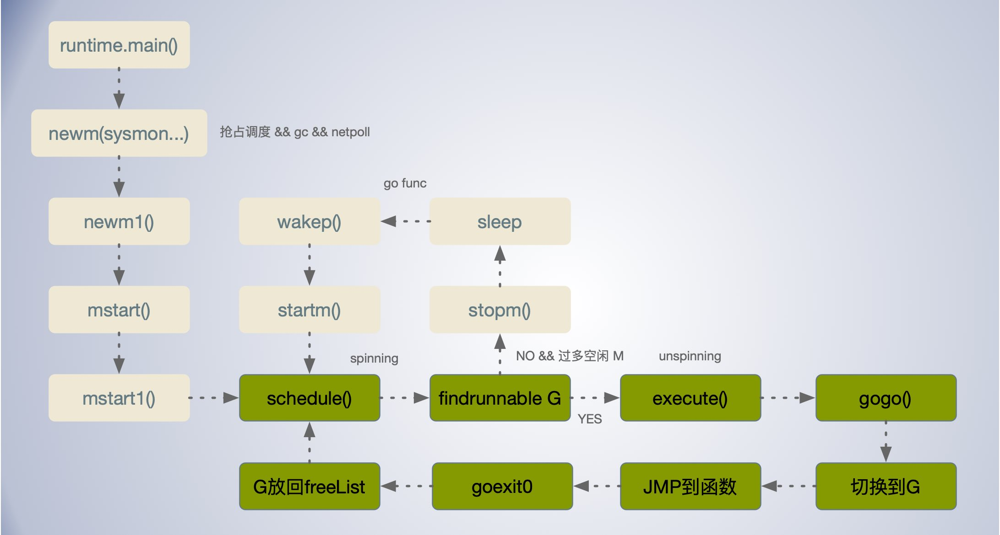

[TOC]


## G-P-M 

G-P-M 并发模型：

- G：Goroutine，也就是协程，由P进行调度。
- P：Processor，是 G-M 的中间层，有的地方叫做逻辑处理器，P 其实类似一个队列的作用，每一个P组织多个 goroutine 跑在同一个 OS 线程上，所以可以被看做运行在线程上的本地调度器。 P 本质是一个队列，负责 G 和 M 之间的运行上下文处理， M 和 G 之间的中间层。通过  `GOMAXPROCS` 变量可以控制 P 的数量，默认等于系统cpu数。
- M：Machine，代表一个内核级线程，由操作系统的调度器调度和管理。M 实际执行 G 工作的线程， M 要运行 G 需要先绑定一个 P 。

P 作为协调器将G队列`动态`的绑在不同的M上，根据负载情况动态调整，从而均衡的发挥出多核最大并行处理计算能力。


### 早期 GM 模型的不足

https://docs.google.com/document/d/1TTj4T2JO42uD5ID9e89oa0sLKhJYD0Y_kqxDv3I3XMw/edit#!

单一全局互斥锁(Sched.Lock)和集中状态存储。

- 早期只有 G 和 M，运行队列等信息是全局集中式存储，这样导致每次操作都需要加全局的大锁。这种加锁方式，很明显不利于性能的提升。

Goroutine 传递问题

- 当 G 触发调度，放回全局队列后，可能会被其他 M 拿去执行，这样会导致内存亲和性(affinity)不好。
- M 经常在 M 之间传递”可运行”的 goroutine，这导致调度延迟增大以及额外的性能损耗。

Per-M 持有内存缓存 (M.mcache)

- mcache 内存分配缓存对象，是挂载到每个 M 上的, 每个 M 持有 mcache 和 stack alloc，然而只有在 M 运行 Go 代码时才需要使用 cache(每个 mcache 可以高达2mb)，当 M 在处于 syscall 时并不需要。由于在 Go 中，当发生系统调用，如果没有可用的线程 M，就会创建新的 M，这样就造成了很大的浪费。同时内存亲和性也较差(proc a new proc b)。

严重的线程阻塞/解锁问题

- 在系统调用的情况下，工作线程经常被阻塞和取消阻塞，这增加了很多开销。 

在计算机哲学中，有一种叫做搞不定那就加一层的功法，于是就有了 CMP 模型。即在G 和 M 之间增加了一个 P 的角色，负责衔接两者。P 中提供了 M 运行所需的一些上下文环境，本地可运行队列，等信息。有了本地队列，首先就可以大大减少全局锁的频次，


```go
type p struct {
    ...
    mcache      *mcache
	pcache      pageCache
    
    // Available G's (status == Gdead)
	gFree struct {
		gList
		n int32
	}
    
    runq     [256]guintptr
    timers []*timer
    ...
}
```


### G-Goroutine

Goroutine 类似轻量级的线程，它在运行时调度器中的地位与线程在操作系统中差不多，但是它占用了更小的内存空间，默认只需 2k 的栈空间，上下文切换的开销也比系统线程更小。它是在用户空间实现的轻量级线程。它的切换不需要频繁的内核态用户态切换。

Goroutine 可能处于以下 9 个状态：

| 状态          | 描述                                                         |
| ------------- | ------------------------------------------------------------ |
| `_Gidle`      | 刚刚被分配并且还没有被初始化                                 |
| `_Grunnable`  | 没有执行代码，没有栈的所有权，存储在运行队列中               |
| `_Grunning`   | 可以执行代码，拥有栈的所有权，被赋予了内核线程 M 和处理器 P  |
| `_Gsyscall`   | 正在执行系统调用，拥有栈的所有权，没有执行用户代码，被赋予了内核线程 M 但是不在运行队列上 |
| `_Gwaiting`   | 由于运行时而被阻塞，没有执行用户代码并且不在运行队列上，但是可能存在于 Channel 的等待队列上 |
| `_Gdead`      | 没有被使用，没有执行代码，可能有分配的栈                     |
| `_Gcopystack` | 栈正在被拷贝，没有执行代码，不在运行队列上                   |
| `_Gpreempted` | 由于抢占而被阻塞，没有执行用户代码并且不在运行队列上，等待唤醒 |
| `_Gscan`      | GC 正在扫描栈空间，没有执行代码，可以与其他状态同时存在      |


- `_Gidle` --> `_Gdead`: 主要方法 `runtime.newproc1` ，新创建的 G 会有此状态变化；
- `_Gdead` --> `_Grunnable`:在 `runtime.newproc1` 中，进行栈分配，分配任务函数之后进入可运行状态；

- `_Grunnable` --> `_Grunning`:在 `runtime.execute` 中，M 开始运行 goroutine 时；
- `_Grunning` --> `_Grunnable`: goschedImpl ,goyield_m；
- `_Grunning` --> `_Gwaiting`: gcMarkDone, gcMarkTermination, gcBgMarkWorker, gcAssistAlloc1,markroot, park_m,stopTheWorld 都可能触发此状态变化；
- `_Gwaiting` --> `_Grunning`:

- `_Grunning` --> `_Gsyscall`: 调用 runtime.reentersyscall 和 runtime.entersyscallblock 进入系统调用；

- `_Gsyscall` --> `_Grunning`: exitsyscall, exitsyscall0；

- `_Gsyscall` --> `_Gdead`: 当一个cgo回调调用了 runtime.needm，但现在已经完成了回调并返回到非go线程时调用 `runtime.dropm` 触发。

- `_Gdead` --> `_Gsyscall`: 当一个cgo回调发生在一个没有m的线程(不是由Go创建的线程)时，调用 `runtime.needm` 触发。
- `_Grunning` --> `_Gcopystack`: 在 `runtime.newtack` 中，当调用 `runtime·morestack` 分配大栈内存或重新分配栈内存是会触发；

- `_Gcopystack` --> `_Grunning`: 在 `runtime.newtack` 中，执行完 copystack(gp, newsize) 之后，触发；

#### 创建 Goroutine

用户代码通过 go 关键字创建 Goroutine，这个关键字会在编译期间通过方法 `cmd/compile/internal/gc.state.stmt`和 `cmd/compile/internal/gc.state.call` 将该关键字转换成调用函数 `runtime.newproc`。

 `runtime.newproc` 会根据接收到的函数指针 fn 及参数，用 `runtime.systemstack` 切换到系统堆栈，调用 `runtime.newproc1`初始化 g ，并调用 `runtime.runqput()` 放入放入处理器运行队列 `runq` 或 全局队列。 

如果空闲列表 `freeList` 和全局的空闲列表中没有可用的 G，则调用 `runtime.malg` 生成新的g的实例，且分配好 G 的栈和设置好栈的边界，接着添加到 `allgs` 数组里面。

```go
func newproc(siz int32, fn *funcval) {
	argp := add(unsafe.Pointer(&fn), sys.PtrSize)
	gp := getg()		// 当前调用着 goroutine
	pc := getcallerpc() // 获取调用方程序计数器
	systemstack(func() {
		newg := newproc1(fn, argp, siz, gp, pc) //根据函数指针，函数参数等初始化 g

		_p_ := getg().m.p.ptr()
		runqput(_p_, newg, true) //  Goroutine 加入处理器的运行队列

		if mainStarted { // M 是否已启动
			wakep()
		}
	})
}

```

执行流程:

> newproc()  ---> newproc1() --> gfget() --> malg()  -->  wakep()

1. 获取或者创建新的 Goroutine 结构体；调用 `runtime.gfget()` 从处理器 P 的 `gFree` 队列中，寻找是否有可用的 G (status == Gdead) 如果没有则从全局调度器的 `sched.gFree` 列表中获取 `runtime.g`结构体；再没有则返回空。然后通过 `runtime.malg` 函数创建新的结构体，分配`_StackMin` 大小也就是 2KB 的栈空间，然后把新创建的 Goroutine 添加到全局列表 `runtime.allgs`
2. 将传入的参数移到 Goroutine 的栈上；
3. 更新 Goroutine 调度相关的属性，设置栈指针 SP，程序计数器 PC ，并更新其状态到 _Grunnable；
4. 将 Goroutine 加入处理器的运行队列,优先放入本地，本地；
5. 尝试调用 `runtime.wakep()` 唤醒 P 运行 G


go 关键字创建了 Goroutine，并加入到 P 的本地队列或者全局队列，OS 线程 M 从各与之绑定的 P 可运行队列 `runq` 中或全局队列 `schedt.runq` 或从别的P中窃取 Goroutine ， 切换到 Goroutine 的执行栈上并执行 Goroutine 上的任务函数，调用goexit做清理工作并回到调度程序 schedule，调度程序重新找个可执行的G，并执行，如此反复。 其中 `sysmon` 会监控整个调度系统，如果某个 Goroutine 长时间占用cpu，会被标记为可抢占。

所有被创建的 Goroutine 指针都到会被加到一个类型为 `[]*g` 全局变量 `runtime.allgs` 中。

保存 G 切换的上下文，G 的上下文切换依赖与 `g.sched` 字段，里面包了调度堆栈信息。

调用 `runqput` 将g插入队列中，如果本地队列还有剩余的位置，将G插入本地队列的尾部，若本地队列已满，插入全局队列。

#### g0 

g0 是一个运行时中比较特殊的 Goroutine，它会管理和调度每个 OS 线程 M 上其他 Goroutine 的运行，包括 Goroutine 的创建、堆内存分配和 CGO 函数的执行。与普通 Goroutine 相比，`g0` 有着固定且更大的栈，

每个 OS 线程 M 上都有一个 g0，g0 上的栈是系统分配的栈，*在linux上栈大小默认固定8MB，不能扩展，也不能缩小。 而普通g一开始只有2KB大小，可扩展*。在 g0 上也没有任何任务函数，也没有任何状态，并且它不能被调度程序抢占。因为调度就是在g0上跑的。

当前线程的 g0 的栈上调用 `runtime.goexit0` 函数，该函数会将 Goroutine 转换会 `_Gdead` 状态、清理其中的字段、移除 Goroutine 和线程的关联并调用 `runtime.gfput` 重新加入处理器的 Goroutine 空闲列表 `gFree`：


### P-逻辑处理器

调度器中的逻辑处理器 P 是线程和 Goroutine 的中间层，它能提供内核线程线程 M 需要的上下文环境，也会负责调度线程上的等待队列，通过处理器 P 的调度，每一个内核线程都能够执行多个 Goroutine，它能在 Goroutine 进行一些 I/O 操作时及时切换，提高线程的利用率。

P 的数量等于 `GOMAXPROCS`，默认与物理处理器数量一直，这些逻辑处理器P会绑定到不同的OS线程M上并利用线程的计算资源运行 Goroutine。

P 对于 G 而言就相当于是处理器，它供了G相关的执行环境(Context)，如内存分配状态(mcache)，任务队列(G)等。

所有的 P 在程序启动的时候就设置好了，并存到全局变量，`runtime.allp` 数切片中。P 的主要状态有：

| 状态        | 描述                                                         |
| ----------- | ------------------------------------------------------------ |
| `_Pidle`    | 处理器没有运行用户代码或者调度器，被空闲队列或者改变其状态的结构持有，运行队列为空 |
| `_Prunning` | 被线程 M 持有，并且正在执行用户代码或者调度器                |
| `_Psyscall` | 没有执行用户代码，当前线程陷入系统调用                       |
| `_Pgcstop`  | 被线程 M 持有，当前处理器由于垃圾回收被停止                  |
| `_Pdead`    | 当前处理器已经不被使用，如减小 GOMAXPROCS                    |


#### P 初始化

P 的初始化时，会创建逻辑 CPU 核数个 P ，存储在 `runtime.schedt.pidle` 空闲链表上。

P 的初始化是在 `runtime.schedinit` 函数中调用的，最终调用 `runtime.procresize` 来实现 P 的分配。会调用 `runtime.procresize`  的函数有 `runtime.schedinit` 和 `runtime.startTheWorldWithSema`。 

```go
func schedinit() {
	...

	// procs默认等于cpu个数
	procs := ncpu
	// 如果环境变量设置了 GOMAXPROCS 且大于0，那么将 procs 更改
	if n, ok := atoi32(gogetenv("GOMAXPROCS")); ok && n > 0 {
		procs = n
	}
	// 调整P的个数，这里是新分配procs个P
	if procresize(procs) != nil {
		throw("unknown runnable goroutine during bootstrap")
	}

	...
}
```


### M-系统线程

 M 是操作系统线程用 `runtime.m` 结构体表示。默认最多会有 `GOMAXPROCS` 个活跃线程同时运行 G，默认情况运行时会将 `GOMAXPROCS` 设置成当前机器的核数。这样就不会出发内核线程调度，所有的调度都发生在用户空间。

根据 `runtime.schedt.maxmcount`的设置，Go 允许最多 10000个系统线程M。`GOMAXPROCS` 变量限制了能够同时执行用户级Go代码的操作系统线程的数量。

OS 线程 M 需要绑定 P 才能执行 G ，有一个例外就是监视器 `sysmon` ， 它不需要P，它是直接运行在 M 上，相当于 GM 模型。sysmon 更像C语言的线程上的任务函数。

M 的创建是通过 `runtime.newm` 实现，`runtime.newm` 依赖与 `runtime.newosproc` 来实现创建 OS 线程 M，不同的操作系统 `runtime.newosproc` 有不同的实现。

新建线程的任务函数 `rutime.mstart` 会对 OS 线程的 `g0` Goroutine 进行栈初始化，后续调度器也是在 `g0` 上运行的，如果是 `m0` 线程，还会调用 `runtime.initsig` 初始化信号处理函数等一些列初始化之后，启动 OS 线程的。


当 M 要执行 G 时，M 会重自己的系统栈，通过把 M.stack→G.stack，M 的 PC 寄存器指向 G 提供的函数，然后去执行。而在 M 执行寻找可运行 G 等逻辑时，是运行自己的栈。


#### 自旋状态   

线程自旋是相对于线程阻塞而言的，表象就是循环执行一个指定逻辑(这里是是不停地for循环寻找可运行的 G)。如果一直没找到可运行的 G，CPU 会白白浪费。但好处是能快速的调度，提高了性能。         

自旋状态说明 M 正处于空转寻找可运行 Goroutine 状态，此时 `m.spinning` 为 true；

非自旋状态 `m.spinning` 为 false，可能由于 M 的数量过多，M 会进入休眠状态，防止浪费 CPU； 自旋的线程数不会超过 *GOMAXPROCS (Busy P)*。这是因为一个 P 在同一个时刻只能绑定一个 M，P 的数量不会超过 GOMAXPROCS，自然被绑定的 M 的数量也不会超过。对于未被绑定的“游离态”的 M，会进入休眠阻塞态。

自旋状态用 `m.spinning` 和 `sched.nmspinning` 表示。其中 `m.spinning` 表示当前的 M 是否为自旋状态，`sched.nmspinning` 表示 runtime中一共有多少个M在自旋状态。

在 `runtime.findrunnable` 函数会根据情况决定是否让 M 进入自旋。

```go
// Finds a runnable goroutine to execute.
// Tries to steal from other P's, get g from local or global queue, poll network.
func findrunnable() (gp *g, inheritTime bool) {
 	...
    // 如果当前的M没在自旋, 且正在自旋的M个数的2倍>=正在忙的p的个数时，不让该M进入自旋状态
	if !_g_.m.spinning && 2*atomic.Load(&sched.nmspinning) >= procs-atomic.Load(&sched.npidle) {
		goto stop  // 此时直接 goto 跳到 stop 代码块
	}
    if !_g_.m.spinning {
		_g_.m.spinning = true
		atomic.Xadd(&sched.nmspinning, 1)
	}
    ...
    wasSpinning := _g_.m.spinning
	if _g_.m.spinning {
		_g_.m.spinning = false
		if int32(atomic.Xadd(&sched.nmspinning, -1)) < 0 {
			throw("findrunnable: negative nmspinning")
		}
	}
    ...
    // 且此时的M一定不是自旋状态
	stopm() 
	goto top
}
```

在 `runtime.findrunnable` 函数中，M 通过在本地全局和运行队列查找 G，网络轮询器查找等方式可运行的 G，如果没找到，则 M 判断是否进入自旋状态。

- 若正在自旋的 M 数量大于等于处于运行状态的 P 两倍时，说明 M 过多，自旋就相当于是空转，也消耗 CPU ，故暂时不需要那么多的 M，执行 `goto stop` 代码块，如果处于 GC 标记阶段会进行 GC 工作，否则最终会调 `runtime.stopm` 来休眠 OS 线程 M；
- 若 M 没有超过 忙碌 P 调两倍，则 M 标记为自旋，如果已经是自旋了则不必多此一举，然后通过 `runtime.runqsteal` 试图从其他 P 的运行队列窃取 可运行的 G，找到则返回，并在 `runtime.schedule` 取消自旋；否则继续自旋，找可运行的 G；


**唤醒 M**

M 需要绑定 P 才能运行 G，如果 M 绑定了 P，就会寻找可运行的 G；如果 M 没有绑定 P，会先绑定一个 P。

当一个新的 Goroutine 创建时，或者有个 Goroutine 可运行时， runtime 会根据 M 的自旋状态来决定是否启动新的M 或通过 `runtime.wakep` 唤醒 M。


#### m0

m0 表示进程启动的第一个线程，也叫主线程，是一个全局变量。

m0 在汇编代码中启动，并与 全局变量 g0 绑定。

在程序启动阶段会初始化 GOMAXPROCS 个 P，在需要时会通过 m0 主线程创建新的 M 绑定 P 并运行 G。


## 调度器

在 Go 中创建的所有 Goroutine 都会被一个内部的调度器所管理。

Go 调度器尝试为所有的 Goroutine 初始化，调用栈分配，运行时间分配，并且在当前的 Goroutine 阻塞或者终止的时候，Go 调度器会通过运行 Goroutine 的方式使所有 CPU 保持忙碌状态。这个调度器实际上是作为一个特殊的 Goroutine 运行的 g0。

 Go 语言基于`协作式`和`信号`的两种抢占式调度。

### 调度器初始化

调度器(P)的初始化在 `runtime.schedinit()` 函数。函数中 `sched.maxmcount = 10000` 设置了最大可启动的线程数，但是能够同时运行的线程还是由环境 `GOMAXPROCS` 控制，默认与CPU核数一致。

`runtime.procresize` 在程序启动时用于调整处理器 P 的数量，期间处于 STW 状态, 这阶段不会执行用户程序。后续如在通过 `runtime.startTheWorldWithSema` 结束 STW 时也会调用此函数。不管是最开始的初始化分配，还是后期调整 P 都会调用这个函数。

```go
// The bootstrap sequence is:
//	call osinit
//	call schedinit
//	make & queue new G
//	call runtime·mstart
// The new G calls runtime·main.
func schedinit() {
	...
	_g_ := getg()
	if raceenabled {
		_g_.racectx, raceprocctx0 = raceinit()
	}

	sched.maxmcount = 10000

	tracebackinit()
	moduledataverify()
	stackinit()
	mallocinit()
	fastrandinit() // must run before mcommoninit
	mcommoninit(_g_.m, -1)
	cpuinit()       // must run before alginit
	alginit()       // maps must not be used before this call
	modulesinit()   // provides activeModules
	typelinksinit() // uses maps, activeModules
	itabsinit()     // uses activeModules

	msigsave(_g_.m)
	initSigmask = _g_.m.sigmask

	goargs()
	goenvs()
	parsedebugvars()
	gcinit()

	sched.lastpoll = uint64(nanotime())
	procs := ncpu
	if n, ok := atoi32(gogetenv("GOMAXPROCS")); ok && n > 0 {
		procs = n
	}
	if procresize(procs) != nil {
		throw("unknown runnable goroutine during bootstrap")
	}
	...
}
```


**调取器运行流程图：**




### 触发调度

```
主动挂起 — runtime.gopark -> runtime.park_m -> goready 
系统调用 — runtime.exitsyscall -> runtime.exitsyscall0
协作式调度 — runtime.Gosched -> runtime.gosched_m -> runtime.goschedImpl
系统监控 — runtime.sysmon -> runtime.retake -> runtime.preemptone
```


每个 P 都有自己的本地运行的 G 队列，同时还有全局可运行的 G 队列，每次回有限从本地运行队列查找，通过这种划分，可以大大减少从全局读取的锁开销。类似的分层思路在内存分配时通过三层划分，也大大减少了锁开销。

但是多个 P 的 local queue 之间如何确保工作的均衡分配？这就需要用到`工作窃取`了。

### 调度器工作窃取

Go 可以在每个核同时最多运行一个 Goroutine，并且需要一种方法来放置其他 Goroutine，并确保负载在处理器之间很好地平衡。

Go通过本地队列和全局队列在两个层次上管理等待 Goroutine。本地队列被附加到每个处理器上，而全局队列是唯一的，可以在所有处理器上共享。


处理器本地运行队列 `p.runq`, 队列长度为256。在新建 G 时，会优先选择 P 的本地队列，如果本地队列满了，后续 Goroutine 会被 push 到全局队列。

则将 P 的本地队列的一半的 G 移动到全局队列，这其实可以理解为调度资源的共享和再平衡。


#### Work-stealing

**Work-stealing**：当一个处理器没有任何工作时，它应用以下规则寻找 Goroutine 直到满足一个:

- 从本地队列中提取工作；

- 从全局队列中提取工作；
- 从网络轮询器获取工作；
- 如果本地运行队列，全局队列，网络轮询器都没有 Goroutine，就会尝试从其他P的本地队列窃取，为了保证公平性，从随机位置上的 P 开始，而且遍历的顺序也随机化了(选择一个小于 GOMAXPROCS，且和它互为质数的步长)。

通过调度器工作窃取，可以平衡不同处理器之间的工作负载。


**go1.14 异步抢占式调度**


steal 行为，创建新的 G 或者 G 变成可运行状态时，它会被推送加入到当前 P 的本地队列中。但其实当 P 执行 G 完毕后，它也会 “干活”，它会将其从本地队列中弹出 G，同时会检查当前本地队列是否为空，如果为空会随机的从其他 P 的本地队列中尝试窃取一半可运行的 G 到自己的名下


runqput() 尝试把 Goroutine 加到 处理本地运行队列 `p.runq`, 队列长度为256 如果本地运行队列满了，把 Goroutine 加到全局队列。

当 next 为 false, 将 Goroutine 加入处理器持有的本地运行队列；

如果 next 为 true, 将 Goroutine 设置到处理器的 `runnext` 上作为下一个处理器执行的任务。

如果本地运行队列已满，则把本地队列中的一部分 Goroutine 和待加入的 Goroutine 通过 `runqputslow` 添加到调度器持有的全局运行队列上；


### 协作式抢占调度

**运行时间较长触发抢占调度**

如果一个 P 经连续执行了较长时间, 超过 forcePreemptNS(10ms)，就会被抢占，runtime.sysmon 调用 `runtime.preemptone` 将 G 标记为 stackPreempt；

- runtime.preemptone 会通知 P 上的 G 暂停。通过 `runtime.preemptone` 设置`gp.preempt = true` 表示可抢占信号。Goroutine 中的每次调用都通过将当前的栈指针与 *gp->stackguard0* 进行比较来检查堆栈溢出。将 P 的 stackguard0 设为 `stackPreempt` 导致该 P 中正在执行的 G 进行下一次函数调用时， 导致栈空间检查失败。进而触发 morestack（汇编代码，位于asm_XXX.s中），然后进行一连串的函数调用，最终会调用 `goschedImpl` 函数，进行解除 P 与当前 M 的关联，让该G进入 `_Grunnable` 状态，插入全局G列表，等待下次调度。触发的一系列函数如下：
    `morestack() -> newstack() -> gopreempt_m() -> goschedImpl() -> schedule()`.


### 基于信号的抢占式调度

通常能触发调度的场景：

- 主动挂起 — runtime.gopark -> runtime.park_m -> goready 
- 系统调用 — runtime.exitsyscall -> runtime.exitsyscall0
- 协作式调度 — runtime.Gosched -> runtime.gosched_m -> runtime.goschedImpl
- 系统监控 — runtime.sysmon -> runtime.retake -> runtime.preemptone

基于抢占调度，不管是长时间运行还是系统调用，大多可被 sysmon 扫描到并进行抢占和调度。但有些场景是无法抢占成功的。比如轮询计算 for { i++ } 等，这类操作无法触发 newstack、morestack、syscall，所以无法检测 stackguard0 = stackpreempt。因为调取就是通过在汇编方法 morestack 中，检查是否需要更多栈时，通过 `stackguard0 == stackpreempt` 来判断是否需要触发调度。


在 go 1.14 版本中引入了基于信号的抢占。

```go

func mstartm0() {
	...
	initsig(false)
}

//初始化
func initsig(preinit bool) {
    for i := uint32(0); i < _NSIG; i++ {
        fwdSig[i] = getsig(i)
        ...
        setsig(i, funcPC(sighandler)) //注册信号对应的回调方法
    }
}

// 信号处理程序
func sighandler(sig uint32, info *siginfo, ctxt unsafe.Pointer, gp *g) {
    ...
    if sig == sigPreempt {  // 如果是抢占信号, 执行抢占逻辑
        // Might be a preemption signal.
        doSigPreempt(gp, c)
    }
    ...
}

// 执行抢占
func doSigPreempt(gp *g, ctxt *sigctxt) {
    if wantAsyncPreempt(gp) && isAsyncSafePoint(gp, ctxt.sigpc(), ctxt.sigsp(), ctxt.siglr()) {
        // Inject a call to asyncPreempt.
        ctxt.pushCall(funcPC(asyncPreempt))  // 执行抢占的关键方法
    }

    // Acknowledge the preemption.
    atomic.Xadd(&gp.m.preemptGen, 1)
}


// 给m发送sigurg信号
func preemptM(mp *m) {
    ...
    signalM(mp, sigPreempt)
}

```

go 在启动时把所有的信号都注册了.

sysmon 会检测出运行较久的 G 会调用 runtime.signalM 方法发信号 `SIGURG` 信号给 M，触发执行 `runtime.sighandler` 处理程序，该方法中会会调用 `runtime.doSigPreempt` 会寻找一个安全点并修改目标 G 的 PC 寄存器中的指令，从而触发抢占。

`runtime.preemptPark` 方法会解绑 M G 的关系，当前协程，继而重新调度 runtime.schedule( )获取可执行的 G。

`runtime.goschedImpl` 把当前 G 的态从 _Grunning 正在执行改成 _Grunnable 可执行，使用 globrunqput 方法把抢占的协程放到全局队列里。


## sysmon

sysmon 在 Go 程序启动后，就运行在单独的内核线程中。

sysmon 是 runtime 系统检测器，sysmon 可进行 forcegc、netpoll、retake等操作。

sysmon 启动后会间隔性的进行监控，最长间隔10ms，最短间隔20us。如果某协程独占P超过10ms，那么就会被抢占！


## syscall

Go 有自己封装的 syscall，进入和退出 syscall 的时候执行 entersyscall/exitsyscall，也只有被封装了系统调用才有可能触发重新调度，它将改变 P 的状态为 syscall。

系统监视器 sysmon，会定时扫描。在执行系统调用时, 如果某个 P 的 G 执行超过一个 sysmon tick，脱离 M。

P 和 M 脱离后目前在 idle list 中等待被绑定。而 syscall 结束后 M 按照如下规则执行直到满足其中一个条件：

- 尝试获取同一个 P，恢复执行 G;
- 尝试获取 idle list 中的空闲 P;
- 把 G 放回 global queue，M 放回到 idle list;


在 Go 中，当发生系统调用，如果没有可用的 线程 M，就会创建新的 M，*而且创建的 M 不会被回收*。


**系统调用时间较长触发M和P解绑**

如果 P 处于系统调用且运行时间较长，则通过 runtime.handoffp 为 P 下其他可运行的 G 分配新的 M 运行；

P 处于系统调用中 当P处于系统调用状态超过10ms，那么调用 `runtime.handoffp` 来检查该 P 下是否有其他可运行的G。如果有的话，调用 `startm` 来常获取或新建一个 M 来服务。这是为了防止 P 因系统调用导致 P 中 其他 G 调度饥饿。由于这个原因，所以cgo里阻塞很久或者系统调用阻塞很久， 会导致 runtime 创建很 OS 多线程的；

需要注意的是，系统调用可能会触发创建很多的内核线程 M，需要注意避免 *pthread exhaust* 问题。


## runnext

在 P 的当前 local queue，使用了 FIFO 实现，这样导致后面可运行的 G 无法被尽早执行。在一些场景，有的 Goroutine 比较关键，可能被其他的 Goroutine 依赖，如果不能被尽早的执行，会导致整体的耗时增加。如  communicate-and-wait 模式，

进行了亲缘性调度的优化。

 P 中引入了 *runnext* 特殊的一个字段，可以高优先级执行 unblock G。如 channel 相关的 goroutine 来提高优先级，

```go
type p struct {
    ...
    runnext guintptr
    ...
}


// Get g from local runnable queue.
func runqget(_p_ *p) (gp *g, inheritTime bool) {
	// If there's a runnext, it's the next G to run.
	for {
		next := _p_.runnext
		if next == 0 {
			break
		}
		if _p_.runnext.cas(next, 0) {
			return next.ptr(), true
		}
	}

	...
}


```

但是这里只能设置一个 G，在 G 的调度优先级上， 调度器的处理并不能解决有很多优先高的 G等待调度的问题。


## network poller


所有的 I/O 都是阻塞的，阻塞的是对应的 G，但是不会阻塞对应的内核线程 M。这样就不会因为 IO 网络系统调用导致大量的 M 被创建。

网络的 syscall 在 go 的 runtime 内部都自己实现了。底层也是基于多路复用实现的。是有 go 实现的 epoll 进行托管的。


在 M 寻找可运行的 G 时候，也会尝试从网络轮训器中寻找。从而触发调度运行。


network poller 触发调度的地方主要有：

- sysmon

- schedule()

- start the world


将异步 I/O 转换为阻塞 I/O 的部分称为 netpoller。

打开或接受连接都被设置为非阻塞模式。如果你试图对其进行 I/O 操作，并且文件描述符数据还没有准备好，它将返回一个错误代码，然后调用 netpoller。


## 问题及思考

当一个goroutine占用cpu超过10ms，会被抢占，防止其他goroutine饿死。

M一旦在runtime里创建，是不会销毁 ?

G，P，M 之间时怎么配合工作的

怎么配合进行调度的

怎么执行函数的

栈怎么分配的，栈内存怎么分配，怎么分布的？

从 go 关键字开始到结束，这期间都发声了什么

g0 是怎么工作的，有哪写作用


**简要的描述什么是 goroutine ?**

- Goroutine 是一个与其他 goroutines 并行运行在`同一地址空间`的 Go 函数或方法。一个运行的程序由一个或更多个 goroutine 组成。它与线程、协程、进程等不同。它是一个 goroutine  -- Rob Pike 。
- 它与线程相比更轻量级，是在用户空间实现调度的，与线程相比上下文切换的代价会小很多。


**goroutine 和 thread 的区别？ 内存，调度，创建，回收，使用**

- goroutine 内存占用更少，OS 创建一个 thread 为了尽量避免极端情况下操作系统线程栈的溢出，默认会为其分配一个较大的栈内存（1 - 8 MB 栈内存），并且后续不能进行变更栈的大小，容易溢出；而一个  Goruotine 默认只需要 *2 KB 的栈空间*，后续可以根据需求动态扩充大小。
- 在创建和销毁上，goroutine 代价更小，系统线程需要与内核交互，需要陷入(trap)内核状态，代价较大，而 Goroutine 完全有 runtime 在用户空间维护，所以代价小很多。
- 调度切换上，goroutine 更快。线程切换会消耗 1000-1500 纳秒(上下文保存成本高，较多寄存器，公平性，复杂时间计算统计)，一个纳秒平均可以执行 12-18 条指令。由于线程切换，执行指令的条数会减少 12000-18000。Goruotine 的切换约为 200 ns (用户态、*3*个寄存器*)*，相当于 2400-3600 条指令。因此，Goruotine 切换成本比 threads 要小得多。
- 在使用尚Goroutine 只需要一个 go 关键字就可以，通过 channel 进行通信。而 thread 的使用，通讯则更加复杂。


**GOMAXPROCS 变量控制的是什么？**

- GOMAXPROCS 控制的是 P 的数量，即最大可并行执行的 goroutine 数量。
- 内核线程 M 的数量是没办法直接控制的。runtime 内部最大的限制是 10000 个。

**GOMAXPROCS 在`容器`中有什么问题？**

- 在容器中，是等于宿主机的CPU核数。而不是容器分配的CPU数
- 可以使用这个包 https://github.com/uber-go/automaxprocs 来解决。


**调度器使用`自旋状态`有什么优缺点？**

- 自旋会造成CPU不停的空转轮训，会有一定的CPU资源浪费；
- 但是这样通过少量的CPU浪费，可以加快调度速。如果通过休眠等待调度器唤醒，则需要更长的时间。而且休眠换新会触发上下文切换开销较大；
- 但是，当  M 的数量过多，多出的 M 会进入休眠状态，防止过多浪费 CPU；

**在引入P之前，GM模型有什么不足？**

- G 的运行队列，全局集中存储，这就造成了有全局大锁的问题，很影响性能。
- 内存缓存 mcache 是跟着 M 走的，这就造成了系统调用时产生新的 M 时，会有更多的内存浪费。
- 考虑到 NUMA 架构，goroutine 在不同的 M 之间来回传递执行，破坏了CPU 亲和性。（NUMA架构与Go的结合的调度远比这复杂）。

**基于信号的抢占式调度怎么实现的？**

- go 在启动时会在 `runtime.mstart0` 把所有的信号都注册了.

- sysmon 会检测出运行较久的 G 会调用 `runtime.signalM ` 方法发信号 `SIGURG` 信号给 M，触发执行 `runtime.sighandler` 处理程序，该方法中会会调用 `runtime.doSigPreempt` 会寻找一个安全点并修改目标 G 的 PC 寄存器中的指令，从而触发抢占。

- `runtime.preemptPark` 方法会解绑 M G 的关系，当前协程，继而重新调度 runtime.schedule( )获取可执行的 G。

- `runtime.goschedImpl` 把当前 G 的态从 _Grunning 正在执行改成 _Grunnable 可执行，使用 globrunqput 方法把抢占的协程放到全局队列里。

    

**G 中的 stackguard0 的作用是？**

- Goroutine 中的每次调用都通过将当前的栈指针与 *gp->stackguard0* 进行比较来检查堆栈溢出。将 P 的 stackguard0 设为 `stackPreempt` 导致该 P 中正在执行的 G 进行下一次函数调用时，导致栈空间检查失败。进而触发 `runtime.morestack`（汇编代码，位于asm_XXX.s中），然后进行一连串的函数调用，最终会调用触发 G 让出 CPU。
- 正是也为协作式抢占调度需要在函数调用时通过栈检查来进行调度。导致过去在一个没有函数调用for循环中，如 for{i++}, 这会迟迟无法触发调度，导致其他 Goroutine 饥饿的问题。


**M 的数量有限制吗? 创建了之后会被回收吗？**

- 根据 `runtime.schedt.maxmcount`的设置，Go 允许最多 10000个系统线程 M。

- 不会被回收，

**调度器如何充分且公平的利用系统的多核CPU的？**

- P 动态的绑定 M ，解绑？
- 工作窃取？
- P 本地运行队列，全局运行队列
- 如果遇到系统调用，阻塞较久会怎么处理？


**如果遇到系统调用，阻塞较久会怎么处理？**

- 当一个 M 在执行系统调用很久时，就会与 P 解绑，专心去执行系统调用。这样 P 就变成空闲了，P 要运行 G 时会寻找新的 M 绑定，如果没有现成的就会创建新的 M ，所以系统调用往往会导致内核线程数很多。


**哪些情况会触发调度，使得 G 让出 CPU ？**

- 其中 `sysmon` 会监控整个调度系统，如果某个 Goroutine 长时间占用 cpu，最长运行为 10ms，会被标记为可抢占。
- 运行条件不满足，如等待 IO，goroutine 主动挂起，让出 CPU。
- 系统调用时间就长时，会触发 M 与 P 分离，新的 M 接管 P。


**什么是g0？主要作用？**

- 每个内核线程 M 上都有一个 g0。
- 普通的 G 默认栈大小是 2 K，且可动态伸缩，但是 g0 的大小是固定的 8MB。
- g0 不可以被调取器调取和抢占，事实上，调度器就是在 g0 上云进行的。

g0 是一个特殊的 Goroutine，它会管理和调度每个 OS 线程 M 上其他 Goroutine ，包括 Goroutine 的创建、堆内存分配和 CGO 函数的执行。

- 创建 Goroutine，并加入运行队列及调度。
- 内存分配，栈扩容。
- 垃圾收集，如 STW，扫描 Goroutine 的栈，对象标记及清理。


**为什么说过多的系统调用会导致内核线程过多？**

- 在发生系统调用是，如果运行时间过长，比如超过 10ms 就可能导致新的内核线程产生。监视器 `sysmon` 会定期轮询 `runtime.allgs` 中所有的逻辑处理器 P。如果 P 上的执行的系统调用时间阻塞较长，触发内核线程 M 与 P 分离。在后续调度中会通过 `runtime.startm` 来唤醒或产生新的 M 来与 P 绑定。这样如果在阻塞系统调用很多的场景就会导致产生很多的内核线程。
- 创建的内核线程，运行时不会回收线程，而是会在需要的时候重用它们。
- 默认最多可以创建 10000 个内核线程，我们也可以使用 `debug.SetMaxThreads()` 进行限制。
- 所以我们在遇到系统调用较多，尤其是阻塞时间长度，需要注意 pthread exhaust 问题。

**guard page**


## 其他

sema.go semacquire1和 semrelease1 函数是 sync.mutex 用来阻塞 g 和释放 g 的实现，这两个方法也实现了类似信号量的功能，并且是针对 goroutine 的信号量


## 扩展阅读

https://www.ardanlabs.com/blog/2018/08/scheduling-in-go-part1.html

https://draveness.me/golang/docs/part3-runtime/ch06-concurrency/golang-goroutine

https://zboya.github.io/post/go_scheduler/#g0%E5%92%8Cm0

https://medium.com/a-journey-with-go/go-goroutine-os-thread-and-cpu-management-2f5a5eaf518a

http://xiaorui.cc/archives/6535