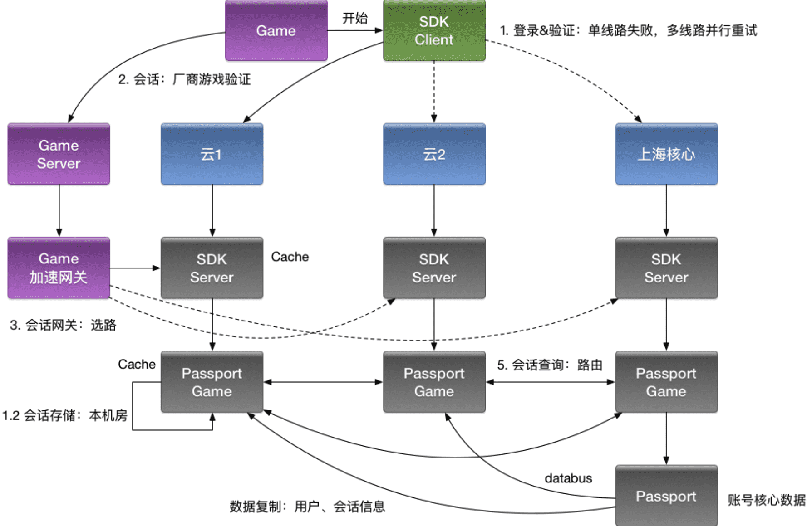

[TOC]

## 隔离易实现效果好

隔离，本质上是对系统或`资源`进行分割，从而实现当系统发生故障时能限定传播范围和影响范围，即发生故障后只有出问题的服务不可用，保证其他服务仍然可用。

相比其他微服务治理手段，*隔离是相对容易实现，并且效果比较明显的措施*，推荐优先考虑。

**常见的隔离方式**

服务隔离

- 动静分离、读写分离

轻重隔离

- 核心、快慢、热点

物理隔离

- 线程、进程、集群、机房

## 动静隔离

小到 CPU 的 cacheline false sharing、数据库 mysql 表设计中避免 bufferpool 频繁过期，隔离动静表，大到架构设计中的图片、静态资源等缓存加速。

本质上都体现的一样的思路，即加速/缓存访问变换频次小的。比如 CDN 场景中，将静态资源和动态 API 分离，也是体现了隔离的思路:

- 降低应用服务器负载，静态文件访问负载全部通过*CDN*。
- 对象存储存储费用最低。
- 海量存储空间，无需考虑存储架构升级。
- 静态*CDN*带宽加速，延迟低。

**WEB资源隔离**

1.web 前端使用单独(多个)的域名，在http1.1 时代可以突破浏览器同一域名并发访问的限制，还可以避免不必要的 cookie 传来传去；

2.CDN 加速，将静态资源和动态API 接口分离。

**冷热数据隔离**

数据库热点数据与非热点数据拆分到不同的表，即隔离动静表，这样可以避免 bufferpool 中的热点数据缓存频繁过期。

*MySQL BufferPool* 是用于缓存 *DataPage* 的，*DataPage* 可以理解为缓存了表的行，那么如果频繁更新 *DataPage* 不断会置换，会导致命中率下降的问题，所以我们在表设计中，仍然可以沿用类似的思路，其主表基本更新，在上游 *Cache* 未命中，透穿到 *MySQL*，仍然有 *BufferPool* 的缓存。

读写分离：主从、Replicaset、CQRS。

在其他 redis 缓存， cpu cache 等场景，进程内存缓存等也可以根据更新到频率，数据冷热进行分离来提升性能。其实也是 **时间局部性**和**空间局部性**的体现，短短的几个字却很多地方都有用到。

## 服务分级隔离

### 按服务重要性隔离

重要性低的服务不能影响核心服务，不可抢占核心服务的机器资源，带宽资源，不能过多抢占上游依赖资源影响核心应用。低优先级的服务故障不能影响核心服务。

根据服务的重要性，是否为核心服务，业务按照 Level 进行资源池划分(L0/L1/L2)，L0 重要性最高。

根据重要性的不同，进行隔离部署维护。必要时还可以优先堆重要性低的服务进行降级处理。

多集群，通过冗余资源来提升吞吐和容灾能力。

### 按请求快慢隔离

可以把服务的吞吐想象为一个池，当突然洪流进来时，池子需要一定时间才能排放完，这时候其他支流在池子里待的时间取决于前面的排放能力，耗时就会增高，对小请求产生影响。

案例：

有一个视频转码服务，绝大部分都是很短的视频，转码很快，突然有人上传几个超大的视频，导致视频转码服务被长时间占据，从而阻塞其他众多小视频的转码相应。对于这类问题，比较适合根据请求大小进行分类处理，比如根据大小 hash 到不同的服务上处理，互不影响。

日志传输体系的架构设计中，整个流都会投放到一个 *kafka topic* 中*(*早期设计目的*:* 更好的顺序*IO)*，流内会区分不同的 logid 会有不同的 sink 端，它们之前会出现差速，比如 HDFS 抖动吞吐下降，*ES* 正常水位，全局数据就会整体反压。

- 按照各种纬度隔离：*sink*、部门、业务、*logid*、重要性*(S/A/B/C)*。

业务日志也属于某个 *logid*，日志等级就可以作为隔离通道。

### 热点服务隔离

对热点进行单独特殊处理，防止热点给整个系统造成过大压力。

主动预热*:* 比如主动监控 topK 的热点，做主动防御。对于热点的 key 可以定期进行缓存刷新预热处理，还可以把 remote cache 转换为 local cache 处理，减少网络开销。

比如直播房间页高在线情况下*bypass* 监控主动防御。

对于缓存击穿问题，还可以主动缓存预热，利用 fan-in 对进行归并请求，避免给短时间内相同的请求压垮数据库。

## 物理隔离

### 线程隔离

线程池资源耗尽，是比较常见的故障。比如由于上游某个街口响应较慢，导致线程被堵住。

主要通过线程池进行隔离，也是实现服务隔离的基础。把业务进行分类并交给不同的线程池进行处理，当某个线程池处理一种业务请求发生问题时，不会把故障扩散到其他线程池，保证服务可用。

对于 Go 应用来说，所有 *IO* 都是 *Nonblocking*，且托管给了 *Runtime*，只会阻塞*Goroutine*，不阻塞 *M*，我们只需要考虑 *Goroutine* 总量的控制，不需要线程模型语言的线程隔离。

### 进程隔离

基于 namespace 和 cgroup 进行隔离。当下比较流行的容器部署，K8S 。

### 集群隔离

多集群方案，即逻辑上是一个应用，物理上部署多套应用，通过 *cluster* 区分。

多活建设完毕后，我们应用可以划分为： *region.zone.cluster.appid*

## 案例

- 早期转码集群被超大视频攻击，导致转码大量延迟。转码很多8h小时的大视频，导致其他短视频被堵住 。轻重请求隔离
- 同一个物理机，多个mysql 实例用 cgroup 做资源限制隔离，如大 SQL 引起的集体故障，避免相互影响；
- info 日志过多，导致 error 日志被吞了，日志采集延迟。

- 入口Nginx(SLB)故障，影响全机房流量入口故障。
- 缩略图服务，被大图实时缩略吃完所有 CPU，导致正常的小图缩略被丢弃，大量503。

# 其他

TODO

存储和计算的分离

CDN 动态加速 ？

fan-in 合并请求  边缘计算

同时 操作一个结构体的两个字段 没有data race 但是易 [false sharing](https://www.cnblogs.com/cyfonly/p/5800758.html)

- 怎加 cache line

## 热点隔离主动预热

热点即经常访问的数据。很多时候我们希望统计某个热点数据中访问频次最高的 Top K 数据，并对其访问进行缓存。

比如：

小表广播*:* 从 *remotecache* 提升为 *localcache*，*app* 定时更新，甚至可以让运营平台支持广播刷新 *localcache*。

[*atomic.Value*](https://pkg.go.dev/sync/atomic#example-Value-ReadMostly)

主动预热*:* 比如直播房间页高在线情况下*bypass* 监控主动防御。主动监控topK的热点，做主动防御。

- 

