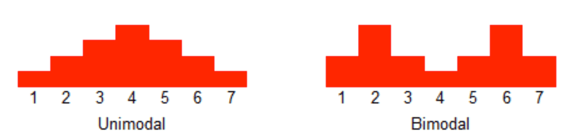

# 超时控制——本质是快速失败

[TOC]


超时控制是微服务可用性的第一道关，良好的超时策略，可以尽可能让服务不堆积请求，尽快清空高延迟的请求，释放线程资源。

高延迟的调用，往往会导致调用方阻塞等待，就算的异步的请求，也是需要一定的线程或内存资源开销，过多甚至会导致线程资源耗尽 OOM 等问题。

任何可能阻塞的地方都应该有超时控制。

对于网络应用，`连接超时，写超时，读超时`三个超时一个都不应该漏掉，应该有默认值，可配置，可通过 kit 基础库兜底默认超时。

客户端和服务端不一致的超时策略导致资源浪费.

## 全局超时控制

使用超时传递*:* 进程间传递 *+* 超时传递。

**超时传递**: 超时传递指的是把当前服务的剩余时间 Quota 传递到下游服务中，继承超时策略，从而实现请求级别的全局超时控制。


### 进程内超时控制

服务内进(线)程建超时控制，可能耗时阻塞，函数调用加超时控制，比如在 Go 中很多地方都会通过 context 对象显示地进行超时控制。

一个请求在每个阶段*(*网络请求*)*开始前，就要检查是否还有足够的剩余来处理请求，以及继承他的超时策略，使用 Go 标准库的 `context.WithTimeout` 进行超时控制。

```go
func example() {
    ...
	c := pb.NewEchoClient(conn)
	ctx, cancel := context.WithTimeout(context.Background(), 3*time.Minute)
	defer cancel()
	res, err := c.UnaryEcho(ctx, &pb.EchoRequest{Message: "keepalive demo"})
	...
}
```

### 服务间超时传递

1. A gRPC 请求 B，1s超时。
2. B 使用了300ms 处理请求，再转发请求 C。
3. C 配置了600ms 超时，但是实际只用了500ms。
4. 到其他的下游，发现余量不足，取消传递。

在需要强制执行时，下游的服务可以覆盖上游的超时传递和配额。


gRPC 支持超时传递，级联取消。 在 gRPC 框架中，会依赖 *gRPC Metadata Exchange*，基于 *HTTP2* 的 *Headers* 传递 *grpc-timeout* 字段，自动传递到下游，构建带 *timeout* 的 *context*。

```go

if v := r.Header.Get("grpc-timeout"); v != "" {
    to, err := decodeTimeout(v)
    if err != nil {
        return nil, status.Errorf(codes.Internal, "malformed time-out: %v", err)
    }
    st.timeoutSet = true
    st.timeout = to
}

func (t *http2Client) createHeaderFields(ctx context.Context, callHdr *CallHdr) ([]hpack.HeaderField, error) {
    ...
    if dl, ok := ctx.Deadline(); ok {
		timeout := time.Until(dl)
		headerFields = append(headerFields, hpack.HeaderField{Name: "grpc-timeout", Value: encodeTimeout(timeout)})
	}
    ...
}
```


服务间应避免超时不一致导致资源浪费。例如，一个 终端 APP 请求 Service A ，超时为 5 秒； Service A 又依赖一个 Account 服务，超时设置为 10秒，这就出现了超时不一致，当终端 App 5秒超时后，取消请求，但是 Service A 依然在执行对 Account 服务的请求，这就造成了资源的浪费。


## 超时配置

- 对于监控不要只看平均值，可以看看耗时分布统计，比如 95th，99th。
- 双峰分布: 95%的请求耗时在100ms内，5%的请求可能永远不会完成(长超时)。
- 设置合理的超时，拒绝超长请求，或者当Server 不可用要主动失败。





## 案例

- SLB 入口 Nginx 没配置超时导致连锁故障。
- 服务依赖的 DB 连接池漏配超时，导致请求阻塞，最终服务集体 OOM。
- 下游服务发版耗时增加，而上游服务配置超时过短，导致上游请求失败。

