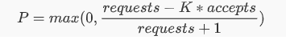
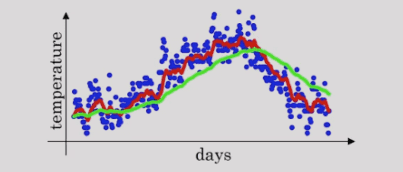

[TOC]


服务器临近过载时，主动抛弃一定量的负载，达到自我保护的目的。实现在系统稳定的前提下，保持吞吐量。

当一个系统过载时, 就要有些东西要被牺牲掉。一旦一个服务越过了临界点, 返回降级结果要比尝试继续服务所有请求要好。理解这些临界点所在, 以及超过临界点系统的行为模式, 是所有想避免连锁故障的运维人员所必需的。 


## 全局过载

过载需要关注的不只是单个服务自身，其依赖的其他服务如 DB，缓存，其他应用系统等。

过载应对策略重要的一个部分是如何处理全局过载( global overload)的情况。全局过载情况在实际运行中出现得非常频繁，尤其是那些被很多队使用的内部服务。

## 服务端用户级限制

Google sre 中提出从后端公共服务给每个客户端设置使用资源限制。比如有 10000个 CPU，

- 邮件服务( Gmail)允许使用 4,000 CPU (每秒使用4,000个CPU) 

- 日历服务( Calendar)允许使用 4,000 CPU 

- 安卓服务( Android)允许使用 3,000C PU 

- Google+允许使用 2,000 CPU 

- 其他用户允许使用 500 CPU

总和会超过该后端服务总共分配的10000CPU容量, 因为所有用户都同时将他们的资源配额用满是一种非常罕见的情况。

随后从所有的后端任务中实时获取用量信息, 并且使用这些数据将配额调整信息推送给每个后端任务。

要实现起来需要写了相当多的代码。一个技术难点是实时计算每个请求所消耗的资源(尤其是CPU)。这种计算对某些不是按“每个请求一个线程”模式设计的软件服务器尤其困难, 这种软件用非阻塞API和线程池模式来处理每个请求的不同阶段。

## 客户端限流

当某个用户超过资源配额时, 后端会迅速拒绝该请求, 虽然该回复比真正处理该请求所消耗的资源少得多。但是当请求足够多的时候，光是回复快速回复 429 ，也可能给系统造成较大负担。

这时，可以考虑从客户端进行限流。当客户端检测到最近的请求错误中的大部分都是“配额不足”, 该客户端开启自行限制它自己生成请求的数量。超过这个请求数量限制的请求直接在本地回复失败,而不会真正发到씨络层。这个和熔断类似，其实熔断就是一种客户端限流手段。

当系统出现故障或是负载高导致超市时，用户通常会积极的重试，这就导致了进一步加剧了系统的压力，所以直接从客户端进行限流是相对低成本的措施。

[Doorman](https://github.com/youtube/doorman) 是一个提供了一个协作性分布式客户端节流系统解决方案。


### 自适应节流-推荐⭐️

每个客户端记录过去两分钟内的以下信息:

- 请求数量 (requests)
- 请求接受数量( accepts), 后端任务接受的请求数量。

在正常情况下，requests == accepts ，当服务端负载开始拒绝请求时会出现 requests > accepts 。设置一个阈值 K

```
requests = K * accepts
```

当发送的请求等于接受到的 K 倍时，开始以一定的概率拒绝客户端的请求，截止返回失败，而不用把请求发出去。



在分母加 1，可以避免在请求很少时全部失败时的特殊情况，避免小样本时请求全部被拒绝。

根据公式，当  requests = K * accepts 时，恰好拒绝概率 P 是 0， 随着 accetps 相对 requests 减小，P 会越来越大。即请求失败的越多，后面被拒绝发送的概率越大，随着请求响应的恢复，P 会逐渐减下，直到客户端关闭限流。

K 值影响截流的效果，

- 降低 K 会使自适应节流算法更加激进；

- 增加 K 值会使该算法变得不再那么激进；

通常推荐 K = 2，通过允许后端接收到比期望值更多的请求, 浪费了一定数量的后端资源, 但是却加快了后端状态到客户端的传递速度。当后端停止拒绝该客户端的请求之后, 客户端检测到这个变化的耗时就会减小，即能更快的恢复。

这种自适应节流算法实现很巧妙。客户端完全依靠本地信息来做出决定, 同时实现算法相对简单:不增加额外的依赖,也不会影响延迟。在实际中效果良好, 可以整体上保持一个非常稳定的请求速率。即使在超大型的过载情况下, 后端服务基本上可以保持 50% 的处理率。

## 请求分级

根据请求的重要性(criticality)，为请求划分不同的等级：

- 最重要 `CRITICAL PLUS`： 最重要的请求预留的类型, 拒绝这些请求会造成非常严重的用户可见的问题。

- 重要 `CRITICAL`：默认请求类型。拒绝这些请求也会造成用户可见的问题, 但是没有 `CRITICAL PLUS` 严重。原则上要求服务必须为所有的 `CRITICAL` 和 `CRTICAL PLUS` 流量配置相应的资源 。
- 可丢弃的 `SHEDDABLE PLUS`: 可以容忍某种程度的不可用性。这是批量任务发出的请求的默认值。这些请求通常可以过几分钟, 或者几小时之后重试。
- 可丢弃的 `SHEDDABLE`: 这些流量可能会经常遇到部分不可用情况, 偶尔会完全不可用。

可以把重要性作为 RPC 系统的一级属性，作为 RPC 的一个 metadata 对流量进行染色，在不同的系统间自动传递，当系统过载时，无论是服务端限流还是客户端自适应限流，都可以根据请求的重要性，优先拒绝重要性低的请求。


## 根据请求开销设置容量阈值

### QPS陷阱

**QPS陷阱——不推荐用 QPS 来规划容量和阈值**

不同的API其内部依赖的资和实现逻辑往往差异很大，单纯的看 QPS 往往并不能客观的反映系统的请求量和压力，也并不好依赖简单的 QPS 给系统定一个容量阈值。

Google Sre 的说法: 按照QPS来规划服务容量，或者是按照某种静态属性一般是错误的选择。就算这个指标在某一个时间段内工作还算良好, 早晚也会发生变化。有些变动是逐渐发生的, 有些则是非常突然的(例如某个软件的新版本突然使得某些请求消耗的资源大幅减少)。这种不断变动的目标,使得设计和实现良好的负载均衡策略使用起来非常困难。

比如用漏单限流和令牌桶限流，伴随着业务的迭代等因素，要设定一个既能充分利用系统资源，又能保护系统的阈值就不太好设置，就算短时间内能表现很好，但是在从长期看来也难以适应变化。

###用资源来衡量系统容量

**更好的解决方案是直接以可用资源来衡量可用容量**。比如一个集群内有 64 核 CPU，256 G 的内存，用这些数据作为容量的重要依据。

可以某个请求的“成本”定义为该请求在正常情况下所消耗的CPU时间(要考虑不同CPU类型的性能差异)。在大部分情况下, 简单地使用 CPU 数量作为资源配给的主要参考就可以工作得很好, 因为:

- 在有垃圾回收(GC)机制的编程环境里,内存的压力通常变成CPU 的压力(在内存受限的情况下,GC会增加)；
- 在其他编程环境里,其他资源一般可以通过某种比例进行配置；

如果光靠 cpu 资源不够的话，可以将其他资源一起计算进来来进行容量评估。

比较理想的根据请求所消耗的系统资源来设置系统的一些阈值。


### 根据 CPU 使用率过载保护

容器 cpu 资源使用这么准确计算。

在偶发流量波动时，也会把 CPU 瞬间的使用率推的很高，但这只是短暂的，这中情况不应该打开过载保护开关。

由于过载保护开启到下一次判断是否关闭开关会有一段时间窗口，如果因为瞬间的 CPU 高峰开启过载保护，会导致后面的一段时间内的正常请求被被系统拒绝。所以在计算 CPU 使用率作为过载的开启指标时，需要抖动的波峰，波谷做平滑处理，`降低抖动的影响`。

我们可以，使用一个独立的线对 cpu 使用进行程采样，每隔 250ms 触发一次。在计算均值时，我们可以使用指数加权平均算法(exponentially weighted average) 计算最近几个滑动窗口的采样数据计算滑动平均值。当达到一定阈值时开启过载保护。

- `inflight` 当前服务中正在进行的请求的数量;
- `pass` 为每100ms采样窗口内成功请求的数量;
- `rt` 为单个采样窗口中平均响应时间;


@TODO


如何计算接近峰值时的系统吞吐？

- *CPU:* 使用一个独立的线程采样，每隔 *250ms* 触发一次。在计算均值时，使用了简单滑动平均去除峰值的影响。
- *Inflight:* 当前服务中正在进行的请求的数量。
- *Pass&RT:* 最近*5s*，*pass* 为每*100ms*采样窗口内成功请求的数量，*rt* 为单个采样窗口中平均响应时间。


### 资源利用率信号

我们的任务过载保护是基于资源利用率(utilization)实现的。在多数情况下,资源利用率仅仅是指目前CPU的消耗程度(目前CPU使用量除以全部预留CPU数量)。但是在某些情况下,同时也会考虑内存的使用率。

随着资源利用率的上升, 根据请求的重要性来拒绝一些请求(高重要性的请求对应高阈值)。

资源利用率信号是完全基于本地信息计算，其主要目的也是保护自身。

针对不同的信号有具体的实现。一个比较有用的信号是基于进程的“负载”, 这是通过一个所谓的执行器负载均值( executor load average)决定的。

要计算执行器负载均值, 统计整个进程中的活跃线程数。“活跃”指那些正在运行,或者已经准备好运行, 但是正在等待空闲CPU的线程。

突发性的大批短时请求, 会导致负载值急剧上升, 我们可以利用`指数性衰变算法( exponential decay)` 来平滑这个值。但是这个平滑过程基本上会将这个突发情况处理掉。

系统 top 命令的负载有一定的滞后性。分表表示 1 ， 5， 15 分钟的负载。

除了用系统负载作为资源利用率信号, 也可以接入后端自己定义的任意资源利用率信号。内存，磁盘，带宽等。例如,我们可能会使用内存压力一表明了后端任务的内存使用率是否已经超出了正常运行范围。我们还可以同时配置多个信号, 在超过目标利用率阈值的时候开始拒绝请求。


## 处理过载错误

如果大部分后端任务都处于过载状态, 请求应该不再重试, 而应该向终端用户发送一个错误信息。

在更常见的、小部分任务过载的情况下, 我们更倾向于立即重试该请求，需请求幂等，同时应遵循指数退让的原则，避免重试加重系统负担。

控制重试次数上限，如 3 次。

控制重试比例，避免重试爆炸。

避免多层不必要的充实，必要时返回 “系统过载，无需重试”。*层级失败传递*是每个大型系统都必须考虑的关键点。


## 服务降级

应对过载的一个选项是服务降级:返回一个精确度降低的回复,或者省略回复中一些需要大量计算的数据。例如

- 平时在整个文档库中进行捜索、以针对某个查询返回最佳结果。而过载情况下仅仅在文档库的一小部分中进行搜索。
- 使用一份本地缓存的数据代替从远端获取数据、这个数据可能不是最新的数据。

然而,在极端的过载情况下,服务甚至可能连这种降级回复都无法生成，这时候需配合通过在数据中心之间调度流量, 让每个数据中心都有足够的容量来处理请求。


## 涉及算法

### 利特尔法则——计算容量

利特尔法则(Little's Law)

```
L = ℷW
```

L = 系统中平均物体的数量

W = 物体在系统中的平均等待时间（逗留时间）

ℷ = 物体进入系统的速率

我们可以用利特尔法则来评估系统的容量。

一个窗口，每个人服务需要 4 分钟，每分钟有两人进来，大概要排多长的队？ W = 4， ℷ = 2，所以 L = 8。类似的例子在生活中还有很多。

我们也可以根据利特尔法则，来计算系统的等待队列长度。


### Codel算法——控制延迟

Codel(control delay), 可控延迟算法。在网络传输中常用，旨在解决缓冲区膨胀问题。

CoDel 算法则是一种更加智能的防止网络拥塞算法，它的核心思想是：当队列中的排队的数据包过多时开始丢弃数据包，丢弃的数据包是从队列的前面开始有选择的丢弃，而不是先处理直到不能处理了再把后面的丢弃。该思想是先查看每一个处理的数据包的等待时间，默认 5ms，如果等待超过5ms，那么说明队列可能拥堵了，这是会丢弃该数据包，继续查看下一个数据包的等待时间。

Codel主要目的是将缓冲区队列中的数据包延迟控制在最小延迟(5毫秒)以下。 如果最小延迟上升到一个太大的值，则将数据包从队列中丢弃，直到延迟降至最大级别以下。


同样的 `fq_codel` 是 `CoDel` 的变体，代表“ 公平排队控制延迟”。它在OpenWrt版本“ Barrier Breaker”中被用作标准活动队列管理（AQM）和数据包调度解决方案。自这之后，CoDel和fq_codel 迁移到了各种下游项目，例如 Tomato ， dd-wrt 和 OPNsense 。

我们可以使用可控延迟算法作为兜底方案来处理请求堆积问题。即在请求堆积过多时，根据超时阈值快速丢弃请求。

### 指数加权平均算法

指数加权平均算法（exponentially weighted average），

定义一年内每一天的温度是 a1，a2，a3·····a365；

计算出v1，v2，v3····v365 来代替每一天的温度(a1，a2，a3·····)；

```
v1 = v0 * 0.9 + a1 * (1-0.9)
v2 = v1 * 0.9 + a2 * (1-0.9)
v3 = v2 * 0.9 + a3 * (1-0.9）
...
```

每一天的温度改变为前一天的 v 值的 0.9 倍 + 当天的温度都 0.1 倍。这样做的好处是拟合温度曲线时，把历史温度计算进去了，降低了当天温度突变带来的曲线抖动问题。

即可以得到公式:

```
vᵗ= vᵗ⁻¹ * β + aᵗ * (1 - β)    =>   Vᵗ = β * Vᵗ⁻¹ + (1-β)*NewSample
```

vt ≈ 1/(1 - β) 天的平均温度, 如β等于 0.9 则 vt 等于前十天的平均温度。若 β 等于 0.98，vt 等于 50 天的平均温度。即 β 接近于 1，当前温度参考的天数越多，曲线也就越平滑，但是变化趋势也就相对滞后。如图中的绿色曲线。反之减小 β 的值，曲线变化更能反映近期温度的变化情况，但是波动也更明显，如红色曲线。



demo：

```go
const decay = 0.8

func WeightAvg() {
	data := []float64{7, 11, 8, 15, 5, 20, 14, 13, 12, 11, 13, 19}
	prev := (data[0] + data[1])/2

	for _, d := range data {
		fmt.Printf("%-6.2f", d)
	}
	println()
	for _, d := range data {
		current := prev * decay + d * (1.0 - decay)
		fmt.Printf("%-6.2f", current)
		prev = current
	}
	println()
}
```

运行

```
decay = 0.4
原数据   7.00  11.00 8.00  15.00 5.00  20.00 14.00 13.00 12.00 11.00 13.00 19.00 
拟合后   7.40  10.28 8.46  13.69 6.74  17.35 14.67 13.33 12.27 11.25 12.65 17.73 

decay = 0.4
原数据   7.00  11.00 8.00  15.00 5.00  20.00 14.00 13.00 12.00 11.00 13.00 19.00 
拟合后   7.80  9.72  8.69  12.48 7.99  15.20 14.48 13.59 12.64 11.65 12.46 16.38 

decay = 0.8
原数据   7.00  11.00 8.00  15.00 5.00  20.00 14.00 13.00 12.00 11.00 13.00 19.00 
拟合后   8.60  9.08  8.86  10.09 9.07  11.26 11.81 12.05 12.04 11.83 12.06 13.45 
```


指数移动平均线是一种计算平均线的高效方法。不需要太多的内存或计算能力来计算这个平均值。

我们可以使用指数加权平均算法来计算 CPU 使用情况，从而根据 CPU 实现过载保护。

```
cpu = cpuᵗ⁻¹ * decay + cpuᵗ * (1 - decay)
```

如,在 kratos 中的实现 [bbr.cpuproc()](https://github.com/go-kratos/kratos/tree/master/pkg/ratelimit/bbr)


## TODO

指数性衰变算法平滑抖动的影响， 代码实现 ？

容器 cpu 使用率采样


## reference

《Google SRE》

https://medium.com/@dhartidhami/exponentially-weighted-averages-5de212b5be46

https://medium.com/datadriveninvestor/exponentially-weighted-average-for-deep-neural-networks-39873b8230e9


