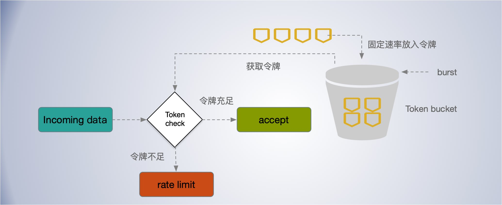
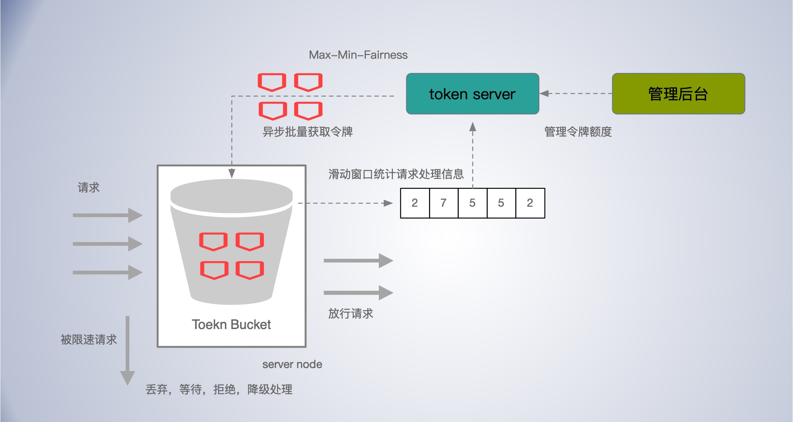

[TOC]

## 限流目的

1.保护系统。最常见的速率限制原因是避免资源耗尽，来提高服务的可用性。

2.多租户配额管理，如果服务的容量是在多个用户或使用者之间共享，则可以对每个用户应用速率限制，以提供合理的使用，而不影响其他用户。

3.控制流。在处理大量数据和消息的复杂关联系统中，可以使用速率限制来控制这些流。防止单个节点在其他节点空闲时累积未处理项队列，确保系统中的每个节点都有同等的机会来完成工作。

4.避免费用超额。


## 限流算法

### 漏桶算法——排队匀速消费

漏桶算法(The Leaky Bucket Algorithm)可以用于流量整形和流量控制，漏桶算法的描述如下：

- 一个固定容量的漏桶；

- 以任意速率流入水滴到漏桶, 如果桶满了，则流入的水滴溢出了（被丢弃）
- 按照常量固定速率流出水滴，如果桶空了，则无流出水滴。

漏桶算法实现： [go.uber.org/ratelimit](https://github.com/uber-go/ratelimit)


漏桶可以看作是一个带有常量服务时间的单服务器队列，如果漏桶（包缓存）溢出，那么数据包会被丢弃。

- 到达的数据包被放置在底部具有漏孔的桶中（数据包缓存）；

- 漏桶最多可以排队 b 个字节，漏桶的这个尺寸受限于有效的系统内存。如果数据包到达的时候漏桶已经满了，那么数据包应被丢弃；

- 数据包从漏桶中漏出，以常量速率（r字节/秒）注入网络，因此平滑了突发流量。


**小结**

漏桶算法提供了一种简单、直观的方法来通过队列限制速率，可以将队列视为保存请求的桶。注册请求时，请求被追加到队列的末尾。按照固定的速率处理请求，每隔一段时间，就会处理队列上的第一项。这也称为先进先出(FIFO)队列。如果队列已满，则会丢弃(或泄漏)其他请求。

这种算法的优点是它平滑了请求的突发的请求，队列(桶)就是缓冲区的大小，并以稳定的速度处理它们。它也很容易在单个服务器或负载均衡器上实现，并且由于队列大小有限，对每个用户来说内存效率很高。

然而，当旧的请求填满队列，使最近的请求无法处理。它也不能保证在固定的时间内处理请求。

如果为了容错或提高吞吐量，则必须使用策略来协调和执行它们之间的限制。这就需要结合负载平衡服务器和分布式限流。


### 令牌桶算法——允许突发整体限速 

是一个存放固定容量令牌的桶，按照固定速率往桶里添加令牌。令牌桶算法(Token bucket)的描述如下：

- 桶的容量为 b 个令牌，起初桶装满了令牌；

- 按照一定的速率往桶里添加令牌(token)，比如 2 r/s ，即每秒往桶里添加 2 个令牌，当桶满时，新添加的令牌被丢弃或拒绝；

- 当收到请求时从桶中获取令牌，拿到令牌到请求才可以继续后面的处理逻辑；桶中令牌不足时，请求要要么等待，要么丢弃(拒绝)；



令牌桶算法：允许突发流量，瞬时速率未做限制。


Go token bucket 实现： https://godoc.org/golang.org/x/time/rate#Limiter

`rate.Limiter` 有三种主要方法:  `Wait`, `Allow`, `Reserve`, 其中 `Wait`, `Allow` 是基于 方法 `Reserve` 实现。 大多数调用者应该使用 Wait。这三个方法中的每次调用都消耗一个令牌。

但是当没有可用的令牌时，它们的行为是不同的。

- 如果没有可用的令牌，`Allow` 返回 false。
- 如果没有可用的令牌，`Reserve` 将返回对未来令牌的预订，以及调用者在使用它之前必须等待的时

- 如果没有可用的令牌，`Wait` 阻塞，直到可以获得一个令牌或其相关的上下文。可以传入 context 来控制等待时间。

```go
func AllowTest() {
	// 每秒放入 1个令牌， 桶的容量为 2
	lim := rate.NewLimiter(2, 5)

	for i := 1; i <= 100; i++ {
		if !lim.Allow() {
			fmt.Print(" = ")
		} else {
			fmt.Print(" || ")
		}
		if i % 20 == 0 {
			fmt.Println("\n sleeping...5s...wait for token refilled")
			time.Sleep(time.Second * 5)
		} else {
			time.Sleep(time.Millisecond * 200)
		}
	}
}

// 使用 Wait 没有令牌时会阻塞等待
func WaitTest() {
	// 每秒放入 1 个令牌， 桶的容量为 2
	lim := rate.NewLimiter(1, 2)

	for i := 0; i < 50; i++ {
		if err := lim.Wait(context.Background()); err != nil {
			log.Panic(err)
		}
		fmt.Println("working...")
		time.Sleep(time.Millisecond * 500)
	}
}
```

上述 AllowTest 方法到输出：

```
 ||  ||  ||  ||  ||  ||  ||  =  ||  =  ||  =  =  ||  =  ||  =  =  ||  = 
 sleeping...5s...wait for token refilled
 ||  ||  ||  ||  ||  ||  ||  =  ||  =  ||  =  =  ||  =  ||  =  =  ||  = 
 sleeping...5s...wait for token refilled
 ||  ||  ||  ||  ||  ||  ||  =  ||  =  ||  =  =  ||  =  ||  =  =  ||  = 
 sleeping...5s...wait for token refilled
 ||  ||  ||  ||  ||  ||  ||  =  ||  =  ||  =  =  ||  =  ||  =  =  ||  = 
 sleeping...5s...wait for token refilled
 ||  ||  ||  ||  ||  ||  ||  =  ||  =  ||  =  =  ||  =  ||  =  =  ||  = 
 sleeping...5s...wait for token refilled

```

`||` 表示获取到 token 请求被处理， `=` 表示未取到 token 请求被丢弃，刚开始桶水满的，请求都被处理了，后面 token 不足了，请求处理速度被 token 都放入速度限制住了。等休眠 5 秒后，桶里积累了 5 个 token 又可以连续处理了，既实现了应对突发又限制了整体的速度。


令牌桶算法是网络流量整形（Traffic Shaping）和速率限制（Rate Limiting）中最常使用的一种算法。

典型情况下，*令牌桶算法用来控制发送到网络上的数据的数目*，并允许突发数据的发送。

具体来讲，传送到令牌桶的数据包需要消耗令牌。不同大小的数据包，消耗的令牌数量不一样。令牌桶中的每一个令牌都代表一个字节。如果令牌桶中存在令牌，则允许发送流量；而如果令牌桶中不存在令牌，则不允许发送流量。具体为：

- 假如用户配置的平均发送速率为r，则每隔1/r秒一个令牌被加入到桶中；

- 假设桶最多可以存发b个令牌。如果令牌到达时令牌桶已经满了，那么这个令牌会被丢弃；

- 当一个 n 个字节的数据包到达时，就从令牌桶中删除 n 个令牌，并且数据包被发送到网络；

- 如果令牌桶中少于n个令牌，那么不会删除令牌，并且认为这个数据包在流量限制之外；

算法允许最长 b 个字节的突发，但从长期运行结果看，数据包的速率被限制成常量 r。对于在流量限制外的数据包可以以不同的方式处理：

- 直接丢弃；

- 它们可以排放在队列中以便当令牌桶中累积了足够多的令牌时再传输；

- 它们可以继续发送，但需要做特殊标记，网络过载的时候将这些特殊标记的包丢弃。


**漏桶&令牌桶限流区别**

这两者看起来类似，但是具有截然不同的特性，应用场景也有区别。

- `令牌桶`算法有一定的`缓冲`容量，限制的平均流速，允许`瞬时流量波动`，能够处理一些突发性的流量，应对突发效果取决越 burst 的大小，即桶的容量，

- `漏桶`算法强行限制数据的传输速率，也是因为`速率固定`，应对突发流量，效果不好。

通常，漏桶算法与令牌桶算法结合起来为网络流量提供更高效的控制。令牌桶可以用来保护自己，防止被突发流量打垮。


而漏桶算法，这是用来保护他人，也就是保护他所调用的系统。

主要场景是，当调用的第三方系统本身没有保护机制，或者有流量限制的时候，我们的调用速度不能超过他的限制，由于我们不能更改第三方系统，所以只有在主调方控制。这个时候，即使流量突发，也必须舍弃。因为消费能力是第三方决定的。


**漏桶&令牌桶限流的局限**

漏桶和令牌桶限流用于限流保护系统时，其防护思路都是设定一个指标, 当超过该指标后就阻止或减少流量的继续进入，当请求量降低到某一水平后则恢复流量的进入。实际效果取决于限流阈值设置是否合理，但往往设置合理不是一件容易的事情。考虑到系统扩容时，代码变更，应用发版时。就算短时间内设置合理了，也很难长时间的与系统很好的匹配。

*理想的限流应该是根据系统当前的负载情况自适应地限流，而无需人工介入*。

### 固定窗口

在固定窗口算法中，使用n秒的窗口大小(通常使用对人友好的值，如60或3600秒)来跟踪速率。每个传入的请求都会增加窗口的计数器。如果计数器超过阈值，请求将被丢弃。

这种算法的优点是，它确保处理更近期的请求，而不会被旧请求饿死。然而，发生在窗口边界附近的一次流量突发可能导致处理请求的速度增加数倍，因为它将在短时间内允许针对当前窗口和下一个窗口的请求。


### 滑动窗口

滑动窗口（Sliding window），常常作为流量控制技术。

早期的网络通信中，通信双方不会考虑网络的拥挤情况直接发送数据。由于大家不知道网络拥塞状况，同时发送数据，导致中间节点阻塞掉包，谁也发不了数据，所以就有了滑动窗口机制来解决此问题。

将一个大的时间窗口分成多个小窗口，每次大窗口向后滑动一个小窗口，

例如，我们可以把一个时间窗口划分成 5 个 bucket， 每个 bucket 统计一个 1s 的请求数量。窗口总的请求量限制为 5 秒 50 次，每个 bucket 的请求量上限为 20 次，计数期间，无论是 bucket 还是窗口触发了请求限制，都拒绝请求。每经过 1s，有一个新的 bucket 加入窗口，早于当前时间 5s 的 bucket 被移除。


应对流量波动和突发流量，将单位时间窗口切的足够的小来缓解，每个 bucket 的最大值可以适当比滑动窗口的总量均分到每个 bucket 的大，这样可以对应一部分的突发，同时也限制请求过于集中在一个小的 bucket 之中。通过 window 窗口和 bucket 两个维度，来较好的突发于限速。

这是一种结合了固定窗口算法的低处理成本和改进的滑动测井边界条件的混合方法。像固定窗口算法一样，我们为每个固定窗口跟踪一个计数器。接下来，我们根据当前时间戳计算上一个窗口请求速率的加权值，以平滑流量突发。例如，如果当前窗口是25%，那么我们将前一个窗口的计数加权为75%，（详情见过载保护——指数加权平均算法）。跟踪每个键所需的数据点数量相对较少，这允许我们在大型集群中扩展和分布。

推荐滑动窗口方法，因为它提供了伸缩性来限制扩展速率，同时具有良好的性能。速率窗口是向API消费者呈现速率限制数据的一种直观方式。它还避免了漏桶的饥饿问题(在桶里排队)和固定窗口流量陡增问题。


## 客户端限流

除了服务端限流，客户端限流也能发挥很大的作用。在分布式系统中的许多组件既是客户端又是服务器。

当某个用户超过资源配额时, 后端会迅速拒绝该请求, 虽然该回复比真正处理该请求所消耗的资源少得多。但是当请求足够多的时候，光是回复快速回复 429 ，也可能给系统造成较大负担。

这时，可以考虑从客户端进行限流。当客户端检测到最近的请求错误中的大部分都是“配额不足”, 该客户端开启自行限制它自己生成请求的数量。超过这个请求数量限制的请求直接在本地回复失败,而不会真正发到씨络层。这个和熔断类似，其实熔断就是一种客户端限流手段。

[Doorman](https://github.com/youtube/doorman) 是一个提供了一个协作性分布式客户端节流系统解决方案。


### 客户端自适应节流

每个客户端记录过去两分钟内的以下信息:

- 请求数量 (requests)
- 请求接受数量( accepts), 后端任务接受的请求数量。

在正常情况下，requests == accepts ，当服务端负载开始拒绝请求时会出现 requests > accepts 。设置一个阈值 K

```
requests = K * accepts
```

当发送的请求等于接受到的 K 倍时，开始以一定的概率拒绝客户端的请求，截止返回失败，而不用把请求发出去。


> $$
> P = max(0, \frac{requests - K*accepts}{requests + 1})
> $$

在分母加 1，可以避免在请求很少时全部失败时的特殊情况，避免小样本时请求全部被拒绝。

根据公式，当  requests = K * accepts 时，恰好拒绝概率 P 是 0， 随着 accetps 相对 requests 减小，P 会越来越大。即请求失败的越多，后面被拒绝发送的概率越大，随着请求响应的恢复，P 会逐渐减下，直到客户端关闭限流。

K 值影响截流的效果，

- 降低 K 会使自适应节流算法更加激进；

- 增加 K 值会使该算法变得不再那么激进；

通常推荐 K = 2，通过允许后端接收到比期望值更多的请求, 浪费了一定数量的后端资源, 但是却加快了后端状态到客户端的传递速度。当后端停止拒绝该客户端的请求之后, 客户端检测到这个变化的耗时就会减小，即能更快的恢复。

这种自适应节流算法实现很巧妙。客户端完全依靠本地信息来做出决定, 同时实现算法相对简单:不增加额外的依赖,也不会影响延迟。在实际中效果良好, 可以整体上保持一个非常稳定的请求速率。即使在超大型的过载情况下, 后端服务基本上可以保持 50% 的处理率。


## 分布式系统限流

在使用多个节点的集群时强制执行全局速率限制。

分布式限流实现相对单机要复杂，需要考虑中心热点问题，网络延迟问题，并发竞争，公平分配，动态调整配额等许多问题。如果分配不公平，可能出现个别节点负载过高，拒绝请求，而有的节点却处于饥饿状态。

### 集中式数据存储计数

利用负载平衡规则的使用集中式的数据存储，如 Redis 或 Cassandra。这将存储每个窗口和消费者的计数。使用集中式存储容易产生中心热点问题，主要问题是向数据存储发出请求的延迟增加，以及竞争条件，以及热点自身的瓶颈。

**并发竞争**

集中式数据存储的最大问题之一是在高并发请求模式中可能出现竞争条件。当您使用简单的`“get-then-set” `方法时，即检索当前速率限制计数器，累加，然后将数据存储。这里就设计并发竞争问题。

最简单的办法是**加锁**，但这很容易成为性能瓶颈，并且不好扩展，特别是当使用像 Redis 这样的远程服务器作为数据存储时。

一种更好的方法是使用 `“set-then-get”` 的心态，依赖高性能的方式实现锁的原子操作符。


**网络延迟**

使用集中式数据存储的另一个缺点是在检查速率限制计数器时延迟增加。即使像 Redis 这样的最快的存储解决方案之一，每个请求都会导致毫秒的额外延迟。

可以使用节点本地单独统计，按一定的频率定期同步到 redis 。节点收敛的周期速率应该是可配置的。

例如，每个节点都可以创建一个与集中式数据存储同步的数据同步周期。每个节点周期性地将每个消费者的计数器增量和它看到的窗口推送到数据存储。然后，节点可以检索更新后的值来更新它的内存总计数。从而实现最终是一致的。


> 类似这种做法，是在系统设计中提高性能常用的措施，从这里面，我们看到了批量处理的影子，合并请求，归并回源，强一致性转为最终一致性的等等。说法虽不同，但是都有相似之处。
>
> 比如，kafka 消息批量发送，来提升吞吐； CDN 多级归并回源，减少回源压力；缓存击穿合并请求，避免压垮db；在 Go 中向通道发送数据，通道低层也有锁操作，我们可以把消息打包批量发送，同样可以大福提升吞吐能力；操作系统利用缓冲区中批量刷磁盘等等。
>
> 这种做法会带来一些延迟，甚至在宕机时还会丢失部分数据，不过在很多业务场景下，这都是可以接受的代价。换来的性能提升却是非常显著的。


### 方案：中心存储-令牌桶分布式限流

中心节点维护一个大大令牌池。

工作节点异步，批量从中心节点获取令牌，在节点本地使用令牌桶限流。这样可以减少网络延迟，也能减少中心节点 redis 的热点压力。



在给工作节点分配令牌时，如何保证公平，最好能按节点需求自适应调整分配额度。


**最大最小公平（max-min fairness）MMF** 

最大最小公平（max-min fairness）最早用于控制网络流量，以实现网络流公平分配网络带宽。

其核心是尽可能公平的分配，同时不可多分配。

给一组用户分配一些稀缺资源：

- 资源按照需求递增的顺序进行分配；

- 用户获得的资源不可超过自身的需求；
- 对于未满足的用户，平均分配剩余资源；


第一轮，20 / 5 = 4， 没人分配 4 个资源，不能超过需求，剩余 4 个，有两人已满足，退出分配；第二轮 3 人均分 4 个资源，有两人满足，退出分配，还剩 2/3；第三轮将剩余的 2/3 没给 1人。最终分配结果为 2 6 5 5 2 。

类似的还有加权最大最小算法，与最大最小公平分配相似，只不过增加了权重，这样可以根据不同节点的需求，每次按照权重的比例进行分配。


对于限流令牌分配，初始使用默认值，一旦有过去历史窗口的数据，可以基于历史窗口数据进行按其需求分配令牌配额。

请求的成本不一样的，不能只根据令牌的数量或请求的多少来判断系统的压力，可以集合过载保护等开关进行调节。然后，根据理完成处理的请求数的历史滑动窗口统计数据计算出需要从中心节点获取的令牌数量。


### 分布式限流


DRF 算法


load bounded hash 视野很重要，也未必是很难东西。

- Consistent Hashing with Bounded Loads
    - key 热点，红包很多人抢 ？

doorman ？


## 限流策略

对服务，分级，做降级处理。

流量染色，请求分级，过载时优先拒绝低优先级请求，或者丢弃非最近用户发来的请求类似 Codel 算法的思路。

拒绝请求需要成本，结合客户端自适应限流。


**流量抛弃策略**

1.一种简单的流量抛弃实现方式是根据CPU使用量、内存使用量及请求队列长度等进行节流；

2.另外的做法包括将标准的先入先出(FIFO)队列模式改成后入先出(LIFO；即先处理最新的请求，因为过早的请求，可能用户已经放弃了，并且刷新重试了；

3.使用可控延迟算法 (Codel)，控制缓冲区膨胀，控制最大延迟；

4.对请求按优先级处理；低优先级的优先抛弃；


当我们评估流量抛弃或者优雅降级时,需要考虑以下儿点：

- 确定具体采用哪个指标作为流量评估和优雅降级的决定性指标(如,CPU使用率、延迟、队列长度、线程数量、是否该服务可以自动进行降级，或者需要人工干预)。
- 当服务进入降级模式时,需要执行什么动作? 
- 流量抛弃或者优雅降级应该在服务的哪一层实现? 是否需要在整个服务的每一层都实现, 还是可以选择某个高层面的关键节点来实现 ?


- 

## 其他

### 出现限流时，如何响应

拒绝请求，定向到错误页；排队等待；降级返回兜底处理


### 限流造成的影响


## TODO

海量用户，用户维度限速

多租户限流

BBR 限流

一定程度的*“*超卖*”*配额？


## 扩展阅读

https://konghq.com/blog/how-to-design-a-scalable-rate-limiting-algorithm/

https://www.nighthour.sg/articles/2017/token-bucket-rate-limiter.html

https://hansliu.com/posts/2020/11/what-is-token-bucket-and-leaky-bucket-algorithms.html

https://github.com/alibaba/Sentinel/wiki/%E7%B3%BB%E7%BB%9F%E8%87%AA%E9%80%82%E5%BA%94%E9%99%90%E6%B5%81


https://medium.com/nlgn/design-a-scalable-rate-limiting-algorithm-system-design-nlogn-895abba44b77

https://engineering.linecorp.com/en/blog/high-throughput-distributed-rate-limiter/