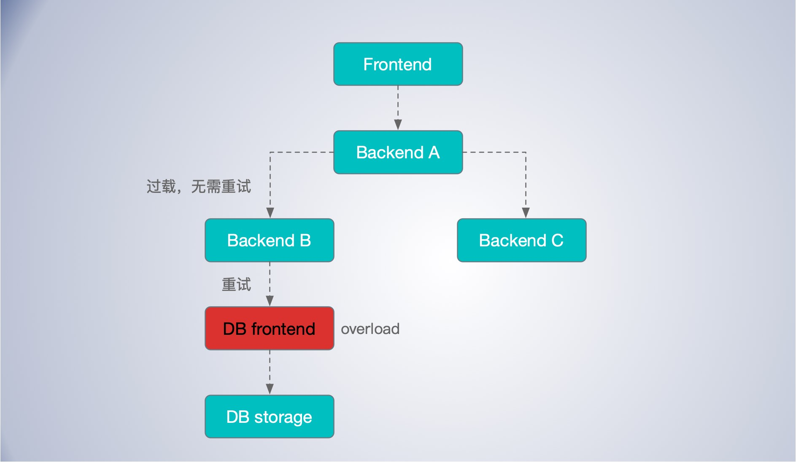

[TOC]


重试可能方法服务器过载问题


##限制重试次数

限制重试3次。某个请求如果已经失败3次, 我们会将该错误回应给调用者。如果一个请求已经三次选择了过载的任务, 再重试也很可能无济于事,这时整个数据中心可能都处于过载状态。


## 控制重试阈值

重试需要控制比例，每个客户端都跟踪重试与请求的比例。一个请求在这个比例低于10%的时候才会重试。这里的逻辑是,如果仅仅只有一小部分任务处于过载状态, 那么重试数量应该是相对较小的。

用一个实际例子来说(一个很糟糕的情况),我们假设一个数据中心正在接受一小部分请求,而大部分请求都被拒绝了。这里用X代表客户端逻辑向这个数据中心发出请求的速率。由于大部分请求会被重试,这里请求的数量将会增长得非常快,接近3X(由于每个请求会被重试3次)。虽然我们在这里限制了重试导致的请求数量,3倍的请求増长仍然是很多的,尤其是当拒绝请求的成本不能忽略的时候。然而,通过加入一个按客户端重试的限制(10%重试比例),实际上我们将重试请求限制在大多数情况下仅增加为原来的1.1倍。这样的改进是很显著的。


或者类似每分钟最多能重试多少次，超过阈值直接请求失败处理。这样至少不易造成全局连锁性故障；


## 避免多层级重试

考虑一个极端情况，如果终端APP 到 DB 有三层，如果允许重试3次，最多可以请求四次，如果每层都进行重试，最多可能有 `4*4*4=64` 次请求落到 DB 上，这样重试无法解决问题，而且会带来更大的灾难。


“过载; 无须重试”

流量是会被放大的，一次重试请求可能会在多层应用中进行传递，对于一些场景，重试可能无意义，反而徒增上有系统的压力。这时应该返回 “过载，无需重试” 而不是 “任务过载”。

请求只应该在被拒绝的层面上面的那一层进行重试。当我们决定某个请求无法被处理,同时不应该被重试时,返回一个“过载;无须重试”错误,以避免触发一个大型的重试爆炸。例如：

假设数据库前端( DB Frontend)目前正处于过载状态, 拒绝请求。在 Bcakend B 会根据前述的规则重试请求。
然而当 Bcakend B 确定数据库前端无法处理该请求时(例如,请求已经重试3次) Bcakend B 需要给 Bcakend A 返回一个“过载; 无须重试”错误, 或者某个降级回复给 Bcakend A 会根据它收到的回复进行处理。



这里的关键点是, 数据库前端拒绝的请求应该仅仅在后端 Bcakend B 处重试一一在它的直接上层处。如果多层都要进行重试, 会造成批量重试爆炸情况

## 使用明确的返回代码

使用明确的返回代码, 同时详细考虑每个错误模式应该如何处理。

可重试错误和不可重试错误要分开。


## 重试时间随机化

重试时间需要考虑指数退让。同时还需要加入一些 jitter 即随机波动的值，尽量错开客户端的重试时间点，避免集中到一起。


## 小结

重试要控制最大次数；

重试要满足幂等；

全局重试预算，控制重试比例，不能大面积重试，或者类似每分钟最多能重试多少次，超过阈值直接请求失败处理。这样至少不易造成全局连锁性故障；

重试时间要指数退让，

重试时间加入随机话，要随机分布在一个时间窗口内，避免碰撞到一起；

对于已知的，重试无法解决的问题，直接回复无需重试，避免不必要的重试浪费；

重试不应该逐层传递，在出现失败的一层重试，若无法解决则返回客户端无需重试，避免无效重试和重试倍数放大；


代码实现，以 kratos 的实现为例：

```go
// DefaultBackoffConfig uses values specified for backoff in common.
var DefaultBackoffConfig = BackoffConfig{
	MaxDelay:  120 * time.Second,
	BaseDelay: 1.0 * time.Second,
	Factor:    1.6,
	Jitter:    0.2,
}

// Backoff defines the methodology for backing off after a call failure.
type Backoff interface {
	// Backoff returns the amount of time to wait before the next retry given
	// the number of consecutive failures.
	Backoff(retries int) time.Duration
}

// BackoffConfig defines the parameters for the default backoff strategy.
type BackoffConfig struct {
	// MaxDelay is the upper bound of backoff delay.
	MaxDelay time.Duration

	// baseDelay is the amount of time to wait before retrying after the first
	// failure.
	BaseDelay time.Duration

	// factor is applied to the backoff after each retry.
	Factor float64

	// jitter provides a range to randomize backoff delays.
	Jitter float64
}


func (bc *BackoffConfig) Backoff(retries int) time.Duration {
	if retries == 0 {
		return bc.BaseDelay
	}
	backoff, max := float64(bc.BaseDelay), float64(bc.MaxDelay)
	for backoff < max && retries > 0 {
		backoff *= bc.Factor
		retries--
	}
	if backoff > max {
		backoff = max
	}
	// Randomize backoff delays 
	backoff *= 1 + bc.Jitter*(rand.Float64()*2-1)
	if backoff < 0 {
		return 0
	}
	return time.Duration(backoff)
}
```


## 扩展阅读

https://aws.amazon.com/cn/blogs/architecture/exponential-backoff-and-jitter/

《Google SRE》

