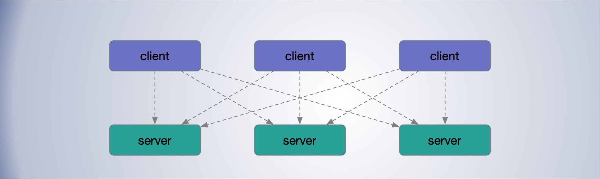
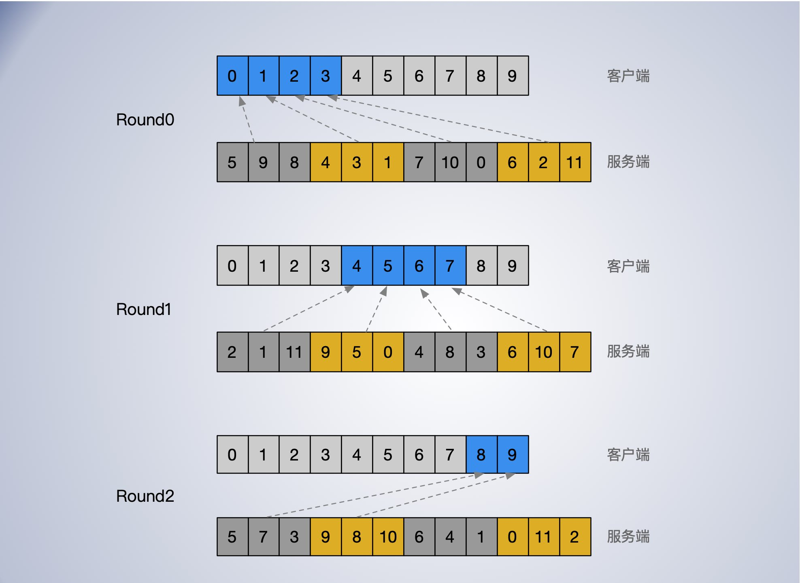

[TOC]


## 负载均衡考虑因素

节点健康管理，错误响应统计

子集划分


服务状态

- 健康
- 拒绝服务
- 跛脚鸭状态

可靠的识别异常任务的方法: **跛脚鸭状态**

- “跛脚鸭”英文是“lame duck”，最早是指负债累累的投资者，经过多年的演变，现用于形容“即将下台的政治家”。而所谓的“跛鸭效应”便是指这些任期将满的议员或政府官员，所提出的议案或政策获得通过执行的可能性很小。

- 跛脚鸭状态: 后端任务正在监听端口, 并且可以服务请求, 但是已经明确要求客户端停止发送请求。

- 跛脚鸭状态的好处就是让无缝停止任务变得更容易

能够无影响地停止一个活跃的后端任务可以让处理代码推送、设备维护活动, 和机器故障问题导致的任务重启变得对用户透明。


数据中心内部的负载均衡

跨数据中心负载均衡

## 子集算法

如图的场景，客户端需要和服务点建立连接，通常会维护长链接。每个连接都需要双方消耗一定数量的内存和 CPU (由于定期健康检査导致)来维护。一两个连接开销可能很小，但是如果节点非常多时，成千上万达到一定规模之后，就算算简单点健康检测，开销也不能忽视了。



在 Google SRE 中推荐了一种子集算法来解决这种问题，大至如下。

**利用划分子集限制连接池大小**

- 限制客户端连接到后端服务数量，或一个后端接受过多的客户端连接；

- 同时需要尽可能均衡的分摊负载；

假如有 12 个服务端 [0, 11]，10 个客户端 [0, 9]，每个客户端要连 3 个服务端，则子集的大小 3, 子集的数量为 4。

按轮次对服务 id 进行洗牌(随机处理)，对服务端按子大小(客户端数量)分组，可分为 4 组，每组3个服务节点，依次分配给客户端 0，1，2，3，这样：

- 第一轮过后 第 0，1，2，3 四个客户端就各分到了 3 个服务端。

- 第二轮过后 第 4，5，6，7 四个客户端就各分到了 3 个服务端。

- 第三轮过后 ，第 8，9 剩余两个客户端就各分到了 3 个服务端。



每轮所有的服务端都会按特定的步长逐个分给客户端，这样可以保证所有的服务端都会均匀分到客户端。

分轮次进行的作用是保证每轮服务端都均匀分配到客户端。每轮只把一个服务端分配给一个客户单。

每轮进行洗牌，这样引入了客户端与服务端匹配的随机性。尤其在滚动更新服务端时，如果不引入随机性，可能导致同一客户端分到的都是不可用的服务端。

代码实现：

```go
// backends 服务端 id 列表
// clientId 客户端id
// subsetSize 子集尺寸
func Subset(backends []int, clientId int, subsetSize int) []int {
	// 子集数量
	subsetCount := len(backends) / subsetSize

	// 将客户端划分为多轮, 每一轮计算使用同样的随机排列的列表
	round := clientId / subsetCount // 根据 clientId 计算轮次
	r := rand.New(rand.NewSource(int64(round)))
	// ServerId 洗牌
	r.Shuffle(len(backends), func(i, j int) {
		backends[i], backends[j] = backends[j], backends[i]
	})

	// subsetId 代表了目前的客户端
	subsetId := clientId % subsetCount

	start := subsetId * subsetSize
	return backends[start : start + subsetSize]
}

// 测试
func TestSubset(t *testing.T) {
	backend := []int{0, 1, 2, 3, 4, 5, 6, 7, 8, 9, 10, 11}
	backendNodes := make([]int, 12, 12)
	frontend := []int{0, 1, 2, 3, 4, 5, 6, 7, 8, 9}
	for i := range frontend {
		copy(backendNodes, backend) // 这里需要拷贝传进去，否则无法保证同一轮次的server 序列一致
		set := Subset(backendNodes, frontend[i], 3)
		fmt.Println(set)
	}
}
```


## 负载均衡策略

客户端在确定好服务端子集之后，需要把自身的流量分摊到子集中不同的服务节点上。

负载均衡策略可以是非常简单的, 不考虑任何后端状态的算法(例如,轮询), 或者是基于后端状态的算法(例如最小负载轮询, 或者带权重的轮询)。


### 简单轮训(round robin)

一个非常简单的负载均衡策路是让每个客户端以轮询的方式发送给子集中的每个后端服务节点, 只要这个后端可以成功连接并且不在跛脚鸭状态中即可。

这种方式简单易实现，但是这种方式没有考虑服务节点的实际负载的均衡性。影响负载均衡性的因素很多，如：

- 服务子集过小；
- 不同请求处理成本不同；这个很常见，且请求成本还可能差的非常大；
- 物理服务器的差异导致处理请求速率不同；
- 不同客户端发送请求的速率不同；
- 其他无法预知的性能因素；


在一个请求处理成本差异性很大的系统中进行负载均衡是非常困难的。可能还要调节服务接口以控制每个请求所执行的工作数量

对于不确定的因素，如不同节点的影响，以及于对共享资源的竞争, 例如内存缓存、带宽等很不明显的地方。例如, 如果一个后端任务对外请求的延退升高(由于网络带宽的竞争), 同时执行的请求数量就会增加, 可能会导致GC( garbage collection) 数量的增多。

在服务更新，重启初期性能会差很多，这同样会导致不同节点处理请求的能力不一致。

这些问题，都可能导致负载不均衡。

### 最闲轮询策略

简单轮询策略的一个替代方案是

让毎个客户端跟踪子集中每个后端任务的活跃请求数量, 然后在活跃请求数量最小的任务中进行轮询。

最少连接。


需要注意的是，活跃请求的数量并不一定是后端容量的代表；


### 加权轮询策略

加权轮询策略通过在决策过程中加入后端提供的信息, 是一个针对简单轮询策略和最闲轮询策略的加强。

加权轮询策略理论上很简单: 毎个客户端根据后端服务节点处理请求的“能力”值，请求仍以轮询方式分发, 但是客户端会按能力值权重比例调节。

客户端节点定期从服务端获取当前观察到的请求速率、每秒错误值, 以及目前资源利用率(一般来说, 是CPU使用率)。客户端综合这些因素计算服务端能力值。

统计失败的请求的分布, 对未来的决策造成影响。

在实践中, 加权轮询策略效果非常好, 极大降低了最高和最低负载任务的差距。


## 推荐阅读

https://sre.google/sre-book/load-balancing-datacenter/


