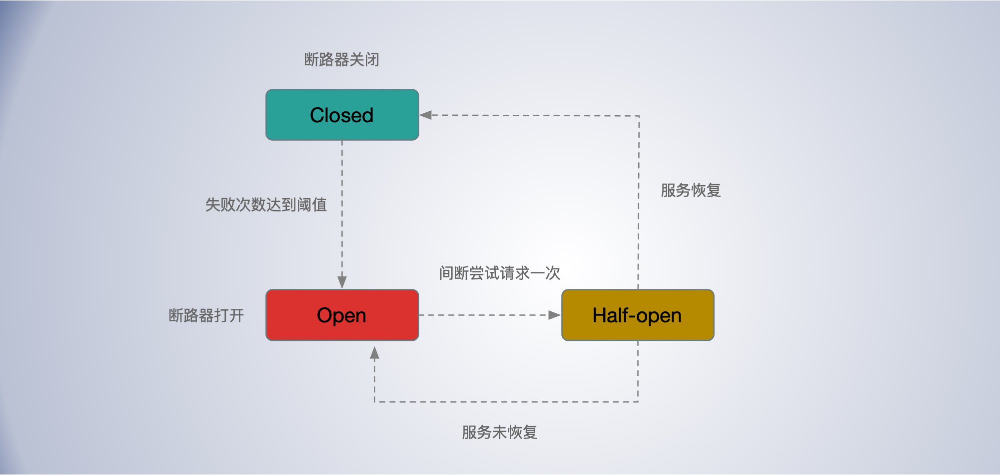

[TOC]


**熔断**

假如服务提供者出现故障，短时间内无法恢复时，重试或双发不但不能提高服务调用的成功率，反而会给服务提供者带来更大的压力，从而加剧故障。

熔断就是把客户端的每一次服务调用用断路器封装起来，通过断路器(circuit-breakers)来监控每一次服务调用。如果某一段时间内，服务调用失败的次数达到一定阈值，断路器就会被触发，后续的服务调用就直接返回，不会再向服务提供者发起请求了。


熔断中断路器的几种状态：

- Closed 状态：正常情况下，断路器是处于关闭状态的，偶发的调用失败也不影响。
- Open 状态：当服务调用失败次数达到一定阈值时，断路器就会处于开启状态，后续的服务调用就直接返回，不会向服务提供者发起请求。
- Half Open 状态：当断路器开启后，每隔一段时间，会进入半打开状态，这时候会向服务提供者发起探测调用，以确定服务提供者是否恢复正常。如果调用成功了，断路器就关闭；如果没有成功，断路器就继续保持开启状态，并等待下一个周期重新进入半打开状态。




- 服务依赖的资源出现大量错误。
- 某个用户超过资源配额时，后端任务会快速拒绝请求，返回*“*配额不足*”*的错误，但是拒绝回复仍然会消耗一定资源。有可能后端忙着不停发送拒绝请求，导致过载。


## 滑动窗口计数器

将一个时间窗口划分为若干个 bucket ，根据窗口尺寸和 bucket 宽度，根据添加计数时的时间统计到对应的 bucket 区间，没有对应区间则新创建 bucket，每次添加时，将窗口中前面已经过期的 bucket 移除。

滑动窗口计数器在 hystrix 的应用 https://github.com/afex/hystrix-go/blob/master/hystrix/rolling/rolling.go


使用滑动窗口滚动统计，最近一段时间内的请求状态分布。


以 Hystrix 为例。

**Hystrix**

熔断器最广泛如 Netflix 开源的 `Hystrix` 了。Hystrix 的断路器也也包含三种状态：关闭、打开、半打开。

Hystrix 通过一个时间滑动窗口，计算一段时间内服务调用的失败率。默认情况下，滑动窗口包含 10 个桶，每个桶时间宽度为 1 秒，每个桶内记录了这 1 秒内所有服务调用中成功的、失败的、超时的以及被线程拒绝的次数。当新的 1 秒到来时，滑动窗口就会往前滑动，丢弃掉最旧的 1 个桶，把最新 1 个桶包含进来。任意时刻，Hystrix 都会取滑动窗口内所有服务调用的失败率作为断路器开关状态的判断依据，这 10 个桶内记录的所有失败的、超时的、被线程拒绝的调用次数之和除以总的调用次数就是滑动窗口内所有服务的调用的失败率。


## 自适应阈值

熔断可以算得上的客户端的自适应限流策略。客户端根据请求响应分布情况。来自适应决定是否开启熔断。

同样可以使用Google SRE 中提到的客户端自适应限流策略。即在正常情况下，requests == accepts 表示发送的请求等于被处理的请求，当服务端负载开始拒绝请求时会出现 requests > accepts 。设置一个阈值 K

```
requests = K * accepts
```

当发送的请求等于接受到的 K 倍时，开始以一定的概率拒绝客户端的请求，截止返回失败，而不用把请求发出去。

> $$
> P = max(0, \frac{requests - K*accepts}{requests + 1})
> $$

在分母加 1，可以避免在请求很少时全部失败时的特殊情况，避免小样本时请求全部被拒绝。

根据公式，当  requests = K * accepts 时，恰好拒绝概率 P 是 0， 随着 accetps 相对 requests 减小，P 会越来越大。即请求失败的越多，后面被拒绝发送的概率越大，随着请求响应的恢复，P 会逐渐减下，直到客户端关闭限流。

K 值影响截流的效果，

- 降低 K 会使自适应节流算法更加激进；

- 增加 K 值会使该算法变得不再那么激进；


hystrix

- https://www.cnblogs.com/li-peng/p/11050563.html
- https://github.com/afex/hystrix-go


- 


