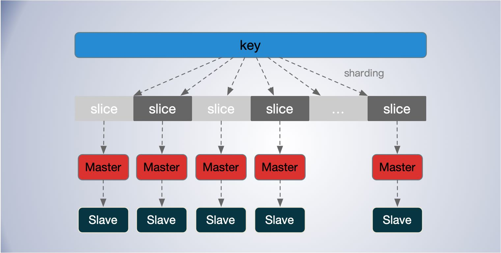
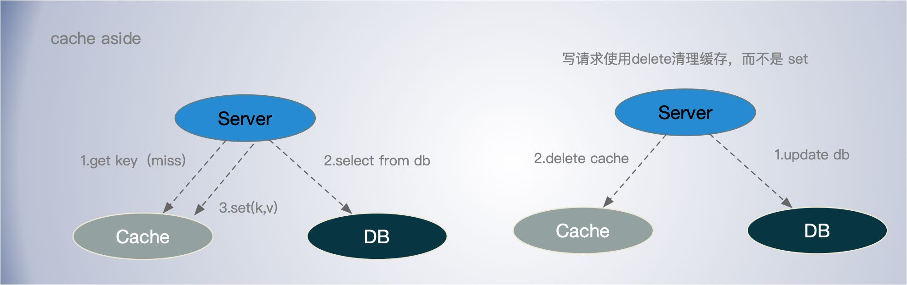

[TOC]

## 缓存的重要性

缓存无处不在，缓存在解决不同媒介之间速差有着重要的作用。

在架构设计中，对于提升服务性能，处理海量请求方面，`缓存和消息队列处于第一梯队`的位置。无论对于读还是写，缓存都能发挥提升性能的作用。

能否把缓存设计的好，使用的好，对于架构设计至关重要。

## 缓存选型

缓存的主要产品是 Memcached 和 Redis。前者历史稍微久一点，支持数据结构单一，后者支持的数据结构相对丰富。 

Memcached 和 Redis的主要区别

- Memcached 多线程，Redis 单线程(新版本双线程)。
- Redis 功能更丰富，还支持持久化。

通常情况下 Redis 和 Memcached 性能差距不大，但是 Redis 是单线程的模型，会遇到一些阻塞和卡顿的操作，比如一些时间复杂度为O(n)的操作会影响性能，如批量大范围的 key 扫描获取操作；同一时间有大量的 key 过期也可能导致卡顿，对于大 key 的读写也会造成QPS下降。

如果只是单纯的 kv 缓存的话，且对 qps 和性能有一定需求，更推荐 memcached 。当然可以只用 redis 统一化管理。新版本的 redis 也开始支持多线程了。

## sharding

### 分片策略

- 客户端分片：需要客户掌握集群节点信息，健康状况，负载信息等信息，这种方案好处是直连，去中心化，但是会加重客户端逻辑。
- 中间层代理分片：由中间件统一进行管理，方便维护，还可以实现如协议翻译，监控请求，分析请求热点，合并请求减少服务节点的连接，但是增加网络延时，中间层可能成为热点。如 Codis，tweproxy(更推荐用 redis cluster)。
- 服务端分片：不使用中间层实现去中心化的管理模式，客户端直接向服务器中任意结点请求，如果被请求的Node没有所需数据，则像客户端回复MOVED，并告诉客户端所需数据的存储位置，这个过程实际上是客户端和服务端共同配合，进行请求重定向来完成的。

数据分片的 hash 方式也是这个思想，即按照数据的某一特征（key）来计算哈希值，并将哈希值与系统中的节点建立映射关系,从而将哈希值不同的数据分布到不同的节点上。

### 分片算法

#### 一致性哈希

一致性 hash 是将数据按照特征值映射到一个首尾相接的 hash 环上，同时也将节点（按照 IP 地址或者机器名 hash）映射到这个环上。

对于数据，从数据在环上的位置开始，顺时针找到的第一个节点即为数据的存储节点。

余数分布式算法由于保存键的服务器会发生巨大变化而影响缓存的命中率，但 Consistent Hashing 中，只有在园（continuum）上增加服务器的地点逆时针方向的第一台服务器上的键会受到影响。

一致性哈希需要尽量的分散均匀，通过虚节点，选择合适的哈希算法来。

#### 有界负载一致性哈希

有限界载一致性哈希（Consistent Hashing with Bounded Loads） 出自论文 [Consistent Hashing with Bounded Loads](https://arxiv.org/abs/1608.01350) ，主要思路是，根据当前负载情况对所有节点限制一个最大负载，在一致性哈希中对 hash 环进行查找时将跳过达到最大负载限制的节点，通过把过载的请求转移到其他节点上来解决热点和不均衡问题。

简单的说，该算法给 Hash环上的每个节点一个负载上限为1 + e倍的平均负载(e可以自定义)，当key在Hash环上顺时针找到合适的节点后，会判断这个节点的负载是否已经到达上限，如果已达上限，则需要继续找之后的节点进行分配。

有界负载一致性哈希是在尽可能减少节点变更的影响，同时尽可能的分摊负载到不同的节点。

#### 虚拟槽位哈希

分片将哈希环切割为相同大小的分片，然后将这些分片交给不同的节点负责。这里跟一直性哈希虚拟节点的区别在于，当一个节点下线时，其所负责的分片数据并不会顺时针合并给之后节点，而是可以更灵活的将整个分片作为一个整体交给任意节点，比如 Redis Cluster 如果主节点挂掉了，可以让对应的 Slave 节点顶上去继续服务。

Redis Cluster 预设虚拟槽，每个槽就相当于一个数字。每个槽映射一个节点的。

## 缓存数据一致性 

当同步更新 cache 和 db 时怎么实现数据一致性？

操作方式：

1、先更新数据库，再更新缓存

- 可能会由于网络或阻塞导致旧的数据覆盖缓存中新数据。

2、先删缓存，再更新数据库

- 依然会出现旧数据覆盖新数据的情况。

3、先更新数据库，再删缓存

- 这种方式可以解决并发写之间导致的数据不一致，但依然无法保证db数据与 cache 一致。但是比前两种方式效果好点。

    

**Cache Aside Pattern**

读请求

- 先读缓存
- 缓存命中，直接返回数据
- 缓存未命中，则查询DB
- 将数据set到缓存，用 SETNX 指令，即当 key 不存在时才设置缓存，防止旧的读覆盖新的写数据。

写请求

- 先更新数据库。
- 后淘汰缓存，采用 delete 淘汰，而不是set更新。 这样可以解决并打写导致的数据不一致。

Cache Aside Pattern 建议，delete 缓存，而不是 set 缓存。

实现 Cache-Aside 模式不能保证数据存储和缓存之间的一致性。

先新更新数据库还是先更新缓存？

- 建议先更新数据库，但是这个不能解决缓存一致性问题

更新缓存 or 删除缓存？

- 建议删除缓存，这样可以解决多个并发写导致的数据不一致问题

给缓存增加过期时间；

通过 job 加消息队列异步延时删除缓存；或 job 订阅MySQL binlog 异步修复缓存数据进行兜底操作。可以实现数据点最终一致性，但是即便如此，通过 job 修复的方式，多个任务排队，可能由于 job 延迟会出现数据版本回退的情况，所以依然无法真正实现 “强一致” 的效果，所以可以 对于 job 回填，可以用 delete 操作，而不是 set 缓存。但是删除缓存要注意解决缓存穿透对 db 的影响。

清理缓存使用 delete 操作相对 set 操作更为安全可靠，因为delte 是幂等操作不会有副作用，set 操作无法避免ABA 问题，但是 delete 操作需要注意缓存穿透问题。可以通过合并请求singlefly 的方式请求db回填缓存数据。所以需要做取舍，

- SET 可能会出现 ABA 问题
- delete 操作要注意缓存穿透问题

缓存的作用是提高访问速度，有些场景也可以优化写入。绝大部分场景，牺牲一定的一致性，来提升性能还是可接受的。

**多级缓存**

对于多级应用之间的缓存时，先更新底层应用的缓存，再更新上层应用的缓存。

**热点缓存**

- 监控热点缓存 topN 的 key，可以把热点的 key 缓存在应用本地，转化为 localcache，运营平台广播刷新缓存。
- 多 cluster 支持。
- 使用 key 的多副本，如 添加 key1， key2， key3 等多个副本，分片到不同的节点上，这种方式可以解决热点问题，但是更新维护也相对麻烦些。

## 缓存集群

## 缓存问题

### 缓存穿透——空值保护 

缓存穿透是指缓存和数据库中都没有的数据，而用户不断发起请求，导致每次请求都先查缓存再查数据库，徒增DB压力。

- 缓存中设置空值保护，将对应的key的value设置特定的标志如 “null”等标志。有点类似 CDN 的404保护。无效的请求没必要每次都回源查找。可以把过期时间设的稍微短一点，定期查找一次数据库，或者数据库更新时刷新缓存。
- 也可以针对空值，在本地维护一个Bloom filter 或者 BitSet, 记录空值。

### 缓存击穿

缓存击穿：大量的请求同时查询一个key时，key 恰好失效了，导致大量的请求打到数据库上面去，容易导致数据库过载。

延长缓存过期时间，甚至永不过期。但是依然要考虑当 cache miss 时，如何减小对 db 的冲击。

**singlefly**

对关键字进行一致性 hash，使其某一个维度的 key 一定命中某个节点，然后在节点内使用互斥锁，保证归并回源；

**分布式锁**

设置一个 lock key，有且只有一个人成功，并且返回，交由这个人来执行回源操作，其他候选者轮训 cache 这个 lock key，如果不存在去读数据缓存，hit 就返回，miss 继续抢锁；

- 但是这个轮训争抢锁的操作开销比较大。

**队列**

如果 cache miss，交由队列聚合一个key，来 load 数据回写缓存，对于 miss 当前请求可以使用 singlefly 保证回源。

**租约**

通过加入 lease 机制，可以很好避免这两个问题，lease 是 64-bit 的 token，与客户端请求的 key 绑定，对于过时设置，在写入时验证 lease，可以解决这个问题；对于 thundering herd，每个key 10s 分配一次，当 client 在没有获取到 lease 时，可以稍微等一下再访问 cache，这时往往cache 中已有数据。（基础库支持 & 修改 cache 源码）；

通过 token 可以解决部分一致性问题，只有拿到 token 的操作才能设置缓存。

### 缓存雪崩

缓存雪崩是指缓存中大批量key过期，导致大量请求落到db上，引发db过载。

缓存击穿指并发查同一个 key，缓存雪崩是不同key同时期了，很多数据都查不到从而查数据库。虽然略有不同，但本质上都是由于 cache miss 导致的 db 过载。

- 缓存过期时间随机化处理，避免同一时间过多 key 同时过期。
- 同一个 key 多副本，sharding 到不同的节点，不同的过期时间，起始和上面一条差不多，本质上无非是从时间和空间上分摊请求压力。
- 同一个 key 合并回源 db 依然使用。
- 非常热的 key 可以设置用不过期，甚至改为应用 local cache。

### 缓存预热

当一个缓存刚上线时，缓存的命中率将非常低，这回降低应用的吞吐能力，更重要的是，大量的请求会直接落在的 DB 上，这可能导致 DB 过载引起级联故障。

- 通过日常监控统计，统计高频热点 key，通过 job 进行主动预热；
- 从其他节点同步数据
- 通过流量控制，逐步增加新节点承担的请求量。

## redis memcached 对比

内存管理

线程模型

功能

集群支持

## 缓存使用建议

- 在满足易读性的前提下，key 设置尽可能小，减少资源的占用，redis value 可以用 int 就不要用 string，对于小于 N 的 value，redis 内部有 shared_object 缓存。
- 拆分 key。主要是用在 redis 使用 hashes 情况下。同一个 hashes key 会落到同一个 redis 节点，hashes 过大的情况下会导致内存及请求分布的不均匀。考虑对 hash 进行拆分为小的hash，使得节点内存均匀及避免单节点请求热点。
- 空缓存保护设置。有的数据数据库始终为空，这时应该设置空缓存标志，避免每次请求都缓存 miss 直接打到 DB。
- 降级后一般读失败不触发回写缓存。
- 推荐序列化使用 protobuf，而不是 json，尽可能减少空间占用。
- 工具化浇水代码 ？
- 如果缓存数据一致性影响很大，建议使用 delete 清理缓存，而不是 set，写请求缓存的优先级应高于读请求。

客户端发送拥塞控制，如在使用 pipline 时，通过一个滑动窗口控制发送速度，随着响应请求的增多增大发送窗口，如果有失败响应则减少发送窗口，类似 TCP 的拥塞控制。

对于超大的 value 也可以考虑拆成多个key，分多次存取。

**memcached**

- flag 使用：标识 compress、encoding、large value 等；
- memcache 支持 gets，尽量读取，尽可能的 pipeline，减少网络往返；
- 例如 facebook 使用二进制协议支持 pipeline delete，UDP 读取、TCP 更新；

**redis**

- 增量更新一致性：EXPIRE、ZADD/HSET 等，保证索引结构体务必存在的情况下去操作新增数据；
- BITSET: 存储每日登陆用户，单个标记位置（boolean），为了避免单个 BITSET 过大或者热点，需要使用 region sharding，比如按照mid求余 %和/ 10000，商为 KEY、余数作为offset；
- List:抽奖的奖池、顶弹幕，用于类似 Stack PUSH/POP操作；
- 杜绝 zrange 或者 zrevrange 返回的集合过大， redis 是单线程的时间复杂度为 O(n)的操作，容易造成阻塞，要控制操作样本；
- Hash: 过小的时候会使用压缩列表、过大的情况容易导致 rehash 内存浪费，也杜绝返回hgetall，对于小结构体，建议直接使用 memcache KV；
- String: SET 的 EX/NX 等 KV 扩展指令，SETNX 可以用于分布式锁、SETEX 聚合了SET + EXPIRE；
- Sets: 类似 Hashs，无 Value，去重等；
- 尽可能的 PIPELINE 指令，但是避免集合过大；
- 避免超大 Value；

