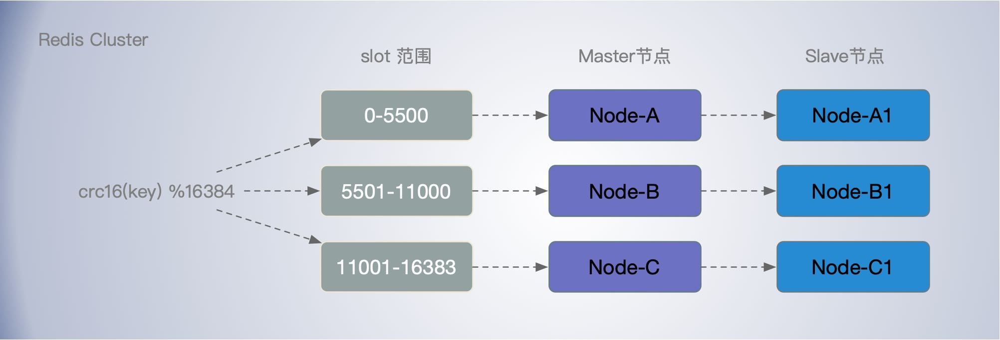
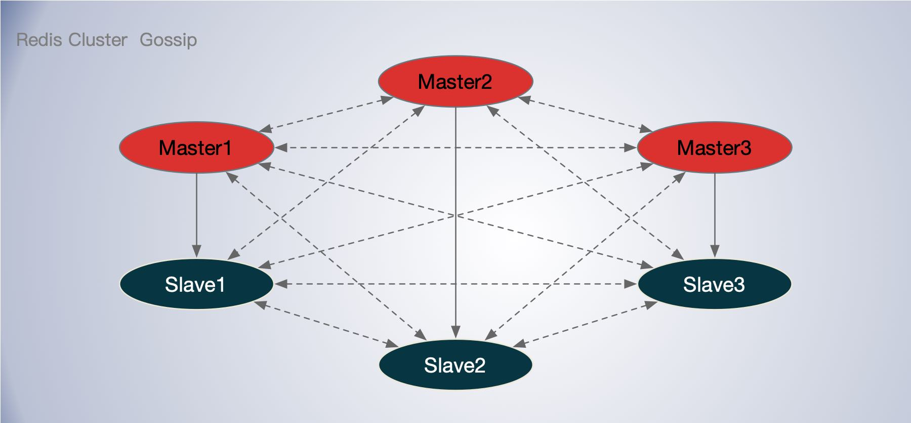
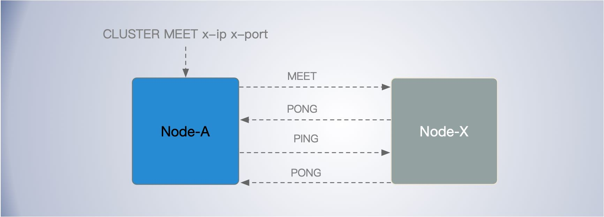

[TOC]


Redis Cluster 提供数据分片能力，高可用，容错能力。在 Redis 集群中，节点负责保存数据，并获取集群的状态，包括将键映射到正确的节点。集群节点还能够自动发现其他节点、检测非工作节点，并在需要时将从节点提升为主节点，以便在故障发生时继续操作。

客户端与节点直接直接通信，无需代理。主从节点之间异步复制，节点可以线性扩展，故 Redis Cluster 集群可以实现非常好的性能和伸缩性。

每个Redis集群节点需要打开两个TCP 端口。

- 用于客户端的端口，如通常的 6379。
- 用于集群总线，内部通信，在数据端口上添加10000 如 16379。 使用二进制协议的节点到节点通信通道。节点使用集群总线进行故障检测、配置更新、故障转移授权等。这个端口和客户端通信。

命令端口和集群总线端口偏移是固定的，并且总是 10000。


## 设计目标

Redis Cluster 按照设计的重要性排序，有以下目标:

- 高性能和线性可扩展性高达1000个节点。不存在代理，使用异步复制，对值不执行合并操作。
- 可接受的写安全程度: 系统尝试(尽最大努力)保留来自与大多数主节点连接的客户机的所有写操作。通常会有一个小窗口丢失已确认的写操作。当客户端在少数分区时，丢失已确认的写操作的 Windows 会更大。
- 可用性: Redis 集群能够在大多数主节点都是可达的分区中存活，并且每个主节点至少有一个可达的从节点不再是可达的。此外，使用 replicas迁移，不再由任何从服务器复制的主服务器将从由多个从服务器覆盖的主服务器接收一个副本。


**支持命令**

Redis 集群实现了单机版所有的单键命令。执行复杂的多键操作(如集合类型联合或交叉)的命令也可以实现，只要键都散列到同一个槽。

Redis 集群实现了一个叫做散列标签（`hash tag`）的概念，可以用来强制某些键被存储在同一个散列槽中。然而，在手工重新切分过程中，多键操作可能在一段时间内不可用，而单键操作总是可用的。

Redis 集群不像 Redis 的单机版本那样支持多个数据库。只有数据库 0，不允许使用 SELECT 命令。


## 数据分片

### hash slot

默认情况下，Redis Cluster 把 16384 槽按照节点数量进行平均分配，由节点进行管理。对每个 key 按照 CRC16 规则进行 hash 运算，把 hash 结果对16384 进行取余，把余数发送给 Redis 节点。

```
HASH_SLOT = CRC16(key) mod 16384
```

Redis集群中的每个节点都负责一个哈希槽的子集，例如，你可能有一个包含3个节点的集群，其中:

例如，一个包含3个节点的集群，其中:

- 节点A包含0 ~ 5500的散列槽位。
- 节点B包含从5501到11000的哈希槽位。
- 节点C包含11001 ~ 16383的散列槽位。

如果想要添加一个新节点 D, 需要把一些散列槽从节点 A，B, C, 移动到节点 D。 如果想删除节点 A，需要把 A 上的槽移动到 B和 C 上，当节点 A 空了，之后将它从集群移除。添加和删除节点，或更改节点持有的哈希槽的百分比，不需何停机。



### hash tag

Redis Cluster 还允许用户强制某个 key 挂在特定槽位上，通过在 key 字符串里面嵌入 tag 标记，这就可以强制 key 所挂在的槽位等于 tag 所在的槽位。

散列标签(hash tag)是确保在同一个散列槽中分配多个键的一种方法。这是为了在Redis集群中实现多键操作。


Redis Cluster 提供了工具 `redis-trib` 可以让运维人员手动调整槽位的分配情况。它不但提供了 UI 界面可以让我们方便的迁移，还提供了自动化平衡槽位工具，无需人工干预就可以均衡集群负载。


**MOVED重定向**

由于群集节点不能代理请求，客户端可能会通过重定向错误 `-MOVED` 和 `-ASK` 重定向到其他节点。如果节点发现 key 槽位不归自己管，它会向客户端返回一个`-MOVED`重定向指令告诉它去源节点去执行。

`asking` 指令的目标就是打开目标节点的选项，告诉它下一条指令不能不理，而要当成自己的槽位来处理。

客户可以自由地向所有节点发送请求，并在需要时进行重定向，因此不需要客户端保持集群的状态。但是，缓存键和节点之间的映射的客户端可以提高性能。

**ask重定向**

在对集群进行扩容和缩容时，需要对槽及槽中数据进行迁移。当客户端向某个节点发送命令，节点向客户端返回moved异常，告诉客户端数据对应的槽的节点信息。

如果此时正在进行集群扩展或者收缩操作，当客户端向正确的节点发送命令时，槽及槽中数据已经被迁移到别的节点了，就会返回ask，这就是ask重定向机制。


## 一致性

Redis 主从之间使用了异步复制。故不能保证强一致性。这意味着在某些情况下，Redis 集群可能会丢失一部分数据。

Redis 集群支持在绝对需要的时候同步写，通过 WAIT 命令实现。这大大降低了写失败的可能性。然而，即使使用了同步复制，Redis集群也没有实现强一致性:在更复杂的故障场景下，还没完成数据同步的从节点被选为主节点依然可能会丢失数据。

这种牺牲一定的数据一致性和可靠性换来的是 redis 的高性能。算是 trade-off 的方案。


## 可用性

### master-slave

为了提升集群可用性，提供故障转移能力。每个哈希槽都有一个对应的 maser 节点和 N 个slave 节点。

按照上述 A，B，C 三个节点部署，如果节点 B 失败，则集群无法继续，因为范围为 5501-11000 的散列槽没办法继续提供服务。

我们向每个主节点添加一写从节点，这样最终的集群由A、B、C(主节点)和A1、B1、C1(从节点)组成。这样，即使节点B发生故障，系统也可以继续运行。

节点B1复制B，如果B失败，集群将提升节点B1为新的主节点，并继续正常运行。但如果节点B和节点B1同时故障，则Redis集群无法继续运行。


Redis 集群在少数节点的分区是不可用的。假设在有大多数节点的网络分区中，这个分区有大多数的主节点并且不可用的主节点对应的从节点是可用的,集群在经过 NODE_TIMEOUT 时间通过从节点进行故障转移实现可用，(故障转移通常是执行在1或2秒)。

Redis Cluster 能够容忍少数节点出现网络分区不可用的情况。

假设集群中有 N 个主节点, 且每个节点有一个从节点。当出现有两个节点不可用时，整个集群不可用的概率为 1 / (N * 2 - 1)) 。失去第一个节点是不影响集群的可用性，但是只要在剩下的 2*N - 1 个节点中失去的恰好和之前失去的互为主从关系，即对应的槽位没有可用的对应节点时，会导致集群无法服务。

例如，在一个有5个节点，每个节点有一个 slave 的集群中，当有两个节点从大多数节点中分区出去后，有 1/(5*2-1)= 11.11% 的概率，集群将不再可用。

通过Redis集群的特性复制迁移，在许多现实场景中，通过复制迁移到孤立的主机(主机不再有副本)，集群的可用性得到了改善。因此，在每次成功的失败事件中，集群可能会重新配置从服务器布局，以便更好地抵御下一次失败。

### 节点超时

另外一个值得注意的场景是，Redis 集群会丢失写操作，这发生在网络分区中，客户端被少数实例隔离，包括至少一个master。

以我们的由 A、B、C、A1、B1、C1 组成的6个节点的集群为例，有3个主节点和3个从节点。还有一个客户端，我们称之为Z1。划分之后，有可能在划分的一边我们有 A C A1 B1 C1，而在另一边我们有 B 和 Z1。Z1 仍然能够向 B 写入数据。如果分区在很短的时间内恢复，集群将继续正常运行。但是，如果分区持续了足够的时间，使得 B1 在分区的大部分端提升为 master，那么 Z1 同时发送给 B 的写操作将丢失。

Z1 可以发送给 B 的写操作数量有一个最大窗口: 如果已经有足够的时间让分区的多数派选择一个从节点作为主节点，那么少数派节点中的每个主节点都将停止接受写操作。这个时间量是 Redis 集群的一个非常重要的配置指令 `cluster-node-timeout` ，被称为`节点超时`。

选项`cluster-node-timeout`，表示当某个节点持续 timeout 的时间失联时，才可以认定该节点出现故障，需要进行主从切换。如果没有这个选项，`网络抖动`会导致主从频繁切换。

在节点超时之后，主节点被认为是失败的，可以被它的一个副本替换。类似地，当节点超时后，没有主节点能够感知大多数其他主节点，它将进入错误状态并停止接受写操作。

### 节点间通信

节点间通信专门使用集群总线和集群总线协议进行: 由不同类型和大小的帧组成的二进制协议。每个 Redis 集群节点都有一个额外的 TCP 端口来接收来自其他 Redis 集群节点的连接。此端口与用于接收来自客户机的传入连接的正常TCP端口有固定的偏移量 10000。例如，如果一个Redis节点正在监听端口6379上的客户端连接，集群总线端口为 16379。

每个节点都通过 TCP 连接到其他节点。在一个有 N 个节点的集群中，每个节点有 N-1 个传出的 TCP 连接和 N-1 个传入的连接。这些 TCP 连接一直处于活动状态。当 Redis 集群中的节点形成一个完整的网格(mesh)时，节点使用了一个八卦协议(`gossip protocol`)和一个配置更新机制，以避免在正常情况下节点之间交换太多的消息，所以交换的消息数量不是指数。

每个节点都使用集群总线连接到集群中的每个其他节点。节点使用`八卦协议(gossip)`来传播关于集群的信息，以便发现新的节点，发送 ping 包以确保所有其他节点都工作正常，并发送需要的集群消息以通知特定的条件。集群总线还用于在集群中传播发布/订阅消息，并在用户请求时协调手动故障转移(手动故障转移不是由Redis集群故障检测器发起的，而是由系统管理员直接发起的)。

### 常用配置参数

Redis 集群在Redis.conf文件中引入的配置参数。

**cluster-enabled <yes/no>**: 是否开启集群功能 ，在 Redis 实例中启用集群支持。否则，该实例将作为一个独立的实例启动。

**cluster-config-file <filename>**: 注意，这不是一个用户可编辑的配置文件，但这个文件是Redis集群节点自动持久化集群配置(状态，基本上)，每次有变化，在启动时重新读取它。该文件列出了集群中的其他节点、它们的状态、持久变量等内容。通常，由于接收了一些消息，这个文件会被重写并刷新到磁盘上。

**cluster-node-timeout <milliseconds>**: 节点不可用的最大时间。如果主节点在指定的时间内无法被访问，它将由从节点进行故障转移。这个参数比较重要，可以防止`网络抖动`会导致主从频繁切换。每个不能在指定时间内访问到大多数主节点的节点将停止接受查询。

**cluster-slave-validity-factor <factor>**: 如果设置为0，那么主从切换是不会抗拒网络抖动的，因此将始终尝试对主服务器进行故障转移，而不管主服务器和从服务器之间的连接断开的时间有多长。如果值是正数, 最大断开时间计算的节点超时值乘以系数。

**cluster-migration-barrier <count>**: Master 节点保持连接的最小 Slave 数量。

**cluster-require-full-coverage <yes/no>**: 如果设置为yes(默认情况)，则如果某个比例的键空间没有被任何节点覆盖，集群将停止接受写操作。如果该选项设置为no，即使只处理关于键子集的请求，集群仍然会提供查询服务。

## 心跳

### 心跳与八卦协议

Redis集群节点不断地交换 ping 和 pong 包。这两种数据包具有相同的结构，并且都携带重要的配置信息。唯一的实际区别是消息类型字段。把ping和pong包的总和称为`心跳包`。

通常节点会发送ping报文，而ping报文会触发接收端以pong报文回应。然而，这并不一定是真的。节点可以只发送pong包向其他节点发送关于其配置的信息，而不触发回应。这是很有用的，例如，为了尽快传播一个新的配置。

通常，一个节点每秒会对几个随机节点进行 ping，这样，无论集群中节点的数量如何，每个节点发送的 ping 包(和接收的pong包)的总数都是恒定的。

但是，每个节点都要确保在 `NODE_TIMEOUT` 时间的一半以上的时间内ping其他没有发送ping或没有接收pong的节点。在 NODE_TIMEOUT 超时之前，节点还尝试重新连接TCP链接到另一个节点，以确保节点不会仅仅因为当前TCP连接存在问题而被认为是不可达的。

如果将 NODE_TIMEOUT 设置为一个小数值，并且节点的数量(N)非常大，则全局交换的消息数量是相当大的，因为每个节点都会在 NODE_TIMEOUT 时间的一半时间内尝试 ping 其他没有新鲜信息的节点。

例如，在一个 100 个节点的集群中，节点超时设置为 60 秒，每个节点将尝试每 30 秒发送 99 次 ping，总 ping 次数为每秒3.3次。乘以100个节点，这在整个集群中是每秒 330 次 ping。

有一些方法可以减少消息的数量，但是目前还没有报告Redis集群故障检测所使用的带宽问题，所以目前使用的是明显和直接的设计。请注意，即使在上面的示例中，每秒交换的330个数据包平均分配给100个不同的节点，因此每个节点接收的流量是可以接受的。


### 心跳包

Ping和pong信息包有一个通用的报头，以及一个特定于Ping和pong信息包的特殊八卦部分。

common header包含以下信息:

- 节点ID，一个160bit的伪随机字符串，在第一次创建节点时分配，并且在所有Redis集群节点的生命周期中保持相同。
- 发送节点的currentEpoch 和 configEpoch 字段用于挂载 Redis 集群使用的分布式算法

- 节点标志，指示节点是slave、master和其他单位节点信息。
- 发送节点提供的哈希槽的位图，或者如果节点是slave，则由其主节点提供的槽的位图。
- 发送端TCP基本端口(即Redis用来接收客户端命令的端口;向其中添加10000以获得群集总线端口)。
- 从发送方的角度来看集群的状态(down或ok)。
- 发送节点的主节点ID(如果是从节点的话)。

ping 和 pong 包里也有 gossip 的 内容。这部分内容向接收方提供发送方节点对集群中其他节点的视图。八卦部分只包含发送方已知的节点集合中一些随机节点的信息。八卦部分中提到的节点数量与集群大小成正比。

对于在八卦部分中添加的每个节点，字段:节点 ID，IP，端口，节点标志。

```c
typedef struct {
    char sig[4];        /* Signature "RCmb" (Redis Cluster message bus). */
    uint32_t totlen;    /* Total length of this message */
    uint16_t ver;       /* Protocol version, currently set to 1. */
    uint16_t port;      /* TCP base port number. */
    uint16_t type;      /* Message type */
    uint16_t count;     /* Only used for some kind of messages. */
    uint64_t currentEpoch;  /* The epoch accordingly to the sending node. */
    uint64_t configEpoch;   /* The config epoch if it's a master, or the last
                               epoch advertised by its master if it is a
                               slave. */
    uint64_t offset;    /* Master replication offset if node is a master or
                           processed replication offset if node is a slave. */
    char sender[CLUSTER_NAMELEN]; /* Name of the sender node */
    unsigned char myslots[CLUSTER_SLOTS/8];
    char slaveof[CLUSTER_NAMELEN];
    char myip[NET_IP_STR_LEN];    /* Sender IP, if not all zeroed. */
    char notused1[34];  /* 34 bytes reserved for future usage. */
    uint16_t cport;      /* Sender TCP cluster bus port */
    uint16_t flags;      /* Sender node flags */
    unsigned char state; /* Cluster state from the POV of the sender */
    unsigned char mflags[3]; /* Message flags: CLUSTERMSG_FLAG[012]_... */
    union clusterMsgData data;
} clusterMsg;
```

其中 clusterMsgData 是一个 union 结构体，它可以为 PING，MEET，PONG 或者 FAIL 等消息体。

```c
union clusterMsgData {
    /* PING, MEET and PONG */
    struct {
        /* Array of N clusterMsgDataGossip structures */
        clusterMsgDataGossip gossip[1];
    } ping;

    /* FAIL */
    struct {
        clusterMsgDataFail about;
    } fail;

    /* PUBLISH */
  	...
};
```

`gossip` 可以帮接收节点从发送端获取关于其他节点状态的信息。这对于故障检测和发现集群中的其他节点都很有用。

```c
typedef struct {
    char nodename[CLUSTER_NAMELEN];
    uint32_t ping_sent;
    uint32_t pong_received;
    char ip[NET_IP_STR_LEN];    /* IP address last time it was seen */
    uint16_t port;              /* base port last time it was seen */
    uint16_t cport;             /* cluster port last time it was seen */
    uint16_t flags;             /* node->flags copy */
    uint32_t notused1;
} clusterMsgDataGossip;
```


## Redis Cluster Gossip

### Gossip 协议

Gossip 协议，即八卦协议，或病毒协议。它模拟流言和病毒在人类社会中的传播实现，主要有 SI，SIR 传播模型。gossip 通过直接邮寄，反熵，谣言传播三种方式来实现最终一致性。gossip 中的节点按恒定的频率向外随机传播信息，而不会随着系统总节点数的增加而增加单节点的通信负担。

随着节点增多，虽然单个节点的通信负担不会增加，但是整个集群的冗余消息传播，带宽占用会增加，达成最终一致的时间也会越长，Redis 官方推荐单个集群节点数据不要超过1000个，这也能满足了绝大部分场景的需求。

相比于 Paxos， Raft 等强一致共识算法需要大多数节点正常才集群能服务，Gossip 通过牺牲一定的一致性来提升系统的性能，可用性和分区容错性。通常只要有节点存活就能对外提供服务。

###Redis Cluster Gossip

Redis Cluster 是一个去中心化的分布式系统，通过槽位哈希对数据进行分片。主从之间异步复制。节点间通过 Gossip 八卦协议来实现元数据的同步，实现元数据最终一致性。

虽然 Redis Culster 使用了 gossip 协议，但是并不能像其他 gossip 系统那样，只要有一部分节点运行，系统就能正常服务。Redis Culster  依然需要所有的槽位有对应的节点提供服务，才能正常对外服务。

提问：

- Redis cluster 用 gossip 来实现做什么？
- gossip 消息体体包含了哪些内容？
- gossip 消息以什么样的方式发送？
- 新节点计入集群怎么实现？
- 健康检测发现故障时怎么处理？怎么解决网络分区问题？
- 节点间如何就节点下线达成共识？



#### 元数据

对于分布式系统，集群的状态信息，节点元信息需要有地方进行维护，有的系统是通过独立的组件进行维护的，如 kafka，hbase 都通过 zookeeper 进行维护，或者以 Leader 节点为准定期同步给其他 follower 节点，如一些 raft 系统实现。对于去中心化的实现，如 redis cluster， consul 它们的集群节点元数据会分别存储在每个节点上。

Redis Cluster 中的每个节点都维护一份自己视角下的当前整个集群的状态，主要包括：

- 当前集群状态

- 集群中各节点所负责的 slots 信息，及其 migrate 状态

- 集群中各节点的 master-slave 状态

- 集群中各节点的存活状态及怀疑 Fail 状态

这些信息会通过 gossip 在节点间进行八卦传播。

#### 消息类型

- MEET：通过 `cluster meet ip port` 命令，已有集群的节点会向新的节点发送邀请，加入现有集群，然后新节点就会开始与其他节点进行通信；
- PING：节点按照配置的时间间隔向集群中其他节点发送 ping 消息，消息中带有自己的状态，还有自己维护的集群元数据，和部分其他节点的元数据；
- PONG: 节点用于回应 PING 和 MEET 的消息，结构和 PING 消息类似，也包含自己的状态和其他信息，也可以用于信息广播和更新；
- FAIL: 节点 PING 不通某节点后，会向集群所有节点广播该节点挂掉的消息。其他节点收到消息后标记已下线。

[更多消息类型](https://github.com/redis/redis/blob/unstable/src/cluster.h)

#### 节点间如何通信

Redis cluster 用 gossip 来实现做什么？

Redis cluster 使用 gossip 协议来实现节点间交换各自所掌握的集群信息。如新节点加入、slot迁移、节点宕机、slave提升为新Master等变更的信息不同。

节点间如何通信？

Redis Cluster 中的节点周期性地向其他节点发送 PING 消息，来交换各个节点状态信息。收到 PING 消息的节点会回复 PONG 消息，PONG 消息的结构和 PING 是一样的，PING 和 PONG 是一样多消息，只是后者是对前者的回复。

PING 消息中封装了发送消息的实例自身的状态信息、部分其它实例的状态信息，以及 Slot 映射表。

节点每个周期会随机选择几个节点，然后从中选择最久没有与之通信的节点发送 PING 消息。

#### 新节点加入集群

Redis Cluster 加入新节点时，客户端需要执行 CLUSTER MEET 命令，该命令用于将不同 Redis 节点连接到工作群集，具体操作为 `CLUSTER MEET ip port`。

当给定节点收到 CLUSTER MEET 消息时，命令中指定的节点仍然不知道我们发送命令的节点。因此，为了使节点强制接收方接受它作为可信节点，它会发送一个`MEET`数据包而不是 PING 数据包。这两个数据包的格式完全相同，但前者强制接收方将节点确认为可信。

例如，在集群中节点A执行 CLUSTER MEET x-ip x-port 命令时，

- 节点A会先为新节点X创建一个 clusterNode 数据，并将其添加到自己维护的 clusterState 的 nodes 字典中。然后节点一会根据据 CLUSTER MEET 命令中的 IP 地址和端口号，向新节点X发送一条 MEET 消息。
- 新节点X接收到MEET消息后，新节点也会为节点A创建一个 clusterNode 结构，并将该结构添加到自己维护的 clusterState 的 nodes 字典中，并向节点A恢复一个 PONG 消息。

- 节点A还会向新节点发送一条 PING 消息。新节点X接收到该条 PING 消息后，可以知道节点A已经成功的接收到了自己返回的PONG消息，从而完成了新节点接入操作。
- 节点A把新节点信息通过八卦谣言传播给集群其他节点。



新加入节点，只有邀请节点和被邀请节点知道，其余节点会通过 PING 消息谣言扩展得知。除了 Fail 是立即全网通知的，其他诸如新节点、节点重上线、从节点选举成为主节点、槽变化等都是Gossip协议进行信息同步，实现最终一致性的协议。

#### Gossip故障检测

什么情况下节点会被认为已下线，集群怎么达成共识？此时怎么应对节点下线？


Redis 集群故障检测用于当识别出主节点或从节点不能被大多数节点访问时。如果是主节点故障，通过提升从节点为主节点来继续服务，当从提升从节点为主节点失败时，集群将处于错误状态，停止接收客户端的查询。

集群中的每个节点(记作节点A)都会定期地向集群中的其他节点(记作节点X)发送 PING 消息，如果在规定的时间`cluster-node-timeout `内没有返回 PONG 消息。则节点A 会在自己本地把节点X标记为`PFAIL`可能失败(Possible failure)。

有两个用于故障检测的标志:

- `PFAIL` 表示可能失败(Possible failure)，是一种未确认的失败类型。失败意味着一个节点正在失败，并且这个条件在固定的时间内被大多数主机确认。
- `FAIL` 表示节点已被大多数节点确认处于下线状态。FAIL 标志会一个触发把主节点对应的从节点提升为主节点。

`PFAIL` 标志本身只是每个节点拥有的关于其他节点的本地信息，但它不足以触发从节点提升。要将节点考标记下线(down)状态，需要将 `PFAIL` 升级为 `FAIL`。


当满足以下一组条件时，PFAIL 将升级为FAIL, 即疑似下线升级为确认下线 :

- 节点 A 把节点 B 标记为 PFATAL；

- 通过 Gossip 消息，节点 A 从其他大部分节 master 点中收集节点 B 的状态信息；

- 大多数 master 节点在超时时间 `NODE_TIMEOUT * FAIL_REPORT_VALIDITY_MULT` 内(比如NODE_TIMEOUT时间的两倍)反馈 节点 B 为 PFAIL或FAIL 状态。

如果以上条件均为真，即达成共识。节点 A 将标记 节点 B 为 FATAL 状态，并向所有可到达的节点发送 `FAIL` 消息。`FAIL` 消息用于强制每个收到消息的节点把节点 B 标记为 `FAIL` 状态，不管节点 B 是否已经标记处于PFAIL状态的节点。


满足一下条件的 FAIL 节点，可以被清除 FAIL 标记:

- 该节点已经可达，并且是一个从节点。在这种情况下，FAIL标志可以被清除，因为从服务器不进行故障转移。
- 该节点已经可达，并且是一个主节点，不服务于任何槽位。在这种情况下，FAIL标志可以被清除，因为没有插槽的主机并不真正参与集群，正在等待配置以加入集群。
- 该节点已经可以访问并且是主节点，但是经过很长一段时间(是NODE_TIMEOUT的N倍)，没有任何可检测到的从节点提升。这时，它最好重新加入集群继续服务。


## epoch

Redis Cluster 使用了类似于 Raft 算法 term（任期）的概念称为 epoch（纪元），用来给事件增加版本号。Redis 集群中的纪元主要是两种：currentEpoch 和 configEpoch。

**currentEpoch**

每个集群节点，都会通过 server.cluster->currentEpoch 记录当前的 currentEpoch。

集群节点创建时，所有节点currentEpoch 都是 0。当前节点接收到来自其他节点的包时，如果发送者的 currentEpoch（消息头部会包含发送者的 currentEpoch）大于当前节点的currentEpoch，那么当前节点会更新 currentEpoch 为发送者的 currentEpoch。因此，集群中所有节点的 currentEpoch 最终会达成一致，相当于对集群状态的认知达成了一致。

currentEpoch 作用在于，当集群的状态发生改变，某个节点为了执行一些动作需要寻求其他节点的同意时，就会增加 currentEpoch 的值。类似于 Raft 中 follower 节点要发起选举是要先增加自己的 Term 值一样。 目前 currentEpoch 主要用于 slave 的故障转移提升为主节点。

**configEpoch**

configEpoch 主要记录了节点所负责的槽位的配置信息。每一个主节点在向其他节点发送包时，都会附带其configEpoch信息，用于解决不同的节点的配置发生冲突的情况。

当从节点替代其下线主节点，成为新的主节点时，会增加自己的 configEpoch，使其成为当前所有集群节点的configEpoch中的最大值。这样，该从节点成为主节点后，就会向所有节点发送广播包，强制其他节点更新相关槽位的负责节点为自己。


## 扩展阅读

https://redis.io/topics/cluster-tutorial

https://redis.io/topics/cluster-spec

https://github.com/redis/redis/blob/unstable/src/cluster.h