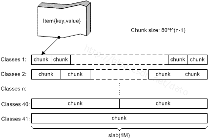
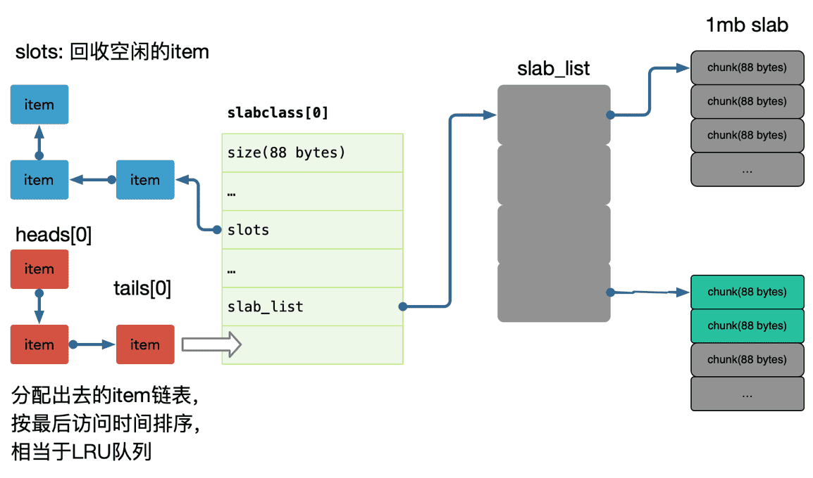

[TOC]


Memcached 是免费和开源、高性能、分布式内存KV对象缓存系统。Memcached 简单而强大。它的简单设计促进了快速部署，易于开发，并解决了大型数据缓存所面临的许多问题。它的API可用于大多数流行语言。

Memcached 是多线程，以 master-worker 的方式, 异步I/O，对外提供服务。基于 libevent 开发实现的。多个 Memcached Server 可以协同工作，但这些 Server 之间是没有任何通讯联系的，每个 Server 只是对自己的数据进行治理。

需要注意的是，Memcached 存储的最大的 value 值不能超过 1M，这个与其适用 slab 内存管理方式有关。


## 常用命令

memcached 就是简单KV存储，支持的命令也相对简单。

- `set` 命令用于将 value 存储在指定的 key 中。如果set的key已经存在，该命令可以更新该key所对应的原来的数据，也就是实现更新的作用。

- `add` 命令用于将 value 存储在指定的 key 中。如果 add 的 key 已经存在，则不会更新数据(过期的 key 会更新)，之前的值将仍然保持相同，并且响应 NOT_STORED。

- `replace` 命令用于替换已存在的 key 的 value。如果 key 不存在，则替换失败，并且响应 NOT_STORED。

- `append` 命令用于向已存在 key 的 value 后面追加数据。

- `prepend` 命令用于向已存在 key 的 value 前面追加数据 。

- `CAS` 命令用于执行一个"检查并设置"的操作, 它仅在当前客户端最后一次取值后，该 key 对应的值没有被其他客户端修改的情况下，才能够将值写入。检查是通过 cas_token 参数进行的， 这个参数是 Memcach 指定给已经存在的元素的一个唯一的64位值。

- `get` 命令获取存储在 key(键) 中的 value(数据值) ，如果 key 不存在，则返回空。

- `gets` 命令获取带有 CAS 令牌存 的 value(数据值) ，如果 key 不存在，则返回空。多个 key 使用空格隔开。

- `delete` 命令用于删除已存在的 key(键)。

- `incr` 与 `decr` 命令用于对已存在的 key(键) 的数字值进行自增或自减操作。incr 与 decr 命令操作的数据必须是十进制的32位无符号整数。

- `stats` 命令用于返回统计信息例如 PID(进程号)、版本号、连接数等。

- `stats items` 命令用于显示各个 slab 中 item 的数目和存储时长(最后一次访问距离现在的秒数)。

- `stats slabs` 命令用于显示各个slab的信息，包括chunk的大小、数目、使用情况等。

- `stats sizes` 命令用于显示所有item的大小和个数。

- `flush_all` 命令用于清理缓存中的所有key-value对。该命令提供了一个可选参数 time，用于在制定的时间后执行清理缓存操作。

    

## 内存管理

由于内存分配方式主要有两种：`预先分配`和`动态分配`；预先分配内存会使比较快，缺点是不能有效利用内存，动态分配可以有效利用内存，但是会使运行效率下降；为了获得更快的速度，有时候我们不得不以空间换时间。 

memcached 会预先分配内存。

直接通过 malloc 和 free 来进行内存分，会造成过多内存碎片的问题，而且会触发频繁的系统调用。适用 slab allocator 预先和大块的申请一个内存作为内存池，来自行管理内存的分配和重复利用。可以解决内存碎片过多和频繁系统调用的问题。这中方式也是很多应用内存管理的大的方向。当然预先分配内存和按大小块切割会有一定的内存浪费。

内存池有很多种设计，可以参考下: nginx ngx_pool_t，tcmalloc 的设计等等。

**内存碎片**

- 内部碎片，由于采用固定大小的内存分区，当一个进程不能完全使用分给它的固定内存区域时就产生了内部碎片，这种通常难以完全避免；
- 外部碎片，外部碎片是由于某些未分配的连续内存区域太小，以至于不能满足任意进程的内存分配请求，从而不能被进程利用的内存区域；

 现在普遍采用的段页式内存分配方式就是将进程的内存区域分为不同的段，然后将每一段由多个固定大小的页组成。通过页表机制，使段内的页可以不必连续处于同一内存区域，从而减少了外部碎片，然而同一页内仍然可能存在少量的内部碎片，只是一页的内存空间本就较小，从而使可能存在的内部碎片也较少。


### slab allocator

slab是 memcached 一次申请内存的最小单位。memcached 启动时使用参数 `-m` 指定其可用内存，但并不是启动时所有的内存就全部分配出去了，只有在需要时才会去申请，而且每次申请按 slab 为单位进行申请。`slab 的大小固定为 1M`。

每个 `slab` 会被切分为多个 `chunk`。每个 chun k中都保存了一个 item结构体、一对key和value。

在同一个slab 中 chunk 的大小相等的，不同的 slab 中 chunk 的大小并不一定相等，根据 chunk 的大小不同，可以把 slab 分为很多种类（class）。每个 chunk 存储一个 item；



可以通过 `memcached -vv`查看 slab 和 chunk 的大小种类：

```bash
$ memcached -vv
slab class 1: chunk size 80 perslab 13107
slab class 2: chunk size 104 perslab 10082
slab class 3: chunk size 136 perslab 7710
slab class 4: chunk size 176 perslab 5957
slab class 5: chunk size 224 perslab 4681
slab class 6: chunk size 280 perslab 3744
slab class 7: chunk size 352 perslab 2978
slab class 8: chunk size 440 perslab 2383
...
slab class 37: chunk size 293752 perslab 3
slab class 38: chunk size 367192 perslab 2
slab class 39: chunk size 458992 perslab 2
slab class 40: chunk size 573744 perslab 1
slab class 41: chunk size 717184 perslab 1
slab class 42: chunk size 1048576 perslab 1
```




每个大小是固定的 1M（1048576B），所以slab 中最多可以有 13107 个 chunk，memcache的 value 存储最大为 1M。

每类chunk的大小有一定的计算公式的，假定i代表分类，class i的计算公式如下：

chunk size(class i) :  (default_size+item_size)*factor^(i-1)+ CHUNK_ALIGN_BYTES

- default_size: 默认大小为48字节, 也就是memcached默认的 key+value 的大小为48字节，可以通过-n参数来调节其大小。
- item_size: item结构体的长度，固定为32字节。default_size大小为48字节,item_size为32，因此class1的chunk大小为48+32=80字节。
- factor: chunk变化大小的因素，默认值为1.25，调节f可以影响chunk的步进大小，在启动时可以使用-f来指定;认为factor在1.05~2范围内是合理的。
- CHUNK_ALIGN_BYTES: 一个修正值，用来保证chunk的大小是某个值的整数倍（在32位机器上要求chunk的大小是4的整数倍）。


**增长因子**

由于 slab 都是按一定大小划分的，存储的value根据大小找到最合适的 chunk，所以存在一定的浪费。

在 memcache 启动初始化时，每个 slab 都预分配一个 1M 的内存页，由 slabs_preallocate 完成(也可将相应代码注释掉关闭预分配功能)。
chunk 的增长因子由 -f 指定，默认1.25，起始大小为48字节。

存储item

- memcached 首先会根据要存储的 item 的大小，来选择最合适的 slab class。

- 看对应的 slab class 有没有空闲的 chunk，有则存储，没有则申请新的slab 进行存储。

    

**slab 热点**

需要注意的是，Memcached 分配的内存是不会归还给操作系统的，各个 slab 之间是独立的，各个 slab 空闲的 chunk 不会借给任何其他 slab 使用， 缓存淘汰算法如 LRU 也是基于 slab 粒度的淘汰。

如果大量接近的 item，建议调整 memcache 参数来优化每一个 slab `增长因子`、可以通过设置 `slab_automove` & `slab_reassign` 开启 memcached 的动态/手动 move slab，防止某些 slab 热点导致内存足够的情况下引发 LRU。


### 过期策略

memcached 使用懒删除机制，只在对应的数据对象上做删除标识并不回收内存，在下次分配时直接覆盖使用。

当 memcached 内存空间不足，即无法从 slab class中获取到新的空间时，memcached 使用 LRU 删除机制从最近未被使用的数据中搜索，将其空间分配给新的数据。


**slab_automove & slab_reassign**

情景：起初，由于 memcached 存储大量长度为1KB的数据，也就是有很多大小为 1K B的 item。现在由于业务调整需要存储大量10KB的数据，并且很少使用1KB的那些数据了。由于数据越来越多，内存开始吃紧。大小为10KB的那些item频繁访问，并且由于内存不够需要使用LRU淘汰一些10KB的item, 即出现了 slab 热点。

对于上面的情景，大量 1KB 的 item 实在太浪费了。由于很少访问这些item，所以即使它们超时过期了，还是会占据着哈希表和LRU队列。而且不同大小的 item 使用不同的 LRU 队列。即 LRU 的缓存淘汰也是基于 LRU 维度进行的。

memcached 提供的 `slab automove` 和 `rebalance` 两个东西就是完成这个功能，即内存页重分配。

命令 `slabs automove` 可以让 memcached 自动检测是否需要进行内存页重分配，如果需要的话就自动去操作。内部的机制是如果发现当前的有LRU淘汰，那么会从其他有空闲的slab中抢过来一个页。同时在stats命令中能够看到已经进行slabs_moved的次数。

- automove 线程会自动检测是否需要进行内存页重分配。
- 如果检测到需要重分配，那么就会叫 rebalance 线程执行这个内存页重分配工作。

默认情况下是不开启自动检测功能的。自动检测功能由全局变量settings.slab_automove 控制(默认值为0，不开启)。如果要开启可以在启动 memcached 的时候加入 slab_automove 选项，并将其参数数设置为 1。比如命令 `memcached -o slab_reassign,slab_automove=1` 就开启了自动检测功能。


## TODO

《scaling-memcache-at-facebook》 摘要...

在小集群维护数据一致性就会比大型集群更容易，因为大型集群通常需要更多的复制。随着节点数量的增加和网络成为瓶颈，寻找更高效的通信方式也至关重要。


*并行请求和批处理*，以最小化响应页面请求所需的网络往返次数。构造了一个有向无环图(DAG)来表示数据之间的依赖关系。web服务器使用这个DAG来最大化可以并发获取的项的数量。。


客户机-服务器通信:Memcached服务器之间不进行通信。在适当的时候，我们将系统的复杂性嵌入到无状态客户机中，而不是memcachedservers中。这极大地简化了memcached，并允许我们专注于使它在更有限的用例中具有高性能。

保持客户端无状态可以使软件快速迭代，并简化我们的部署过程。客户端逻辑以两个组件的形式提供:可以嵌入到应用程序中的库，或者作为名为mcrouter 的独立代理。这个代理提供了一个memcached服务器接口，并将请求/响应路由到其他服务器。


> Mcrouter是一个memcached协议路由器，用于扩展memcached部署。它是Facebook和Instagram缓存基础设施的核心组件，mcrouter 最多每秒处理50亿次请求。


**Incast congestion**:  客户端实现一个滑动窗口来进行流量控制，类似 TCP 拥塞控制，随着成功响应的增加，会增加发送窗口，如果有失败的响应或超时，则逐步减少发送窗口的大小。


减少延迟

- 并发请求，批量请求，减少网络往返时间次数。
- 我们将系统的复杂性嵌入到无状态客户端中，保持服务端简洁。
- 使用 UDP 通信。
- 客户端拥塞控制。

减少负载

- 租约，


**租约**

memcached 实例向客户端提供一个租约，以便在客户端遇到缓存失败miss 时将数据设置回缓存。租约是一个绑定到客户端最初请求的特定键的64位令牌。客户端在缓存中设置值时提供租约令牌。

通过使用租约令牌，memcached 可以进行校验并确定是否应该存储数据，从而避免并发写入。如果memcached由于接收到对该项的删除请求而使租约令牌失效，那么验证可能会失败。租约以类似于 load-link/store-conditional操作的方式防止旧的数据覆盖新的数据。


将集群的memcached服务器划分为单独的池。我们指定一个池(名为通配符)作为默认值，并为那些在通配符中存在问题的键提供单独的池。例如，我们可以为频繁访问但缓存丢失代价不高的键预留一个小池。我们也可以为不经常访问的键提供一个大的缓存池，因为缓存失败的代价是非常昂贵的。


**故障处理**

缓存故障可能导致进一步的级联故障。

(1)小范围的主机由于网络或服务器故障而无法访问;

(2)大范围的停机故障。需要把流量切到其他集群。


对于小的故障，依赖一个自动修复系统。这些动作不是立即进行的，可能需要几分钟。这个持续时间足够长，足以导致上述的级联故障，因此我们引入了一种机制来进一步将后端服务与故障隔离开来。我们专门提供了一组名为 `Gutter` 的机器来接管一些故障服务器。在一个集群中，`Gutter` 大约占 memcached 服务器的 1%。

当一些 memcachedserver 由于故障或轻微的网络事件而不可用时，Gutter可以保护后台存储免受流量激增的影响。

通常，每个失败的请求都会直接穿透到后端存储，可能会导致后端存储过载。通过使用Gutter存储这些结果，这些失败中的很大一部分将转换为Gutter池中的命中，从而减少后盾存储的负载。


**跨区域:一致性**

- 实现最终一致性就行了，强一致性不好做，很多场景其实也不需要这么做。
- 所谓的强一致性，也是在一定的时间窗口内达成一致性。


## reference

https://research.fb.com/publications/scaling-memcache-at-facebook/