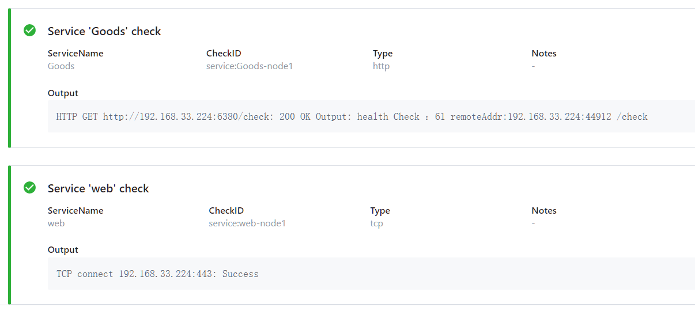

# Consul 下

[TOC]


## 定义服务

定义一个服务可以通过配置文件的方式，或者调用HTTP API 接口来实现。

一个服务定义必须包括 `name` 字段，可选字段有 `id`, `tags`, `address`, `meta`, `port`, `enable_tag_override`, `checks`等.

`id` 是唯一的， `name`如果出现重复时，`id` 必须配置。

 `tags` 可用来标记不同的版本。

```json
{
	"service": {
		"id": "redis",
		"name": "redis",
		"tags": ["primary"],
		"address": "",
		"meta": {
			"meta": "for my service"
		},
		"tagged_addresses": {
			"lan": {
				"address": "192.168.0.55",
				"port": 8000
			},
			"wan": {
				"address": "198.18.0.23",
				"port": 80
			}
		},
		"port": 8000,
		"enable_tag_override": false,
		"checks": [{
			"args": ["/usr/local/bin/check_redis.py"],
			"interval": "10s"
		}],
		"kind": "connect-proxy",
		"proxy_destination": "redis",
		"proxy": {
			"destination_service_name": "redis",
			"destination_service_id": "redis1",
			"local_service_address": "127.0.0.1",
			"local_service_port": 9090,
			"config": {},
			"upstreams": [],
			"mesh_gateway": {
				"mode": "local"
			},
			"expose": {
				"checks": true,
				"paths": [{
					"path": "/healthz",
					"local_path_port": 8080,
					"listener_port": 21500,
					"protocol": "http2"
				}]
			}
		},
		"connect": {
			"native": false,
			"sidecar_service": {}
		},
		"weights": {
			"passing": 5,
			"warning": 1
		},
		"token": "233b604b-b92e-48c8-a253-5f11514e4b50",
		"namespace": "foo"
	}
}
```

[Service Definition](https://www.consul.io/docs/discovery/services)

## 查询服务

可以通过 DNS 和 HTTP API 两个方法从 Consul 中注册的服务。

DNS 查询，格式 TAG.NAME.service.consul

```bash

# dig 通过 yum install -y bind-utils 安装
[root@node4 consul]# dig @127.0.0.1 -p 8600 web.service.consul

[root@localhost go-explore-202003]# dig @127.0.0.1 -p 8600 v1.Goods.service.consul

; <<>> DiG 9.11.4-P2-RedHat-9.11.4-26.P2.el7_9.2 <<>> @127.0.0.1 -p 8600 v1.Goods.service.consul
; (1 server found)
;; global options: +cmd
;; Got answer:
;; ->>HEADER<<- opcode: QUERY, status: NOERROR, id: 38369
;; flags: qr aa rd; QUERY: 1, ANSWER: 1, AUTHORITY: 0, ADDITIONAL: 1
;; WARNING: recursion requested but not available

;; OPT PSEUDOSECTION:
; EDNS: version: 0, flags:; udp: 4096
;; QUESTION SECTION:
;v1.Goods.service.consul.	IN	A

;; ANSWER SECTION:
v1.Goods.service.consul. 0	IN	A	192.168.33.224

;; Query time: 8 msec
;; SERVER: 127.0.0.1#8600(127.0.0.1)
;; WHEN: Wed Nov 25 17:21:44 CST 2020
;; MSG SIZE  rcvd: 68


```


通过 HTTP API 查询

```bash
# 查询前面注册的 web 服务信息
curl http://localhost:8500/v1/catalog/service/web

# 查询 Goods 服务信息
[root@node4 consul]# curl http://localhost:8500/v1/catalog/service/Goods
[{"ID":"2b582c9d-6084-da73-6f37-7cdb9df96f74","Node":"192.168.33.224","Address":"192.168.33.224","Datacenter":"shanghai","TaggedAddresses":{"lan":"192.168.33.224","lan_ipv4":"192.168.33.224","wan":"192.168.33.224","wan_ipv4":"192.168.33.224"},"NodeMeta":{"consul-network-segment":""},"ServiceKind":"","ServiceID":"Goods-node1","ServiceName":"Goods","ServiceTags":["v1"],"ServiceAddress":"192.168.33.224","ServiceTaggedAddresses":{"lan_ipv4":{"Address":"192.168.33.224","Port":6380},"wan_ipv4":{"Address":"192.168.33.224","Port":6380}},"ServiceWeights":{"Passing":1,"Warning":1},"ServiceMeta":{},"ServicePort":6380,"ServiceEnableTagOverride":false,"ServiceProxy":{"MeshGateway":{},"Expose":{}},"ServiceConnect":{},"CreateIndex":2147,"ModifyIndex":2147}]
```


## 更新服务信息

`consul reload`


# 健康检测

健康检测分为系统层（主机节点）和应用层。可以通过配置文件，或者在应用中调用 consul 提供的 HTTP API 来设置健康检测。

通过配置文件 `checks` 字段进行配置。

健康检测类型：

- Script + Interval, Script类型需要提供Script脚本和interval变量。 
- HTTP + Interval, HTTP类型必须提供http和Interval字段。
- TCP + Interval, TCP类型需要提供tcp和Interval字段。
- Time to Live (TTL)
- Docker + Interval
- gRPC + Interval
- Alias

**HTTP + Interval**

给一个商品服务，加入配置中心，每5秒调一次应用提供的 HTTP 健康检测接口。

配置文件形式：

```json
{
  "service": {
    "name": "Goods",
    "id":"Goods-node1",
    "tags": [
      "v1"
    ],
    "address": "192.168.33.224",  
    "port": 6380,
    "checks": [  
        {  
            "http": "http://192.168.33.224:6380/heath",  
            "interval": "5s",
            "timeout": "3s" 
        }  
    ]  
  }
}
```

也可以再应用中，通过SDK 代码注册。


**TCP + Interval**

```json
{
  "service": {
    "name": "web",
    "id":"web-node1",
    "tags": [
      "v1"
    ],
    "address": "192.168.33.224",  
    "port": 443,
    "checks": [  
        {  
            "tcp": "192.168.33.224:443",  
            "interval": "5s",
            "timeout": "2s" 
        }  
    ]  
  }
}
```




## 参考阅读

[Checks](https://www.consul.io/docs/discovery/checks)

[health checks tutorial](https://learn.hashicorp.com/tutorials/consul/service-registration-health-checks) 