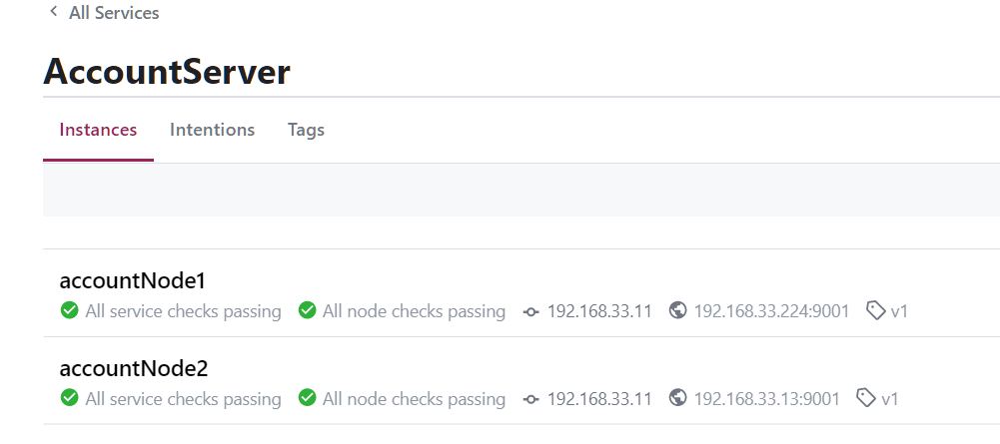

[TOC]


Consul 是 HashiCorp 公司推出的开源工具，用于实现分布式系统的服务发现与配置。属于 CP型注册中心，提供了强一致性的支持，Consul 内置了服务注册与发现框架、分布一致性协议实现、健康检查、Key/Value 存储、多数据中心方案支持等。

Consul 使用 Go 语言编写，方便移植，部署方便，与 Docker 等轻量级容器可无缝配合。

使用 Raft 算法来保证一致性, 比zookeeper 采用的是 Paxos更为简洁, etcd 也是是 Raft。

支持多数据中心，可以避免单数据中心的单点故障。 zookeeper 和 etcd 均不提供多数据中心功能的支持。支持健康检查。

Consul 可以作为一个服务网格解决方案，提供一个功能齐全的控制平面，服务发现，配置和细分功能。这些特性可以根据需要单独使用，也可以一起使用来构建一个完整的服务网格。Consul 需要一个数据平面，并同时支持代理和本机集成模型。

Consul 有一个简单的内置代理，但也支持第三方代理集成，如 `Envoy`。


## Consul 术语

**Agent**: Agent 是一直运行在Consul集群中每个成员上的守护进程。Agent 可以运行在client或者server模式。所有 Agent 都可以运行DNS或HTTP接口，并负责运行检查和保持服务同步。

**Client**: Client 是 Agent 客户端运行模式，是无状态的。将所有rpc转发到 Server。客户端执行的唯一后台活动是参与 LAN Gossip 池。

**Server**：Server 是 Agent server 运行模式保存配置信息，它具有扩展的职责集，包括参与 Raft quorum、维护集群状态、响应RPC查询、与本地客户端通讯，通过 WAN Gossip 与其他数据中心通讯，以及将查询转发给 Leader 或远程数据中心。每个数据中心的 server 数量推荐为 3 个或是 5 个。

**Datacenter**：数据中心，一个局域网内，私有的、低延迟和高带宽的网络环境。

**Gossip**：Consul 使用的通信协议，建立在Serf之上，Serf提供成员关系、故障检测和事件广播，主要是通过 UDP 进行。

**LAN Gossip Pool**：用于同一局域网或数据中心的节点的通信。

**WAN Gossip Pool**：用于跨数据中心通信。


## Gossip 协议


Consul 使用 gossip 协议来管理成员和广播消息到集群。

Consul使用两个不同的 `gossip` 池。分别称为 `LAN` 和 `WAN` 池。

每个数据中心有一个 `LAN gossip`池，它包含数据中心的所有成员——client和server。LAN池用于几个目的：

成员关系运行client自动发现server，减少配置量；分布式的故障检测允许故障检测的工作由整个集群承担，而不是集中在少数server上；gossip池允许可靠和快速的事件广播，比如leader选举。

WAN池是全局唯一的，所有数据中心的server都应该加入WAN Gossip池。WAN Gossip 池允许 server 执行跨数据中心请求，优雅的处理某个数据中心失联，或者远程数据中心只有一个server。 


同一个数据中心的所有节点都要加入 LAN Gossip协议。这意味着 LAN Gossip pool 包含给定数据中心的所有节点。有以下目的：

- 首先，没有必要为client配置服务器地址参数；发现是自动完成的。
- 节点故障检测的工作不是放置在服务器上，而是分布式的。这使故障检测比心跳机制更可扩展性。
- 可用来作为消息层通知重要的事件，如 Leader  选举。

每个数据中心选出一个单独的 Server 作为 Leader 领导负责处理所有查询和更新事务。更新事务操作还必须复制到所有 Server。当非 Leader 服务器接收到 RPC 请求时，它会将其转发给集群 Leader 服务器。

Server 还作为 WAN Gossip 池的一部分进行操作。此 WAN 池与 LAN 池不同，因为它针对外网的较高延迟进行了优化，这个池的目的是允许数据中心以一种低接触的方式发现彼此。在网上建立一个新的数据中心就像加入现有的 WAN Gossip 池一样简单。因为服务器都在此池中操作，所以它还支持跨数据中心请求。当服务器接收到针对不同数据中心的请求时，它将该请求转发到正确数据中心中的随机服务器。然后，该服务器可能会转发给本地Leader 。

多个数据中心之间是低耦合，由于故障检测、连接缓存复用、跨数据中心要求快速和可靠的响应。


通常，`不会在不同的 Consul 数据中心之间复制数据`。当对另一个数据中心中的资源发出请求时，本地代理服务器将该资源的RPC请求转发给远程代理服务器并返回结果。如果远程数据中心不可用，那么这些资源也不可用，但是这不会影响本地数据中心。在某些特殊情况下，可以复制有限的数据子集，比如使用领事的内置 [ACL replication](https://learn.hashicorp.com/tutorials/consul/access-control-replication-multiple-datacenters)  功能，或者使用像  [consul-replicate](https://github.com/hashicorp/consul-replicate) 这样的外部工具。

客户端代理可能缓存来自服务器的数据以提高性能和可靠性。这可以少一个往返于服务器的时延。一些API端点还支持可选的结果缓存。这有助于提高可靠性。


## 健康检测

https://www.consul.io/docs/discovery/checks


## Consul 的 Server-Client架构


## Consul vs. ZooKeeper, etcd 


ZooKeeper、doozerd和etcd的架构都很相似。这三个服务器节点都需要一个quorum节点来操作。它们是强一致性的，并公开各种原语，可以通过应用程序中的客户端库使用这些原语来构建复杂的分布式系统。

相比之下，Consul 通过 Gossip 协议，同时提供了本地和异地多数据中心的支持。

这几个系统都是强一致性的，根据CAP理论，当出现网络网络分区时，会牺牲部分节点的可用性，来维持一致性。

服务发现框架还必须包健康检测功能。如果节点失败或服务崩溃，知道节点A提供Foo服务是没有用的。幼稚的系统利用心跳，使用定期更新和TTLs。这些方案要求工作与节点数量成线性关系，并将需求放在固定数量的服务器上。此外，故障检测窗口至少与TTL一样长。

ZooKeeper提供临时节点，即K/V项，当客户端断开连接时将被删除。它们比心跳系统更复杂，但仍然存在固有的可伸缩性问题，增加了客户端复杂性。所有客户端必须保持与ZooKeeper服务器的活动连接，并执行维持活动。此外，这需要“胖客户端”，而“胖客户端”难于编写，常常导致调试困难。

Consul 使用非常不同的架构进行健康检查。与只有服务器节点不同，Consul 客户端在集群中的每个节点上运行。这些客户端是 Gossip 池的一部分，Gossip 池提供多种功能，包括分布式运行状况检查。Gossip 协议实现了一个有效的故障检测器，它可以扩展到任何规模的集群，而无需将工作集中特定的 Server 上。

客户端还允许在本地运行一组更丰富的运行状况检查，而ZooKeeper临时节点是一种非常原始的活性检查。使用 Consul，客户端可以检查web服务器是否返回200个状态码，内存利用率情况，是否有足够的磁盘空间，等等。Consul 客户端公开一个简单的HTTP接口，并避免像ZooKeeper那样向客户端暴露系统的复杂性。

Consul 为服务发现、检查检测、K/V存储和多个数据中心提供一流的支持。除了简单的K/V存储之外，这些功能在其他系统都需要额外的工具和库。通过使用客户端节点，Consul 提供了一个只需要瘦客户机的简单API。此外，完全可以通过使用配置文件和DNS接口来避免API，从而不需要进行任何开发就能实现服务发现。


服务注册相比 Eureka 会稍慢一些。因为 Consul 的 raft 协议要求必须过半数的节点都写入成功才认为注册成功；

Consul Leader挂掉时，重新选举期间整个 Consul 不可用，以此保证了强一致性但牺牲了可用性。

# 部署应用

> 1. 一个 RPC Server ，有两个应用实例部署，通过 Consul 实现服务发现，故障隔离，结合负载均衡
> 2. Consul + Template + nginx（kong）怎么玩
> 3. Consul 集群怎么部署，怎么操作

安装包就一个二进制文件，解压即可。

启动 

```bash
consul agent -dev

# 指定ip ，开启 ui
consul agent -dev -client 192.168.33.11 -ui
```


用浏览器访问WEB管理界面：

```
http://192.168.33.11:8500/ui/#/dc1/services
```


说明：在 cli 模式下，支持环境变量，下面直接用hosts 配置，代替具体的ip

/etc/hosts 文件如下：

```
192.168.33.11 node1
192.168.33.12 node2
192.168.33.13 node3
192.168.33.224 node4
```

## 集群部署

三个 centos7 节点：192.168.33.11，192.168.33.12，192.168.33.13 分别为 node1，node2，node3。

每个节点安装二进制文件 consul ，添加环境变量。

```bash
#node1 启动consul
nohup consul agent -server -bootstrap-expect=2 -data-dir /tmp/consul -log-file /var/log/consul -node 192.168.33.11 -bind=192.168.33.11 -client=0.0.0.0 -datacenter=shanghai -ui >> /usr/local/consul/output.log 2>&1 &

#node2 启动consul
nohup consul agent -server -bootstrap-expect 2 -data-dir /tmp/consul -log-file /var/log/consul -node 192.168.33.12 -bind=192.168.33.12 -client=0.0.0.0 -retry-join 192.168.33.11 -datacenter shanghai -ui  >> /usr/local/consul/output.log 2>&1 &

#node3 启动consul
nohup consul agent -server -bootstrap-expect 2 -data-dir /tmp/consul -log-file /var/log/consul -node 192.168.33.13 -bind=192.168.33.13 -client=0.0.0.0 -datacenter beijing -ui  >> /usr/local/consul/output.log 2>&1 &

#node4 (留着后面多集群使用)
nohup consul agent -server -bootstrap-expect 2 -data-dir /tmp/consul -log-file /var/log/consul -node 192.168.33.224 -bind=192.168.33.224 -client=0.0.0.0 -datacenter beijing -ui  >> /usr/local/consul/output.log 2>&1 &

```

参数说明：

-  server： 以server身份启动。默认是client
-  bootstrap-expect：集群要求的最少server数量，当低于这个数量，集群即失效。
-  data-dir：data存放的目录，
-  node：节点id，集群中的每个node必须有一个唯一的名称。默认情况下，Consul使用机器的hostname
-  bind：监听的ip地址。默认绑定0.0.0.0，可以不指定。表示Consul监听的地址,而且它必须能够被集群中的其他节点访问。Consul默认会监听第一个private IP,但最好还是提供一个。生产设备上的服务器通常有好几个网卡，所以指定一个不会出错
-  client: 客户端的ip地址，0.0.0.0是指谁都可以访问（不加这个，下面的ui :8500无法访问）
-  retry-join:多次尝试试图加入一个集群
-  ui: 可以访问UI界面
- -config-dir指定配置文件夹，Consul会加载其中的所有文件
- -datacenter 指定数据中心名称，默认是dc1

### 节点 join 集群

此时没有 cluster leader 节点

```
2020-11-24T13:53:00.848+0800 [ERROR] agent: Coordinate update error: error="No cluster leader"
2020-11-24T13:53:11.603+0800 [ERROR] agent.anti_entropy: failed to sync remote state: error="No cluster leader"
```

当一个consul agent启动后，它不知道任何其他节点, agent 必须加入一个已经存在的集群(cluster)。要加入一个集群，只需要知道这个集群中的一个节点即可。它加入后，将会和这个member gossip（交谈）并迅速发现集群中的其他节点。一个consul agent可以加入任何类型的其他agent，而不只是那些运行于server mode的agent。

分别让 node2 和 node3 节点加入 node1 集群：

```bash
# 以下相当于 consul join 192.168.33.11， node1 为 hosts 文件配置的主机host
consul join node1

# 加入成功
2020-11-24T14:07:10.078+0800 [INFO]  agent.server: member joined, marking health alive: member=192.168.33.12
2020-11-24T14:07:10.188+0800 [INFO]  agent.server: member joined, marking health alive: member=192.168.33.13
```


### 优雅离开集群

把node3 从集群移除

```bash
[root@localhost consul]# consul leave
Graceful leave complete

# 日志
2020-11-24T14:27:34.871+0800 [INFO]  agent.server.raft: removed peer, stopping replication: peer=d7d47526-386a-17fd-3f67-df22b0e83b2a last-index=167
2020-11-24T14:27:34.873+0800 [INFO]  agent.server.raft: aborting pipeline replication: peer="{Voter d7d47526-386a-17fd-3f67-df22b0e83b2a 192.168.33.13:8300}"
2020-11-24T14:27:34.915+0800 [INFO]  agent.server: deregistering member: member=192.168.33.13 reason=left

```

### 多数据中心(dc)

node1，node2 节点为集群1（shanghai），node3,node4 为集群2（beijing），

```bash
# 查看 dc1
[root@localhost consul]# consul operator raft list-peers
Node           ID                                    Address             State     Voter  RaftProtocol
192.168.33.11  61c649a3-61e9-7d34-89ab-f60f6da2e568  192.168.33.11:8300  leader    true   3
192.168.33.12  3182f531-7ad9-1162-f7fa-6beaf0c67761  192.168.33.12:8300  follower  true   3

# 查看 dc2
[root@localhost vagrant]# consul operator raft list-peers
Node            ID                                    Address              State     Voter  RaftProtocol
192.168.33.224  2b582c9d-6084-da73-6f37-7cdb9df96f74  192.168.33.224:8300  leader    true   3
192.168.33.13   ebd7bc1e-214c-1a15-05e6-86a0425b491c  192.168.33.13:8300   follower  true   3
```

让两个集群通过 WAN Gossip 彼此可见：

```bash
# 在 dc2任意节点执行
consul join -wan node1
```

查看 WAN Gossip 池中节点信息，这里只有 server 节点， client 节点只在 LAN Gossip 中作为节点代理向当前 dc 中 server 发送请求。

```bash
[root@localhost vagrant]# consul members -wan
Node                    Address              Status  Type    Build  Protocol  DC        Segment
192.168.33.11.shanghai  192.168.33.11:8302   alive   server  1.8.6  2         shanghai  <all>
192.168.33.12.shanghai  192.168.33.12:8302   alive   server  1.8.6  2         shanghai  <all>
192.168.33.13.beijing   192.168.33.13:8302   alive   server  1.8.6  2         beijing   <all>
192.168.33.224.beijing  192.168.33.224:8302  alive   server  1.8.6  2         beijing   <all>
```


### server-client

```bash

#node1  server 模式启动
nohup consul agent -server -bootstrap-expect 2 -data-dir /tmp/consul -log-file /var/log/consul -node 192.168.33.11 -bind 192.168.33.11 -client 0.0.0.0 -datacenter shanghai -ui >> /usr/local/consul/output.log 2>&1 &

#node2 server 模式启动加入node1集群
nohup consul agent -server -bootstrap-expect 2 -data-dir /tmp/consul -log-file /var/log/consul -node 192.168.33.12 -bind 192.168.33.12 -client 0.0.0.0 -retry-join 192.168.33.11 -datacenter shanghai -ui  >> /usr/local/consul/output.log 2>&1 &

#node3 client模式启动加入node1集群
nohup consul agent -data-dir /tmp/consul -log-file /var/log/consul -node 192.168.33.13 -bind 192.168.33.13 -client 0.0.0.0 -datacenter shanghai -retry-join 192.168.33.11 -ui  >> /usr/local/consul/output.log 2>&1 &
```

节点信息：

```bash
[root@localhost consul]# consul members
Node           Address             Status  Type    Build  Protocol  DC        Segment
192.168.33.11  192.168.33.11:8301  alive   server  1.8.6  2         shanghai  <all>
192.168.33.12  192.168.33.12:8301  alive   server  1.8.6  2         shanghai  <all>
192.168.33.13  192.168.33.13:8301  alive   client  1.8.6  2         shanghai  <default>
```

每个数据中心都是由Server和 Client 组成。建议有3或5 Server 模式的节点，这是基于故障处理和性能的平衡之策。因为 Server 节点越多，维护节点分布式一致性的成本就会越高，需要的时间也更久。对 Client 模式的节点则没有限制，可以很容易地扩展到成千上万或数万。

通过 Client 节点，大大分担了 Server 节点的压力，减少了如健康检测等对 Server 节点的压力。具体的应用服务节点不必直接连 Server，只需要连接 Client 节点就可以实现服务发现的功能。


### 其他操作

**集群状态查看**

```bash
[root@localhost consul]# consul operator raft list-peers
Node           ID                                    Address             State     Voter  RaftProtocol
192.168.33.11  61c649a3-61e9-7d34-89ab-f60f6da2e568  192.168.33.11:8300  leader    true   3
192.168.33.12  3182f531-7ad9-1162-f7fa-6beaf0c67761  192.168.33.12:8300  follower  true   3
192.168.33.13  d7d47526-386a-17fd-3f67-df22b0e83b2a  192.168.33.13:8300  follower  true   3
```

**查看members状态**

```bash
[root@localhost consul]# consul members
Node           Address             Status  Type    Build  Protocol  DC        Segment
192.168.33.11  192.168.33.11:8301  alive   server  1.8.6  2         shanghai  <all>
192.168.33.12  192.168.33.12:8301  alive   server  1.8.6  2         shanghai  <all>
192.168.33.13  192.168.33.13:8301  alive   server  1.8.6  2         shanghai  <all>
```

**kv 存储get/set**, 也可以通过WEB界面进行操作

```bash
[root@localhost consul]# consul kv put name hxx
Success! Data written to: name
[root@localhost consul]# consul kv get name
hxx
```

**通过 HTTP API 查询节点信息**

`curl http://node1:8500/v1/catalog/nodes?dc=shanghai`

```json
[
    {
        "ID": "61c649a3-61e9-7d34-89ab-f60f6da2e568", 
        "Node": "192.168.33.11", 
        "Address": "192.168.33.11", 
        "Datacenter": "shanghai", 
        "TaggedAddresses": {
            "lan": "192.168.33.11", 
            "lan_ipv4": "192.168.33.11", 
            "wan": "192.168.33.11", 
            "wan_ipv4": "192.168.33.11"
        }, 
        "Meta": {
            "consul-network-segment": ""
        }, 
        "CreateIndex": 6, 
        "ModifyIndex": 11
    }, 
   ...
]
```


### 定义服务

定义一个服务可以通过配置文件的方式，或者调用HTTP API 接口来实现。

一个服务定义必须包括 `name` 字段，可选字段有 `id`, `tags`, `address`, `meta`, `port`, `enable_tag_override`, `check`等.

`id` 是唯一的， `name`如果出现重复时，`id` 必须配置。

 `tags` 可用来标记不同的版本。


```json
{
	"service": {
		"id": "redis",
		"name": "redis",
		"tags": ["primary"],
		"address": "",
		"meta": {
			"meta": "for my service"
		},
		"tagged_addresses": {
			"lan": {
				"address": "192.168.0.55",
				"port": 8000
			},
			"wan": {
				"address": "198.18.0.23",
				"port": 80
			}
		},
		"port": 8000,
		"enable_tag_override": false,
		"checks": [{
			"args": ["/usr/local/bin/check_redis.py"],
			"interval": "10s"
		}],
		"kind": "connect-proxy",
		"proxy_destination": "redis",
		"proxy": {
			"destination_service_name": "redis",
			"destination_service_id": "redis1",
			"local_service_address": "127.0.0.1",
			"local_service_port": 9090,
			"config": {},
			"upstreams": [],
			"mesh_gateway": {
				"mode": "local"
			},
			"expose": {
				"checks": true,
				"paths": [{
					"path": "/healthz",
					"local_path_port": 8080,
					"listener_port": 21500,
					"protocol": "http2"
				}]
			}
		},
		"connect": {
			"native": false,
			"sidecar_service": {}
		},
		"weights": {
			"passing": 5,
			"warning": 1
		},
		"token": "233b604b-b92e-48c8-a253-5f11514e4b50",
		"namespace": "foo"
	}
}
```


## 配置文件

```bash
consul agent -server -config-dir /usr/local/consul -bind=192.168.33.11 
```

**-config-dir** 指定加载的配置文件目录，consul将加载目录下所有后缀为“.json”的文件，加载顺序为字母顺序，文件中配置选项合并方式如config-file。该参数可以多次配置。目录中的子目录是不会加载的。


```json
{
  "datacenter": "shanghai",
  "data_dir": "/tmp/consul",
  "log_level": "INFO",
  "log_file": "/var/log/consul",
  "node_name": "node1",
  "client": "0.0.0.0",
  "bind": "0.0.0.0",
  "server": true,
  "ui": true,
  "bootstrap_expect": 3,
  "watches": [
    {
        "type": "checks",
        "handler": "/usr/bin/health-check-handler.sh"
    }
  ],
  "telemetry": {
     "statsite_address": "127.0.0.1:2180"
  }
}
```


```json
{
  "service": {
    "name": "redis",
    "tags": ["master"],
    "address": "1192.168.1.100",
    "port": 8000,
    "enableTagOverride": false,
    "check": {  
        "id": "redis",  
        "name": "redis on port 8000",  
        "tcp": "localhost:8000",  
        "interval": "10s",  
        "timeout": "1s"  
  }
  }
}
```


[Consul 配置文档](https://www.consul.io/docs/agent/options.html#configuration_files)

## 应用

一个 Account 服务，如何接入 Consul 集群，实现服务发现？

node1，node2 节点作为 Consul Server，即节点上的 Consul 以 Server 模式运行。

node3, node4 作为 Account服务节点

### 注册服务

服务通过 `github.com/hashicorp/consul/api` 向 Consul 注册服务信息，同时设置健康监测的处理函数用于被Consul调用。

```go
package server

import (
	"fmt"
	consul "github.com/hashicorp/consul/api"
	"log"
	"net/http"
)

const (
	consulServer = "192.168.33.11:8500" // Consul 服务节点，向这里注册应用服务信息
	checkPort    = 8080                 // 健康监测端口库

	serverName = "AccountServer"  // 服务名称
	nodeName   = "accountNode1"   // 服务节点的名称, 这个根据具体实例节点调整
	nodeAddr   = "192.168.33.224" // 服务节点的地址，这个根据具体实例节点调整
	serverPort = 9001             // 服务端口
	serverTag  = "v1"             // 服务标签
)

//把 Service Provider 注册到 Consul 中
func RegisterServer() {
	config := consul.DefaultConfig()
	config.Address = consulServer
	client, err := consul.NewClient(config)
	if err != nil {
		log.Fatal("consul client error : ", err)
	}

	registration := new(consul.AgentServiceRegistration)
	registration.Name = serverName
	registration.Tags = []string{serverTag}
	registration.Port = serverPort
	registration.ID = nodeName
	registration.Address = nodeAddr

	// 健康检查
	registration.Check = &consul.AgentServiceCheck{
		HTTP:                           fmt.Sprintf("http://%s:%d%s", registration.Address, checkPort, "/check"),
		Timeout:                        "3s",
		Interval:                       "5s",  // 健康检查间隔
		DeregisterCriticalServiceAfter: "10s", //check失败后10秒从 Consul 删除本服务
        
        // proto 文件 https://github.com/grpc/grpc/blob/master/doc/health-checking.md
		// GRPC:     fmt.Sprintf("%v:%v/%v", IP, r.Port, r.Service),// grpc 支持，执行健康检查的地址，service 会传到 Health.Check 函数中
	}

	err = client.Agent().ServiceRegister(registration)
	if err != nil {
		log.Fatal("register server error : ", err)
	}

	http.HandleFunc("/check", healthCheckHandler)
	http.ListenAndServe(fmt.Sprintf(":%d", checkPort), nil)

}

// consul 服务端会请求这个方法来进行健康检查
var count int64

func healthCheckHandler(w http.ResponseWriter, r *http.Request) {
	s := "consulCheck" + fmt.Sprint(count) + "remote:" + r.RemoteAddr + " " + r.URL.String()
	fmt.Fprintln(w, s)
	count++
}

```

服务节点注册成功



一个节点下线时，


超过设置时间，故障节点会被移除，恢复之后会重新加入服务实例列表。


### 获取服务节点信息

```go
package client

import (
	"fmt"
	"github.com/hashicorp/consul/api"
	"log"
	"net"
	"strconv"
)

const (
	consulServer = "192.168.33.11:8500" // Consul 服务节点，向这里注册应用服务信息
	serverName   = "AccountServer"      // 服务名称
	serverTag    = "v1"                 // 服务标签
)

func ServiceDiscovery() {
	var lastIndex uint64
	config := api.DefaultConfig()
	config.Address = consulServer

	client, err := api.NewClient(config)
	if err != nil {
		log.Fatal(err)
	}
	//根据名和服务标签获取服务实例信息
	services, metainfo, err := client.Health().Service(serverName, serverTag, true, &api.QueryOptions{
		WaitIndex: lastIndex, // 同步点，这个调用将一直阻塞，直到有新的更新
	})
	if err != nil {
		log.Printf("error retrieving instances from Consul: %v", err)
	}
	lastIndex = metainfo.LastIndex

	addrs := map[string]struct{}{}
	for _, service := range services {
		fmt.Println("service.Service.Address:", service.Service.Address, "service.Service.Port:", service.Service.Port)
		addrs[net.JoinHostPort(service.Service.Address, strconv.Itoa(service.Service.Port))] = struct{}{}
	}
}
```


服务端打印出的节点信息：

```
service.Service.Address: 192.168.33.224 service.Service.Port: 9001
service.Service.Address: 192.168.33.13 service.Service.Port: 9001
```


这里没用到 Consul Client 模式，Client 怎么用

# 其他功能


### ACL

ACL 权限控制列表 (Access Control List),


# Consul-Template

Consul-Template 为 Consul官方推出的模板系统。Consul一样，也是用Golang实现。Consul-Template 提供了一个便捷的方式从Consul中获取存储的值，Consul-Template守护进程会查询 Consul 实例来更新系统上指定的任何模板来动态的创建配置文件。

Consul-Template安装非常简单，只需要下载对应系统的软件包并解压后就可使用。

## Consul + Template + Nginx 应用

Consul + Template + Nginx 部署高可用负载均衡.

- Nginx 用于复杂均衡

- Consul 作为注册中心实现服务发现

- Consul-template 监控 Consul 中的可用服务变更，并动态维护 Nginx 上有可用服务的配置文件信息。当在 Consul 中注册的服务挂掉时；Nginx中的Server 的配置信息会被 Consul-template 实时删除，并重新加载（Nginx -s reload）配置文件。


[Introducing Consul Template](https://www.hashicorp.com/blog/introducing-consul-template)


# 扩展阅读

[Consul 官网文档](https://www.consul.io/docs/intro)

[Consul vs. Other Software](https://www.consul.io/docs/intro/vs/eureka)

[Introducing Consul Template](https://www.hashicorp.com/blog/introducing-consul-template)

