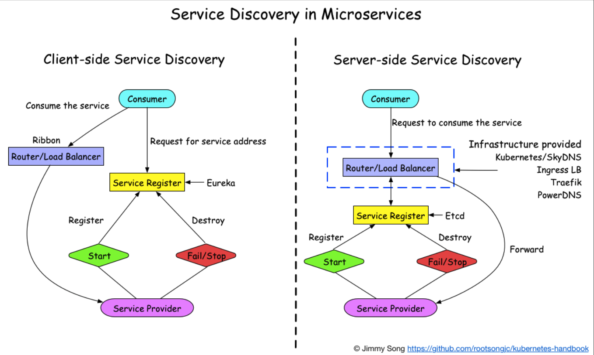
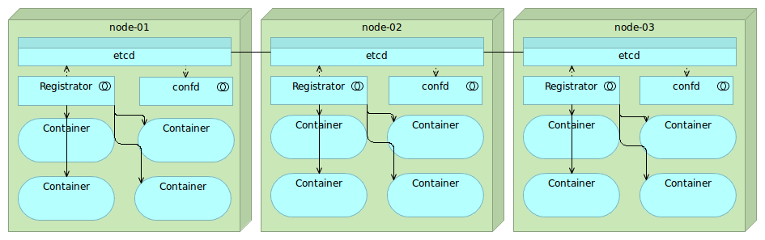

[TOC]

## 原理

三种角色：服务提供者（RPC Server）、服务消费者（RPC Client）和服务注册中心（Registry）

RPC Server 在启动时，向 Registry 注册自身服务，并向 Registry 定期发送心跳汇报存活状态。

RPC Client 调用服务，在启动时，向 Registry 订阅服务，把 Registry 返回的服务节点列表缓存在本地内存中，并与 RPC Sever 建立连接。

当 RPC Server 节点发生变更时，Registry 会同步变更，RPC Client 感知后会刷新本地内存中缓存的服务节点列表。

RPC Client 从本地缓存的服务节点列表中，基于负载均衡算法选择一台 RPC Sever 发起调用。

## 服务发现模式

**服务端服务发现**：服务使者请求 Router/Loadbalancer ，Router 去查询注册中心查询可用的服务列表信息，结合负载均衡策略，转发到对应的服务提供者节点。这种模式，Consumer 无需关注服务发现具体细节，只需知道 服务的 DNS 域名即可，支持异构语言开发，需要 基础设施支撑，多了一次网络跳转，可能有性能损失。如 Consul Template+Nginx ，kubernetes+etcd 。

**客户端服务发现**：比服务端服务发现少一次网络跳转， Consumer 需要内置特定的服务发现客户端和发现逻辑。多语言，变更会麻烦，如果技术栈统一，基础库稳定，也是不错的选择。此时注册中心，担任的只是一个配置下发的角色。

一个 Server Provider 实例启动时，它的网络地址会写到注册中心;当 Server Provider 实例终止时，要从注册中心删除对应的实例信息;注册中心通过心跳机制动态刷新检测实例健康状况;客户端使用一个负载均衡算法（LB也可分为集成SDK和外挂负载均衡），去选择一个可用的服务实例进行调用。

## 实现

注册中心需要提供哪些接口？

注册中心该如何部署？

如何存储服务信息？

如何监控服务提供者节点的存活？

如果服务提供者节点有变化如何通知服务消费者？

如何控制注册中心的访问权限？

**注册中心 API**

注册中心必须提供以下最基本的 API：

服务注册接口：服务提供者通过调用服务注册接口来完成服务注册。

服务注销接口：服务提供者用于服务注销。

心跳汇报接口：服务提供者通过调用心跳汇报接口完成节点存活状态上报。

服务订阅接口：服务消费者通过调用服务订阅接口完成服务订阅，获取可用的服务提供者节点列表。

服务变更查询接口：服务消费者通过调用服务变更查询接口，获取最新的可用服务节点列表。

服务查询接口：查询注册中心当前注册了哪些服务信息。

服务修改接口：修改注册中心中某一服务的信息。

后台管理的 API：

注册中心是服务提供者和调用之间的沟通桥梁，相当重要，所以通常需要`保证高可用`，`集群化部署`，并通过`分布式一致性协议`来确保集群中不同节点之间的数据保持一致。

开源的产品如 ZooKeeper，后起之秀 etcd。

*zk并不合适做注册中心，注册中心应该是一个AP的系统 ？*

*注册中心来实现服务发现与传统的 DNS 实现服务发现有什么不同吗？*

- 注册中心对已注册的服务会有主动的、自动化的健康检查机制，DNS没有。
- 注册中心一般是一级分布式的，DNS则是多级架构，例如根域名服务器、权威域名服务器等。
- 注册中心实时性、容错性好于DNS。注册中心的服务注册和发现都是基于API的，可以自动化注册与发现，dns则是人工注册，有延迟，维护不便。
- 通过DNS，客户端通常只能连接一个Server端IP，不易负载均衡，而通过注册中心，可以拿到所有服务提供者的地址信息。
- DNS只能做到IP级的服务发现，不能端口级服务发现。

**应用内应用外注册中心**

应用内 & 应用外实现注册中心。

用应用内注册与发现的方式，最典型的案例要属 Eureka。服务的提供者和消费着都要集成 Eureka 的 SDK，对项目代码有侵入，对于大规模部署，维护级更新会比较麻烦。

应用外方式实现服务注册和发现，如 Consul 。

Consul：注册中心的服务端，实现服务注册信息的存储，并提供注册和发现服务。

Registrator：一个开源的第三方服务管理器项目，它通过监听服务部署的容器实例是否存活，来负责服务提供者的注册和销毁。

Consul Template：定时从注册中心服务端获取最新的服务提供者节点列表并刷新 LB 配置（比如 Nginx 的 upstream），这样服务消费者就通过访问 Nginx 就可以获取最新的服务提供者信息。

## 服务信息存储

结合具体多产品来看。

## CP与AP型注册中心

注册中心需要具备高可用性，对数据一致性也有要求；

为了保证高可用性，通常需要集群部署，甚至异地多机房部署，于是就绕不开数据一致性的问题。集群节点之间的数据一致性，甚至是不同机房的数据一致性。

于是也绕不开分布式系统中著名的 CAP 理论。

**CAP 理论** ：C（Consistency）代表一致性，A（Availability）代表可用性，P（Partition Tolerance）代表分区容错性，三者不可同时满足。

- C（Consistency）代表一致性，等同于所有节点访问同一份最新的数据副本。
- A（Availability）代表可用性，每次请求都能获取到非错的响应——但是不保证获取的数据为最新数据。
- P（Partition Tolerance）代表分区容错性，当出现网络联通问题，会把集群划分为彼此隔离的分区，但任意区域内节点上的数据依然可访问。

**理解CAP**：

想象两个节点分处隔离的两个分区。允许至少一个节点更新状态会导致数据不一致，即丧失了C性质。如果为了保证数据一致性，将分区一侧的节点设置为不可用，那么又丧失了A性质。除非两个节点可以互相通信，才能既保证C又保证A，这又会导致丧失P性质。

实际上，系统的分区如果不能在一定时间内达成数据一致性，就意味着发生了分区的情况，必须就当前操作在C和A之间做出选择。

总的来说，就是数据节点越多，分区容错性越高，但数据一致性越难保证。为了保证数据一致性，又会带来可用性的问题。

发生分区通常来说是小概率事件，但是对于跨地区的系统，架构师通常无法舍弃 P 性质，那么就只能在数据一致性 C 和可用性 A 上做一个选择。

于是主流的注册中心主要分为 CP 型和 AP 型注册中心。

**CP 型注册中心**，牺牲可用性来保证数据强一致性，如 `ZooKeeper`，`etcd`，`Consul` 了。ZooKeeper 集群内只有一个 Leader，而且在 Leader 无法使用的时候通过 `Paxos 算法`选举出一个新的 Leader。这个 Leader 的目的就是保证写信息的时候只向这个 Leader 写入，Leader 会同步信息到 Followers，这个过程就可以保证数据的强一致性。但如果多个 ZooKeeper 之间网络出现问题，造成出现多个 Leader，发生脑裂的话，注册中心就不可用了。而 etcd 和 Consul 集群内都是通过 `raft 协议`来保证强一致性，如果出现脑裂的话， 注册中心也不可用。

**AP 型注册中心**，牺牲一致性来保证可用性，最典型的例子就是 `Eureka` 了。对比下 Zookeeper，Eureka 不用选举一个 Leader，每个 Eureka 服务器单独保存服务注册地址，因此有可能出现数据信息不一致的情况。但是当网络出现问题的时候，每台服务器都可以完成独立的服务。

**选 AP 还是 CP ？** 在网络出现问题的时候，可用性的要高于数据一致性。即使因为数据不一致，注册中心内引入了不可用的服务节点，也可以通过其他措施来避免，比如客户端的快速失败机制等，只要实现最终一致性，对于注册中心来说就足够了。因此，选择 AP 型注册中心，一般更加合适。当然这也要结合具体的业务场景，不能一改而论。

相比较而言，在大规模集群中，CP 型要维护强一致性，其性能不如 AP 型。如 zookeeper 没有 Euerka 能抗。

如果业务已经是云原生的应用，可以考虑使用 Consul，Etcd 搭配 Registrator 和 Consul Template 来实现应用外的服务注册与发现。在 k8s 中，就是 Etcd 来实现服务注册发现。

### 开源方案

Consul

zookeeper

Etcd

Euerka

### 服务发现

假设我们写的代码会调用 REST API 或者 RPC 的服务。为了完成一次请求，需要知道服务实例的网络位置（IP 地址和端口）。

传统应用中，运行在物理硬件上时，服务实例的网络位置是相对固定的，代码能从一个偶尔更新的配置文件中读取网络位置。对于基于云端的、现代化的微服务应用而言，这却是一大难题。将容器应用部署到集群时，其服务地址是由集群系统动态分配的。那么，当我们需要访问这个服务时，如何确定它的地址呢？这时就需要服务发现（Service Discovery）了。

当服务提供者节点挂掉时，要求服务能够及时取消注册，比便及时通知消费者重新获取服务地址。

当服务提供者新加入时，要求服务中介能及时告知服务消费者，你要不要尝试一下新的服务。

服务提供者需要每隔5秒左右向服务中介汇报存活，服务中介将服务地址和汇报时间记录在zset数据结构的value和score中。服务中介需要每隔10秒左右检查zset数据结构，踢掉汇报时间严重落后的服务地址项。这样就可以准实时地保证服务列表中`服务地址的有效性`。

`服务列表变动时如何通知消费者`

## 存储

ZooKeeper节点将它们的数据存储于一个分层的命名空间，非常类似于一个文件系统或一个[前缀树](https://zh.wikipedia.org/wiki/前缀树)结构。数据按层次结构组织在文件系统中，并复制到 ensemble（一个 ZooKeeper 服务器的集合） 中所有的 ZooKeeper 服务器。对数据的所有操作都是原子的和顺序一致的。

客户端可以在节点读写，从而以这种方式拥有一个共享的配置服务。

更新是[全序](https://zh.wikipedia.org/wiki/全序)。

如果运行在一个服务器集群中，ZooKeeper将跨所有节点共享配置状态，每个集群选举一个 Leader，客户端可以连接到任何一台服务器获取数据。

每个目录在 ZooKeeper 中叫作 znode，并且其有一个唯一的路径标识。znode 可以包含数据和子 znode。znode 中的数据可以有多个版本，比如某一个 znode 下存有多个数据版本，那么查询这个路径下的数据需带上版本信息。

ZooKeeper数据保存在内存中。每个改变都被写入一个在存储介质上的持久 WAL（Write Ahead Log）。当一个服务器故障时，它能够通过回放 WAL 恢复之前的状态。为了防止 WAL 无限制的增长，ZooKeeper 服务器会定期的将内存状态快照保存到存储介质。这些快照能够直接加载到内存中，所有在这个快照之前的 WAL 条目都可以被安全的丢弃。

## Api

- *create* : creates a node at a location in the tree
- *delete* : deletes a node
- *exists* : tests if a node exists at a location
- *get data* : reads the data from a node
- *set data* : writes data to a node
- *get children* : retrieves a list of children of a node
- *sync* : waits for data to be propagated

## 服务健康状态检测

注册中心除了要支持最基本的服务注册和服务订阅功能以外，还必须具备对服务提供者节点的健康状态检测功能，这样才能保证注册中心里保存的服务节点都是可用的。

ZooKeeper健康检测，基于客户端和服务端的长连接和会话超时控制机制，来实现服务健康状态检测的。客户端和服务端建立连接后，会话也随之建立，并生成一个全局唯一的 Session ID。服务端和客户端维持的是一个长连接，在 SESSION_TIMEOUT 周期内，通过客户端定时向服务端发送心跳消息（ping 消息），服务器重置 SESSION_TIMEOUT 时间。如果超过 SESSION_TIMEOUT 后服务端都没有收到客户端的心跳消息，ZooKeeper 就会认为这个服务节点已经不可用，将会从注册中心中删除其信息。

*故障恢复呢？*

## 服务状态变更通知

当注册中心探测到有服务提供者节点新加入或者被剔除，须立刻通知所有订阅该服务的服务消费者，刷新本地缓存的服务节点信息。

在 ZooKeeper 中，通过 Watcher 机制，来实现服务状态变更通知给服务消费者的。服务消费者在调用 ZooKeeper 的 getData 方法订阅服务时，还可以通过监听器 Watcher 的 process 方法获取服务的变更，然后调用 getData 方法来获取变更后的数据，刷新本地缓存的服务节点信息。

ZooKeeper的主要优势是其成熟、健壮以及丰富的特性，然而，它也有自己的缺点，其中采用Java开发以，太重，太复杂。

