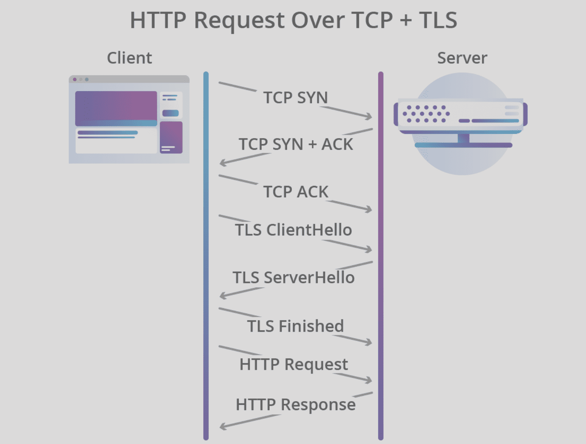
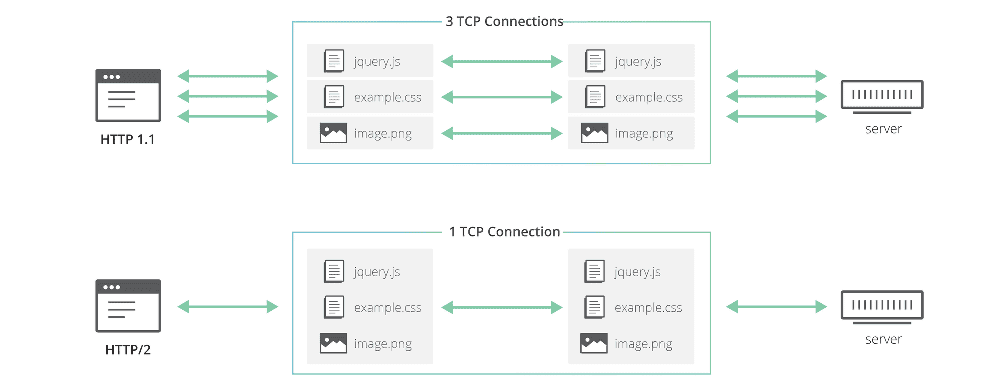
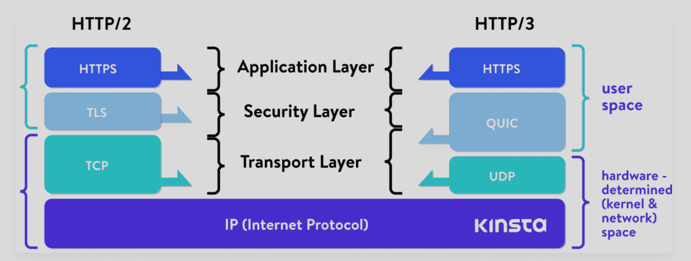

[TOC]

**提问**：

http3 为何放弃使用 tcp 改用 udp 协议？

http3 相比 http2，http1.1 又有哪些改进和优化？

在 http3 中，将弃用TCP协议，改为使用基于 `UDP` 协议的 `QUIC` 协议实现。 此变化主要为了解决 http2 中存在的`队头阻塞问题(head-of-line blocking)`。由于 http2 在单个 TCP 连接上使用了多路复用，受到 TCP 拥塞控制的影响，少量的丢包就可能导致整个 TCP 连接上的所有流被阻塞。

TCP 新建连接的开销，以及新连接必须经历缓`慢启动`过程，使得应用无法立即使用所有可用的网络带宽。

## http的演变到放弃tcp

**http1.1**

http1.1 引入了 “`keep-alive`”，它允许客户端重用TCP连接，从而分摊初始连接建立的成本和慢启动的成本。虽然多个请求可以共享同一个连接，但它们仍然必须一个接一个地序列化，因此客户机和服务器在任何给定时间只能为每个连接执行单个请求/响应交换。受此影响， http1.1 根本无法充分利用 tcp 的传输能力。

**http2**

由于浏览器对于同源并发连接数的限制，又由于 css，js，img 等资源越来越多，需要更多的并发请求。 http2 登上了历史舞台。

http2 最核心的变化是引入了二进制分帧层，引入了“流”的概念，允许多个 http 请求复用同一个 tcp 连接。并且各个请求之间传输没互不影响，这使得 http2 能比 http1.1 更加充分利用 tcp 的传输能力。同时 http2 还引入了诸如`头压缩`，`服务端推送`，`流优先级`等优化措施。

虽然在 http2 中各个流之前是隔离的，但是在下面的 tcp 层却可能会相互影响，由于 tcp 的`拥塞控制`, 当出现部分丢包现象时，tcp 会降低包的发送速度，导致整体的网络吞吐能力下降。即少量的丢包就可能导致整个 TCP 连接上的所有流被阻塞。

此外，tcp 依然有建立`连接成本高`，`慢启动`，`队首阻塞`(head-of-line blocking) 等问题，也并不是总能很好的利用带宽资源。所以到了 http3 直接舍弃了tcp，使用基于 UDP 的 `QUIC` 作为传输层的协议。

QUIC 流共享相同的 QUIC 连接，QUIC包被封装在UDP数据报的顶部。QUIC 不需要像 TCP 那样额外的握手和慢速启动来创建新的连接，QUIC流是独立交付的，大多数情况下，一个流的包丢失不会影响其他流。

## QUIC 协议

`QUIC`(快速UDP网络连接)是一种新的默认加密的互联网传输协议，衍生自 Google 的 gQUIC，旨在使网络更快，更安全，其预期目标是最终取代web上的TCP和TLS。

