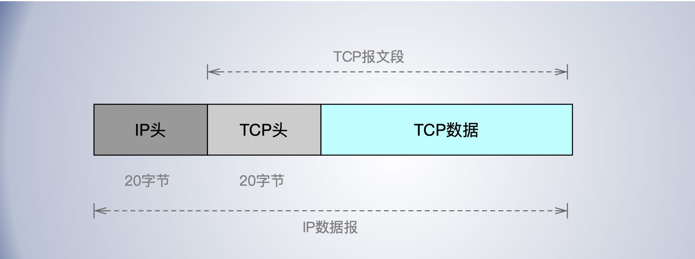
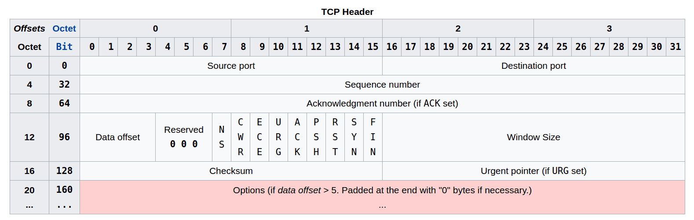
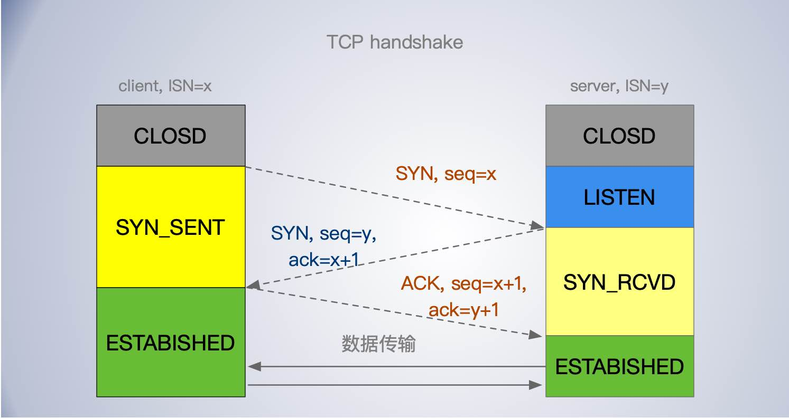
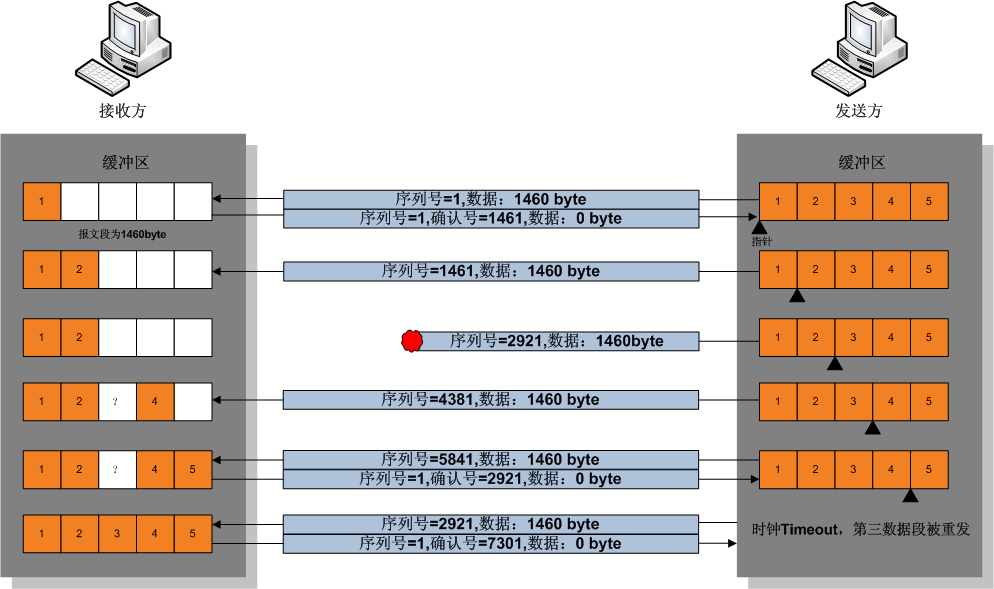
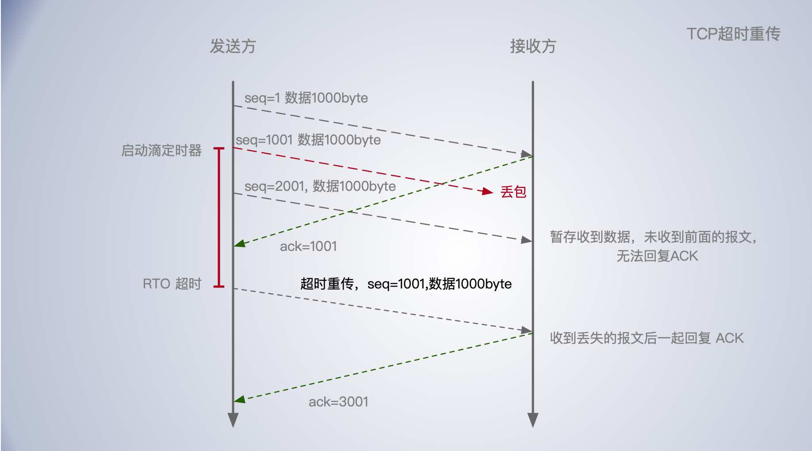
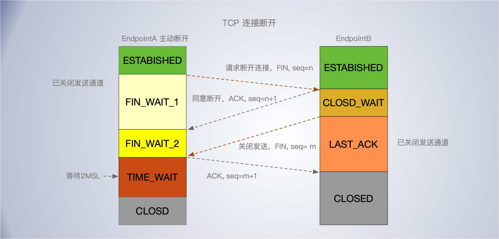
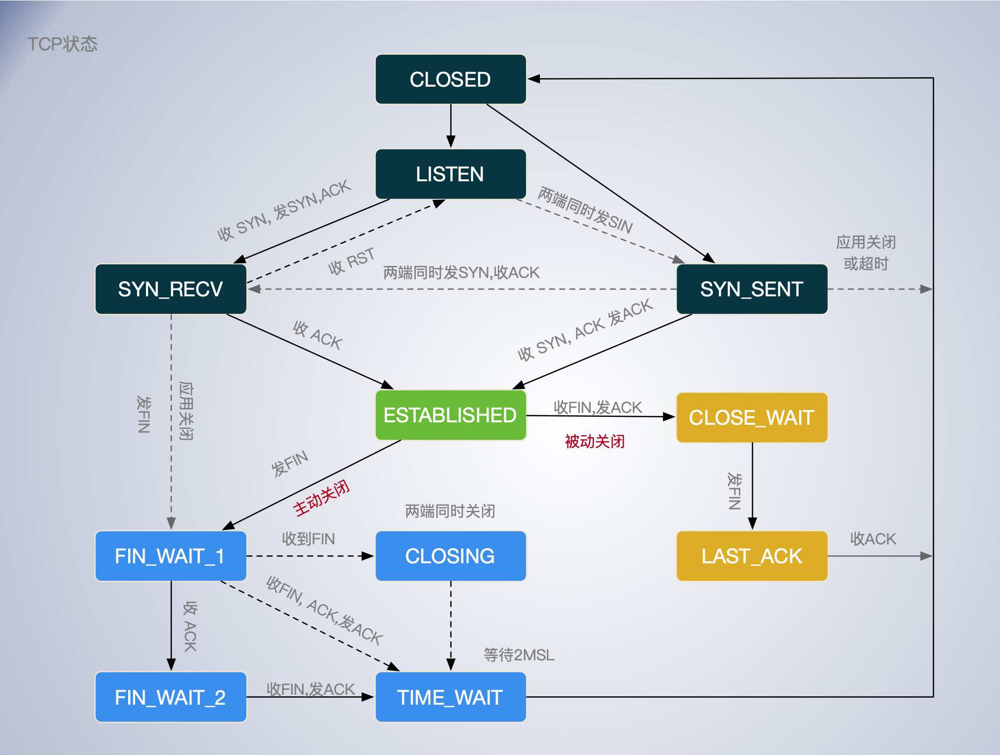

[TOC]

TCP 传输控制协议，面向连接，流协议。提供了可靠传输，这是与UDP 最大的不同。也这种由于要提供可靠性传输，TCP 协议层的实现的复杂性要比 UDP 高得多。

TCP 为了保证消息的可靠性传递，设计了复杂的拥塞控制算法，握手机制，重传策略。TCP 在保证可靠性的同时也牺牲了一定的效率。

TCP 主要关注：顺序问题，丢包问题，连接维护，流量控制，拥塞控制。

## 提问思考

- TCP 怎么保证发送的数据不乱序？
- TCP 校验发送的数据没有丢失？
- 怎么进行拥塞控制的？
- 怎么进行延时控制的？
- 消息可靠传输通过哪些手段保证？
- 怎么确定 ACK 报文有没有被对方收到？
- 处于 ESTABLISHED 状态的连接，如果一端断电了，另一端会处于什么状态？如果一端被 kill -9 了，另一端会是什么状态？
- 如果处于 LAST_ACK 状态，一直没收到对方的 ACK 报文，会怎么样？
- 哪些情况能快速回收 TIME_WAIT 状态的端口，哪些情况不能快速回收？
- MSS 是不是越大越好？什么情况下大比较好？
- 如果服务器出现大量的 CLOSE_WAIT 状态，可能会是什么原因，怎么处理？
- TCP 的设计思想，有没有值得借鉴并应用到其他项目中的？


## 数据包结构

由 TCP 传递给 IP 的信息单位称为报文段或段 (segment)。TCP数据被封装在一个 IP数据报中, 如图。







16位源端口，16位目标端口，16位紧急指针，16位校验和，

16位窗口：接收窗口大小，用于流量控制。


### SEQ

为什么要有序号？这是为了为了给发送的每个字节数组都编号，编号是为了`防止乱序`。如果一定时间没有确认会进行重新发送，这可以防止丢包。序号是 TCP 可靠性传输的基础。 


**32位序号，32位确认序号**。

确认序号应当是上次已成功收到数据字节序号的确认，并加 1，确认序号包含接收端所期望收到的下一个序号。

每个传输的字节都会被计数，序号是 32bit 的无符号数, 序号到达2^32-1后又从0开始。

TCP 提供全双工服务。在两个方向上独立地进行传输。 连接的每一端必须保持每个方向上的传输数据序号。


**初始序号**

ISN（Initial Sequence Number）, 连接的初始序号。在建立连接的握手节点客户端服务端会交换彼此的 ISN，并进行确认，后续的报文序号会在此基础上增加。

有不同的生成策略。

- 选择一个随机数作为序号的初值，以克制 TCP序号预测攻击.

- ISN 可以看作是32bit的计数器，每4微秒加1，防止网络延迟的分组被传达导致接收方错误的解释。

### 标志符

标志符（9位）

- URG—为1表示高优先级数据包，紧急指针字段有效。
- ACK—为1表示确认号字段有效
- PSH—为1表示是带有PUSH标志的数据，指示接收方应该尽快将这个报文段交给应用层而不用等待缓冲区装满。
- RST—为1表示出现严重差错。可能需要重新创建TCP连接。还可以用于拒绝非法的报文段和拒绝连接请求。
- SYN—为1表示这是连接请求或是连接接受请求，用于创建连接和使顺序号同步
- FIN—为1表示发送方没有数据要传输了，要求释放连接
- NS，CWR，NS

选项字段—最多40字节。

SYN 是发起一个连接，ACK 是回复，RST 是重新连接，FIN 是结束连接等。

*ACK 报文不需要进一步确认，也不消耗序列号。*

### MSS MTU

最大报文段长度(Maximum Segment Size，MSS)表示TCP传往另一端的最大块数据的长度。MSS 通常受网络的数据链路层的最大传输单元（`MTU`）的限制。

MSS 选项只能出现在 SYN 报文中，即在建立阶段协商，双方都要通告各自的 MSS 的大小。如果一方不接收来自另一方的 MSS值, 则MSS就定为默认值536字节 (这个默认值允许 20字节的 IP 首部和20字节的TCP首部以适合576字节 IP数据报)。

如果没有`IP分片`发生, MSS 越大越好，因为每个报文都会携带 IP头，TCP头各20字节，报文段越大允许每个报文段传送的数据就越多, 就有更高的网络利用率。

**TCP避免IP分片**

由于以太网中，帧的大小不能超过 1518 个字节（14 字节的帧头 + 4 字节帧校验和 + 最多 1500 字节数据）。所以 IP 数据报的大小如果超过了 1500 字节，要想交付给链路层就必须进行“IP分片”。 “IP分片”指的是一个IP数据报太大，需要拆分成一个一个的小段，变成多个IP数据报。IP分片，只要有一个分片出错，就会导致整个报文全部重传。所以 IP 分片会降低传输效率。

为了避免分片开销，通常IP数据报的大小不超过1500字节。除去IP和TCP协议头的40字节，TCP携带的数据不超过1460字节。


**MTU**

最大传输单元， `mtu = mss + ip首部大小 + tcp首部大小`

IP数据包通常40字节，ip首部20字节，tcp首部20字节。


### TCP 选项

选项位于报文段的最后，并且长度必须为字节的整数倍。选项字段是一个选项的列表，可包含多个选项，每个选项可出现在任何字节的边界上。列表中的选项包括两种格式：一种是单字节选项；另一种是可变长的选项。单字节选项由一个字节的选项类型（Option Kind）构成。变长选项则包含了1字节的选项类型，1字节的选项长度（Option Length）和一个可变长的选项数据（Option data）。

TCP 选项字段—最多40字节。每个选项的开始是1字节的kind字段，说明选项的类型。

- 0：选项表结束（1字节），表示选项列表的结束。
- 1：无操作（1字节），无操作，用于选项字段之间的字边界对齐。
- 2：`最大报文段长度`（4字节，Maximum Segment Size，MSS）通常在创建连接而设置SYN标志的数据包中指明这个选项，指明本端所能接收的最大长度的报文段。通常将MSS设置为（MTU-40）字节，携带TCP报文段的IP数据报的长度就不会超过MTU（MTU最大长度为1518字节，最短为64字节），从而避免本机发生IP分片。只能出现在同步报文SYN段中，否则将被忽略。
- 3：`窗口扩大因子`（3字节，wscale），取值0-14。用来把TCP的窗口的值左移的位数，使窗口值乘倍。只能出现在同步报文段中，否则将被忽略。这是因为现在的TCP接收数据缓冲区（接收窗口）的长度通常大于65535字节。
- 4：sackOK—发送端支持并同意使用SACK选项。
- 5：SACK 实际工作的选项，选择性确认。
- 8：时间戳（10字节，TCP Timestamps Option，TSopt）
    - 发送端的时间戳（Timestamp Value field，TSval，4字节）
    - 时间戳回显应答（Timestamp Echo Reply field，TSecr，4字节）


### 其他

- 数据偏移量（4位长）—以4字节为单位计算出的数据段开始地址的偏移值。
- 保留（3比特长）—须置0
- *窗口*（WIN，16位长）—表示从确认号开始，本报文的发送方可以接收的字节数，即接收窗口大小。用于流量控制。
- *校验和*（Checksum，16位长）—对整个的TCP报文段，包括TCP头部和TCP数据，以16位字进行计算所得。防止数据篡改。
- 紧急指针（16位长）—本报文段中的紧急数据的最后一个字节的序号，序号后面为普通数据。

### 紧急数据

紧急数据是指应该尽快处理的数据，比一般的数据有更高的优先级。紧急指针与 URG 标志位一起使用。如果设置了URG 标志，它表明紧急指针是有效的，并指向该数据。

紧急指针指向的是带外数据的最后一个字节。指明了紧急数据之后正常数据的起始位置。

当 URG 标记设为1，则序列号到紧急指针之间的数据为紧急数据，而紧急指针开始的数据才是正常数据。即紧急指针的偏移量和序号字段中的值相加表示紧急数据最后一个字节的序号。

**紧急方式有什么用？**

- Telnet和 Rlogin，当交互用户键入中断键时；
- 在 FTP 中, 当交互用户放弃一个文件的传输时；

TCP的紧急方式与带外数据之问的混淆？

## 建立连接

1、客户端（通过执行connect函数）向服务器发送一个SYN报文，携带初始化序列号 ISN（Initial Sequence Number），ISN 假设为 X；

2、服务器收到一个合法的SYN包后，把该包放入SYN队列中；回送一个SYN/ACK，确认序列号为X+1，并且携带自己的初始化随机序列号 ISN 假设为 Y；

3、客户端再以ACK报文回应这个服务器的ISN，确认序列号Y+1，完成三次握手。然后客户端的connect函数成功返回。当服务器端收到这个ACK包的时候，把请求帧从SYN队列中移出，放至ACCEPT队列中；这时accept函数如果处于阻塞状态，可以被唤醒，从ACCEPT队列中取出ACK包，重新创建一个新的用于双向通信的sockfd，并返回。

每个发送的报文，都会携带一个32位的 seq 序列号，即便只是一个 ACK 报文，也会增加seq的值。




如果服务器端接到了客户端发的SYN后回了SYN-ACK后客户端掉线了，服务器端没有收到客户端回来的ACK，那么，这个连接处于一个中间状态，既没成功，也没失败。于是，服务器端如果在一定时间内没有收到的TCP会重发SYN-ACK。在Linux下，默认重试次数为5次，重试的间隔时间从1s开始每次都翻倍，5次的重试时间间隔为1s, 2s, 4s, 8s, 16s，总共31s，第5次发出后还要等32s才知道第5次也超时了，所以，总共需要 1s + 2s + 4s+ 8s+ 16s + 32s = 63s，TCP才会断开这个连接。`SYN Flood` 类型的DDOS 攻击正是利用这种原理, 构造大量半连接影响正常的连接。

使用三个TCP参数来调整行为：tcp_synack_retries 减少重试次数；tcp_max_syn_backlog，增大SYN连接数；tcp_abort_on_overflow决定超出能力时的行为。

服务器端执行了listen函数后，就在服务器上创建起两个队列：

- `SYN 队列`：存放完成了二次握手的结果。 队列长度由listen函数的参数backlog指定。
- `ACCEPT 队列`：存放完成了三次握手的结果。队列长度由listen函数的参数backlog指定。


**同时打开**

两个应用程序同时彼此执行主动打开的情况是可能的, 尽管发生的可能性极小。

- 连接的两个端同时发送 SYN 报文，然后双方都进入了 SYN_SENT 状态。
- 双方收到 SYN 报文后，都回复 ACK 报文，还会再发一次 SYN 报文，然后都进入 SYN_RCVD 状态。
- 两端收到对方的 ACK 之后，进入 ESTABLISHED 状态。

同时打开的连接需要交换 4个报文段,比正常的三次握手多一个。每一端既是客户又是服务端。

这种情形有必要特别强调吗？

## 数据传输

1. 发送方首先发送第一个包含序列号为1（可变化）和1460字节数据的TCP报文段给接收方。接收方以一个没有数据的TCP报文段来回复（只含报头），用确认号1461来表示已完全收到并请求下一个报文段。
2. 发送方然后发送第二个包含序列号为1461，长度为1460字节的数据的TCP报文段给接收方。正常情况下，接收方以一个没有数据的TCP报文段来回复，用确认号2921（1461+1460）来表示已完全收到并请求下一个报文段。发送接收这样继续下去。
3. 然而当这些数据包都是相连的情况下，接收方没有必要每一次都回应。比如，他收到第1到5条TCP报文段，只需回应第五条就行了。在例子中第3条TCP报文段被丢失了，所以尽管他收到了第4和5条，然而他只能回应第2条。
4. 发送方在发送了第三条以后，没能收到回应，因此当时钟（timer）过时（expire）时，他重发第三条。（每次发送者发送一条TCP报文段后，都会再次启动一次时钟：RTT）。
5. 这次第三条被成功接收，接收方可以直接确认第5条，因为4，5两条已收到。 (这里其实就相当于发生了 `head-of-line block` 问题了，即第4，5条报文必须等第三条收到，否则就等一直等)




## 超时重传

超时重传(TCP Timeout retransmission mechanism)，是TCP协议保证数据可靠性的另一个重要机制。

TCP 发送端在发送一个数据报文后，会保留一个副本，并开启一个计时器，如果在一定时间内没有收到该数据报的ACK确认报文，那么发送端会认为该报文已丢失，然后重新发送报文，直到发送成功为止。当发送方收到确认包后，会重置定时器。

尽管超时重传的概念十分简单，但是在实现中，TCP处理超时重传的机制与其他可靠性协议相比是相当复杂的。

**RTO**

重传超时时间（Retransmission time-Out， RTO），这也是一项重传机制协议效率的一个关键参数。RTO 过大过小都会对协议造成不利影响，

- RTO过大，会使发送端经过较长时间才能发现报文段丢失，降低了连接数据传输的吞吐量，即会加剧队首阻塞问题。

- RTO过小，可能将一些延迟大的报文段误认为是丢失，造成不必要的重传，浪费了网络资源。



### 超时时间RTO

如何确定 RTO 就是超时重传的复杂性所在。

如果底层网络的传输特性是可预知的，那么重传机制的设计相对简单得多，可根据底层网络的传输时延的特性选择一个合适的RTO。然而TCP的底层网络环境是一个完全异构的互联结构。不同端点之间传输通路的性能可能存在着巨大的差异，即便是同一个TCP连接在不同的时间段上，也会由于不同的网络状态具有不同的传输时延。

RTO 主要是根据 RTT 进行动态的调整。

**滑动均值 SRTT**

SRTT(Smoothed round trip time，即平滑往返时间)，没产生一次新的 RTT. 就根据一定的算法对 SRTT 进行更新，具体而言，计算方式如下(SRTT 初始值为0):

```
New_SRTT = α * Old_SRTT +（1-α）* New_RTT
```

其中，α 是平滑因子，若α值很接近于1，表示新计算出的SRTT和原来的值相比变化不大，新的往返时间RTT样本对SRTT的影响不大。若选择的α值接近于零，则表示加权计算的SRTT受新的往返时间样本的影响较大，典型的α为7/8, 推荐 0.8~0.9之间。

拿到 SRTT，我们就可以计算 RTO 的值了:

```
RTO = min(ubound, max(lbound, β * SRTT))
```

β 是加权因子，一般为1.3 ~ 2.0， lbound 是下界，ubound 是上界。

这个算法过程还是很简单的，但是也存在一定的局限，就是在 RTT 稳定的地方表现还可以，而在 RTT 变化较大的地方就不行了，因为平滑因子 α 的范围是0.8 ~ 0.9, RTT 对于 RTO 的影响太小。


**Karels 算法**

为了解决经典方法对于 RTT 变化不敏感的问题，后面又引出了标准方法，也叫 Jacobson / Karels 算法。

第一步: 计算SRTT，公式如下:

```
SRTT = (1 - α) * SRTT + α * RTT
```

注意这个时候的 α跟经典方法中的α取值不一样了，建议值是 0.125 。

第二步: 计算RTTVAR(round-trip time variation)这个中间变量。

```
RTTVAR = (1 - β) * RTTVAR + β * (|RTT - SRTT|)
```

β 建议值为 0.25。这个值是这个算法中出彩的地方，也就是说，它记录了最新的 RTT 与当前 SRTT 之间的差值，给我们在后续感知到 RTT 的变化提供了抓手。

第三步: 计算最终的RTO:

```
RTO = µ * SRTT + ∂ * RTTVAR 
```

µ建议值取1, ∂建议值取4。

这个公式在 SRTT 的基础上加上了最新 RTT 与它的偏移，从而很好的感知了 RTT 的变化，这种算法下，RTO 与 RTT 变化的差值关系更加密切。


## 断开连接

TCP 断开连接有两中方式

- Graceful connection release，优雅释放连接，经过正常的4次挥手连接；
- Abrupt connection release，突然释放连接，如一个TCP实体被迫关闭连接，进程被杀掉；


**Graceful connection release**

建立一个连接需要三次握手, 而终止一个连接要经过4次握手。这由 TCP 的半关闭(half-close)造成的。即客户端和服务端要分别先各自的发送通道，要确认对方已关闭发送通道，才能关闭自己的接收通道。




1、当一方 EndpointA 需要断开连接，会发送一个 FIN 报文来终止这个方向连接，中断进入 FIN_WAIT1 状态。

2、当另一端 EndpointB 收到一个 FIN 报文, 意味着对方发送通道已关闭，会通知应用层另一端几经终止了那个方向的数据传送，EndpointB 关闭自己的接收通道，并对 EndpointA 的FIN报文进行回复。EndpointB 进入 状态 CLOSE_WAIT。不会再发送数据了。收到了 ACK 的 EndpointA 会进入 FIN_WATI2 。如果 EndpointA 同时收到了 对方的 FIN 和 ACK 报文就会进入 CLOSING 状态。

3、EndpointB 在没有需要发送的数据后，会关闭自己的发送通道，发一个 FIN 报文给 EndpointA，自己进入 LAST_ACK 状态。

4、EndpointA 收到对方的 FIN 报文后，关闭自己的接收通道，进入 TIME_WAIT 状态。TIME_WAIT 会持续 2MSL 周期。

**同时关闭**

- 连接两端同时发起关闭操作，发送 FIN 报文，都进入  FIN_WAIT_1 状态；

- 双方在收到 FIN 报文后，进入 CLOSING 状态；
- 双方都回复 ACK 都进入 TIMT_WAIT 状态。


### TIMT_WAIT

- 主动关闭的一方会进入这个状态
- 过多的 TIME_WAIT 会导致占用太多的文件句柄，端口等，导致出现too many open files
- 持续2msl， 防止之前迷路的包，在后续到达影响新的连接，（区分一个连接的唯一标识就是双方的ip和port，为了避免在2msl时间内同样的ip和port被再次使用而出问题）
- 处于此状态时，收到任何报文都作废。
- 可配置proc中 `net.ipv4.tcp_tw_reuse` 快速回收
- 通常客户端主动关闭，但是当服务端主动关闭如重启，会导致 2MSL 时间内不能使用之前端口。

被动关闭方 EndpointB 发送 FIN 报文后，会等待主动关闭方 EndpointA 的 ACK，以确认主动关闭方收到从而释放资源。如果 EndpointB 没有收到ACK，则会重试发送 FIN 报文。

TIMT_WAIT 会持续 2MSL，防止当最后一个回复 FIN 的 ACK 没能及时到达 EndpointB，EndpointB 会重新发送 FIN 报文，这是EndpointA 会重新发送 ACK 报文来回复 FIN。这样即使在 *TIMT_WAIT 状态内重复收到对方的 FIN 报文*也不会有其他影响。

如果没有 TIMT_WAIT 的持续状态，前迷路的 FIN等报文，在后续到达影响新的连接，因为区分一个连接的唯一标识就是双方的ip和port，为了避免在2MSL 时间内同样的ip和port被再次使用而出问题。


**MSL**

MSL 即 Maximum Segment Lifetime 报文最大生存时间。任何报文在网络上存在的最长时间，超过这个时间报文将被丢弃。因为 TCP 报文基于是 IP 协议的，而 IP 头中有一个 TTL 域，是 IP 数据报可以经过的最大路由数，每经过一个处理他的路由器此值就减 1，当此值为 0 则数据报将被丢弃，同时发送 ICMP 报文通知源主机。协议规定 MSL 为 2 分钟，实际应用中常用的是 30 秒，1 分钟和 2 分钟等。

IP数据报TTL的限制是基于跳数, 而不是定时器。

### FIN_WAIT_2

当主动关闭的一方，发送的 FIN 报文得到对方 ACK 确认后，会进入这种状态。只有另一端，也关闭发送通道并发送 FIN 报文后，本发送端才会重从FIN_WAIT_2 进入 TIME_WAIT 状态。

这意味着这端可能永远保持这个状态。另一端也将处于 CLOSE_WAIT 状态, 并一直保持这个状态直到应用层決定进行关闭。

在一些实现中，会针对两种状态正价超时时间，但是如果由于应用的问题，还是可能导致这些状态过多，导致系统出现”too many open files“ 问题。


### RST 复位报文

**Abrupt connection release**，异常释放，通过发送 RST 报文，可以异常释放一个连接。

当发送一个RST段时，进行一个突然的连接释放。发送RST报文的原因如下:

- 目标端口没有在监听，接收到非SYN报文时。
- 在一个开放的连接中，在一些TCP实现中，当收到一个无效报头的段时发送一个RST段，来关闭相应的连接来防止攻击。

- 当一些实现需要关闭一个现有的TCP连接时，它们发送一个RST段。如缺少支持连接的资源；远程主机现在不可达，并已停止响应。


## TCP 状态变迁




TIME_WAIT

- 防止最后的ACK丢失，超时重传ACK；丢弃迟到的报文，保障连接可靠终止
- 避免2MSL内，连接使用相同的IP和端口
- 只有被动关方，完全关闭，发送FIN，主动方才能进入此态

FIN_WAIT_2

- 主动关闭方在收到被动关一方的ACK后进入此状态
- 对方若不发FIN，可能一直处于这状态，被动方也将一直处于CLOSE_WAIT


## 计时器

TCP 使用几个定时器来确保在通信过程中不会遇到过度的延迟。

- Retransmission Timer 重传计时器
- Persistent Timer 坚持计时器
- Keep Alive Timer 保活计时器
- Time Wait Timer

### 重传计时器

重传定时器——TCP使用重传超时(RTO)来重传丢失的段。当TCP发送一个段时，计时器开始并在接收到确认时停止。如果计时器过期，就会发生超时并重传段。RTO (retransmission timeout is for 1 RTT)为了计算重传超时，我们首先需要计算RTT(round trip time)。


### 坚持计时器

*TCP 不对 ACK 报文段进行确认，故ACK的传输并不可靠*，否则就陷入了无尽的循环中了，TCP只确认那些包含有数据的 ACK 报文。

场景：若确 TCP 的 ACK 丢失了，接收TCP并不知道，而是会认为它已经完成了任务，并等待着对方发送更多的报文段。但发送方由于没有收到确认，就一直等待对方发送确认来通知窗口大小，由此导致双方都一直在等待着对方。

要解决这种`零窗口死锁`，TCP需要为每一个链接使用一个`坚持计时器`。

当发送TCP收到窗口大小为0的确认时，就启动坚持计时器。当坚持计时器期限到时，发送TCP就发送一个特殊的报文段，叫做探测报文。这个报文段只有一个字节的数据。它有一个序号，但它不需要确认；甚至在计算机对其他部分的数据的确认时该序号也被忽略。探测报文段提醒接收端：确认报文已丢失，需重新发送ACK报文。

坚持计时器时发送探测报文的时间满足指数退让原则，如首次超时时间算出来是1.5秒, 第2次为3秒, 再下次为6秒, 之后为12 秒等。最大通常为 60秒。达到最大间隔后，会每隔60秒就发送一个探测报文，直到窗口重新打开或者链接被终止。

### 保活计时器

TCP KeepAlive Timer 的主要目的发现不健康的连接，并回收连接。

假定客户端建立了到服务器的连接，并传送了一些数据，然后就保持静默了。也许是这个客户出故障了。在这种情况下，这个连接将永远的处理打开状态。为此服务器设置保活计时器。每当服务器收到客户的信息，就将计时器复位。若服务在一定时间内没收到对方的信息，就发送探测报文。若发送了多个个探测报文还没有响应，就认为对方出现故障，就会终止了连接。

TCP 连接是一个抽象的概念，是个虚拟连接。当客户端服务器建立一个连接后，即使客户端或者服务器网络中断，但是逻辑上此连接仍然存在，当网络重新接通以后仍然可以传输数据。但是如果在短暂断网期间，keepalive 机制发送的探测包检测到无响应，则会判断当前连接。在这种业务场景之下，这也是 TCP Keepalive的一个副作用，但可以通过设置合理的超时时间来平衡。

默认TCP Keepalive 连接上无数据传输以后默认2小时才会发送探针检测连接状态，这不适合实时业务场景。对于推送长连接、IM等，判断死连接以便及时清理通过在应用层协议发送心跳包机制，tcp keepalive 定时器并不适合这些应用场景。


**半打开状态**

如果一方已经关闭或异常终止连接而另一方却还不知道, 这样的TCP连接称为半打开(Half-Open)的。只要不打算在半打开连接上传输数据, 仍处于连接状态的一方就不会检测另一方已经出现异常。

半打开连接的另一个常见原因是当客户主机`突然断电`，而没有正常的结束客户应用程序后再关机。

这可能发生在使用PC机作为 Telnet的客户主机上, 例如, 用户在一天工作结束时关闭PC机的电源。当关闭PC机电源时, 如果已不再有要向服务器发送的数据, 服务器将永远不知道客户程序已经消失了。当用户在第二天到来时,打开PC机,并启动新的 Telnet客户程序, 在服务器主机上会启动一个新的服务器程序。这样会导致服务器主机中产生许多半打开的TCP连接。

可以使用 TCP的 keepalive选项来检测另一端的是否存活。


### 等待计时器

Time Wait Timer——这个定时器在 tcp 连接终止期间使用。

主动关闭连接一方的定时器在发送第二个FIN的Ack报文后关闭连接后开始及时。即统计处于 TIME_WAIT 的时间。通常为 2MSL 时间。

## 可靠性

TCP 通过哪些手段提高传输的可靠性

- 序号，确认序号

- 确认应答（ACK）机制

- 超时重传，出错重传

- 检验和

    

通过使用序号和确认号，TCP层可以把收到的报文段中的字节按正确的顺序交付给应用层。

TCP 通过给其中每个字节关联一个序列号对所发送的数据进行排序(sequencing)。如,假设一个应用写2048字节到一个TCP套接字,导致TCP发送2个报文:第一个报文所含数据的序列号为1~1024, 第二个报文所含数据的序列号为1025~2048。如果这些报文非顺序到达, 接收端将先根据它们的序列号重新排序, 再把结果数据传递给接收应用。如果接收端TCP接收到来自对端的重复数据, 它可以根据序列号判断丢弃重复数据。

当 TCP 向另一端发送数据时, 它要求对端返回一个确认。如果没有收到确认, TCP就自动重传数据并等待更长时间。在数次重传失败后,TCP 才放弃,如此在尝试发送数据上所花的总时间一般为4~10分钟(依赖于具体实现)。

每个 tcp 段都有`序号`和数据完整`性校验和`，每段数据都需要接收端确认，超过一定时间未收到接收方的反馈，会进行`超时重传`。TCP 含有用于动态估算客户和服务器之间的往返时间(round-trip time,RTT)的算法, 以便它知道等待一个确认需要多少时间。

它发送数据后启动一个定时器;另一端对收到的数据进行确认,对失序的数据重新排序,丢弃重复数据; TCP 提供端到端的流量控制,并计算和验证一个强制性的端到端检验和。


### 校验和

TCP用一个校验和函数来检验数据是否有错误，在发送端计算和接收端进行验证。主要是为确保TCP头和数据在传输过程中没有被篡改。如果接收方检测到校验和有差错，则TCP段会被直接丢弃。

TCP需要确保传输数据的可靠性，不像 IP 只校验 IP头部，TCP 会对头和数据都进行校验。


**TCP校验和计算过程**

1、首先，把伪首部、TCP报头、TCP数据分为16位的字，如果总长度为奇数个字节，则在最后增添一个位都为0的字节；

2、TCP报头中的校验和(checksum)字段置为0， tcp 中 checksum 值不参与计算，因为它就是要求的目标；

3、用反码相加法累加所有的16位字（进位也要累加）；

4、最后，对计算结果取反，作为TCP的校验和；

其中，`伪首部` 共有12字节，包含如下信息：源IP地址、目的IP地址、保留字节(置0)、传输层协议号(TCP是6)、TCP报文长度(报头+数据)。*这是为了防止被错误的路由，即检查TCP报文是否收错了(目的IP地址)、传输层协议是否选对了(传输层协议号)等。*


按现在的标准，*TCP的校验和是一个比较脆弱的校验*。出错概率高的数据链路层需要更高的能力来探测和纠正连接错误。

TCP 校验和是早期的设计，如果是在今天设计的，它很可能有一个32位的CRC校验来纠错，而不是使用校验和。但是通过在第二层使用通常的CRC校验或更完全一点的校验可以部分地弥补这种脆弱的校验。

第二层是在TCP层和IP层之下的，比如PPP或以太网，它们使用了这些校验。


**反码**

- 正数的反码还是等于原码。
- 负数的反码就是他的原码除符号位外，按位取反。

例如，整数 3，反码与原码相同，则可以表示为 0011 。

-3 的原码是1011，反码为 1100。

## TCP 时间戳

TCP 时间戳(TCP Timestamps Option)位于 TCP 选项中,共 10字节。

Timestamps 是 TCP 报文首部的一个可选项，一共占 10 个字节，格式如下:

```
kind(1 字节) + length(1 字节) + info(8 个字节)
```

其中 kind = 8， length = 10， info 有两部分构成: 

- 发送端的时间戳（Timestamp Value field，TSval，4字节）
- 时间戳回显应答（Timestamp Echo Reply field，TSecr，4字节）

TCP 的时间戳主要解决两大问题:

- 计算往返时延 RTT(Round-Trip Time)
- 防止序列号的回绕问题

### 计算往返延迟 RTT

RTT（Round Trip Time）由三部分组成：链路的传播时间（propagation delay）、末端系统的处理时间、路由器缓存中的排队和处理时间（queuing delay）。前两个部分的值对于一个TCP连接相对固定，路由器缓存中的排队和处理时间会随着整个网络拥塞程度的变化而变化。所以RTT的变化在一定程度上反应了网络的拥塞程度。

比如现在 a 向 b 发送一个报文 s1，b 向 a 回复一个含 ACK 的报文 s2 那么：

- step 1: a 向 b 发送的时候，timestamp 中存放的内容就是 a 主机发送时的内核时刻 ta1。
- step 2: b 向 a 回复 s2 报文的时候，timestamp 中存放的是 b 主机的时刻 tb, timestamp echo字段为从 s1 报文中解析出来的 ta1。
- step 3: a 收到 b 的 s2 报文之后，此时 a 主机的内核时刻是 ta2, 而在 s2 报文中的 timestamp echo 选项中可以得到 ta1, 也就是 s2 对应的报文最初的发送时刻。然后直接采用 ta2 - ta1 就得到了 RTT 的值。

### 防止序列号回绕问题

序列号的范围其实是在0 ~ 2 ^ 32 - 1, 用完之后就会从头开始，如果前面的数据包延迟了，和后面重新计数的序列号重复了，两次发包序列号即使相同，时间戳也不可能相同，这样就能够区分开两个数据包了。

防止序列号回绕算法（Protection Against Wrapped Sequence numbers，PAWS）。

## 拥塞控制

见 tcp 拥塞控制篇


## reference

https://zh.wikipedia.org/wiki/%E4%BC%A0%E8%BE%93%E6%8E%A7%E5%88%B6%E5%8D%8F%E8%AE%AE

TCP/IP 详解卷一


