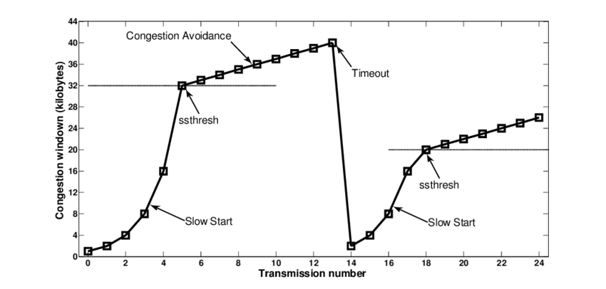

[TOC]


慢启动

拥塞避免(Congestion avoidance)

快速重传(Fast retransmit)

快速恢复(Fast Recovery)

选择性应答(selective acknowledgement,SACK)

BBR 算法

Naggle 算法

Codel 算法，延时控制

TCP 如何确定网络是否拥塞

## 提问思考

- TCP 用哪些方式来提升传输效率，怎么实现低延时？怎么实现吞吐最大化？
- 数据传输时，接收方会按策略回复 ACK？根据大小？时间 ？
- 拥塞窗口与通告窗口的联系与区别？
- 发送方是如何判断是否丢包的？
- 慢启动和拥塞避免是怎么协作进行流控制的？
- 什么时候会收到重复的 ACK ？


## TCP 滑动窗口

TCP是全双工协议，会话的双方都各自维护一个`发送窗口`和一个`接收窗口`。

各自的`接收窗口`大小取决于应用、系统、硬件的限制（TCP传输速率不能大于应用的数据处理速率）。各自的`发送窗口`则要求取决于对端通告的`接收窗口`，要求相同。

通过滑动窗口实现TCP流量控制。

滑动窗口可以理解成接收端所能提供的缓冲区大小。在TCP头中，窗口字段为16位，所以接收端 TCP 能最大提供65535个字节的缓冲。

如果发送方收到接受方的窗口大小为0的TCP数据报，那么发送方将停止发送数据。

### 发送窗口

发送的数据序列主要有四部分:

- 已发送且已确认；
- 已发送但未确认；
- 未发送但可以发送；
- 未发送也不可以发送；


滑动窗口的大小表示最多可允许的未确认数据的字节数。窗口会随着收到的确认序号向后移动。

如果窗口大小降为0，则不能发送数据，需等接收确认。

窗口大小由接收方通告，窗口大小TCP的性能密切相关。


## 延迟确认

延迟确认(delayed ack) 接收方不必确认每一个收到的分组，稍微延时一点合并多个报文确认，然后回复ACK。TCP 要求延迟的时延必须小于500ms，一般操作系统实现都不会超过 200ms。

不过有一些场景是不能延迟确认的，收到了就要马上回复:

- 接收到了大于一个 frame 的报文，且需要调整窗口大小
- TCP 处于 quickack 模式（通过tcp_in_quickack_mode设置）
- 发现了乱序包

## 拥塞控制 congestion control 

拥塞控制 congestion control。

网络中不同的节点，传输能力并不相同，有的快，有的慢，当发送的数据包超过了网络节点的承载能力就会出现拥塞现象，出现丢包现象。

拥塞控制是发送方根据网络的承载情况控制分组的发送量，以获取高性能又能避免拥塞崩溃。发送方与接收方根据确认包或者包丢失的情况，以及定时器，评估网络拥塞情况，从而修改数据流的行为，这称为拥塞控制或拥塞避免。

TCP的四种相互影响的拥塞控制算法：*慢启动*、*拥塞避免*、*快速重传*、*快速恢复*。

TCP 的拥塞控制主要原理依赖于一个拥塞窗口(cwnd)来控制。它使用一套基于`线增积减模式`的多样化网络拥塞控制方法（包括慢启动和拥塞窗口等模式）来控制拥塞。

> 在慢启动阶段，拥塞窗口随着收到的ACK进行指数增长，在达到慢启动阈值ssthresh 后出发拥塞避免算法，拥塞窗口cmwd 改为随RTT线性增长。如果出现超时拥塞，ssthresh 会变为当前 cmwd 的一般。当前的 cmwd 会重置为 1 ，即发送窗口重新按慢启动增长。


有包组丢失的指示:发生超时和接收到重复的ACK。如果使用超时作为拥塞指示, 则需要使用一个好的 RTT 算法。

### 慢启动 

**为什么要有慢启动(slow start)？**

发送方一开始便向网络发送多个报文段, 直至达到接收方通告的窗口大小为止。 当发送方和接收方处于同一个局域网时, 这是可以的。但是如果在发送方和接收方之间存在多个路由器和速率较慢的链路时, 就有可能出现一些问题。

一些较慢中间路由器必须缓存数据, 发送太快，有可能耗尽存储器的空间。这会严重降低了TCP连接的吞吐量的。

#### 拥塞窗口

慢启动为发送方的TCP增加了另ー个窗口: 拥塞窗口( congestion window), 记为 cwnd。

`拥塞窗口(cwnd)`是发送方使用的流量控制, 对端通告的`接收窗口(rwnd)`用于接收端流量控制。

窗口值的大小就代表能够发送出去的但还没有收到ACK的最大数据报文段，窗口越大那么数据发送的速度也就越快。发送方取拥塞窗口与通告窗口中的最小值作为发送上限。

```
TCP的真正的发送窗口=min(rwnd, cwnd)
```

**增大拥塞窗口**

-  拥塞窗口被初始化为 1个报文，也就是MSS的最小倍数，之后的变化依靠`线增积减`机制来控制;

- 每收到一个 ACK， cwmd = cwmd + 1 (单位：报文)，一个 ACK 可能是对几个报文的确认， cwmd 就会增加对应的报文数(不是字节数)。
- 所以，如果所有的报文按时送达并收到ACK，则每过一个RTT时延，cwnd = 2 * cwmd，即拥塞窗口是按指数扩展大小的；
- 如果是超时引起了拥塞, 则cwnd被设置为1个MSS；

例如，刚开始发送端与另一个网络的主机建立 TCP 连接时, 拥塞窗口被初始化为 1个报文。发送方开始时发送一个报文段, 然后等待ACK。当收到该ACK时, 拥塞窗口从1増加为2, 即可以发送两个报文段。当收到这两个报文段的ACK时, 拥塞窗口就增加为4。即拥塞窗口按指数增大，直到发生超时或者超过一个称为“`慢启动阈值（ssthresh）`”的限值或者接收方的接收窗口进行限制。

**慢启动**

连接建立好之后，发送端根据都到的ACK按照指数方式扩展拥塞窗口，即增大发送窗口的大小。当链路中间某个节点达到阈值时，开始出现`丢包`现象，发送方主要也是根据丢包情况来判断链路的拥塞情况。

慢启动假设分段的未确认是由于网络拥塞造成的，大部分网络的确如此，但也有其他原因，例如一些链路质量差的网络，会导致分段包丢失。在一些网络环境，例如无线网络，慢启动效率并不好。

慢启动对于一些短暂的连接性能并不好，如网页使用了很多的http的短连接，性能会比较差。

### 拥塞避免

`拥塞避免算法`(Congestion Avoidance)和`慢启动算法`是两个独立的算法，它们都是用于发送的流量控制。拥塞避免算法和慢启动算法需要对每个连接维持两个变量:

- 一个拥塞窗口 *cwnd* ;
- 一个慢启动阈值 *ssthresh* (Slow Start Threshold);

在实际中这两个算法通常在一起实现共同协作，实现发送端流量控制。

- 对一个给定的连接, 初始化cwnd为1个报文段, ssthresh为65535个字节。

- 当 cwnd < ssthresh， 遵循慢启动算法，按指数扩展发送窗口；

- 当 cwnd >= ssthresh，停止使用慢启动算法，进入拥塞避免阶段；

当拥塞发生时(超时或收到重复确认), `ssthreshy` 被设置为当前拥塞窗口大小的一半；如果是超时引起的拥塞，拥塞窗口会降为1个MSS，这样重新回到最初的慢启动阶段。




**拥塞避免阶段**

当 cwnd >= ssthresh 时，就会进入“拥塞避免阶段”：

- 每收到一个ACK 拥塞窗口只增加自身值的倒数，即 cwnd = cwnd + 1/cwnd ，

- 当每过一个RTT时, 无论收到对多少报文的 ACK，cwnd 最多增加一个报文，即 cwnd = cwnd + 1，

所以拥塞避免阶段 cwnd 为线性增长，而在慢自动阶段 cwnd 是指数增长。

### 快速重传

快速重传（Fast retransmit）是对超时重传的一种改进。

发送端会对数据进行按字节编号，然后按编号顺序发给接收端，接收端也是按编号顺序接收，然后对收到的序号进行确认回复 ACK报文。

如果接收端提前收到了下一个序号，说明前面的报文丢失了，由于`队首阻塞`，前面的序号报文没收到，接收端无法对后面的序号进行确认。这时接收端会立即再次前面已经发送过连续序号的最大值发送 ACK 报文。

假设重复阈值为3，当发送方收到4次相同确认号ACK时，可认为该ACK序号开始的报文分段丢失了。立刻进行重新发送，而不用等到重传超时(RTO)再补发报文。所以叫做快速重传。


一句话：在 TCP 传输的过程中，如果发生了丢包，即接收端发现数据段不是按序到达的时候，接收端的处理是重复发送之前的 ACK，发送端然后快速重传。

此外，在收到 3个 duplicateACK时就开启重传，并：

- cwnd = cwnd /2
- sshthresh = cwnd


### 快速恢复

快速恢复（Fast recovery）是Reno算法新引入的一个阶段，在将丢失的分段重传后，启动一个超时定时器，并等待该丢失分段包的分段确认后，再进入拥塞控制阶段。如果仍然超时，则回到慢启动阶段。

当发送端收到重复 ACK 之后，发现丢包，会认为现在的网络已经出现拥塞了，会进入快速恢复阶段：在这个阶段，发送端如下改变：

- 慢启动阈值降低为当前拥塞窗口 cwnd 的一半；
- cwnd 的大小变为拥塞阈值，即快速恢复阶段直接进入“拥塞避免”阶段，cwnd 变为线性增加；


Reno算法包含的慢启动、拥塞避免和快速重传、快速恢复机制。由于一个数据报的丢失所带来的窗口缩小要花费很长的时间来恢复，这样带宽利用率就不高了。另外，丢包并不一定是网络拥塞，可能是线路的质量问题，网络常态，但是基于丢包的拥塞控制并不能区分。

### 选择性重传

连续发送包4， 5，6，7，其中包 5 丢失。只收到了包4 的 ACK。需要进行重传，那么只重传第 5 个包还是第5、6、7 个包都重传呢？

为此，TCP 增加 “选择确认”（selective acknowledgment，SACK）选项。通过SACK 知名已经收到的连续字节的左右边界。

例如，假设通过10个分组发出了1万个字节的数据。如果第一个分组0到999字节丢失，接收方可以发出SACK指出序号1000到9999表明这个区间已经收到了，发送方因此只需重发第一个分组(字节 0 到 999)。

选择性确认(SACK)能明确反馈哪个包收到了，*SACK极大改善了TCP重传能力*。

## BBR 算法

**BBR算法原理分析**

传统的拥塞控制算法是计算拥塞窗口值 min(cwnd,rwnd) 来确定当前可以发送多少数据，但是并不关注以什么样的速度发送数据。

如果简单而粗暴地将窗口大小 min(cwnd,rwnd) 数据全部突发出去，这往往会造成路由器的排队，在深队列的情况下，会测量出rtt剧烈地抖动。

bbr在计算cwnd的同时，还计算了一个与之适配的 pacing rate，该pacing rate规定cwnd指示的一窗数据的数据包之间，以多大的时间间隔发送出去。


BBR 摒弃了丢包和实时RTT作为拥塞控制因素。引入BDP管道容量来衡量链路传输水平。BBR追求的是在链路最小RTT（物理链路延迟）的状态下，找到最大带宽。

- BtlBW：最大带宽
- RtProp：物理链路延迟
- BDP：管道容量，BDP=BtlBW * RtProp


随着数据包投递速率增加，如果没有超过最优带宽，则RTT不会变化，此时的RTT是物理链路延迟。

随着投递速率继续增加，这时中间路由节点可能出现需要缓存数据包的情况，这会导致RTT变大。如果投递速率继续增加，超过路由缓存能力，则可能出现丢包。


随着数据包投递速率增加，如果没有超过最优带宽，则发送方确认接收端收到的数据速率增加。


TCP BBR 致力于解决两个问题：

1. 在有一定丢包率的网络链路上充分利用带宽。
2. 降低网络链路上的 buffer 占用率，从而降低延迟。


TCP BBR（Bottleneck Bandwidth and Round-trip propagation time）是由Google设计，于2016年发布的拥塞算法。

以往大部分拥塞算法是基于丢包来作为降低传输速率的信号，而*BBR则基于模型主动探测*。

该算法使用网络最近出站数据分组当时的最大带宽和往返时间来创建网络的显式模型。数据包传输的每个累积或选择性确认用于生成记录在数据包传输过程和确认返回期间的时间内所传送数据量的采样率。

该算法认为随着网络接口控制器逐渐进入千兆速度时，与缓冲膨胀相关的延迟相比丢包更应该被认为是识别拥塞的主要决定因素，所以基于延迟模型的拥塞控制算法（如BBR）会有更高的吞吐量和更低的延迟，可以用BBR来替代其他流行的拥塞算法，


```
BBR之后移植入Linux内核4.9版本，并且对于QUIC可用。

BBR效率很高，速度也很快，但是它与非BBR的流的公平性有争议。虽然谷歌的展示显示 BBR 与 CUBIC 共存良好，但像杰夫·休斯顿和霍克、布利斯和齐特巴特等研究者发现它对其他流不公平，并且不可扩展。在Linux 4.9的BBR实现中“存在一些严重的固有问题，如排队延迟增加、不公平和大量数据包丢失”。
```

https://www.bookset.io/read/sdn-handbook/basic-tcp-bbr.md


## Nagle 算法——合并小包

由于每个报文至少有40个字节IP和TCP头信息，如果发送的数据比较小，即小包比较多，那么传输效率就会比较低。

Nagle 算法就是为了避免小包的频繁发送。

Nagle 算法要求：

- 一个 TCP 连接上最多只能有一个未被确认的小分组，在它到达目的地前，不能发送其它小分组。
- TCP 收集后来的小分组，当上一个小分组的收到ACK后，TCP 就将收集的小分组合并成一个大分组发送出去。

该算法的优点是自适应的: 确认到达得越快,  数据也就发送得越快。

什么是小分组？小于 MSS 的报文都是小分组。

Nagle 算法要把数据发出去，需要满足下面两个条件之一，否则就是在积累数据。

- 条件一：Window Size>=MSS 且 Data Size >= MSS；
- 条件二：等待时间或是超时200ms，

也就是要么发送窗口足够且满足一个最大传输单元MSS大小，要么等待超过 200ms。

注意：Nagle 算法默认是打开的，合并小包，增大网络吞吐量，提高传输效率，但是可能会增加应用的时延。所以对于一些需要小包低延迟场景的程序——比如像 telnet或ssh 这样的交互性程序，需要关闭这个算法。可以在Socket设置 `TCP_NODELAY` 选项来关闭这个算法。

## Codel 算法

延时控制


## 其他

### PUSH 标志

发送方使用 `PSH` 标志通知接收方将所收到的数据全部提交给接收进程。

通过允许客户应用程序通知其TCP设置`PSH`标志, 客户进程通知TCP在向服务器发送一个报文段时不要因等待额外数据而使已提交数据在缓存中滞留。

当服务器的TCP接收到一个设置了`PSH`标志的报文段时, 它需要立即将这些数据递交给服务器进程而不能等待判断是否还会有额外的数据到达

然而, 目前大多数的 API 没有向应用程序提供通知其TCP设置PUSH标志的方法。 许多程序认为PUSH标志已经过时, 一个好的TCP实现能够自行決定何时设置这个标志。

(我也觉得这标志没什么卵用，有点鸡肋)

### 窗口更新


### 最大最小公平分配

这在网络流之间产生近似最大最小公平分配。


### TCP 如何确定网络是否拥塞

TCP认为网络拥塞的主要依据是它重传了一个报文段。TCP对每一个报文段都有一个定时器，称为重传定时器(RTO)，当RTO超时且还没有得到数据确认，TCP就会对该报文段进行重传，当发生超时时，那么出现拥塞的可能性就很大，某个报文段可能在网络中某处丢失，并且后续的报文段也没有了消息。

- 把ssthresh降低为cwnd值的一半
- 把cwnd重新设置为 1
- 重新进入慢启动过程。


### 带宽延时积

窗口应该设置为多大？

根据`利特尔法则`，计算带宽延时积

```
capacity (bit)= bandwidth (b/s) * RTT (s)
```

根据上述公式，不论是带宽还是时延均会影响发送方和接收方之间通路的容量。


### 队首阻塞

队首阻塞（Head-of-line blocking, HOL）是一种出现在缓存式通信网络交换中的一种现象。交换结构通常由缓存式先进先出输入端口、一个交换结构以及缓存式先进先出输出端口组成。每个输入端的FIFO首先处理的是在队列中最靠前的数据，而这时队列后面的数据对应的出口缓存可能已经空闲，但因为得不到处理而只能等待，这样既浪费了带宽又降低了系统性能。

> 举个现实生活中的例子，这就如同你在只有一条行车路线的马路上右转，但你前面有直行车，虽然这时右行线已经空闲，但你也只能等待。


TCP 中的队首阻塞也是类似的现象，队列前面的额包丢失，导致后面的包被阻塞。由于 TCP 是可靠传输，所有后续包将被接收端一直保存，直到丢失的包被发送端重传并且到达接受端为止才会继续被传输。


因为只有具有输入缓冲的交换结构才存在队首阻塞问题。所以若有充足的内部带宽，则输入缓冲就是是不必要的，进而能够避免排头阻塞的问题。这种没有输入缓冲的交换结构结构在小到中等规模的以太网交换机上十分常见。

`虚拟输出队列`（Virtual Output Queues）：在输入端口将发送到不同端口的数据包虚拟成不同的队列，并且彼此互不影响，这样一来即使队头数据包被阻塞也将不会影响发送到其他端口的数据包的发送。


## 扩展阅读


https://www.bookset.io/read/sdn-handbook/basic-tcp-bbr.md


