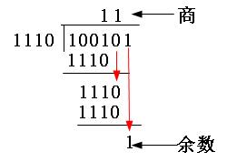
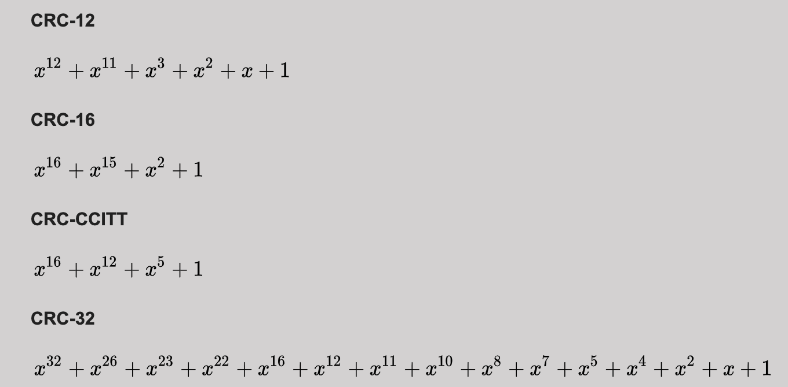
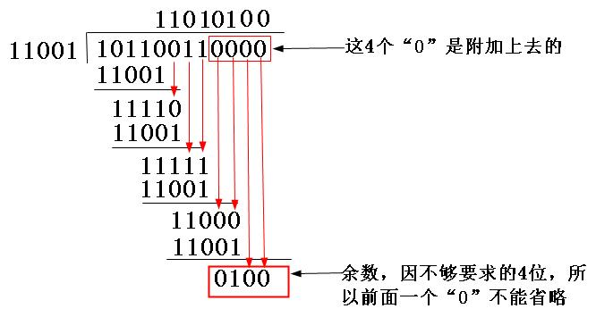

[TOC]

## checksum


## CRC校验

CRC (Cyclic Redundancy Check) ，即循环冗余校验，相比于校验和，具有更强检错能力, 是一种能力相当强的检错。

**帧检验序列FCS**（Frame Check Sequence）：为了进行差错检验而添加的冗余码。

**CRC 原理**

发送端：发送端选定一个除数，使用`模2除法`算出一个余数，作为校验码附加到原数据序列后面，发送给接收到。

接收端：再把接收到的新帧除以（同样采用“模2除法”）这个选定的除数。因为在发送端发送数据帧之前就已通过附加一个余数(FCS校验码)，做了“去余”处理，已经能整除了，所以结果应该是没有余数。如果有余数，则表明该帧在传输过程中出现了差错。

### 模2除法

模2除法与算术除法类似，但每一位除的结果不影响其它位，减法不借位、加法不进位, 实际上就是异或。

模2加法运算为：1+1=0，0+1=1，0+0=0，无进位，也无借位；

模2减法运算为：1-1=0，0-1=1，1-0=1，0-0=0，也无进位，无借位。

相当于`异或运算`。也就是两者对应位相同则结果为“0”，不同则结果为“1”。如100101除以1110，结果得到商为11，余数为1。如11×11=101



**除数选择**

要使用模2除法，首先要有一个除数，可以随机选择，也可按国际上通行的标准选择，但最高位和最低位必须均为1。

通常，CRC的除数用生成多项式来表示。最常用的CRC码的生成多项式如：



生成多项式（generator polynomial）：当进行CRC检验时，发送方与接收方需要事先约定一个除数，即生成多项式，一般记作G（x）。生成多项式的最高位与最低位必须是1。

假设约定的生成多项式为 G(x)=x^4+x^3+1，其二进制表示为 11001。

计算过程，首先把生成多项式转换成二进制数，由 G(x)=x^4+x^3+1 可以知道,一共是5位（总位数等于最高位的幂次加1，即4+1=5），然后根据多项式各项的含义多项式只列出二进制值为1的位，根据x的指数，也就是这个二进制的第4位、第3位、第0位的二进制均为1，其它位均为0, 因为多项式最高位和最低位必须都是1，所以它的二进制比特串为**11001**。

根据上述规则，CRC-16 多项式 g(x) = x^16 + x^15 + x^5 +1 对应二进制比特串为：11000000000100001，因为一共 17 位， 首尾都是1，根据 x 的指数可知第 0，5，15，16 位是1，其他位是 0。


**CRC计算过程**

1、选出一个除数，按上述方法。

2、假设选定的除数二进制位数为k位，假设要发送的数据帧位数为m位，在待发送数据帧后面补上上k-1位“0”，然后以这个加了k-1个“0“的新帧（一共是m+k-1位）以“模2除法”方式除以上面这个除数，所得到的余数（也是二进制的比特串）就是该帧的CRC校验码，也称之为FCS（帧校验序列）。注意，`余数的位数是比除数位数少一位数，位数不足，前面补0`。

3、把得到FCS（帧校验序列）追加到待发送数据序列后面，一起发送给接收方。

4、接收方方校验，也是根据收到的数据帧序列和除数，进行模2除法，得到的余数应该是0。如果不是 0，则表示数据出现了篡改。


**CRC校验码的计算示例**

计算二进制序列10110011的CRC校验码。

- 假设约定的生成多项式为上述的 G(x)=x^4+x^3+1，其二进制表示为 11001。
- 因为生成多项式的位数为5，得知CRC校验码的位数为4（校验码的位数比生成多项式的位数少1）。因为原数据帧 10110011，在它后面再加4个0，得到 `101100110000`，然后把这个数以“模2除法”方式除以生成多项式，得到的余数（即CRC码）为 `0100`。



- 把上步计算得到的CRC校验 `0100` 替换原始帧 `101100110000` 后面的四个“0”，得到新帧 `101100110100` 。再把这个新帧发送到接收端。

- 接收到，根据收到的序列 `101100110100` 使用 `0100` 进行模2除法，除数会是0，如果不是0，则说明传输出错了。


**小结**

CRC是一种常用的检错码，能发现错误，但并不能用于自动纠错。

只要经过严格的挑选，并使用位数足够多的除数，那么出现检测不到的差错的概率就很小很小，CRC32 不能发现的错误的几率低于 0.0047% 。

CRC 校验验错能力强，性能开销低的有点，性能开销远远优于`奇偶校验`及`算术和校验`等方式。

因而，在数据存储和数据通讯领域，CRC无处不在：著名的通讯协议X.25的FCS（帧检错序列）采用的是CRC-CCITT，ARJ、LHA等压缩工具软件采用的是CRC32，磁盘驱动器的读写采用了 CRC16，通用的图像存储格式GIF、TIFF等也都用CRC作为检错手段。


## crc32

crc32 是 crc 校验的一种，crc32 表示生成的校验码是32bit，由于CRC32产生校验值时源数据块的每一个bit（位）都参与了计算，所以数据块中即使只有一位发生了变化，也会得到不同的CRC32值。因此具有较强的校验错误能力。

CRC32 检错能力极强，开销小，易于用编码器及检测电路实现。从其检错能力来看，它所不能发现的错误的几率低于 0.0047% 。


```go
func Ex() {
	data := []string{
		"hello world",
		"101123123",
		"你想啊，你吃着火锅，唱着歌，突然就让马匪给劫了",
		"我不要你觉得，我要我觉得",
		"Journey of Joy",
	}
	for _, v := range data {
		fmt.Println(crc32.ChecksumIEEE([]byte(v)))
	}
	fmt.Println(”修改数据“)
	for _, v := range data {
		fmt.Println(crc32.ChecksumIEEE([]byte(v + "xx")))
	}
}

```

结果为：

```
222957957
3586846661
1262205741
3186870356
758784933
修改数据
3567606201
2128154919
2222482399
3012130606
2314603755
```


## reference

[CRC校验原理剖析](https://blog.51cto.com/winda/1063951)

https://blog.csdn.net/parasoft/article/details/86692743