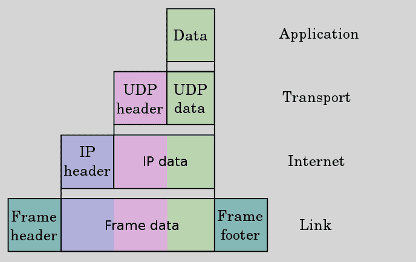
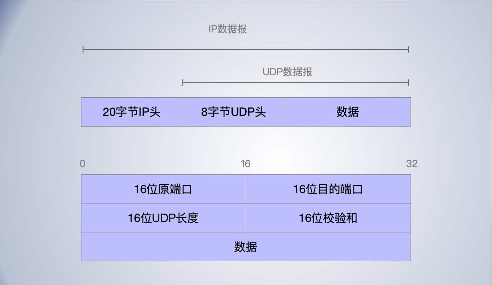
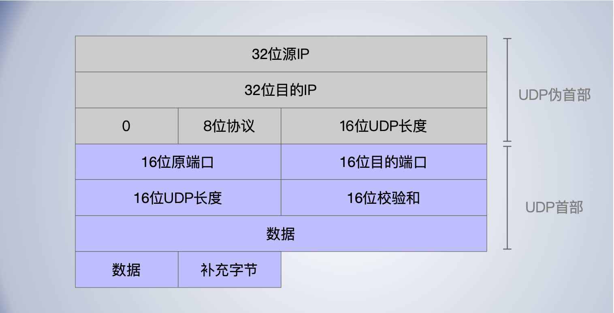

[TOC]


## 提问

- 同时启动tcp和udp服务，能同时使用同一个端口吗？
- IP，UDP，TCP的校验和的可靠性问题？
- CRC 校验的可靠性？有没有可靠性更好的校验？


## 概述


传输层有两个主要协议 UDP 和 TCP，互为补充。

- 无连接的是 UDP，它除了给应用程序发送数据包功能并允许它们在所需的层次上架构自己的协议之外，几乎没有做什么特别的事情。
- 面向连接的是 TCP，该协议几乎做了所有的事情。


UDP 是 User Datagram Protocol的简称， 中文名是用户数据报协议。UDP 提供了一种无需建立连接就可以发送封装的 IP 数据包的方法。


UDP 不保证 UDP 数据报会到达其最终目的地, 不保证各个数据报的先后顺序跨网络后保持不变, 也不保证每个数据报只到达一次

使用UDP进行网络编程所遇到的问题是它缺乏可靠性。





进程的每个输出操作都正好产生一个 UDP 数据报, 并组装成一份待发送的 IP 数据报。

## UDP头



UDP 的头相对 TCP 的头要简单许多，只有16位源目标端口，16长度，和16位校验和。

由于没有 TCP 那样的可靠性传输保证，没有拥塞控制，所以 UDP 的设计整体比较简单。


### UDP校验和

UDP检验和覆盖UDP首部和UDP数据。而IP首部的检验和, 它只覆盖IP的首部一一并不覆盖IP数据报中的任何数据。

在TCP中校验和是必须的，在UDP中校验和是可选的。


UDP的校验和计算方法与IP的类似，UDP 数据报的长度可以为奇数字节, 但是检验和算法是把若干 16 bit 字相加。解决方法是必要时在最后增加填充字节0, 这只是为了检验和的计算(也就是说,可能增加的填充字节不被传送) 。

**伪首部**

- UDP数据报和TCP段都包含一个12字节长的伪首部。
- 伪首部包含IP首部一些字段，其目的是让UDP两次检査数据是否已经正确到达目的地(例如,IP没有接受地址不是本主机的数据报, 以及IP没有把应传给另一高层的数据报传给UDP)。
- 伪首部是为了防止被错误的路由，即检查报文是否收错了(目的IP地址)、传输层协议是否选对了(传输层协议号)等。



如果接收端检测到检验和有差错, 那么 UDP 数据报就要被*悄悄地丢弃*。不产生任何差错报文(当IP层检测到IP首部检验和有差错时也这样做)。


**不可靠的校验**

根据一些统计数，

- TCP发生检验和差错的比例与UDP相比要高得多。这很可能是因为在该系统中的TCP连接经常是“远程”连接(经过许多路由器和网桥等中间设备),而UDP一般为本地通信。
- 不要完全相信数据链路(如以太网,令牌环等)的CRC检验。应该始终打开端到端的检验和功能。如果是重要的数据, 也不要完全相信UDP或TCP的检验和, 因为这些都只是简单的检验和, 不能检测出所有可能发生的差错。


## UDP抓包

客户端发送 “client say hello” 服务端回复 “server say hi”，抓包：

```bash
$tcpdump -i lo0  -v udp port 9098
22:43:55.354641 IP (tos 0x0, ttl 64, id 47017, offset 0, flags [none], proto UDP (17), length 44, bad cksum 0 (->c515)!)
    localhost.53991 > localhost.9098: UDP, length 16
22:43:55.355013 IP (tos 0x0, ttl 64, id 30623, offset 0, flags [none], proto UDP (17), length 41, bad cksum 0 (->523)!)
    localhost.9098 > localhost.53991: UDP, length 13
```


```bash
$tcpdump -i lo0  -vv udp port 9098
22:47:07.052199 IP (tos 0x0, ttl 64, id 57630, offset 0, flags [none], proto UDP (17), length 44, bad cksum 0 (->9ba0)!)
    localhost.51184 > localhost.9098: [bad udp cksum 0xfe2b -> 0x66ca!] UDP, length 16
22:47:07.052478 IP (tos 0x0, ttl 64, id 31386, offset 0, flags [none], proto UDP (17), length 41, bad cksum 0 (->228)!)
    localhost.9098 > localhost.51184: [bad udp cksum 0xfe28 -> 0xbfa3!] UDP, length 13
```


## IP分片

*物理网络层*一般要限制每次发送数据帧的最大长度。每次IP层接收到一份要发送的P数据报时, 它要判断向本地哪个接口发送数据(选路), 并查询该接口获得其MTU。IP把MTU与数据报长度进行比较, 如果需要则进行分片。分片可以发生在原始发送端主机上, 也可以发生在中间路由器上。


把一份IP数据报分片以后, 到达下一站会根据IP头部中的信息进行重新组装。

- 重新组装是在下一站就进行进行重新组装, 而不是在最终的目的地这与其他网络协议不同。

- 重新组装由目的端的IP层来完成, 其目的是使分片和重新组装过程对运输层(TCP和UDP)是透明的,
- 已经分片过的数据报有可能会再次进行分片(可能不止一次)。
  

当IP数据报被分片后, 每一片都成为一个分组, 具有自己的 IP首部, 并在选择路由时与其他分组独立。这样, 当数据报的这些片到达目的端时有可能会失序, 但是在 IP 首部中有足够的信息让接收端能正确组装这些数据报片。


**减少IP分片现象**

*即使只丢失一片数据也要重传整个IP数据报*，这是一个非常低效的操作。

- 这个重传是由TCP控制触发的？还是由 IP 层控制触发的？

当来自TCP报文段的某一片丢失后, TCP会重发整个TCP报文段, 该报文段对应于一份IP数据报。没有办法只重传数据报中的一个数据报片。

事实上, 如果对数据报分片的是中间路由器, 而不是起始端系统, 那么起始端系统就无法知道数据报是如何被分片的。就这个原因, 经常要避免分片。

**？？？**


使用UDP很容易导致IP分片。

## 发现链路的MTU


以用 sock 程序来增加数据报的长度, 直到分片发生。在一个以太网上, 数据帧的最大长度是1500字节。


## UDP TCP 对比

UDP 和 TCP 协议的主要区别是两者在信息的可靠传递方面不同。TCP协议中包含了专门的传递保证机制，当数据接收方收到发送方传来的信息时，会自动向发送方发出确认消息；发送方只有在接收到该确认消息之后才继续传送其它信息，否则将一直等待直到收到确认信息为止。而 UDP 协议并不提供数据传送的保证机制。如果在从发送方到接收方的传递过程中出现数据包的丢失，协议本身并不能做出任何检测或提示。

TCP 是面向连接的传输控制协议，而UDP 提供了无连接的数据报服务；

TCP 具有高可靠性，确保传输数据的正确性，不出现丢失或乱序；

UDP 在传输数据前不建立连接，不对数据报进行检查与修改，无须等待对方的应答，所以会出现分组丢失、重复、乱序，应用程序需要负责传输可靠性方面的所有工作；

UDP 具有较好的实时性，工作效率较 TCP 协议高；

UDP 段结构比 TCP 的段结构简单，网络开销更小。

TCP 协议可以保证接收端毫无差错地接收到发送端发出的字节流，为应用程序提供可靠的通信服务。对可靠性要求高的通信系统往往使用 TCP 传输数据。


## 应用

UDP 在网络状况不好的情况下，可能出现严重的丢包线上。由于 UDP 无需可靠性保证，头信息更小，无需建立连接，没有 tcp 的慢启动，拥塞控制等机制，所以效率更高，资源开销少，实时性也更好。

流媒体，实时游戏，实时通讯 等场景，对实时性要求比较高，但是偶尔丢一些包，少个像素帧也不太影响的场景，会用 UDP。如果是在局域网，网络环境比较好，丢包较少的情况下，也可以采用更高效的 udp 协议。

通常音频、视频和普通数据在传送时使用 UDP 较多，因为它们即使偶尔丢失一两个数据包，也不会对接收结果产生太大影响。比如 QQ 就是使用的UDP协议。新版的 http3 协议草案也是基于 UDP 实现。


